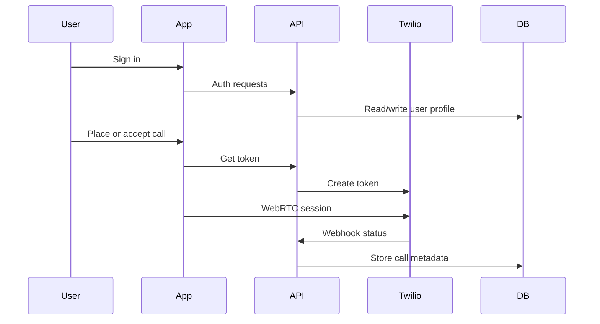

---
# CareFlow Documentation (Concise)

## Purpose

CareFlow enables browser-based calls using Twilio Voice, with Firebase Authentication and MongoDB for user and call data. This document is the concise reference for how the system is structured and how it operates at a high level.
---

## System Overview

```mermaid
graph TB
    subgraph Client
        A[Next.js App] --> B[AuthContext]
        B --> C[Dashboard UI]
        C --> D[Twilio Device / WebRTC]
    end

    subgraph API
        E[/api/auth/*] --> F[Auth Handlers]
        G[/api/calls/*] --> H[Call History]
        I[/api/analytics] --> J[Analytics]
        K[/api/webhooks/twilio/*] --> L[Twilio Webhooks]
        M[/api/users/*] --> N[User Lookup]
        O[/api/storage/*] --> P[Backblaze B2]
    end

    subgraph Services
        Q[Firebase Auth]
        R[MongoDB]
        S[Twilio Voice]
        T[Backblaze B2]
        U[Firebase Realtime DB - WebRTC Signaling]
    end

    A --> E
    A --> G
    A --> I
    A --> K
    A --> M
    F --> Q
    H --> R
    J --> R
    L --> S
    D --> S
    O --> T
```

---

## Core Capabilities

- User registration and login with Firebase Auth.
- Browser-based inbound and outbound calls via Twilio Voice SDK.
- Call recordings stored in cloud storage and indexed in MongoDB.
- Call history and analytics in the dashboard.

---

## High-Level Flow



---

## Key Data Models

**User**

- `firebaseUid`, `email`, `displayName`, `care4wId` (CareFlow User ID), `sequenceNumber`, `twilioClientIdentity`, `role`, `isActive`

**Recording**

- `firebaseUid`, `callSid`, `from`, `to`, `direction`, `duration`, `recordedAt`, `s3Key` or storage reference

---

## Primary Routes (App Router)

- `/api/auth/register`
- `/api/auth/login`
- `/api/auth/logout`
- `/api/calls/history`
- `/api/analytics`
- `/api/webhooks/twilio/voice`
- `/api/webhooks/twilio/status`

---

## API Summary

| Area      | Endpoint                      | Method | Purpose                                   |
| --------- | ----------------------------- | ------ | ----------------------------------------- |
| Auth      | `/api/auth/register`          | POST   | Create user profile after Firebase signup |
| Auth      | `/api/auth/login`             | POST   | Server-side login (if used)               |
| Auth      | `/api/auth/logout`            | POST   | Logout server-side session                |
| Calls     | `/api/calls/history`          | GET    | List call history for current user        |
| Analytics | `/api/analytics`              | GET    | Aggregate call metrics                    |
| Twilio    | `/api/token`                  | GET    | Create Twilio voice token                 |
| Webhooks  | `/api/webhooks/twilio/voice`  | POST   | Handle inbound call TwiML                 |
| Webhooks  | `/api/webhooks/twilio/status` | POST   | Call status updates                       |

---

## Environment Dependencies

See [`careflow/.env.local.example`](careflow/.env.local.example) for required variables.

---

## Related Documents

- Architecture: [`plans/system-architecture.md`](plans/system-architecture.md)
- User flows: [`plans/USER_FLOWS.md`](plans/USER_FLOWS.md)
- Deployment: [`plans/DEPLOYMENT.md`](plans/DEPLOYMENT.md)
- Analysis & issues: [`plans/CAREFLOW_ANALYSIS_REPORT.md`](plans/CAREFLOW_ANALYSIS_REPORT.md)

---

## Implementation Roadmap

### Phase 1: Stabilize Core Functionality

- Implement missing dashboard components referenced in [`careflow/app/dashboard/page.js`](careflow/app/dashboard/page.js).
- Add `/api/token` App Router endpoint and require auth.
- Implement `User` schema in [`careflow/models/User.js`](careflow/models/User.js).
- Standardize Twilio client identity usage across auth/token/webhooks.

### Phase 2: Consolidate APIs and Data Flow

- Remove legacy Pages Router APIs after App Router parity.
- Align analytics response with dashboard expectations.
- Ensure webhooks create new recording entries when missing.

### Phase 3: Product Enhancements

- Voicemail capture + playback.
- Notifications for inbound calls.
- Call history export + filters.

### Phase 4: Quality and Security

- Add schema validation for API inputs.
- Add Twilio webhook signature validation.
- Implement structured logging and testing.
  L -->|Yes| N[Send email verification]

  N --> O[Store user session]
  O --> P[Set authentication state]
  P --> Q[Redirect to Dashboard]
  Q --> R[Show verification notice]

  J --> F
  M --> F

````

### Call Management Flows

#### Making a Call

```mermaid
graph TD
    A[User on Dashboard] --> B[Enters phone number]
    B --> C[Clicks 'Call' button]
    C --> D[Validate phone number]
    D -->|Invalid| E[Show validation error]
    D -->|Valid| F[Initiate call request]

    F --> G[Generate Twilio access token]
    G --> H[Create Twilio Voice connection]
    H --> I[Establish WebRTC connection]

    I --> J{Connection successful?}
    J -->|No| K[Show connection error]
    J -->|Yes| L[Call connected]

    L --> M[Display call interface]
    M --> N[Show call controls]
    N --> O[Monitor call status]

    O --> P{Call active?}
    P -->|Yes| Q[Continue monitoring]
    P -->|No| R[Handle call end]

    Q --> O
    R --> S[Log call details]
    S --> T[Update call history]

    E --> B
    K --> B
````

#### Receiving a Call

```mermaid
graph TD
    A[Twilio webhook receives call] --> B[Parse call data]
    B --> C[Validate call source]
    C --> D[Check user availability]

    D --> E{User available?}
    E -->|No| F[Send to voicemail]
    E -->|Yes| G[Generate access token]

    G --> H[Send push notification]
    H --> I[User receives notification]
    I --> J[User accepts call]

    J --> K[Establish WebRTC connection]
    K --> L[Call connected]
    L --> M[Monitor call status]

    M --> N{Call active?}
    N -->|Yes| O[Continue monitoring]
    N -->|No| P[Handle call end]

    P --> Q[Log call details]
    Q --> R[Update call history]

    F --> S[Store voicemail]
    S --> T[Notify user of missed call]
```

---

## API Endpoints

### Authentication Endpoints

#### POST /api/auth/register

**Description**: Register a new user and create user profile
**Request Body**:

```json
{
  "displayName": "string",
  "email": "string",
  "firebaseUid": "string"
}
```

**Response**:

```json
{
  "success": true,
  "message": "User profile created successfully",
  "user": {
    "id": "string",
    "email": "string",
    "displayName": "string",
    "role": "string",
    "twilioClientIdentity": "string",
    "createdAt": "string"
  }
}
```

### Call Management Endpoints

#### GET /api/calls/history

**Description**: Get call history for authenticated user
**Headers**: Authorization: Bearer {token}
**Query Parameters**:

- `page`: Page number (default: 1)
- `limit`: Items per page (default: 20)
- `type`: Call type filter ('call' or 'voicemail')

**Response**:

```json
{
  "success": true,
  "calls": [
    {
      "_id": "string",
      "firebaseUid": "string",
      "callSid": "string",
      "from": "string",
      "to": "string",
      "status": "string",
      "duration": "number",
      "recordingUrl": "string",
      "recordedAt": "string",
      "type": "string"
    }
  ],
  "pagination": {
    "page": "number",
    "limit": "number",
    "total": "number",
    "totalPages": "number",
    "hasNextPage": "boolean",
    "hasPrevPage": "boolean"
  }
}
```

#### GET /api/token

**Description**: Generate Twilio access token for client
**Headers**: Authorization: Bearer {token}
**Response**:

```json
{
  "token": "string",
  "identity": "string"
}
```

### Twilio Integration Endpoints

#### POST /api/twilio/voice

**Description**: Handle incoming Twilio voice calls
**Response**: TwiML XML for call handling

#### POST /api/calls/webhook

**Description**: Handle Twilio call webhooks
**Request Body**:

```json
{
  "CallSid": "string",
  "RecordingUrl": "string",
  "RecordingDuration": "string"
}
```

### Storage Endpoints

#### GET /api/recordings

**Description**: Get download URL for recordings
**Query Parameters**:

- `recordingUrl`: Recording URL to get download link for
- `list`: Set to "true" to list all recordings

**Response**:

```json
{
  "downloadUrl": "string"
}
```

#### POST /api/recordings

**Description**: Upload external audio files
**Request Body**:

```json
{
  "file": "base64",
  "fileName": "string",
  "contentType": "string"
}
```

---

## Database Schema

### User Model

```javascript
{
  _id: ObjectId,
  firebaseUid: String,        // Firebase user ID
  email: String,              // User email
  displayName: String,        // User display name
  twilioClientIdentity: String, // Twilio client identity
  role: String,               // User role ('user' or 'admin')
  isActive: Boolean,          // Account status
  createdAt: Date,
  updatedAt: Date,
  lastLoginAt: Date
}
```

### Recording Model

```javascript
{
  _id: ObjectId,
  firebaseUid: String,       // User who owns the recording
  userId: ObjectId,        // Reference to User model
  type: String,            // 'call' or 'voicemail'
  sid: String,            // Twilio call SID (unique)
  callSid: String,        // Reference to call
  from: String,           // Caller number or CareFlow ID
  to: String,             // Callee number or CareFlow ID
  direction: String,      // 'inbound' or 'outbound'
  storageKey: String,    // Backblaze B2 object key
  storageBucket: String, // Backblaze B2 bucket name
  duration: Number,       // Call duration in seconds
  recordedAt: Date,      // When recording was created
  status: String,        // 'active', 'archived', 'deleted'
  isListened: Boolean,   // Whether user has listened
  transcription: String, // Optional transcription
  createdAt: Date,
  updatedAt: Date
}
```

**Note**: The actual database models are missing from the codebase. The application uses mock data in the old API routes and imports non-existent models in the new routes.

---

## Configuration Management

### Environment Configuration System

CareFlow uses a sophisticated configuration management system with the following features:

#### Configuration Schema

```javascript
const CONFIG_SCHEMA = {
  NODE_ENV: {
    type: 'string',
    enum: ['development', 'production', 'test'],
    default: 'development',
  },
  NEXT_PUBLIC_FIREBASE_API_KEY: {
    type: 'string',
    required: true,
    pattern: /^[A-Za-z0-9_-]{10,}$/,
  },
  // ... other configurations
};
```

#### Configuration Features

- **Dynamic Loading**: Loads `.env.local` file automatically
- **Schema Validation**: Validates all required environment variables
- **Type Casting**: Converts configuration values to proper types
- **Runtime Protection**: Frozen configuration object prevents modification
- **Development/Production Detection**: Environment-specific behavior

#### Service Configuration

- **Firebase**: Authentication and storage configuration
- **Twilio**: Voice API and webhook configuration
- **MongoDB**: Database connection configuration
- **Backblaze B2**: S3-compatible cloud storage configuration

---

## Authentication System

### Authentication Architecture

CareFlow uses Firebase Authentication with the following components:

#### Client-Side Authentication

- **AuthContext**: React context for authentication state
- **Protected Routes**: Route-level authentication guards
- **Token Management**: JWT token handling and automatic refresh
- **Session Persistence**: Local storage for user sessions

#### Server-Side Authentication

- **Firebase Admin SDK**: Server-side token verification
- **Middleware**: Authentication middleware for API routes
- **User Management**: User creation and profile management

#### Authentication Features

- **Email/Password**: Standard email and password authentication
- **JWT Tokens**: Secure token-based authentication
- **Session Management**: Automatic session refresh and management
- **Email Verification**: Email verification requirement
- **Password Reset**: Password reset functionality

### Security Features

- **Token Expiration**: Automatic token refresh every 50 minutes
- **Secure Storage**: Secure token storage in browser
- **CORS Protection**: Proper CORS configuration
- **Input Validation**: Client and server-side input validation

---

## Missing Features

### Critical Missing Features

#### 1. Database Models

**Issue**: No actual database models exist

- `User.js` and `Recording.js` models are imported but don't exist
- Application uses mock data instead of real database
- No MongoDB connection established

**Impact**: Application cannot persist user data or call history

#### 2. Database Connection

**Issue**: No database connection logic

- `connectDB()` function is called but not implemented
- No MongoDB Atlas integration
- No database initialization

**Impact**: All data is lost on application restart

#### 3. User Registration Integration

**Issue**: Registration flow incomplete

- Frontend registration exists but doesn't integrate with backend
- No user profile creation in database
- No email verification system

**Impact**: Users cannot actually register or maintain accounts

#### 4. Call Recording Persistence

**Issue**: Call recordings not stored in database

- Firebase Storage integration exists but no database records
- No call metadata tracking
- No recording management system

**Impact**: Call history and analytics cannot function properly

#### 5. Analytics System

**Issue**: Analytics are mocked

- No actual call data collection
- No database queries for analytics
- No real-time metrics

**Impact**: Dashboard analytics show fake data

### Additional Missing Features

#### 6. Error Handling

- No comprehensive error handling system
- Missing error boundaries in React
- No user-friendly error messages

#### 7. Input Validation

- Limited input validation on frontend
- No server-side validation middleware
- No data sanitization

#### 8. Security Features

- No rate limiting on API endpoints
- No request validation middleware
- No security headers configuration

#### 9. Performance Optimization

- No caching system implemented
- No lazy loading for components
- No image optimization

#### 10. Testing

- No unit tests
- No integration tests
- No end-to-end tests

---

## Potential Issues

### 1. Configuration Management Issues

#### Environment Variable Validation

**Issue**: Configuration validation may fail silently

```javascript
// In env.config.js - validation errors don't prevent app startup
if (!validation.valid) {
  console.error('Configuration validation failed:');
  validation.errors.forEach((error) => console.error(`  - ${error}`));

  if (process.env.NODE_ENV === 'production') {
    throw new Error('Invalid configuration in production environment');
  }
  // In development, app continues with warnings
}
```

**Risk**: Application may start with invalid configuration in development

#### Configuration Access

**Issue**: Configuration access patterns are inconsistent

- Some components use `process.env` directly
- Others use the configuration system
- No centralized configuration access pattern

### 2. Authentication Issues

#### Token Management

**Issue**: JWT token refresh may fail

```javascript
// In AuthContext.js - token refresh interval
const tokenRefresh = setInterval(
  async () => {
    try {
      const newToken = await getIdToken(user, true);
      setToken(newToken);
    } catch (err) {
      console.error('Token refresh failed:', err);
      // If token refresh fails, sign out user
      await handleLogout();
    }
  },
  50 * 60 * 1000
); // 50 minutes
```

**Risk**: Users may be unexpectedly logged out if token refresh fails

#### Session Persistence

**Issue**: Session state may not persist correctly

- No proper session storage implementation
- Token storage may be cleared unexpectedly
- No session recovery mechanism

### 3. Database Issues

#### Missing Database Connection

**Issue**: No database connection established

```javascript
// In API routes - connectDB() is called but not implemented
await connectDB();
```

**Risk**: All data operations will fail silently or use mock data

#### Data Consistency

**Issue**: No data validation or consistency checks

- No database constraints
- No data validation middleware
- No transaction management

### 4. Twilio Integration Issues

#### Token Generation

**Issue**: Twilio token generation may fail

```javascript
// In pages/api/twilio/token.js - no error handling for missing env vars
const accountSid = process.env.TWILIO_ACCOUNT_SID;
const apiKey = process.env.TWILIO_API_KEY;
const apiSecret = process.env.TWILIO_API_SECRET;
const twimlAppSid = process.env.TWILIO_TWIML_APP_SID;

if (!accountSid || !apiKey || !apiSecret || !twimlAppSid) {
  return res.status(500).json({
    error: 'Missing Twilio environment variables',
  });
}
```

**Risk**: Call functionality will fail if Twilio credentials are missing

#### Webhook Security

**Issue**: Webhook endpoints lack security validation

```javascript
// In pages/api/calls/webhook.js - no authentication or validation
export default function handler(req, res) {
  if (req.method !== "POST") {
    return res.status(405).json({ error: "Method not allowed" });
  }

  try {
    const { CallSid, RecordingUrl, RecordingDuration } = req.body;
    // No validation of webhook source or data
  }
}
```

**Risk**: Webhook endpoints can be called by anyone, potentially causing data corruption

### 5. Performance Issues

#### No Caching

**Issue**: No caching system implemented

- Database queries not cached
- API responses not cached
- Static assets not optimized

#### Memory Leaks

**Issue**: Potential memory leaks in event listeners

```javascript
// In dashboard components - event listeners may not be cleaned up
useEffect(() => {
  // Event listeners set up but cleanup may be incomplete
}, []);
```

### 6. Security Issues

#### CORS Configuration

**Issue**: CORS configuration may be too permissive

- No proper CORS middleware
- Cross-origin requests not properly validated
- Potential for CSRF attacks

#### Input Validation

**Issue**: Limited input validation

```javascript
// In API routes - minimal input validation
const { displayName, email, firebaseUid } = body;

if (!displayName || !email || !firebaseUid) {
  return NextResponse.json(
    { error: 'Missing required fields: displayName, email, firebaseUid' },
    { status: 400 }
  );
}
```

**Risk**: No validation of input format, length, or content

#### Rate Limiting

**Issue**: No rate limiting on API endpoints

- No protection against brute force attacks
- No protection against API abuse
- No request throttling

---

## Security Considerations

### Authentication Security

- ✅ JWT tokens with expiration
- ✅ Secure token storage
- ✅ Session management
- ❌ No rate limiting on login attempts
- ❌ No account lockout mechanism
- ❌ No two-factor authentication

### Data Security

- ✅ HTTPS enforcement
- ✅ Secure API endpoints
- ❌ No input sanitization
- ❌ No SQL injection protection (not applicable with MongoDB)
- ❌ No XSS protection

### API Security

- ❌ No API versioning
- ❌ No request validation middleware
- ❌ No security headers
- ❌ No API rate limiting
- ❌ No request logging

### Infrastructure Security

- ✅ Environment variable protection
- ✅ Firebase security rules (assumed)
- ❌ No backup strategy
- ❌ No disaster recovery plan
- ❌ No monitoring and alerting

---

## Performance Analysis

### Frontend Performance

- ✅ Next.js with server-side rendering
- ✅ Component-based architecture
- ✅ Lazy loading for components
- ❌ No image optimization
- ❌ No code splitting optimization
- ❌ No bundle size optimization

### Backend Performance

- ✅ Next.js API routes
- ❌ No caching system
- ❌ No database connection pooling
- ❌ No request queuing
- ❌ No performance monitoring

### Database Performance

- ❌ No database indexing
- ❌ No query optimization
- ❌ No connection pooling
- ❌ No database monitoring

### Network Performance

- ✅ CDN for static assets (assumed with Vercel)
- ❌ No request compression
- ❌ No response caching
- ❌ No connection reuse optimization

---

## Recommendations

### 1. Implement Database Models

```javascript
// Create User.js model
const mongoose = require('mongoose');

const userSchema = new mongoose.Schema({
  firebaseUid: { type: String, required: true, unique: true },
  email: { type: String, required: true, unique: true },
  displayName: { type: String, required: true },
  twilioClientIdentity: { type: String, required: true },
  role: { type: String, enum: ['user', 'admin'], default: 'user' },
  isActive: { type: Boolean, default: true },
  createdAt: { type: Date, default: Date.now },
  lastLoginAt: { type: Date },
});

module.exports = mongoose.model('User', userSchema);
```

### 2. Implement Database Connection

```javascript
// Create lib/db.js
const mongoose = require('mongoose');

let isConnected = false;

export async function connectDB() {
  if (isConnected) {
    return;
  }

  try {
    await mongoose.connect(process.env.MONGODB_URI, {
      useNewUrlParser: true,
      useUnifiedTopology: true,
    });
    isConnected = true;
    console.log('Connected to MongoDB');
  } catch (error) {
    console.error('Database connection error:', error);
    throw new Error('Database connection failed');
  }
}
```

### 3. Add Comprehensive Error Handling

```javascript
// Create error handling middleware
export function errorHandler(err, req, res, next) {
  console.error(err.stack);

  if (err.name === 'ValidationError') {
    return res.status(400).json({
      error: 'Validation Error',
      details: err.message,
    });
  }

  if (err.name === 'UnauthorizedError') {
    return res.status(401).json({
      error: 'Unauthorized',
      message: 'Invalid or expired token',
    });
  }

  res.status(500).json({
    error: 'Internal Server Error',
    message: process.env.NODE_ENV === 'production' ? 'Something went wrong' : err.message,
  });
}
```

### 4. Add Input Validation

```javascript
// Create validation middleware
export function validateInput(schema) {
  return (req, res, next) => {
    const { error } = schema.validate(req.body);
    if (error) {
      return res.status(400).json({
        error: 'Validation Error',
        details: error.details[0].message,
      });
    }
    next();
  };
}
```

### 5. Add Rate Limiting

```javascript
// Create rate limiting middleware
import rateLimit from 'express-rate-limit';

export const apiLimiter = rateLimit({
  windowMs: 15 * 60 * 1000, // 15 minutes
  max: 100, // limit each IP to 100 requests per windowMs
  message: {
    error: 'Too many requests from this IP, please try again later.',
  },
});

export const authLimiter = rateLimit({
  windowMs: 15 * 60 * 1000, // 15 minutes
  max: 5, // limit each IP to 5 login requests per windowMs
  message: {
    error: 'Too many login attempts, please try again later.',
  },
});
```

### 6. Add Security Headers

```javascript
// Add to next.config.js
const securityHeaders = [
  {
    key: 'X-DNS-Prefetch-Control',
    value: 'on',
  },
  {
    key: 'X-XSS-Protection',
    value: '1; mode=block',
  },
  {
    key: 'X-Frame-Options',
    value: 'SAMEORIGIN',
  },
  {
    key: 'X-Content-Type-Options',
    value: 'nosniff',
  },
  {
    key: 'Referrer-Policy',
    value: 'origin-when-cross-origin',
  },
];
```

### 7. Add Monitoring and Logging

```javascript
// Create monitoring system
export class ApplicationMonitor {
  static logError(error, context = {}) {
    console.error('Application Error:', {
      message: error.message,
      stack: error.stack,
      context,
      timestamp: new Date().toISOString(),
    });
  }

  static logPerformance(metric, value) {
    console.log('Performance Metric:', {
      metric,
      value,
      timestamp: new Date().toISOString(),
    });
  }
}
```

### 8. Add Testing Framework

```javascript
// Create test setup
import { describe, it, expect } from '@jest/globals';

describe('Authentication', () => {
  it('should login with valid credentials', async () => {
    // Test login functionality
  });

  it('should reject invalid credentials', async () => {
    // Test invalid login
  });
});
```

### 9. Add CI/CD Pipeline

```yaml
# Create .github/workflows/ci.yml
name: CI/CD Pipeline

on:
  push:
    branches: [main, develop]
  pull_request:
    branches: [main]

jobs:
  test:
    runs-on: ubuntu-latest

    steps:
      - uses: actions/checkout@v2
      - uses: actions/setup-node@v2
        with:
          node-version: '18'
          cache: 'yarn'

      - run: yarn install
      - run: yarn test
      - run: yarn build
```

### 10. Add Documentation

- API documentation with OpenAPI/Swagger
- Component documentation with Storybook
- Architecture documentation
- Deployment guides

---

## Conclusion

CareFlow is a well-architected application with a modern technology stack and good separation of concerns. However, it has several critical missing features and potential issues that need to be addressed before it can be considered production-ready.

The main areas that require attention are:

1. **Database Implementation**: Complete the database models and connection
2. **Error Handling**: Add comprehensive error handling and user feedback
3. **Security**: Implement proper security measures and input validation
4. **Testing**: Add comprehensive test coverage
5. **Performance**: Optimize performance and add monitoring
6. **Documentation**: Complete API and architecture documentation

With these improvements, CareFlow would be a robust and production-ready application for browser-based voice calling.
