# CareFlow Comprehensive User Flow Documentation

## Document Overview

This document provides a comprehensive end-to-end user flow for the CareFlow application, documenting all decision points, alternate paths, error states, and recovery mechanisms. The documentation covers the complete user journey from initial entry through all interactions, touchpoints, and possible outcomes.

**Version:** 1.0.0
**Last Updated:** 2026-02-06
**Status:** Complete Documentation

---

## Table of Contents

1. [High-Level Architecture Flow](#high-level-architecture-flow)
2. [User Journey Phases](#user-journey-phases)
3. [Authentication Flow](#authentication-flow)
4. [Dashboard Navigation Flow](#dashboard-navigation-flow)
5. [Call Management Flow](#call-management-flow)
6. [Recording Playback Flow](#recording-playback-flow)
7. [Notification Permission Flow](#notification-permission-flow)
8. [Error States and Recovery](#error-states-and-recovery)
9. [Gaps and Optimization Opportunities](#gaps-and-optimization-opportunities)

---

## High-Level Architecture Flow

### System Architecture Overview

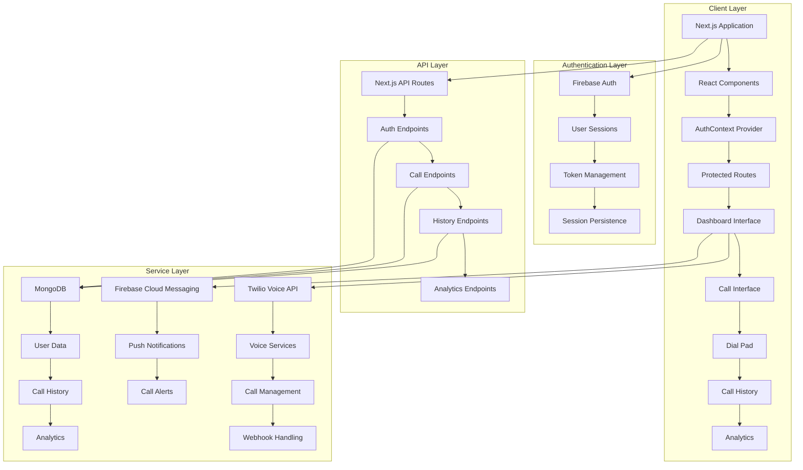
```mermaid
graph TB
    subgraph "Client Layer"
        A[Next.js Application] --> B[React Components]
        B --> C[AuthContext Provider]
        C --> D[Protected Routes]
        D --> E[Dashboard Interface]
        E --> F[Call Interface]
        F --> G[Dial Pad]
        G --> H[Call History]
        H --> I[Analytics]
    end

    subgraph "Authentication Layer"
        J[Firebase Auth] --> K[User Sessions]
        K --> L[Token Management]
        L --> M[Session Persistence]
    end

    subgraph "API Layer"
        N[Next.js API Routes] --> O[Auth Endpoints]
        O --> P[Call Endpoints]
        P --> Q[History Endpoints]
        Q --> R[Analytics Endpoints]
    end

    subgraph "Service Layer"
        S[Twilio Voice API] --> T[Voice Services]
        T --> U[Call Management]
        U --> V[Webhook Handling]

        W[Firebase Cloud Messaging] --> X[Push Notifications]
        X --> Y[Call Alerts]

        Z[MongoDB] --> AA[User Data]
        AA --> BB[Call History]
        BB --> CC[Analytics]
    end

    A --> J
    A --> N
    E --> S
    E --> W
    O --> Z
    P --> Z
    Q --> Z
```

### Component Dependency Map

| Component                                          | Dependencies             | Purpose                      |
| -------------------------------------------------- | ------------------------ | ---------------------------- |
| [`app/page.js`](app/page.js)                       | AuthContext              | Landing page with auth check |
| [`app/login/page.js`](app/login/page.js)           | Firebase Auth            | User authentication          |
| [`app/signup/page.js`](app/signup/page.js)         | Firebase Auth, MongoDB   | New user registration        |
| [`app/dashboard/page.js`](app/dashboard/page.js)   | CallManager, AuthContext | Main application interface   |
| [`lib/callManager.js`](lib/callManager.js)         | Twilio SDK, WebRTC       | Unified call handling        |
| [`context/AuthContext.js`](context/AuthContext.js) | Firebase Auth            | Global auth state            |

---

## User Journey Phases

### Phase Overview

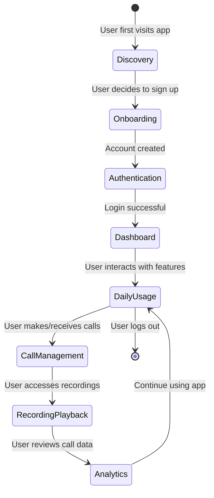
```mermaid
stateDiagram-v2
    [*] --> Discovery: User first visits app
    Discovery --> Onboarding: User decides to sign up
    Onboarding --> Authentication: Account created
    Authentication --> Dashboard: Login successful
    Dashboard --> DailyUsage: User interacts with features
    DailyUsage --> CallManagement: User makes/receives calls
    CallManagement --> RecordingPlayback: User accesses recordings
    RecordingPlayback --> Analytics: User reviews call data
    Analytics --> DailyUsage: Continue using app
    DailyUsage --> [*]: User logs out
```

### Emotional State Mapping

| Phase              | Typical Emotional State | Key Factors                                |
| ------------------ | ----------------------- | ------------------------------------------ |
| Discovery          | Curious, Skeptical      | First impression, trust signals            |
| Onboarding         | Hopeful, Anxious        | Ease of signup, privacy concerns           |
| Authentication     | Frustrated/Relieved     | Error messages, recovery options           |
| Dashboard          | Overwhelmed/Empowered   | Interface clarity, feature discoverability |
| Call Management    | Anxious, Focused        | Connection reliability, call quality       |
| Recording Playback | Reflective, Satisfied   | Playback quality, access speed             |
| Analytics          | Informed, Confident     | Data clarity, actionable insights          |

---

## Authentication Flow

### Login Flow (Happy Path)

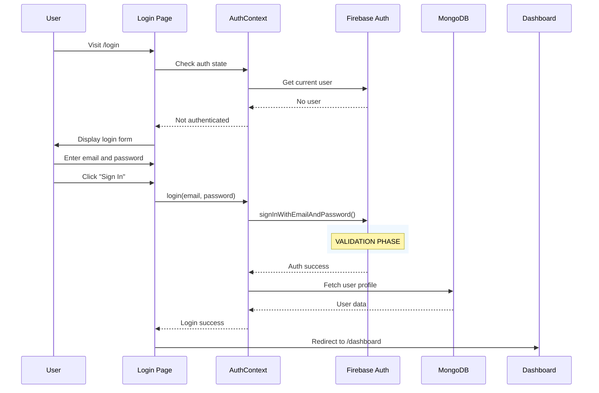
```mermaid
sequenceDiagram
    participant User
    participant UI as Login Page
    participant Auth as AuthContext
    participant Firebase as Firebase Auth
    participant DB as MongoDB
    participant Dashboard as Dashboard

    User->>UI: Visit /login
    UI->>Auth: Check auth state
    Auth->>Firebase: Get current user
    Firebase-->>Auth: No user
    Auth-->>UI: Not authenticated
    UI->>User: Display login form

    User->>UI: Enter email and password
    User->>UI: Click "Sign In"
    UI->>Auth: login(email, password)
    Auth->>Firebase: signInWithEmailAndPassword()

    rect rgb(240, 248, 255)
        Note over Firebase: VALIDATION PHASE
    end

    Firebase-->>Auth: Auth success
    Auth->>DB: Fetch user profile
    DB-->>Auth: User data
    Auth-->>UI: Login success
    UI->>Dashboard: Redirect to /dashboard
```

### Login Flow Detailed Steps

| Step | User Goal              | System Response                              | User Input      | Friction Points                   | Emotional State     |
| ---- | ---------------------- | -------------------------------------------- | --------------- | --------------------------------- | ------------------- |
| 1    | Access login page      | Render login form with email/password fields | None            | Page load delay                   | Neutral/Curious     |
| 2    | Enter credentials      | Validate input format in real-time           | Email, password | Typing errors, forgotten password | Focused             |
| 3    | Submit form            | Show loading spinner, disable button         | Click "Sign In" | Network latency                   | Anticipation        |
| 4    | Process authentication | Call Firebase Auth API                       | None            | Server timeout, rate limiting     | Anxiety             |
| 5    | Handle success         | Store session, redirect to dashboard         | None            | None                              | Relief/Satisfaction |
| 6    | Handle error           | Display specific error message               | None            | Error unclear                     | Frustration         |

### Login Error States

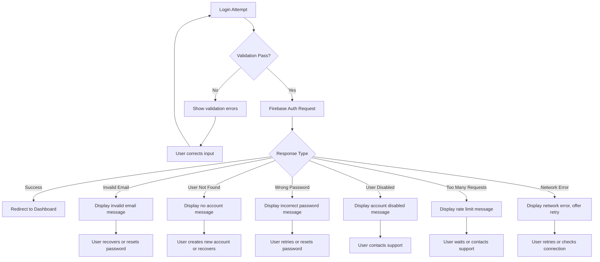
```mermaid
graph TD
    A[Login Attempt] --> B{Validation Pass?}
    B -->|No| C[Show validation errors]
    C --> D[User corrects input]
    D --> A

    B -->|Yes| E[Firebase Auth Request]
    E --> F{Response Type}

    F -->|Success| G[Redirect to Dashboard]
    F -->|Invalid Email| H[Display invalid email message]
    F -->|User Not Found| I[Display no account message]
    F -->|Wrong Password| J[Display incorrect password message]
    F -->|User Disabled| K[Display account disabled message]
    F -->|Too Many Requests| L[Display rate limit message]
    F -->|Network Error| M[Display network error, offer retry]

    H --> N[User recovers or resets password]
    I --> O[User creates new account or recovers]
    J --> P[User retries or resets password]
    K --> Q[User contacts support]
    L --> R[User waits or contacts support]
    M --> S[User retries or checks connection]
```

### Error Recovery Matrix

| Error Code                    | User Message                       | Recovery Action                  | Recovery Path                   |
| ----------------------------- | ---------------------------------- | -------------------------------- | ------------------------------- |
| `auth/invalid-email`          | "Invalid email address"            | User corrects email format       | Return to login form            |
| `auth/user-not-found`         | "No account found with this email" | Create account or reset password | Sign up link or forgot password |
| `auth/wrong-password`         | "Incorrect password"               | Retry or reset password          | Forgot password link            |
| `auth/user-disabled`          | "This account has been disabled"   | Contact support                  | Support email link              |
| `auth/too-many-requests`      | "Too many login attempts"          | Wait 5-15 minutes                | Automatic retry after delay     |
| `auth/network-request-failed` | "Network error. Check connection"  | Retry or check network           | Retry button                    |

### Registration Flow (Happy Path)

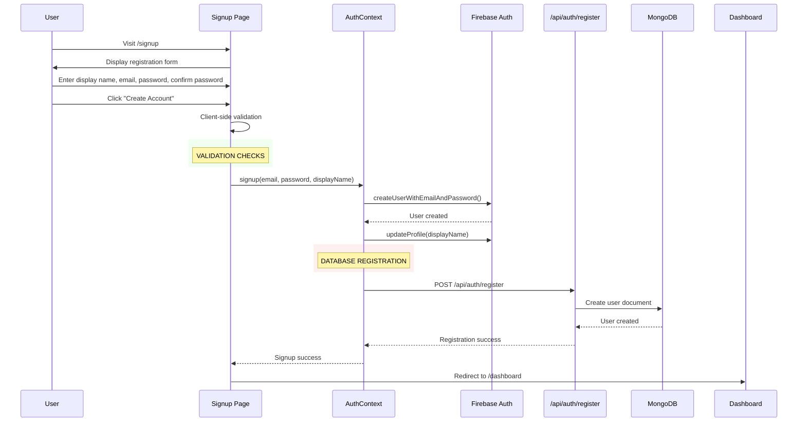
```mermaid
sequenceDiagram
    participant User
    participant UI as Signup Page
    participant Auth as AuthContext
    participant Firebase as Firebase Auth
    participant API as /api/auth/register
    participant DB as MongoDB
    participant Dashboard as Dashboard

    User->>UI: Visit /signup
    UI->>User: Display registration form

    User->>UI: Enter display name, email, password, confirm password
    User->>UI: Click "Create Account"
    UI->>UI: Client-side validation

    rect rgb(240, 255, 240)
        Note over UI: VALIDATION CHECKS
    end

    UI->>Auth: signup(email, password, displayName)
    Auth->>Firebase: createUserWithEmailAndPassword()
    Firebase-->>Auth: User created
    Auth->>Firebase: updateProfile(displayName)

    rect rgb(255, 240, 240)
        Note over Auth: DATABASE REGISTRATION
    end

    Auth->>API: POST /api/auth/register
    API->>DB: Create user document
    DB-->>API: User created
    API-->>Auth: Registration success
    Auth-->>UI: Signup success
    UI->>Dashboard: Redirect to /dashboard
```

### Registration Validation Rules

| Field            | Validation Rule      | Error Message                            | Emotional Impact              |
| ---------------- | -------------------- | ---------------------------------------- | ----------------------------- |
| Display Name     | Required, non-empty  | "Please enter your display name"         | Mild frustration if forgotten |
| Email            | Valid email format   | "Invalid email address"                  | Anxiety about typos           |
| Password         | Minimum 6 characters | "Password must be at least 6 characters" | Concern about security        |
| Confirm Password | Must match password  | "Passwords do not match"                 | Frustration if mismatch       |

### Password Reset Flow

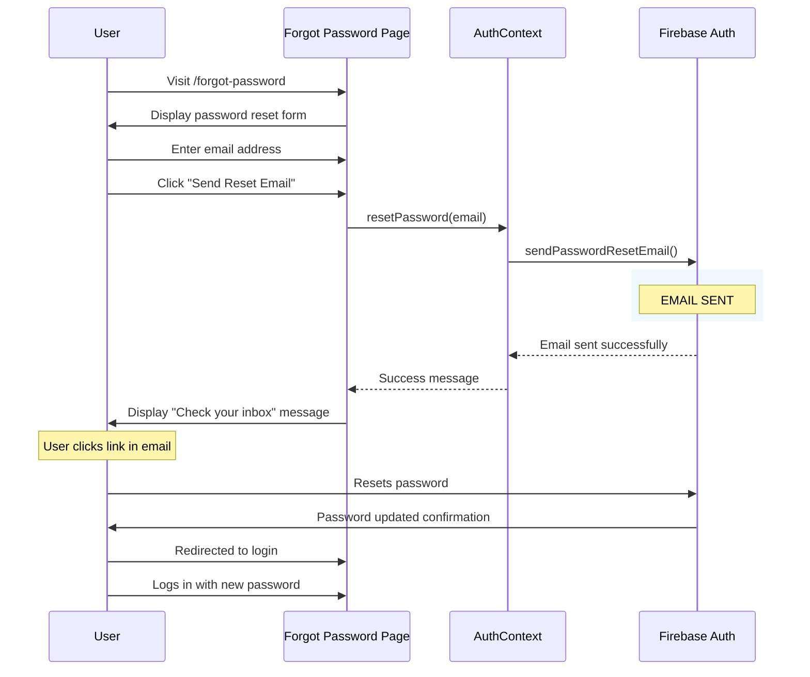
```mermaid
sequenceDiagram
    participant User
    participant UI as Forgot Password Page
    participant Auth as AuthContext
    participant Firebase as Firebase Auth

    User->>UI: Visit /forgot-password
    UI->>User: Display password reset form

    User->>UI: Enter email address
    User->>UI: Click "Send Reset Email"
    UI->>Auth: resetPassword(email)
    Auth->>Firebase: sendPasswordResetEmail()

    rect rgb(240, 248, 255)
        Note over Firebase: EMAIL SENT
    end

    Firebase-->>Auth: Email sent successfully
    Auth-->>UI: Success message
    UI->>User: Display "Check your inbox" message

    Note over User: User clicks link in email
    User->>Firebase: Resets password
    Firebase->>User: Password updated confirmation
    User->>UI: Redirected to login
    User->>UI: Logs in with new password
```

### Authentication Design Rationale

**Decision 1: Firebase Authentication**

_Rationale:_ Firebase provides robust, scalable authentication with built-in security features, social login options for future expansion, and handles token refresh automatically every 50 minutes to maintain session security.

**Decision 2: Client-Side Validation + Server Validation**

_Rationale:_ Client-side validation provides immediate feedback for better UX, while server-side validation ensures data integrity even if client validation is bypassed.

**Decision 3: Token Refresh Interval (50 minutes)**

_Rationale:_ Firebase tokens expire after 60 minutes. Refreshing at 50 minutes ensures continuous authentication while preventing excessive refresh requests.

---

## Dashboard Navigation Flow

### Dashboard Entry Flow

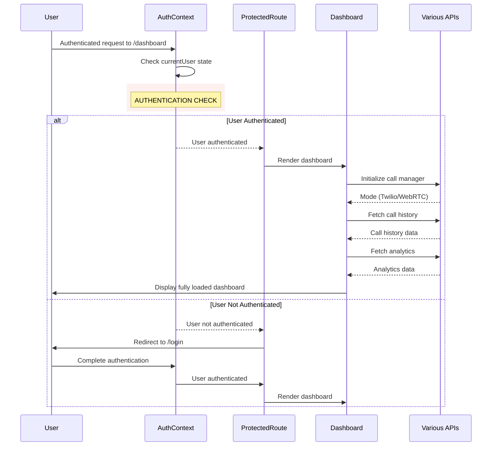
```mermaid
sequenceDiagram
    participant User
    participant Auth as AuthContext
    participant Route as ProtectedRoute
    participant Dashboard as Dashboard
    participant API as Various APIs

    User->>Auth: Authenticated request to /dashboard
    Auth->>Auth: Check currentUser state

    rect rgb(255, 240, 240)
        Note over Auth: AUTHENTICATION CHECK
    end

    alt User Authenticated
        Auth-->>Route: User authenticated
        Route->>Dashboard: Render dashboard
        Dashboard->>API: Initialize call manager
        API-->>Dashboard: Mode (Twilio/WebRTC)
        Dashboard->>API: Fetch call history
        API-->>Dashboard: Call history data
        Dashboard->>API: Fetch analytics
        API-->>Dashboard: Analytics data
        Dashboard->>User: Display fully loaded dashboard
    else User Not Authenticated
        Auth-->>Route: User not authenticated
        Route->>User: Redirect to /login
        User->>Auth: Complete authentication
        Auth->>Route: User authenticated
        Route->>Dashboard: Render dashboard
    end
```

### Dashboard Tab Navigation

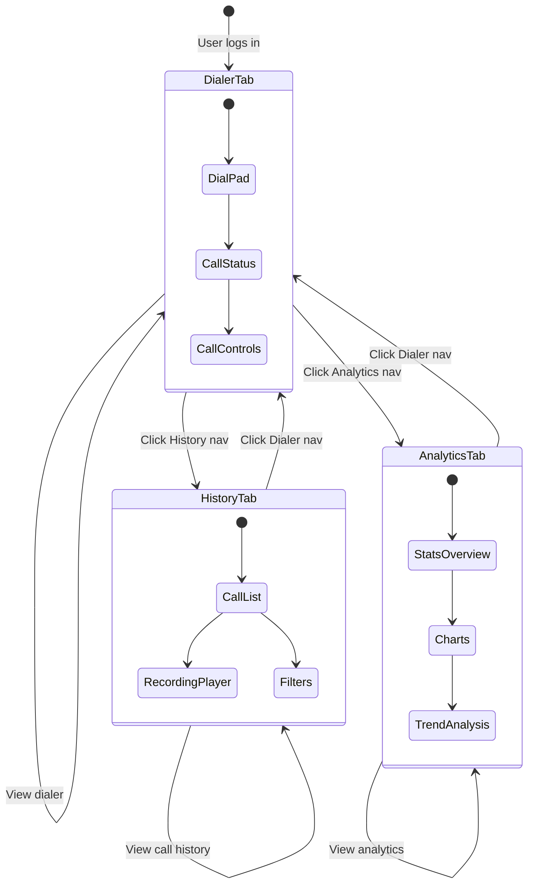
```mermaid
stateDiagram-v2
    [*] --> DialerTab: User logs in
    DialerTab --> DialerTab: View dialer
    DialerTab --> HistoryTab: Click History nav
    HistoryTab --> HistoryTab: View call history
    HistoryTab --> DialerTab: Click Dialer nav
    DialerTab --> AnalyticsTab: Click Analytics nav
    AnalyticsTab --> AnalyticsTab: View analytics
    AnalyticsTab --> DialerTab: Click Dialer nav

    state DialerTab {
        [*] --> DialPad
        DialPad --> CallStatus
        CallStatus --> CallControls
    }

    state HistoryTab {
        [*] --> CallList
        CallList --> RecordingPlayer
        CallList --> Filters
    }

    state AnalyticsTab {
        [*] --> StatsOverview
        StatsOverview --> Charts
        Charts --> TrendAnalysis
    }
```

### Dashboard Loading States

| State             | Duration | User Experience     | Emotional State      |
| ----------------- | -------- | ------------------- | -------------------- |
| Initial Load      | 0-2s     | Spinner displayed   | Neutral anticipation |
| Auth Check        | 0-1s     | Immediate if cached | Neutral              |
| Call Manager Init | 1-3s     | Progress indicator  | Mild anxiety         |
| Data Fetch        | 1-2s     | Skeleton loader     | Neutral waiting      |
| Full Load         | 2-5s     | Complete dashboard  | Satisfaction         |

---

## Call Management Flow

### Outbound Call Flow (Happy Path - Twilio)

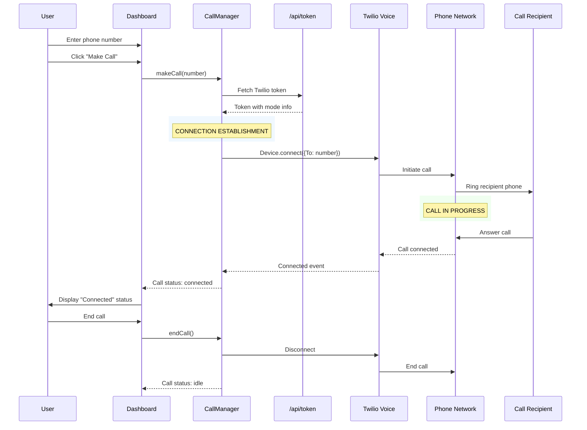
```mermaid
sequenceDiagram
    participant User
    participant UI as Dashboard
    participant CM as CallManager
    participant API as /api/token
    participant Twilio as Twilio Voice
    participant PSTN as Phone Network
    participant Recipient as Call Recipient

    User->>UI: Enter phone number
    User->>UI: Click "Make Call"
    UI->>CM: makeCall(number)
    CM->>API: Fetch Twilio token
    API-->>CM: Token with mode info

    rect rgb(240, 248, 255)
        Note over CM: CONNECTION ESTABLISHMENT
    end

    CM->>Twilio: Device.connect({To: number})
    Twilio->>PSTN: Initiate call
    PSTN->>Recipient: Ring recipient phone

    rect rgb(240, 255, 240)
        Note over PSTN: CALL IN PROGRESS
    end

    Recipient->>PSTN: Answer call
    PSTN-->>Twilio: Call connected
    Twilio-->>CM: Connected event
    CM-->>UI: Call status: connected
    UI->>User: Display "Connected" status

    User->>UI: End call
    UI->>CM: endCall()
    CM->>Twilio: Disconnect
    Twilio->>PSTN: End call
    CM-->>UI: Call status: idle
```

### Outbound Call Flow (Happy Path - WebRTC)

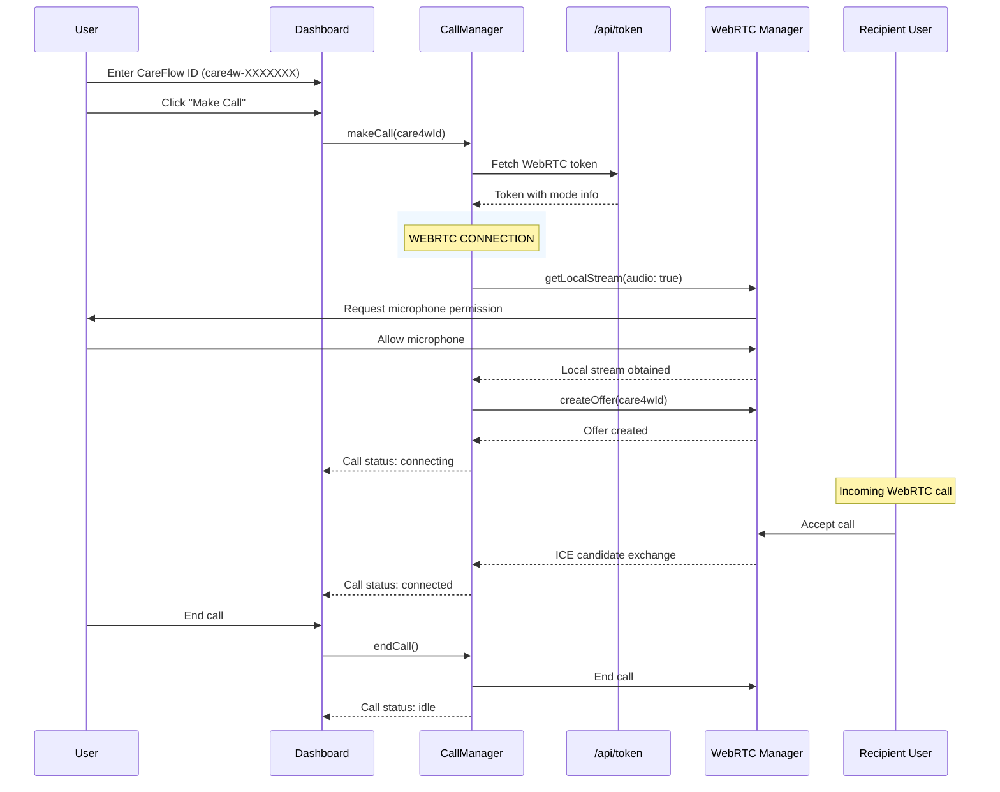
```mermaid
sequenceDiagram
    participant User
    participant UI as Dashboard
    participant CM as CallManager
    participant API as /api/token
    participant WebRTC as WebRTC Manager
    participant Recipient as Recipient User

    User->>UI: Enter CareFlow ID (care4w-XXXXXXX)
    User->>UI: Click "Make Call"
    UI->>CM: makeCall(care4wId)
    CM->>API: Fetch WebRTC token
    API-->>CM: Token with mode info

    rect rgb(240, 248, 255)
        Note over CM: WEBRTC CONNECTION
    end

    CM->>WebRTC: getLocalStream(audio: true)
    WebRTC->>User: Request microphone permission
    User->>WebRTC: Allow microphone
    WebRTC-->>CM: Local stream obtained
    CM->>WebRTC: createOffer(care4wId)
    WebRTC-->>CM: Offer created
    CM-->>UI: Call status: connecting

    Note over Recipient: Incoming WebRTC call
    Recipient->>WebRTC: Accept call
    WebRTC-->>CM: ICE candidate exchange
    CM-->>UI: Call status: connected

    User->>UI: End call
    UI->>CM: endCall()
    CM->>WebRTC: End call
    CM-->>UI: Call status: idle
```

### Call Management Detailed Steps

| Step | User Goal         | System Response          | User Input                  | Friction Points          | Emotional State  |
| ---- | ----------------- | ------------------------ | --------------------------- | ------------------------ | ---------------- |
| 1    | Enter destination | Validate format          | Phone number or CareFlow ID | Invalid format confusion | Focused          |
| 2    | Initiate call     | Request token            | Click "Make Call"           | Network delay            | Anticipation     |
| 3    | Connection        | Show "Connecting" status | None                        | Extended connecting time | Anxiety          |
| 4    | Ringing           | Show "Ringing" status    | None                        | Long wait                | Impatience       |
| 5    | Connected         | Show call duration       | None                        | Audio quality issues     | Satisfaction     |
| 6    | End call          | Disconnect and log       | Click "End Call"            | Accidental disconnect    | Mild frustration |

### Call Status States

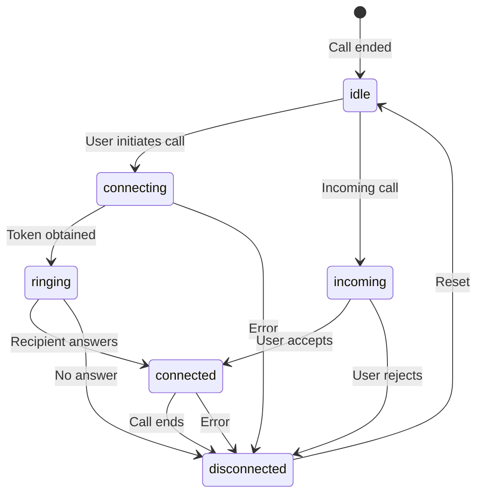
```mermaid
stateDiagram-v2
    [*] --> idle: Call ended

    idle --> connecting: User initiates call
    connecting --> ringing: Token obtained
    ringing --> connected: Recipient answers
    connected --> disconnected: Call ends
    disconnected --> idle: Reset

    ringing --> disconnected: No answer
    connecting --> disconnected: Error
    connected --> disconnected: Error

    idle --> incoming: Incoming call
    incoming --> connected: User accepts
    incoming --> disconnected: User rejects
```

### Call Controls Available

| Control       | State Available | Purpose           | UX Consideration           |
| ------------- | --------------- | ----------------- | -------------------------- |
| Mute          | Connected only  | Toggle microphone | Clear visual indicator     |
| Keypad (DTMF) | Connected only  | Send digits       | Future feature (disabled)  |
| Hold          | Connected only  | Place on hold     | Not yet implemented        |
| End Call      | Any active call | Disconnect        | Always visible when active |
| Accept Call   | Incoming only   | Answer call       | Large green button         |
| Reject Call   | Incoming only   | Decline call      | Large red button           |

### Inbound Call Flow

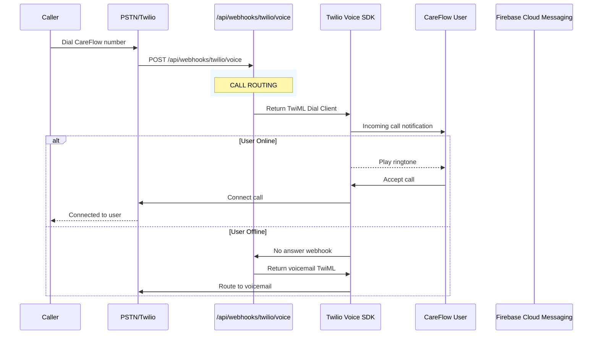
```mermaid
sequenceDiagram
    participant Caller
    participant PSTN as PSTN/Twilio
    participant Webhook as /api/webhooks/twilio/voice
    participant Twilio as Twilio Voice SDK
    participant User as CareFlow User
    participant FCM as Firebase Cloud Messaging

    Caller->>PSTN: Dial CareFlow number
    PSTN->>Webhook: POST /api/webhooks/twilio/voice

    rect rgb(240, 248, 255)
        Note over Webhook: CALL ROUTING
    end

    Webhook->>Twilio: Return TwiML Dial Client
    Twilio->>User: Incoming call notification

    alt User Online
        Twilio-->>User: Play ringtone
        User->>Twilio: Accept call
        Twilio->>PSTN: Connect call
        PSTN-->>Caller: Connected to user
    else User Offline
        Twilio->>Webhook: No answer webhook
        Webhook->>Twilio: Return voicemail TwiML
        Twilio->>PSTN: Route to voicemail
    end
```

### Inbound Call Notification Flow

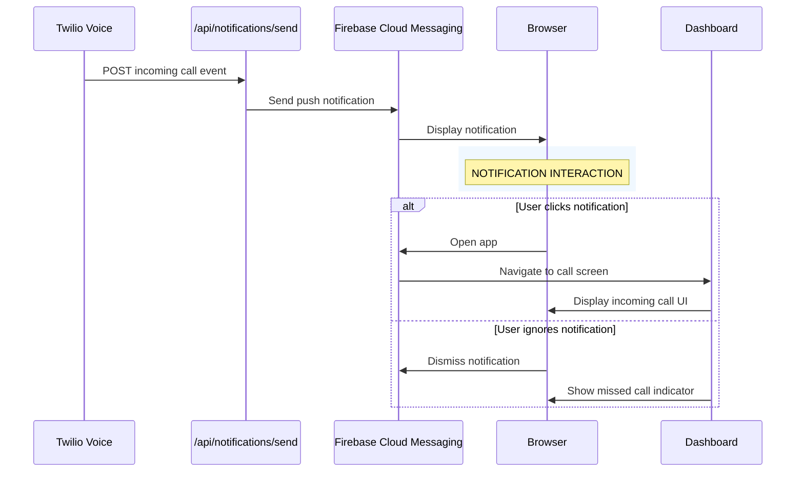
```mermaid
sequenceDiagram
    participant Twilio as Twilio Voice
    participant API as /api/notifications/send
    participant FCM as Firebase Cloud Messaging
    participant User as Browser

    Twilio->>API: POST incoming call event
    API->>FCM: Send push notification
    FCM->>User: Display notification

    rect rgb(240, 248, 255)
        Note over User: NOTIFICATION INTERACTION
    end

    alt User clicks notification
        User->>FCM: Open app
        FCM->>Dashboard: Navigate to call screen
        Dashboard->>User: Display incoming call UI
    else User ignores notification
        User->>FCM: Dismiss notification
        Dashboard->>User: Show missed call indicator
    end
```

### Call History Access Flow

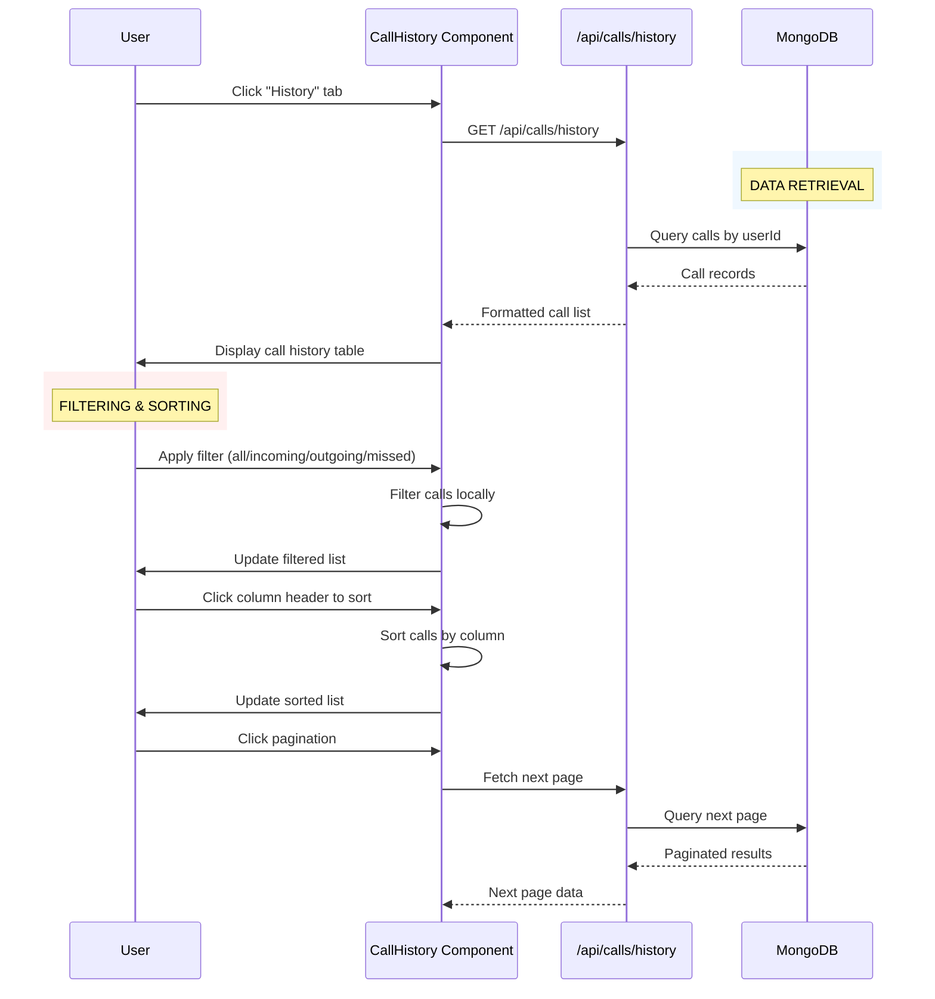
```mermaid
sequenceDiagram
    participant User
    participant UI as CallHistory Component
    participant API as /api/calls/history
    participant DB as MongoDB

    User->>UI: Click "History" tab
    UI->>API: GET /api/calls/history

    rect rgb(240, 248, 255)
        Note over DB: DATA RETRIEVAL
    end

    API->>DB: Query calls by userId
    DB-->>API: Call records
    API-->>UI: Formatted call list

    UI->>User: Display call history table

    rect rgb(255, 240, 240)
        Note over User: FILTERING & SORTING
    end

    User->>UI: Apply filter (all/incoming/outgoing/missed)
    UI->>UI: Filter calls locally
    UI->>User: Update filtered list

    User->>UI: Click column header to sort
    UI->>UI: Sort calls by column
    UI->>User: Update sorted list

    User->>UI: Click pagination
    UI->>API: Fetch next page
    API->>DB: Query next page
    DB-->>API: Paginated results
    API-->>UI: Next page data
```

### Call History Features

| Feature          | Implementation                          | User Benefit                   |
| ---------------- | --------------------------------------- | ------------------------------ |
| Filter by type   | All, Incoming, Outgoing, Missed         | Quick access to specific calls |
| Sortable columns | Date, Caller, Duration, Status          | Find specific calls easily     |
| Pagination       | 10 calls per page                       | Manage large call logs         |
| Status badges    | Color-coded (completed, missed, failed) | Quick status identification    |
| Recording access | Play/download for recorded calls        | Review past conversations      |

---

## Recording Playback Flow

### Recording Access Flow

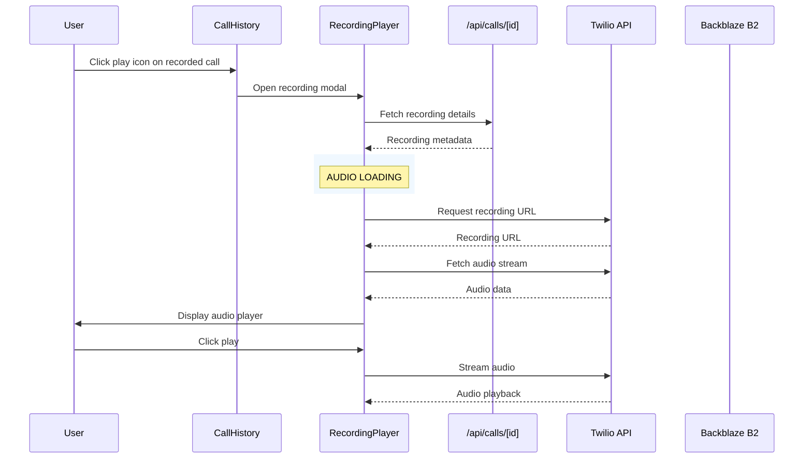
```mermaid
sequenceDiagram
    participant User
    participant History as CallHistory
    participant Player as RecordingPlayer
    participant API as /api/calls/[id]
    participant Twilio as Twilio API
    participant Storage as Backblaze B2

    User->>History: Click play icon on recorded call
    History->>Player: Open recording modal
    Player->>API: Fetch recording details
    API-->>Player: Recording metadata

    rect rgb(240, 248, 255)
        Note over Player: AUDIO LOADING
    end

    Player->>Twilio: Request recording URL
    Twilio-->>Player: Recording URL
    Player->>Twilio: Fetch audio stream
    Twilio-->>Player: Audio data
    Player->>User: Display audio player

    User->>Player: Click play
    Player->>Twilio: Stream audio
    Twilio-->>Player: Audio playback
```

### Recording Player Controls

| Control       | Function                | User Experience          |
| ------------- | ----------------------- | ------------------------ |
| Play/Pause    | Toggle audio playback   | Large, accessible button |
| Progress bar  | Seek through recording  | Click and drag support   |
| Time display  | Show current/total time | Real-time update         |
| Volume toggle | Mute/unmute audio       | Icon state change        |
| Download      | Save recording locally  | Authenticated download   |
| Delete        | Remove recording        | Confirmation required    |

### Recording Metadata Display

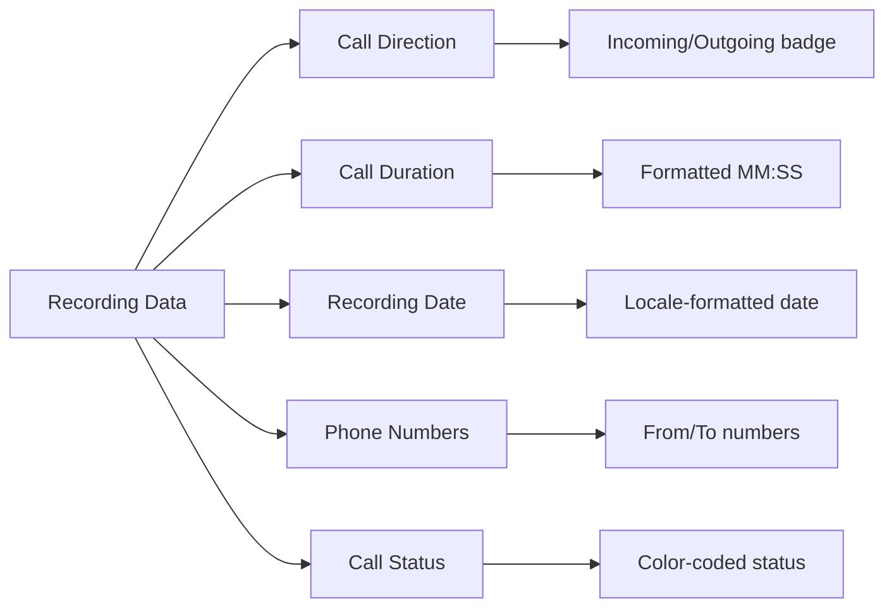
```mermaid
graph LR
    A[Recording Data] --> B[Call Direction]
    A --> C[Call Duration]
    A --> D[Recording Date]
    A --> E[Phone Numbers]
    A --> F[Call Status]

    B --> G[Incoming/Outgoing badge]
    C --> H[Formatted MM:SS]
    D --> I[Locale-formatted date]
    E --> J[From/To numbers]
    F --> K[Color-coded status]
```

---

## Notification Permission Flow

### Permission Request Flow

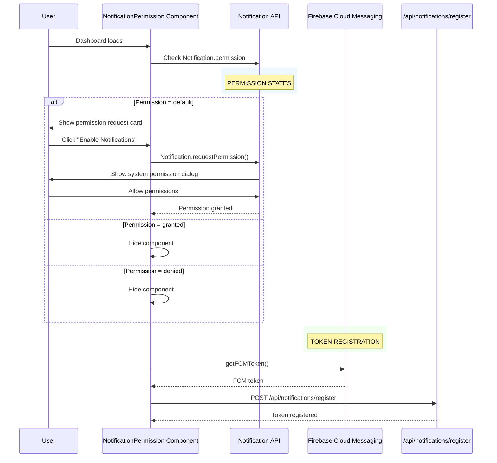
```mermaid
sequenceDiagram
    participant User
    participant UI as NotificationPermission Component
    participant Browser as Notification API
    participant FCM as Firebase Cloud Messaging
    participant API as /api/notifications/register

    User->>UI: Dashboard loads
    UI->>Browser: Check Notification.permission

    rect rgb(240, 248, 255)
        Note over Browser: PERMISSION STATES
    end

    alt Permission = default
        UI->>User: Show permission request card
        User->>UI: Click "Enable Notifications"
        UI->>Browser: Notification.requestPermission()
        Browser->>User: Show system permission dialog
        User->>Browser: Allow permissions
        Browser-->>UI: Permission granted
    else Permission = granted
        UI->>UI: Hide component
    else Permission = denied
        UI->>UI: Hide component
    end

    rect rgb(240, 255, 240)
        Note over FCM: TOKEN REGISTRATION
    end

    UI->>FCM: getFCMToken()
    FCM-->>UI: FCM token
    UI->>API: POST /api/notifications/register
    API-->>UI: Token registered
```

### Notification States

| State                      | User Experience               | Recovery Option                      |
| -------------------------- | ----------------------------- | ------------------------------------ |
| Default (Prompt not shown) | Show permission card          | User can click enable                |
| Granted                    | Hide card, send notifications | N/A                                  |
| Denied                     | Hide card, no notifications   | User must change in browser settings |
| Dismissed                  | Hide card, no prompt          | User must change in browser settings |

### Notification Benefits

| Benefit                   | User Value                 |
| ------------------------- | -------------------------- |
| Incoming call alerts      | Never miss important calls |
| Missed call notifications | Stay informed when away    |
| Call status updates       | Real-time connection info  |

---

## Error States and Recovery

### Error Handling Architecture

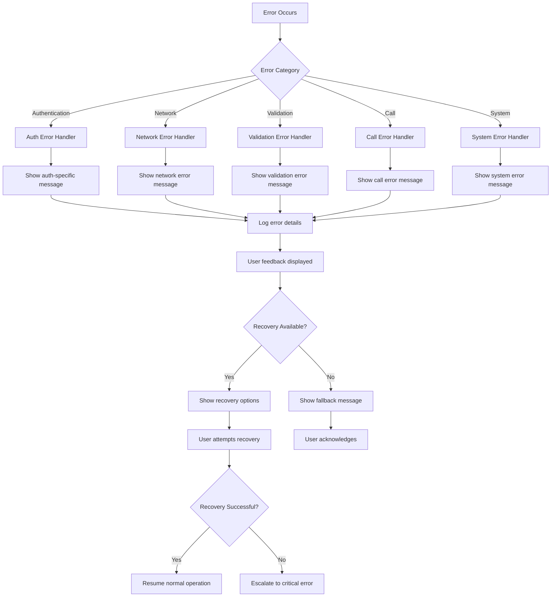
```mermaid
graph TD
    A[Error Occurs] --> B{Error Category}

    B -->|Authentication| C[Auth Error Handler]
    B -->|Network| D[Network Error Handler]
    B -->|Validation| E[Validation Error Handler]
    B -->|Call| F[Call Error Handler]
    B -->|System| G[System Error Handler]

    C --> H[Show auth-specific message]
    D --> I[Show network error message]
    E --> J[Show validation error message]
    F --> K[Show call error message]
    G --> L[Show system error message]

    H --> M[Log error details]
    I --> M
    J --> M
    K --> M
    L --> M

    M --> N[User feedback displayed]
    N --> O{Recovery Available?}

    O -->|Yes| P[Show recovery options]
    O -->|No| Q[Show fallback message]

    P --> R[User attempts recovery]
    Q --> S[User acknowledges]

    R --> T{Recovery Successful?}
    T -->|Yes| U[Resume normal operation]
    T -->|No| V[Escalate to critical error]
```

### Authentication Errors

| Error               | Handling               | User Message                                     | Recovery       |
| ------------------- | ---------------------- | ------------------------------------------------ | -------------- |
| Session expired     | Auto-redirect to login | "Session expired. Please log in again."          | Login required |
| Token refresh fail  | Force logout           | "Authentication failed. Please log in again."    | Login required |
| Permission denied   | Show access denied     | "You don't have permission to access this."      | Contact admin  |
| Network during auth | Retry prompt           | "Network error. Check connection and try again." | Retry button   |

### Call Errors

| Error                  | Handling                 | User Message                                  | Recovery       |
| ---------------------- | ------------------------ | --------------------------------------------- | -------------- |
| Twilio not initialized | Show error, disable call | "Call system not ready. Please refresh."      | Refresh page   |
| Invalid phone number   | Validate before dial     | "Invalid phone number format."                | Correct number |
| CareFlow ID invalid    | Validate format          | "Invalid CareFlow ID. Format: care4w-XXXXXXX" | Correct ID     |
| Cannot call self       | Prevent call             | "You cannot call your own CareFlow ID."       | N/A            |
| Network during call    | Show reconnection        | "Connection lost. Attempting to reconnect..." | Auto-retry     |
| Call failed            | Show failure reason      | "Call failed: [reason]. Please try again."    | Retry button   |

### Network Errors

| Scenario           | Handling                   | User Experience                               |
| ------------------ | -------------------------- | --------------------------------------------- |
| API timeout (5s)   | Show loading, retry option | "Request timed out. Retry?"                   |
| Rate limited       | Show wait message          | "Too many requests. Please wait 1 minute."    |
| Server error (5xx) | Show error, retry option   | "Server error. Try again later."              |
| Offline            | Detect connection loss     | "You are offline. Some features unavailable." |

### Validation Errors

| Field       | Validation       | Error Message                                         |
| ----------- | ---------------- | ----------------------------------------------------- |
| Email       | Regex validation | "Please enter a valid email address"                  |
| Password    | Min 6 characters | "Password must be at least 6 characters"              |
| Phone       | E.164 format     | "Please enter a valid phone number with country code" |
| CareFlow ID | Pattern match    | "Invalid CareFlow ID. Format: care4w-XXXXXXX"         |

---

## Gaps and Optimization Opportunities

### Identified Gaps

| Gap                             | Impact        | Priority | Recommended Action                              |
| ------------------------------- | ------------- | -------- | ----------------------------------------------- |
| No email verification flow      | Security      | High     | Implement email verification before full access |
| No two-factor authentication    | Security      | Medium   | Add TFA option for enhanced security            |
| Hold feature not implemented    | Functionality | Medium   | Complete hold feature implementation            |
| No call transfer capability     | Functionality | Low      | Add transfer feature for future                 |
| Limited call recording controls | UX            | Low      | Add trim, annotate features                     |
| No group call support           | Feature       | Low      | Consider for future roadmap                     |
| No video call option            | Feature       | Low      | Consider WebRTC video expansion                 |

### Usability Concerns

| Concern                            | Observation                                   | Impact | Recommendation                        |
| ---------------------------------- | --------------------------------------------- | ------ | ------------------------------------- |
| CareFlow ID format unclear         | Users confuse phone numbers with CareFlow IDs | Medium | Add clearer placeholder and help text |
| Call mode switching opaque         | Users don't understand Twilio vs WebRTC       | Low    | Add mode indicator with tooltip       |
| Notification permission timing     | Permission asked on dashboard load            | Low    | Consider timing optimization          |
| Error messages sometimes technical | Some errors show raw codes                    | Low    | Ensure all errors are user-friendly   |
| No undo for recording deletion     | Recordings deleted immediately                | Low    | Add soft delete with confirmation     |

### Performance Optimization Opportunities

| Area                    | Current                | Opportunity                       | Expected Benefit          |
| ----------------------- | ---------------------- | --------------------------------- | ------------------------- |
| Initial load time       | 2-5s                   | Lazy load non-critical components | 30% faster load           |
| Call history pagination | 10 per page            | Virtual scrolling for large lists | Better UX for power users |
| Analytics data          | Full reload on refresh | Caching and incremental updates   | Reduced API calls         |
| Token refresh           | Every 50 min           | Smart refresh based on activity   | Reduced overhead          |
| Recording fetch         | On-demand              | Preload recent recordings         | Faster playback           |

### Security Improvements

| Area               | Current State     | Improvement                    |
| ------------------ | ----------------- | ------------------------------ |
| Token storage      | Firebase session  | Add token encryption           |
| API authentication | Bearer token      | Add request signing            |
| Recording access   | Direct Twilio URL | Implement signed URLs          |
| Rate limiting      | Basic             | Implement stricter limits      |
| Input sanitization | Basic             | Add comprehensive sanitization |

### Accessibility Improvements

| Issue               | Current                 | Improvement             |
| ------------------- | ----------------------- | ----------------------- |
| Color-only status   | Status uses colors only | Add icons and text      |
| Keyboard navigation | Limited                 | Full keyboard support   |
| Screen reader       | Not optimized           | ARIA labels and roles   |
| Focus management    | Basic                   | Enhanced focus trapping |
| Contrast ratios     | Most pass               | Audit and fix failing   |

### User Flow Optimization Opportunities

| Flow             | Current        | Optimized                   |
| ---------------- | -------------- | --------------------------- |
| First login      | 4 steps        | 3 steps (combined setup)    |
| Make first call  | 5 steps        | 4 steps (inline validation) |
| Access recording | 3 clicks       | 2 clicks (quick play)       |
| Change settings  | Multiple pages | Unified settings page       |
| Logout           | 1 click        | Add confirmation for safety |

---

## Design Decisions Rationale

### Decision: Unified Call Manager

_Rationale:_ The [`CallManager`](lib/callManager.js) class provides a unified interface for both Twilio and WebRTC calls, abstracting the complexity of different call modes from the UI layer. This design allows for:

- Easy addition of new call providers
- Consistent UI regardless of underlying technology
- Simplified testing and mocking
- Future extensibility for hybrid scenarios

### Decision: Client-Side Validation First

_Rationale:_ Client-side validation provides immediate feedback, reducing server load and improving user experience. However, all validation is also performed server-side to ensure data integrity.

### Decision: Token Refresh at 50 Minutes

_Rationale:_ Firebase tokens expire at 60 minutes. Refreshing at 50 minutes ensures continuous authentication while preventing edge cases where a token might expire during a long operation.

### Decision: Protected Routes

_Rationale:_ The [`ProtectedRoute`](components/ProtectedRoute/ProtectedRoute.js) component ensures that unauthenticated users cannot access protected resources, providing a security boundary at the routing level.

### Decision: Modal-Based Recording Player

_Rationale:_ Using a modal for recording playback maintains context with the call history while providing focused audio playback controls.

---

## Appendix

### File Reference Map

| Flow               | Key Files                                                                                                                                |
| ------------------ | ---------------------------------------------------------------------------------------------------------------------------------------- |
| Authentication     | [`app/login/page.js`](app/login/page.js), [`app/signup/page.js`](app/signup/page.js), [`context/AuthContext.js`](context/AuthContext.js) |
| Dashboard          | [`app/dashboard/page.js`](app/dashboard/page.js), [`components/dashboard/`](components/dashboard/)                                       |
| Call Management    | [`lib/callManager.js`](lib/callManager.js), [`lib/webrtc.js`](lib/webrtc.js)                                                             |
| Call History       | [`components/dashboard/CallHistory.js`](components/dashboard/CallHistory.js)                                                             |
| Recording Playback | [`components/dashboard/RecordingPlayer.js`](components/dashboard/RecordingPlayer.js)                                                     |
| Notifications      | [`components/NotificationPermission.js`](components/NotificationPermission.js), [`hooks/useNotifications.js`](hooks/useNotifications.js) |

### API Endpoints

| Endpoint                      | Method | Purpose                   |
| ----------------------------- | ------ | ------------------------- |
| `/api/auth/login`             | POST   | Authenticate user         |
| `/api/auth/register`          | POST   | Register new user         |
| `/api/auth/logout`            | POST   | Logout user               |
| `/api/calls/history`          | GET    | Fetch call history        |
| `/api/analytics`              | GET    | Fetch analytics data      |
| `/api/token`                  | GET    | Fetch Twilio/WebRTC token |
| `/api/notifications/register` | POST   | Register FCM token        |

### Configuration Variables

| Variable                         | Purpose                         |
| -------------------------------- | ------------------------------- |
| `NEXT_PUBLIC_FIREBASE_API_KEY`   | Firebase authentication         |
| `NEXT_PUBLIC_TWILIO_ACCOUNT_SID` | Twilio account identification   |
| `NEXT_PUBLIC_FIREBASE_VAPID_KEY` | Push notification configuration |
| `TWILIO_AUTH_TOKEN`              | Twilio API authentication       |
| `MONGODB_URI`                    | Database connection             |

---

## Document Version History

| Version | Date       | Changes                             | Author        |
| ------- | ---------- | ----------------------------------- | ------------- |
| 1.0.0   | 2026-02-06 | Initial comprehensive documentation | CareFlow Team |

---

_This document provides the authoritative reference for CareFlow user flows. For implementation details, refer to the codebase and supplementary documentation._
