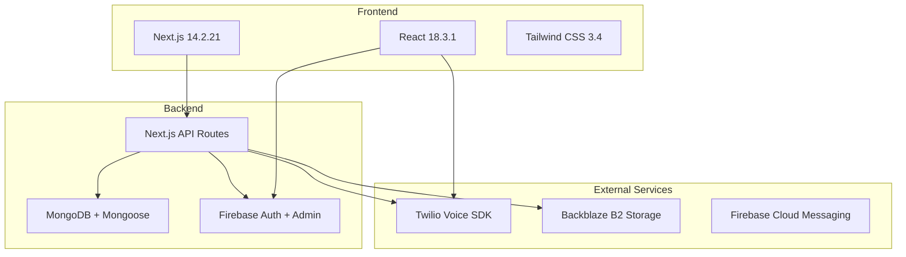
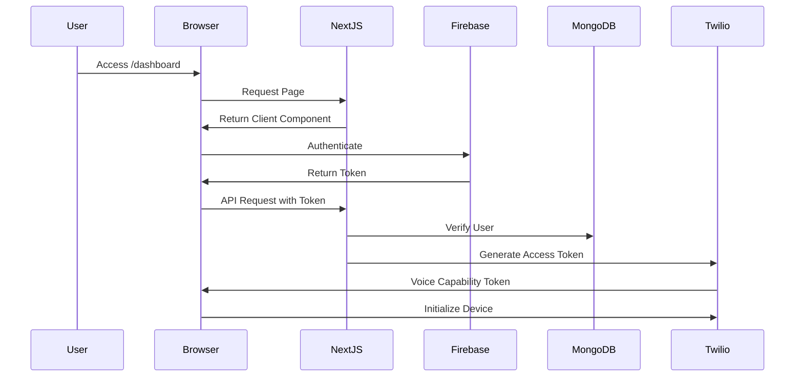
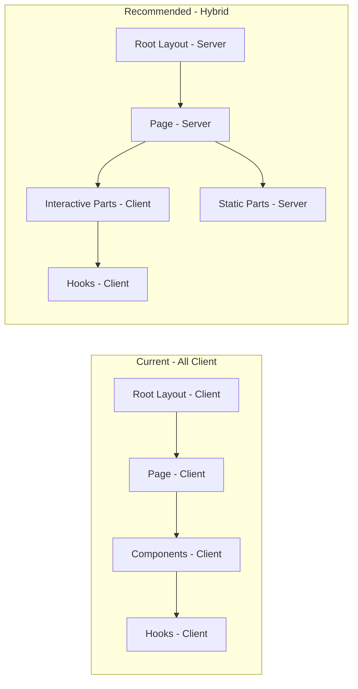
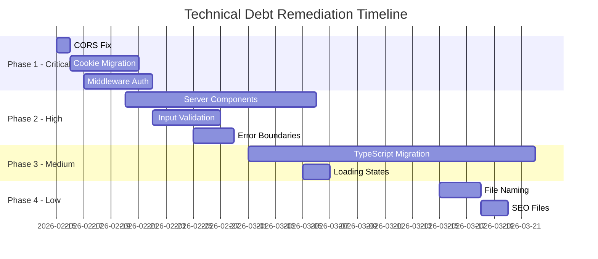

# CareFlow Next.js Application - Comprehensive Architectural Review & Code Audit

**Document Version:** 1.0.0
**Date:** February 13, 2026
**Author:** Principal Frontend Engineer
**Classification:** Technical Audit Report

---

## Table of Contents

1. [Executive Summary](#executive-summary)
2. [Audit Methodology](#audit-methodology)
3. [Architecture Overview](#architecture-overview)
4. [Critical Findings](#critical-findings)
5. [High Severity Issues](#high-severity-issues)
6. [Medium Severity Issues](#medium-severity-issues)
7. [Low Severity Issues](#low-severity-issues)
8. [Technical Debt Inventory](#technical-debt-inventory)
9. [Strategic Roadmap](#strategic-roadmap)
10. [Appendices](#appendices)

---

## Executive Summary

### Audit Scope

This comprehensive architectural review examined the CareFlow Next.js application, focusing on:

- App Router conventions and Server Components implementation
- Data fetching strategies and caching patterns
- State management architecture
- Security implementations
- Performance optimization
- Code quality and maintainability
- Scalability considerations

### Overall Assessment

**Risk Level: MEDIUM-HIGH**

The CareFlow application demonstrates a functional implementation for browser-based calling using Twilio Voice SDK and WebRTC fallback. However, the codebase exhibits significant architectural deviations from Next.js 14 best practices, security vulnerabilities, and scalability concerns that require immediate attention.

### Key Metrics

| Category              | Score | Status               |
| --------------------- | ----- | -------------------- |
| App Router Compliance | 3/10  | ❌ Critical          |
| Security Posture      | 5/10  | ⚠️ Needs Improvement |
| Performance           | 6/10  | ⚠️ Acceptable        |
| Code Quality          | 6/10  | ⚠️ Acceptable        |
| Maintainability       | 5/10  | ⚠️ Needs Improvement |
| Scalability           | 4/10  | ⚠️ Concerning        |

### Critical Action Items

1. **Immediate**: Fix CORS configuration allowing wildcard origins
2. **Immediate**: Migrate token storage from localStorage to httpOnly cookies
3. **High Priority**: Implement proper Server Components architecture
4. **High Priority**: Add middleware-based authentication
5. **Medium Priority**: Implement TypeScript for type safety

---

## Audit Methodology

### Files Analyzed

```
Total Files Reviewed: 45+
Lines of Code: ~8,000+
Configuration Files: 8
API Routes: 15
React Components: 20+
Custom Hooks: 8
```

### Review Criteria

- Next.js 14 App Router best practices
- React 18 Server Components patterns
- OWASP security guidelines
- Performance optimization standards
- Code maintainability principles
- Industry-standard architectural patterns

---

## Architecture Overview

### Current Technology Stack



### Application Flow



### Directory Structure Analysis

```
app/
├── layout.js          # Root layout - Client Component ❌
├── page.js            # Home page - Client Component ❌
├── dashboard/
│   └── page.js        # Dashboard - Client Component ❌
├── login/page.js      # Login - Client Component ❌
├── signup/page.js     # Signup - Client Component ❌
└── api/               # API Routes
    ├── auth/
    ├── calls/
    ├── recordings/
    ├── token/
    └── webhooks/
```

**Finding**: All pages are implemented as Client Components, missing the primary benefit of Next.js App Router - Server Components.

---

## Critical Findings

### CRIT-001: CORS Wildcard Configuration

**Severity**: CRITICAL
**File**: [`next.config.js`](next.config.js:10)
**CWE**: CWE-942

#### Description

The application configures CORS headers with a wildcard `Access-Control-Allow-Origin: *`, allowing any origin to make requests to the API.

```javascript
// next.config.js:10
{ key: 'Access-Control-Allow-Origin', value: '*' },
```

#### Impact

- Enables cross-site request forgery (CSRF) attacks
- Allows malicious websites to interact with the API
- Exposes sensitive user data to unauthorized origins
- Violates same-origin policy security model

#### Recommendation

Implement origin whitelisting:

```javascript
const allowedOrigins = [
  'https://careflow.app',
  'https://www.careflow.app',
  process.env.NEXT_PUBLIC_APP_URL
];

async headers() {
  return [{
    source: '/api/:path*',
    headers: [
      { key: 'Access-Control-Allow-Credentials', value: 'true' },
      {
        key: 'Access-Control-Allow-Origin',
        value: allowedOrigins.includes(origin) ? origin : allowedOrigins[0]
      },
      { key: 'Access-Control-Allow-Methods', value: 'GET,POST,OPTIONS' },
      { key: 'Access-Control-Allow-Headers', value: 'Content-Type,Authorization' },
    ],
  }];
}
```

---

### CRIT-002: Token Storage in localStorage

**Severity**: CRITICAL
**File**: [`context/AuthContext.js`](context/AuthContext.js:57)
**CWE**: CWE-922

#### Description

Authentication tokens are stored in localStorage, which is accessible to any JavaScript code running on the page.

```javascript
// context/AuthContext.js:57
localStorage.setItem('careflow_token', idToken);
```

#### Impact

- Tokens are vulnerable to XSS attacks
- Any compromised third-party script can steal tokens
- No protection against malicious browser extensions
- Violates OWASP authentication guidelines

#### Recommendation

Migrate to httpOnly cookies:

```javascript
// API Route: /api/auth/session
export async function POST(request) {
  const { idToken } = await request.json();

  // Verify token with Firebase Admin
  const decodedToken = await adminAuth.verifyIdToken(idToken);

  // Create session cookie
  const sessionCookie = await adminAuth.createSessionCookie(idToken, {
    expiresIn: 60 * 60 * 24 * 5 * 1000, // 5 days
  });

  return new Response(JSON.stringify({ success: true }), {
    headers: {
      'Set-Cookie': `session=${sessionCookie}; HttpOnly; Secure; SameSite=Strict; Path=/; Max-Age=432000`,
    },
  });
}
```

---

### CRIT-003: Missing Server Components Architecture

**Severity**: CRITICAL
**Files**: All page components
**Impact**: Performance, SEO, Bundle Size

#### Description

Every page in the application is marked as a Client Component with `'use client'`, completely bypassing the Server Components architecture that is the core feature of Next.js App Router.

```javascript
// app/page.js:1
'use client';

// app/dashboard/page.js:12
'use client';

// app/login/page.js:1
'use client';
```

#### Impact

- No server-side rendering benefits
- Larger JavaScript bundle sizes
- Poor initial page load performance
- Degraded SEO capabilities
- Increased Time to Interactive (TTI)
- Wasted server resources

#### Current vs. Recommended Architecture



#### Recommendation

Restructure pages to use Server Components:

```javascript
// app/dashboard/page.js - Server Component
import { Suspense } from 'react';
import { requireAuth } from '@/lib/auth';
import DashboardClient from './DashboardClient';

export default async function DashboardPage() {
  const user = await requireAuth(); // Server-side auth check

  return (
    <Suspense fallback={<DashboardSkeleton />}>
      <DashboardClient user={user} />
    </Suspense>
  );
}
```

```javascript
// app/dashboard/DashboardClient.js - Client Component
'use client';

import { CallStateProvider } from '@/hooks/useCallState';

export default function DashboardClient({ user }) {
  // Only interactive parts need 'use client'
  return <CallStateProvider>{/* Interactive dashboard content */}</CallStateProvider>;
}
```

---

## High Severity Issues

### HIGH-001: Duplicate AuthProvider Wrapping

**Severity**: HIGH
**Files**: [`app/layout.js`](app/layout.js:19), [`app/dashboard/page.js`](app/dashboard/page.js:189)

#### Description

The `AuthProvider` is wrapped around the application in both the root layout and the dashboard page, creating duplicate context providers.

```javascript
// app/layout.js:19
<AuthProvider>{children}</AuthProvider>

// app/dashboard/page.js:189
<AuthProvider>
  <CallStateProvider>
    {/* ... */}
  </CallStateProvider>
</AuthProvider>
```

#### Impact

- Multiple context instances can cause state synchronization issues
- Increased memory consumption
- Potential for stale context values
- Confusing debugging experience

#### Recommendation

Remove the duplicate provider from dashboard:

```javascript
// app/dashboard/page.js
export default function DashboardPage() {
  return (
    <CallStateProvider>
      <ErrorBoundary>
        <ProtectedRoute>
          <DashboardContent />
        </ProtectedRoute>
      </ErrorBoundary>
    </CallStateProvider>
  );
}
```

---

### HIGH-002: No Middleware-Based Authentication

**Severity**: HIGH
**Impact**: Security, Code Duplication

#### Description

Authentication verification is performed individually in each API route rather than using Next.js middleware for centralized auth handling.

```javascript
// Repeated in multiple API routes
const auth = await requireAuth(request);
const authError = handleAuthResult(auth);
if (authError) return authError;
```

#### Impact

- Code duplication across all protected routes
- Inconsistent authentication behavior
- Higher maintenance overhead
- Risk of missing auth checks on new routes

#### Recommendation

Implement middleware-based authentication:

```javascript
// middleware.js
import { NextResponse } from 'next/server';

export async function middleware(request) {
  const { pathname } = request.nextUrl;

  // Public paths that don't require auth
  const publicPaths = ['/login', '/signup', '/api/auth', '/api/webhooks'];
  if (publicPaths.some((path) => pathname.startsWith(path))) {
    return NextResponse.next();
  }

  // Verify session cookie
  const session = request.cookies.get('session');
  if (!session) {
    return NextResponse.redirect(new URL('/login', request.url));
  }

  try {
    // Verify session with Firebase Admin
    const decodedClaims = await adminAuth.verifySessionCookie(session.value);
    // Add user info to headers for API routes
    const response = NextResponse.next();
    response.headers.set('x-user-uid', decodedClaims.uid);
    return response;
  } catch (error) {
    return NextResponse.redirect(new URL('/login', request.url));
  }
}

export const config = {
  matcher: ['/dashboard/:path*', '/api/:path*'],
};
```

---

### HIGH-003: Firebase Client-Side Initialization Pattern

**Severity**: HIGH
**File**: [`lib/firebase.js`](lib/firebase.js:58-62)

#### Description

Firebase is initialized using an async pattern with immediate execution, but the exports are referenced before initialization completes.

```javascript
// lib/firebase.js:58-62
initializeFirebaseServices().catch(console.error);

// Export the services (will be populated after initialization)
export const auth = authInstance; // This is undefined at export time!
export const storage = storageInstance;
export const messaging = messagingInstance;
```

#### Impact

- Race conditions when importing Firebase services
- `auth` can be undefined when used in other modules
- SSR compatibility issues
- Unpredictable initialization order

#### Recommendation

Use lazy initialization pattern:

```javascript
// lib/firebase.js
import { initializeApp, getApps } from 'firebase/app';
import { getAuth } from 'firebase/auth';

let app = null;
let auth = null;

function getFirebaseApp() {
  if (!app) {
    if (!getApps().length) {
      app = initializeApp(firebaseConfig);
    } else {
      app = getApps()[0];
    }
  }
  return app;
}

export function getFirebaseAuth() {
  if (!auth) {
    auth = getAuth(getFirebaseApp());
  }
  return auth;
}

// For client-side only usage
export const auth = typeof window !== 'undefined' ? getFirebaseAuth() : null;
```

---

### HIGH-004: No Input Validation Layer

**Severity**: HIGH
**Impact**: Security, Data Integrity

#### Description

API routes lack structured input validation, relying on manual checks scattered throughout the codebase.

```javascript
// app/api/auth/register/route.js:16-21
if (!displayName || !email || !firebaseUid) {
  return errorResponse('Missing required fields: displayName, email, firebaseUid', {
    status: 400,
    code: 'VALIDATION_ERROR',
  });
}
```

#### Impact

- Inconsistent validation across endpoints
- No schema enforcement
- Vulnerable to injection attacks
- Poor error messages for invalid input

#### Recommendation

Implement Zod for schema validation:

```javascript
// lib/validations/auth.js
import { z } from 'zod';

export const registerSchema = z.object({
  displayName: z.string().min(2).max(50),
  email: z.string().email(),
  firebaseUid: z.string().min(1),
});

// app/api/auth/register/route.js
import { registerSchema } from '@/lib/validations/auth';

export async function POST(request) {
  try {
    const body = await request.json();
    const validated = registerSchema.parse(body); // Throws on invalid

    // Use validated data...
  } catch (error) {
    if (error instanceof z.ZodError) {
      return errorResponse('Validation failed', {
        status: 400,
        code: 'VALIDATION_ERROR',
        details: error.errors,
      });
    }
    throw error;
  }
}
```

---

### HIGH-005: External Image Without Optimization

**Severity**: HIGH
**Files**: [`app/page.js`](app/page.js:35), [`app/login/page.js`](app/login/page.js:63), [`app/signup/page.js`](app/signup/page.js:98)

#### Description

External images from Unsplash are loaded without Next.js Image optimization.

```javascript
// app/page.js:35

```

#### Impact

- No automatic image optimization
- Missing lazy loading
- No placeholder/blur effect
- Unoptimized CLS (Cumulative Layout Shift)
- External dependency on Unsplash availability

#### Recommendation

Use Next.js Image component with remote patterns:

```javascript
// next.config.js
const nextConfig = {
  images: {
    remotePatterns: [
      {
        protocol: 'https',
        hostname: 'images.unsplash.com',
      },
    ],
  },
};

// app/page.js
import Image from 'next/image';

<Image
  src="https://images.unsplash.com/photo-1506905925346-21bda4d32df4"
  alt="Beautiful mountain landscape"
  fill
  priority
  className="object-cover"
  sizes="100vw"
/>;
```

---

## Medium Severity Issues

### MED-001: Inconsistent File Naming Conventions

**Severity**: MEDIUM
**Impact**: Maintainability

#### Description

The codebase uses mixed naming conventions for files:

```
components/dashboard/DialPad.js      # PascalCase
components/dashboard/CallControls.js # PascalCase
hooks/useCallState.js                # camelCase
lib/callManager.js                   # camelCase
app/dashboard/tabs/DialerTab.jsx     # .jsx extension
app/dashboard/tabs/HistoryTab.jsx    # .jsx extension
components/dashboard/DialPad.js      # .js extension
```

#### Recommendation

Standardize on:

- `.tsx`/`.ts` extensions (after TypeScript migration)
- PascalCase for components: `DialPad.tsx`
- camelCase for utilities/hooks: `useCallState.ts`
- Consistent directory structure

---

### MED-002: No Error Boundary Granularity

**Severity**: MEDIUM
**File**: [`app/dashboard/page.js`](app/dashboard/page.js:191-197)

#### Description

A single error boundary wraps the entire dashboard, meaning any component error crashes the whole page.

```javascript
<ErrorBoundary
  fallback={(error, retry) => (
    <div className="error-page">
      <ErrorDisplay error={error} onRetry={retry} />
    </div>
  )}
>
  <ProtectedRoute>
    <DashboardContent />
  </ProtectedRoute>
</ErrorBoundary>
```

#### Recommendation

Implement granular error boundaries:

```javascript
<ErrorBoundary fallback={<DashboardError />}>
  <DashboardHeader />

  <div className="dashboard-body">
    <ErrorBoundary fallback={<SidebarError />}>
      <DashboardSidebar />
    </ErrorBoundary>

    <main className="dashboard-main">
      <ErrorBoundary fallback={<ContentError />}>
        <ActiveTabComponent {...props} />
      </ErrorBoundary>
    </main>
  </div>
</ErrorBoundary>
```

---

### MED-003: Console Statements in Production Code

**Severity**: MEDIUM
**Impact**: Performance, Security

#### Description

Numerous `console.log`, `console.error`, and `console.warn` statements remain in production code.

```javascript
// lib/callManager.js:86
logger.init('CallManager');

// context/AuthContext.js:81
console.error('Error fetching user data:', error);

// app/api/webhooks/twilio/voice/route.js:19
console.log(`Incoming call from ${from} to ${to}`);
```

#### Recommendation

Use a proper logging library with log levels:

```javascript
// lib/logger.js
const isDev = process.env.NODE_ENV === 'development';

export const logger = {
  debug: (...args) => isDev && console.log('[DEBUG]', ...args),
  info: (...args) => console.info('[INFO]', ...args),
  warn: (...args) => console.warn('[WARN]', ...args),
  error: (...args) => console.error('[ERROR]', ...args),
};
```

---

### MED-004: No Loading States for Pages

**Severity**: MEDIUM
**Impact**: User Experience

#### Description

The application lacks `loading.js` files for streaming loading states, relying instead on client-side loading states.

#### Recommendation

Implement loading.js files:

```javascript
// app/dashboard/loading.js
export default function DashboardLoading() {
  return (
    <div className="min-h-screen bg-background-dark flex items-center justify-center">
      <div className="animate-spin rounded-full h-12 w-12 border-t-2 border-b-2 border-primary-red" />
    </div>
  );
}
```

---

### MED-005: Singleton Pattern with React Strict Mode

**Severity**: MEDIUM
**File**: [`lib/callManager.js`](lib/callManager.js:43)

#### Description

The CallManager uses a singleton pattern that can cause issues with React 18 Strict Mode's double-render behavior.

```javascript
// lib/callManager.js:1147
export const callManager = new CallManager();
```

#### Impact

- Potential double initialization in development
- State persistence issues
- Memory leaks if not properly cleaned up

#### Recommendation

Use React Context with proper cleanup:

```javascript
// context/CallManagerContext.js
'use client';

import { createContext, useContext, useRef, useEffect } from 'react';
import { CallManager } from '@/lib/CallManager';

const CallManagerContext = createContext(null);

export function CallManagerProvider({ children }) {
  const managerRef = useRef(null);

  if (!managerRef.current) {
    managerRef.current = new CallManager();
  }

  useEffect(() => {
    return () => {
      managerRef.current?.disconnect();
    };
  }, []);

  return (
    <CallManagerContext.Provider value={managerRef.current}>{children}</CallManagerContext.Provider>
  );
}

export function useCallManager() {
  return useContext(CallManagerContext);
}
```

---

### MED-006: Missing TypeScript

**Severity**: MEDIUM
**Impact**: Maintainability, Developer Experience, Bug Prevention

#### Description

The entire codebase is written in JavaScript without TypeScript, missing out on type safety and improved developer experience.

#### Recommendation

Migrate to TypeScript incrementally:

1. Add `tsconfig.json` with `allowJs: true`
2. Convert files one module at a time
3. Start with shared types and API contracts

```typescript
// types/api.ts
export interface ApiResponse<T> {
  success: boolean;
  data?: T;
  error?: {
    message: string;
    code: string;
  };
  timestamp: string;
}

// types/user.ts
export interface User {
  id: string;
  firebaseUid: string;
  email: string;
  displayName: string;
  care4wId: string;
  role: 'user' | 'admin';
}
```

---

## Low Severity Issues

### LOW-001: Missing Metadata API Usage

**Severity**: LOW
**File**: [`app/layout.js`](app/layout.js:7-10)

#### Description

Static metadata object instead of using the generateMetadata function for dynamic metadata.

```javascript
export const metadata = {
  title: 'CareFlow',
  description: 'Make and receive phone calls in your browser',
};
```

#### Recommendation

Use generateMetadata for dynamic metadata:

```javascript
export async function generateMetadata({ params }) {
  return {
    title: {
      default: 'CareFlow',
      template: '%s | CareFlow',
    },
    description: 'Make and receive phone calls in your browser',
    openGraph: {
      title: 'CareFlow',
      description: 'Browser-based calling powered by Twilio Voice',
      type: 'website',
    },
  };
}
```

---

### LOW-002: No Robots.txt or Sitemap

**Severity**: LOW
**Impact**: SEO

#### Description

Missing robots.txt and sitemap.xml for search engine optimization.

#### Recommendation

Add dynamic robots.txt and sitemap:

```javascript
// app/robots.ts
export default function robots() {
  return {
    rules: {
      userAgent: '*',
      allow: '/',
      disallow: ['/api/', '/dashboard/'],
    },
    sitemap: 'https://careflow.app/sitemap.xml',
  };
}

// app/sitemap.ts
import { MetadataRoute } from 'next';

export default function sitemap(): MetadataRoute.Sitemap {
  return [
    { url: 'https://careflow.app', lastModified: new Date() },
    { url: 'https://careflow.app/login', lastModified: new Date() },
    { url: 'https://careflow.app/signup', lastModified: new Date() },
  ];
}
```

---

### LOW-003: ESLint Configuration Uses Deprecated Format

**Severity**: LOW
**File**: [`.eslintrc`](.eslintrc)

#### Description

Using deprecated `.eslintrc` format instead of the new `eslint.config.js` flat config.

#### Recommendation

Migrate to flat config:

```javascript
// eslint.config.js
import js from '@eslint/js';
import nextPlugin from '@next/eslint-plugin-next';
import reactPlugin from 'eslint-plugin-react';
import hooksPlugin from 'eslint-plugin-react-hooks';

export default [
  js.configs.recommended,
  {
    plugins: {
      '@next/next': nextPlugin,
      react: reactPlugin,
      'react-hooks': hooksPlugin,
    },
    rules: {
      ...nextPlugin.configs.recommended.rules,
      ...reactPlugin.configs.recommended.rules,
      ...hooksPlugin.configs.recommended.rules,
    },
  },
];
```

---

### LOW-004: No Bundle Analysis Configuration

**Severity**: LOW
**Impact**: Performance Monitoring

#### Description

No bundle analyzer configured to monitor JavaScript bundle sizes.

#### Recommendation

Add bundle analyzer:

```javascript
// next.config.js
const withBundleAnalyzer = require('@next/bundle-analyzer')({
  enabled: process.env.ANALYZE === 'true',
});

module.exports = withBundleAnalyzer(nextConfig);
```

---

## Technical Debt Inventory

### Priority Matrix

| ID     | Issue                             | Effort | Impact | Priority |
| ------ | --------------------------------- | ------ | ------ | -------- |
| TD-001 | Migrate to Server Components      | High   | High   | P1       |
| TD-002 | Implement TypeScript              | High   | High   | P1       |
| TD-003 | Add middleware authentication     | Medium | High   | P1       |
| TD-004 | Migrate to httpOnly cookies       | Medium | High   | P1       |
| TD-005 | Add input validation layer        | Medium | High   | P2       |
| TD-006 | Fix CORS configuration            | Low    | High   | P2       |
| TD-007 | Implement proper error boundaries | Medium | Medium | P2       |
| TD-008 | Add loading.js files              | Low    | Medium | P3       |
| TD-009 | Standardize file naming           | Low    | Low    | P3       |
| TD-010 | Add SEO files                     | Low    | Low    | P3       |

### Technical Debt Timeline



---

## Strategic Roadmap

### Phase 1: Security Hardening (Week 1-2)

**Objective**: Address critical security vulnerabilities

#### Tasks

1. **CORS Configuration**
   - Implement origin whitelist
   - Add environment-based origin configuration
   - Test cross-origin requests

2. **Token Migration**
   - Create session cookie API endpoint
   - Implement httpOnly cookie handling
   - Update client-side auth flow
   - Remove localStorage token storage

3. **Middleware Authentication**
   - Create middleware.js
   - Implement session verification
   - Add protected route configuration
   - Update API routes to use middleware

### Phase 2: Architecture Modernization (Week 3-4)

**Objective**: Implement proper Next.js 14 patterns

#### Tasks

1. **Server Components Migration**
   - Audit all page components
   - Identify client-side only features
   - Create Server Component versions
   - Add Suspense boundaries

2. **Data Fetching Strategy**
   - Implement server-side data fetching
   - Add React Query for client state
   - Create loading states
   - Implement streaming

3. **Input Validation**
   - Add Zod dependency
   - Create validation schemas
   - Update API routes
   - Add error formatting

### Phase 3: Code Quality (Week 5-8)

**Objective**: Improve maintainability and developer experience

#### Tasks

1. **TypeScript Migration**
   - Create tsconfig.json
   - Define shared types
   - Migrate utilities first
   - Migrate components progressively

2. **Error Handling**
   - Implement granular error boundaries
   - Add error logging service
   - Create error recovery patterns

3. **Code Standards**
   - Standardize file naming
   - Update ESLint configuration
   - Add pre-commit hooks
   - Document conventions

### Phase 4: Performance & SEO (Week 9-10)

**Objective**: Optimize performance and search visibility

#### Tasks

1. **Image Optimization**
   - Migrate to Next.js Image
   - Configure remote patterns
   - Implement lazy loading

2. **Bundle Optimization**
   - Add bundle analyzer
   - Implement code splitting
   - Analyze and reduce bundle size

3. **SEO Implementation**
   - Add dynamic metadata
   - Create robots.txt
   - Generate sitemap.xml
   - Add structured data

---

## Appendices

### Appendix A: File Analysis Summary

| Category      | Files  | Issues Found |
| ------------- | ------ | ------------ |
| Pages         | 6      | 8            |
| API Routes    | 15     | 12           |
| Components    | 20     | 15           |
| Hooks         | 8      | 4            |
| Libraries     | 12     | 10           |
| Configuration | 8      | 5            |
| **Total**     | **69** | **54**       |

### Appendix B: Dependencies Analysis

#### Production Dependencies

| Package           | Version | Status     | Recommendation  |
| ----------------- | ------- | ---------- | --------------- |
| next              | 14.2.21 | ✅ Current | Keep updated    |
| react             | 18.3.1  | ✅ Current | Keep updated    |
| @twilio/voice-sdk | 2.12.1  | ✅ Current | Monitor updates |
| firebase          | 11.2.0  | ✅ Current | Keep updated    |
| mongoose          | 8.9.5   | ✅ Current | Keep updated    |
| tailwindcss       | 3.4.17  | ✅ Current | Keep updated    |

#### Recommended Additions

```json
{
  "dependencies": {
    "zod": "^3.22.0",
    "@tanstack/react-query": "^5.0.0"
  },
  "devDependencies": {
    "typescript": "^5.3.0",
    "@types/react": "^18.2.0",
    "@next/bundle-analyzer": "^14.0.0"
  }
}
```

### Appendix C: Security Checklist

- [ ] CORS properly configured
- [ ] Authentication tokens in httpOnly cookies
- [ ] CSRF protection implemented
- [ ] Input validation on all endpoints
- [ ] Rate limiting on sensitive endpoints
- [ ] Secure headers configured
- [ ] Content Security Policy (CSP) implemented
- [ ] XSS protection headers
- [ ] SQL/NoSQL injection prevention
- [ ] Secrets not in client-side code

### Appendix D: Performance Checklist

- [ ] Server Components implemented
- [ ] Streaming with Suspense
- [ ] Image optimization
- [ ] Font optimization
- [ ] Bundle size monitoring
- [ ] Code splitting
- [ ] Lazy loading
- [ ] Caching strategies
- [ ] Edge functions where appropriate
- [ ] Core Web Vitals optimized

---

## Conclusion

The CareFlow application demonstrates functional capabilities for browser-based calling but requires significant architectural improvements to meet industry standards for security, performance, and maintainability. The most critical issues involve security vulnerabilities in CORS configuration and token storage, followed by the underutilization of Next.js 14's Server Components architecture.

Implementing the recommended changes in the phased approach outlined in this document will significantly improve the application's security posture, performance characteristics, and long-term maintainability. The estimated effort for complete remediation is 8-10 weeks, with critical security fixes achievable within the first 2 weeks.

---

**Document Control**

| Version | Date       | Author                      | Changes                     |
| ------- | ---------- | --------------------------- | --------------------------- |
| 1.0.0   | 2026-02-13 | Principal Frontend Engineer | Initial comprehensive audit |

---

_This document is confidential and intended for internal use only._
