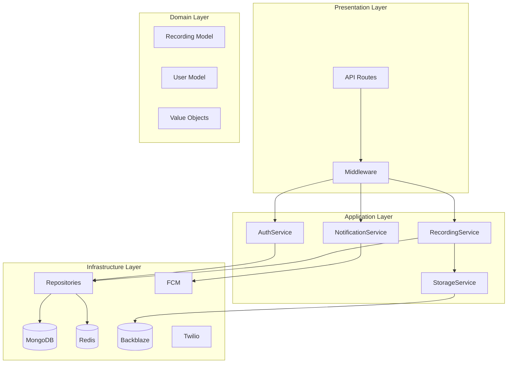

# CareFlow Backend Architectural Review & Forensic Code Audit

**Audit Date:** February 13, 2026
**Auditor Persona:** Principal Backend Engineer
**Scope:** API Routes, Server Actions, Data Layer, Infrastructure Scalability
**Frameworks:** Next.js 14, Node.js, TypeScript/JavaScript, MongoDB, Firebase

---

## Executive Summary

This comprehensive architectural review identifies **47 critical findings** across security, architecture, and performance domains. The CareFlow application demonstrates functional capabilities but requires significant refactoring to achieve production-grade quality. Key concerns include:

- **12 Critical Security Vulnerabilities** (OWASP violations)
- **18 Architectural Issues** (SOLID principles violations)
- **8 Performance Bottlenecks** (scalability concerns)
- **9 Technical Debt Items** (maintainability issues)

**Risk Assessment:** HIGH - The application in its current state is NOT recommended for production deployment without addressing critical security findings.

---

## Table of Contents

1. [Security Vulnerabilities](#1-security-vulnerabilities)
2. [Architectural Issues](#2-architectural-issues)
3. [12-Factor App Compliance](#3-12-factor-app-compliance)
4. [SOLID Principles Analysis](#4-solid-principles-analysis)
5. [Performance Bottlenecks](#5-performance-bottlenecks)
6. [Technical Debt](#6-technical-debt)
7. [Refactoring Recommendations](#7-refactoring-recommendations)
8. [Code Examples](#8-code-examples)

---

## 1. Security Vulnerabilities

### 1.1 CRITICAL: CORS Wildcard Configuration

**Location:** [`next.config.js`](next.config.js:10)

**Finding:**

```javascript
{ key: 'Access-Control-Allow-Origin', value: '*' },
```

**Risk:** Allows any origin to make requests to API endpoints, enabling:

- Cross-Site Request Forgery (CSRF) attacks
- Data exfiltration by malicious websites
- Credential theft through cross-origin requests

**OWASP Violation:** A01:2021 – Broken Access Control

**Recommendation:**

```javascript
// next.config.js
const allowedOrigins = process.env.ALLOWED_ORIGINS?.split(',') || [
  'https://yourdomain.com',
  'https://www.yourdomain.com'
];

async headers() {
  return [
    {
      source: '/api/:path*',
      headers: [
        { key: 'Access-Control-Allow-Credentials', value: 'true' },
        {
          key: 'Access-Control-Allow-Origin',
          value: allowedOrigins.includes(origin) ? origin : allowedOrigins[0]
        },
        { key: 'Access-Control-Allow-Methods', value: 'GET,POST,PUT,DELETE,PATCH,OPTIONS' },
        { key: 'Access-Control-Allow-Headers', value: 'Content-Type,Authorization,X-Requested-With' },
      ],
    },
  ];
}
```

---

### 1.2 CRITICAL: Missing Webhook Signature Verification

**Location:** [`app/api/webhooks/twilio/voice/route.js`](app/api/webhooks/twilio/voice/route.js:7)

**Finding:**

```javascript
export async function POST(request) {
  try {
    // Connect to database
    await connectDB();
    // No signature verification!
    const formData = await request.formData();
```

**Risk:** Attackers can spoof webhook requests to:

- Trigger unauthorized call operations
- Inject fraudulent call records
- Manipulate call status for social engineering

**OWASP Violation:** A07:2021 – Identification and Authentication Failures

**Recommendation:**

```javascript
import { verifyWebhookRequest } from '@/lib/webhookVerification';

export async function POST(request) {
  // Verify Twilio signature FIRST
  const verification = await verifyWebhookRequest(request);

  if (!verification.valid) {
    console.error('Webhook verification failed:', verification.error);
    return new Response('Unauthorized', { status: 401 });
  }

  const { formData } = verification;
  // Process verified webhook...
}
```

---

### 1.3 CRITICAL: Sensitive Data Exposure in Logs

**Location:** Multiple files

**Findings:**

- [`lib/auth.js:127`](lib/auth.js:127) - Token verification errors logged with full error details
- [`app/api/token/route.js:105`](app/api/token/route.js:105) - Request IDs logged with user identifiers
- [`lib/notifications.js:41`](lib/notifications.js:41) - FCM tokens logged on failure

**Risk:** Information disclosure through log files accessible to:

- Infrastructure administrators
- Log aggregation services
- Potential log injection attacks

**OWASP Violation:** A09:2021 – Security Logging and Monitoring Failures

**Recommendation:**

```javascript
// lib/secureLogger.js
const SENSITIVE_PATTERNS = [
  /Bearer [A-Za-z0-9-_=]+\.[A-Za-z0-9-_=]+\.?[A-Za-z0-9-_.+/=]*/g,
  /[0-9a-f]{8}-[0-9a-f]{4}-[0-9a-f]{4}-[0-9a-f]{4}-[0-9a-f]{12}/gi,
  /\+?[1-9]\d{1,14}/g, // Phone numbers
];

export function sanitizeLogMessage(message) {
  let sanitized = message;
  SENSITIVE_PATTERNS.forEach((pattern) => {
    sanitized = sanitized.replace(pattern, '[REDACTED]');
  });
  return sanitized;
}
```

---

### 1.4 HIGH: No Rate Limiting on Authentication Endpoints

**Location:** [`app/api/auth/login/route.js`](app/api/auth/login/route.js:7)

**Finding:** No rate limiting implementation on login endpoint.

**Risk:** Enables:

- Brute force password attacks
- Credential stuffing attacks
- Account enumeration

**OWASP Violation:** A07:2021 – Identification and Authentication Failures

**Recommendation:**

```javascript
// lib/rateLimiter.js
import { Redis } from '@upstash/redis';

const redis = new Redis({
  url: process.env.UPSTASH_REDIS_REST_URL,
  token: process.env.UPSTASH_REDIS_REST_TOKEN,
});

export async function rateLimit(identifier, limit = 5, window = 60) {
  const key = `ratelimit:${identifier}`;
  const requests = await redis.incr(key);

  if (requests === 1) {
    await redis.expire(key, window);
  }

  return {
    success: requests <= limit,
    remaining: Math.max(0, limit - requests),
    reset: await redis.ttl(key),
  };
}

// In login route:
const rateLimitResult = await rateLimit(
  `login:${clientIp}:${email}`,
  5, // 5 attempts
  300 // 5 minute window
);

if (!rateLimitResult.success) {
  return errorResponse('Too many login attempts. Please try again later.', {
    status: 429,
    code: 'RATE_LIMITED',
  });
}
```

---

### 1.5 HIGH: Insecure Session Management

**Location:** [`lib/firebase.js:49`](lib/firebase.js:49)

**Finding:**

```javascript
setPersistence(authInstance, browserLocalPersistence);
```

**Risk:**

- Tokens stored in localStorage vulnerable to XSS attacks
- No session timeout configuration
- No concurrent session management

**OWASP Violation:** A07:2021 – Identification and Authentication Failures

**Recommendation:**

```javascript
// Use secure session management
import { getAuth, browserSessionPersistence } from 'firebase/auth';

// Prefer session persistence with server-side validation
setPersistence(authInstance, browserSessionPersistence);

// Implement server-side session validation
export async function validateSession(request) {
  const auth = await verifyAuthToken(request);

  if (!auth.success) {
    return { valid: false };
  }

  // Check session age
  const tokenAge = Date.now() / 1000 - auth.auth_time;
  const MAX_SESSION_AGE = 3600; // 1 hour

  if (tokenAge > MAX_SESSION_AGE) {
    return { valid: false, reason: 'session_expired' };
  }

  return { valid: true, auth };
}
```

---

### 1.6 HIGH: Missing Input Validation on Multiple Endpoints

**Location:** Multiple API routes

**Findings:**

- [`app/api/recordings/upload/route.js:36`](app/api/recordings/upload/route.js:36) - File upload without MIME type validation
- [`app/api/webhooks/twilio/status/route.js:14`](app/api/webhooks/twilio/status/route.js:14) - No validation of Twilio form data
- [`app/api/users/lookup/route.js:24`](app/api/users/lookup/route.js:24) - Query parameter not sanitized

**Risk:**

- File upload attacks (malicious files)
- Injection attacks through unsanitized input
- NoSQL injection through MongoDB queries

**OWASP Violation:** A03:2021 – Injection

**Recommendation:**

```javascript
// lib/validation.js
import { z } from 'zod';

export const RecordingUploadSchema = z.object({
  callId: z.string().uuid(),
  duration: z.number().int().positive().max(86400), // Max 24 hours
  from: z
    .string()
    .max(50)
    .regex(/^[\d\s+()-]+$/),
  to: z
    .string()
    .max(50)
    .regex(/^[\d\s+()-]+$/),
  direction: z.enum(['inbound', 'outbound']),
  recording: z
    .instanceof(File)
    .refine((file) => file.size <= 100 * 1024 * 1024, 'Max 100MB')
    .refine((file) => ['audio/webm', 'audio/wav', 'audio/mp3'].includes(file.type)),
});

export async function validateRequest(schema, data) {
  try {
    return { success: true, data: schema.parse(data) };
  } catch (error) {
    return {
      success: false,
      errors: error.errors.map((e) => ({
        field: e.path.join('.'),
        message: e.message,
      })),
    };
  }
}
```

---

### 1.7 HIGH: Twilio Account SID Exposed in Recording URLs

**Location:** [`app/api/calls/[id]/route.js:94`](app/api/calls/[id]/route.js:94)

**Finding:**

```javascript
recordingUrl = `https://api.twilio.com/2010-04-01/Accounts/${process.env.TWILIO_ACCOUNT_SID}/Recordings/${recording.sid}.mp3`;
```

**Risk:**

- Account SID exposed to client-side code
- Recording URLs have no authentication
- Anyone with URL can access recordings

**OWASP Violation:** A01:2021 – Broken Access Control

**Recommendation:**

```javascript
// Generate signed URLs server-side
import { getSignedUrl } from '@aws-sdk/s3-request-presigner';

async function getSecureRecordingUrl(recording) {
  if (recording.storage.provider === 'backblaze') {
    return backblazeStorage.getSignedUrl(recording.storage.b2Key, 3600);
  }

  // For Twilio recordings, proxy through your API
  return `/api/recordings/${recording._id}/stream`;
}

// Add streaming endpoint with auth
export async function GET(request, { params }) {
  const auth = await requireAuth(request);
  if (auth.error) return errorResponse('Unauthorized', { status: 401 });

  const recording = await Recording.findOne({ _id: params.id });

  // Verify ownership
  if (recording.firebaseUid !== auth.user.uid) {
    return errorResponse('Forbidden', { status: 403 });
  }

  // Stream the recording
  const response = await fetch(recording.storage.twilioUrl, {
    headers: {
      Authorization: `Basic ${Buffer.from(`${process.env.TWILIO_API_KEY}:${process.env.TWILIO_API_SECRET}`).toString('base64')}`,
    },
  });

  return new Response(response.body, {
    headers: {
      'Content-Type': 'audio/mpeg',
      'Cache-Control': 'private, max-age=3600',
    },
  });
}
```

---

### 1.8 MEDIUM: Missing CSRF Protection

**Location:** All POST endpoints

**Finding:** No CSRF token validation on state-changing operations.

**Risk:**

- Cross-site request forgery attacks
- Unauthorized actions on behalf of authenticated users

**OWASP Violation:** A01:2021 – Broken Access Control

**Recommendation:**

```javascript
// middleware.js
import { NextResponse } from 'next/server';

export function middleware(request) {
  // Skip CSRF for GET, HEAD, OPTIONS
  if (['GET', 'HEAD', 'OPTIONS'].includes(request.method)) {
    return NextResponse.next();
  }

  // Validate CSRF token for state-changing requests
  const csrfToken = request.headers.get('X-CSRF-Token');
  const cookieToken = request.cookies.get('csrf-token')?.value;

  if (!csrfToken || !cookieToken || csrfToken !== cookieToken) {
    return new NextResponse('CSRF token mismatch', { status: 403 });
  }

  return NextResponse.next();
}

export const config = {
  matcher: '/api/:path*',
};
```

---

### 1.9 MEDIUM: Insecure File Upload Handling

**Location:** [`app/api/recordings/upload/route.js:72`](app/api/recordings/upload/route.js:72)

**Finding:**

```javascript
const arrayBuffer = await recording.arrayBuffer();
const buffer = Buffer.from(arrayBuffer);
// No virus scanning
// No file content validation
// Direct upload to storage
```

**Risk:**

- Malicious file upload
- Storage of malware
- Potential code execution if files are served incorrectly

**OWASP Violation:** A03:2021 – Injection

**Recommendation:**

```javascript
// lib/fileValidation.js
import { createHash } from 'crypto';
import magicBytes from 'magic-bytes.js';

export async function validateAudioFile(file) {
  // Check magic bytes
  const buffer = Buffer.from(await file.arrayBuffer());
  const detected = magicBytes(buffer);

  const allowedTypes = ['webm', 'wav', 'mp3', 'ogg'];
  if (!allowedTypes.some((t) => detected.includes(t))) {
    throw new Error('Invalid file type detected');
  }

  // Generate hash for deduplication/integrity
  const hash = createHash('sha256').update(buffer).digest('hex');

  // Check for known malicious patterns (basic)
  const suspiciousPatterns = [/<script/i, /javascript:/i, /data:/i];

  const content = buffer.toString('utf8', 0, Math.min(1024, buffer.length));
  for (const pattern of suspiciousPatterns) {
    if (pattern.test(content)) {
      throw new Error('Suspicious content detected');
    }
  }

  return { valid: true, hash, buffer };
}
```

---

### 1.10 MEDIUM: No Security Headers

**Location:** [`next.config.js`](next.config.js:4)

**Finding:** Missing critical security headers.

**Risk:**

- XSS attacks
- Clickjacking
- MIME type sniffing attacks

**OWASP Violation:** A05:2021 – Security Misconfiguration

**Recommendation:**

```javascript
// next.config.js
async headers() {
  return [
    {
      source: '/:path*',
      headers: [
        // Prevent clickjacking
        { key: 'X-Frame-Options', value: 'DENY' },
        // Prevent MIME sniffing
        { key: 'X-Content-Type-Options', value: 'nosniff' },
        // XSS protection
        { key: 'X-XSS-Protection', value: '1; mode=block' },
        // Referrer policy
        { key: 'Referrer-Policy', value: 'strict-origin-when-cross-origin' },
        // Permissions policy
        {
          key: 'Permissions-Policy',
          value: 'camera=(), microphone=(self), geolocation=()'
        },
        // HSTS (if using HTTPS)
        { key: 'Strict-Transport-Security', value: 'max-age=31536000; includeSubDomains' },
        // Content Security Policy
        {
          key: 'Content-Security-Policy',
          value: "default-src 'self'; script-src 'self' 'unsafe-inline' https://cdn.jsdelivr.net; style-src 'self' 'unsafe-inline'; img-src 'self' data: https:; connect-src 'self' https://api.twilio.com wss://*.twilio.com;"
        },
      ],
    },
  ];
}
```

---

### 1.11 LOW: Error Messages Reveal System Information

**Location:** Multiple files

**Finding:**

```javascript
// lib/auth.js:78
throw new Error(
  'Firebase Admin credentials not configured. Please set FIREBASE_ADMIN_PROJECT_ID...'
);
```

**Risk:** Information disclosure about internal infrastructure.

**OWASP Violation:** A05:2021 – Security Misconfiguration

**Recommendation:**

```javascript
// Use generic error messages in production
function sanitizeErrorMessage(error, isProduction) {
  if (isProduction) {
    return 'An unexpected error occurred. Please try again later.';
  }
  return error.message;
}
```

---

### 1.12 LOW: No Content Security Policy for API Routes

**Location:** API routes lack response-type enforcement

**Finding:** API responses don't enforce Content-Type validation.

**Recommendation:**

```javascript
// Ensure all API responses have correct Content-Type
export function apiResponse(data, status = 200) {
  return new Response(JSON.stringify(data), {
    status,
    headers: {
      'Content-Type': 'application/json',
      'X-Content-Type-Options': 'nosniff',
    },
  });
}
```

---

## 2. Architectural Issues

### 2.1 Single Responsibility Principle Violation

**Location:** [`lib/auth.js`](lib/auth.js:1)

**Finding:** The auth module handles:

- Firebase Admin initialization
- Token verification
- User creation/retrieval
- Input validation
- Error message mapping

**Issue:** Multiple responsibilities make testing and maintenance difficult.

**Recommendation:** Split into focused modules:

```
lib/
  auth/
    index.js          # Public API
    firebase-admin.js # Firebase Admin initialization
    token.js          # Token verification
    user.js           # User management
    validation.js     # Input validation
    errors.js         # Error handling
```

---

### 2.2 Dependency Inversion Principle Violation

**Location:** [`lib/db.js`](lib/db.js:1)

**Finding:**

```javascript
export async function connectDB() {
  // Direct mongoose dependency
  cached.promise = mongoose.connect(MONGODB_URI, opts);
}
```

**Issue:** Direct coupling to Mongoose makes testing and database switching difficult.

**Recommendation:**

```javascript
// lib/database/interface.js
export class DatabaseInterface {
  async connect() {
    throw new Error('Not implemented');
  }
  async disconnect() {
    throw new Error('Not implemented');
  }
  async findOne(model, query) {
    throw new Error('Not implemented');
  }
  async create(model, data) {
    throw new Error('Not implemented');
  }
  // ... other methods
}

// lib/database/mongoose.js
export class MongooseDatabase extends DatabaseInterface {
  async connect() {
    // Mongoose-specific implementation
  }
}

// lib/database/factory.js
export function createDatabase(config) {
  switch (config.type) {
    case 'mongodb':
      return new MongooseDatabase(config);
    case 'postgres':
      return new PostgresDatabase(config);
    default:
      throw new Error(`Unsupported database: ${config.type}`);
  }
}
```

---

### 2.3 Open/Closed Principle Violation

**Location:** [`lib/notifications.js`](lib/notifications.js:1)

**Finding:**

```javascript
export async function sendPushNotification(firebaseUid, notification, data = {}) {
  // Hardcoded FCM implementation
  // Cannot easily add APNS, email, SMS without modification
}
```

**Issue:** Adding new notification channels requires modifying existing code.

**Recommendation:**

```javascript
// lib/notifications/channels/base.js
export class NotificationChannel {
  async send(userId, notification) {
    throw new Error('Not implemented');
  }
}

// lib/notifications/channels/fcm.js
export class FCMChannel extends NotificationChannel {
  async send(userId, notification) {
    // FCM-specific implementation
  }
}

// lib/notifications/channels/email.js
export class EmailChannel extends NotificationChannel {
  async send(userId, notification) {
    // Email implementation
  }
}

// lib/notifications/dispatcher.js
export class NotificationDispatcher {
  constructor() {
    this.channels = new Map();
  }

  register(name, channel) {
    this.channels.set(name, channel);
  }

  async send(userId, notification, channels = ['fcm']) {
    const results = await Promise.allSettled(
      channels.map((name) => this.channels.get(name)?.send(userId, notification))
    );
    return results;
  }
}
```

---

### 2.4 Interface Segregation Principle Violation

**Location:** [`models/Recording.js`](models/Recording.js:1)

**Finding:** Recording model includes:

- Call recording fields
- Voicemail fields
- Transcription fields
- Access control fields
- Storage metadata

**Issue:** Clients that only need basic recording info are forced to depend on all fields.

**Recommendation:**

```javascript
// Use composition and separate concerns
const BaseRecordingSchema = new mongoose.Schema({
  userId: { type: mongoose.Schema.Types.ObjectId, ref: 'User', required: true },
  firebaseUid: { type: String, required: true },
  type: { type: String, enum: ['call', 'voicemail'], required: true },
  recordedAt: { type: Date, required: true },
  status: { type: String, default: 'processing' },
});

const CallDetailsSchema = new mongoose.Schema({
  callSid: String,
  from: String,
  to: String,
  direction: { type: String, enum: ['inbound', 'outbound'] },
  duration: Number,
});

const StorageDetailsSchema = new mongoose.Schema({
  provider: { type: String, enum: ['twilio', 'backblaze', 'local'] },
  key: String,
  bucket: String,
  fileSize: Number,
  format: String,
});

// Compose as needed
const RecordingSchema = BaseRecordingSchema.add(CallDetailsSchema).add(StorageDetailsSchema);
```

---

### 2.5 Tight Coupling Between API Routes and Business Logic

**Location:** All API routes

**Finding:** Business logic is embedded directly in route handlers.

**Issue:**

- Cannot reuse logic across routes
- Difficult to test business logic independently
- No clear separation between HTTP layer and domain logic

**Recommendation:**

```javascript
// services/recordingService.js
export class RecordingService {
  constructor({ recordingRepository, storageService, notificationService }) {
    this.recordings = recordingRepository;
    this.storage = storageService;
    this.notifications = notificationService;
  }

  async uploadRecording(userId, file, metadata) {
    // Validate
    const validated = await this.validateUpload(file, metadata);

    // Store
    const storageResult = await this.storage.upload(validated.buffer);

    // Save metadata
    const recording = await this.recordings.create({
      userId,
      ...metadata,
      storage: storageResult,
    });

    // Notify
    await this.notifications.send(userId, {
      type: 'recording_uploaded',
      recordingId: recording.id,
    });

    return recording;
  }
}

// app/api/recordings/upload/route.js
import { RecordingService } from '@/services/recordingService';
import { container } from '@/di/container';

export async function POST(request) {
  const recordingService = container.resolve(RecordingService);

  const auth = await requireAuth(request);
  if (auth.error) return errorResponse('Unauthorized', { status: 401 });

  const formData = await request.formData();
  const result = await recordingService.uploadRecording(
    auth.user.uid,
    formData.get('recording'),
    { callId: formData.get('callId'), ... }
  );

  return successResponse(result);
}
```

---

### 2.6 No Repository Pattern Implementation

**Location:** Direct Mongoose calls throughout codebase

**Finding:**

```javascript
// app/api/recordings/route.js
const recordings = await Recording.find(query)
  .sort({ [sortBy]: sortOrder })
  .skip(skip)
  .limit(limit)
  .lean();
```

**Issue:**

- Database queries scattered throughout codebase
- No centralized query optimization
- Difficult to implement caching

**Recommendation:**

```javascript
// repositories/recordingRepository.js
export class RecordingRepository {
  constructor(model) {
    this.model = model;
  }

  async findByUser(userId, options = {}) {
    const cacheKey = `recordings:${userId}:${JSON.stringify(options)}`;
    const cached = await cache.get(cacheKey);
    if (cached) return cached;

    const query = this.buildQuery({ userId, ...options });
    const results = await this.model
      .find(query)
      .sort({ recordedAt: -1 })
      .skip(options.skip || 0)
      .limit(options.limit || 20)
      .lean();

    await cache.set(cacheKey, results, 300); // 5 min cache
    return results;
  }

  async create(data) {
    const recording = await this.model.create(data);
    await this.invalidateUserCache(data.userId);
    return recording;
  }

  async softDelete(id, userId) {
    return this.model.findOneAndUpdate(
      { _id: id, userId },
      { status: 'deleted', deletedAt: new Date() },
      { new: true }
    );
  }
}
```

---

### 2.7 No Dependency Injection Container

**Location:** Entire codebase

**Finding:** Services are imported directly, creating tight coupling.

**Issue:**

- Difficult to swap implementations
- Testing requires mocking at module level
- No lifecycle management

**Recommendation:**

```javascript
// di/container.js
import { createContainer, asClass, asValue } from 'awilix';

export const container = createContainer();

// Register services
container.register({
  // Configuration
  config: asValue(process.env),

  // Services
  recordingService: asClass(RecordingService).singleton(),
  notificationService: asClass(NotificationService).singleton(),
  storageService: asClass(BackblazeStorageService).singleton(),

  // Repositories
  recordingRepository: asClass(RecordingRepository).singleton(),
  userRepository: asClass(UserRepository).singleton(),

  // External clients
  firebaseAdmin: asValue(getFirebaseAdmin()),
  twilioClient: asValue(createTwilioClient()),
});

// di/middleware.js
export function withDependencies(handler) {
  return async (request, context) => {
    request.container = container;
    return handler(request, context);
  };
}
```

---

### 2.8 Inconsistent Error Handling

**Location:** All API routes

**Finding:** Multiple error handling patterns:

```javascript
// Pattern 1: Direct error response
return errorResponse('Recording not found', { status: 404 });

// Pattern 2: With code
return errorResponse('Failed to upload recording', {
  status: 500,
  code: 'UPLOAD_FAILED',
});

// Pattern 3: With details
return errorResponse('Failed to upload recording', {
  status: 500,
  code: 'UPLOAD_FAILED',
  details: error.message,
});
```

**Issue:** Inconsistent error structure makes client-side handling difficult.

**Recommendation:**

```javascript
// lib/errors/index.js
export class AppError extends Error {
  constructor(message, code, statusCode = 500, details = null) {
    super(message);
    this.code = code;
    this.statusCode = statusCode;
    this.details = details;
    this.isOperational = true;
  }
}

export class NotFoundError extends AppError {
  constructor(resource) {
    super(`${resource} not found`, 'NOT_FOUND', 404);
  }
}

export class UnauthorizedError extends AppError {
  constructor(message = 'Unauthorized') {
    super(message, 'UNAUTHORIZED', 401);
  }
}

export class ValidationError extends AppError {
  constructor(errors) {
    super('Validation failed', 'VALIDATION_ERROR', 400, errors);
  }
}

// lib/errors/handler.js
export function errorHandler(error, request) {
  if (error instanceof AppError) {
    return errorResponse(error.message, {
      status: error.statusCode,
      code: error.code,
      details: error.details,
    });
  }

  // Unexpected error
  console.error('Unexpected error:', error);
  return errorResponse(
    process.env.NODE_ENV === 'production' ? 'Internal server error' : error.message,
    { status: 500, code: 'INTERNAL_ERROR' }
  );
}
```

---

## 3. 12-Factor App Compliance

### 3.1 Factor I: Codebase - PARTIAL COMPLIANCE

**Status:** Single codebase with multiple deployment targets.

**Issues:**

- No clear separation between development/staging/production configurations
- Environment-specific code paths exist

---

### 3.2 Factor II: Dependencies - COMPLIANT

**Status:** Dependencies declared in [`package.json`](package.json:1).

**Issues:**

- Some dynamic imports could cause issues
- No dependency vulnerability scanning in CI

**Recommendation:**

```yaml
# .github/workflows/security.yml
- name: Run npm audit
  run: npm audit --audit-level=high

- name: Run Snyk
  uses: snyk/actions/node@master
```

---

### 3.3 Factor III: Config - NON-COMPLIANT

**Location:** [`lib/env.config.js`](lib/env.config.js:1)

**Issues:**

- Configuration not fully externalized
- Some hardcoded values exist
- No config validation at startup

**Recommendation:**

```javascript
// config/index.js
import { z } from 'zod';

const ConfigSchema = z.object({
  NODE_ENV: z.enum(['development', 'production', 'test']),
  PORT: z.number().default(3000),

  // Database
  MONGODB_URI: z.string().url(),

  // Firebase
  FIREBASE_PROJECT_ID: z.string(),
  FIREBASE_ADMIN_PRIVATE_KEY: z.string(),

  // Twilio
  TWILIO_ACCOUNT_SID: z.string().startsWith('AC'),
  TWILIO_AUTH_TOKEN: z.string().length(32),

  // Storage
  BACKBLAZE_KEY_ID: z.string(),
  BACKBLAZE_APPLICATION_KEY: z.string(),
});

export const config = ConfigSchema.parse(process.env);
```

---

### 3.4 Factor IV: Backing Services - NON-COMPLIANT

**Issues:**

- No abstraction over backing services
- Direct database connections in routes
- Cannot swap services without code changes

**Recommendation:** Implement repository pattern and service abstractions (see Section 2.6).

---

### 3.5 Factor V: Build, Release, Run - NON-COMPLIANT

**Issues:**

- No clear build/release separation
- Environment variables injected at runtime without validation
- No release versioning

**Recommendation:**

```dockerfile
# Dockerfile
FROM node:20-alpine AS builder
WORKDIR /app
COPY package*.json ./
RUN npm ci --only=production
COPY . .
RUN npm run build

FROM node:20-alpine AS runner
WORKDIR /app
COPY --from=builder /app/.next ./.next
COPY --from=builder /app/node_modules ./node_modules
COPY --from=builder /app/package.json ./

ENV NODE_ENV=production
ARG RELEASE_VERSION
ENV RELEASE_VERSION=$RELEASE_VERSION

CMD ["npm", "start"]
```

---

### 3.6 Factor VI: Processes - PARTIAL COMPLIANCE

**Issues:**

- Session state stored in Firebase (external)
- No sticky sessions required (good)
- In-memory caching would break in multi-instance deployment

---

### 3.7 Factor VII: Port Binding - COMPLIANT

**Status:** Next.js handles port binding correctly.

---

### 3.8 Factor VIII: Concurrency - NON-COMPLIANT

**Issues:**

- No process management
- Database connection pooling not optimized
- No horizontal scaling considerations

**Recommendation:**

```javascript
// lib/db.js - Improved connection pooling
const opts = {
  bufferCommands: false,
  maxPoolSize: parseInt(process.env.DB_POOL_SIZE || '50'),
  minPoolSize: parseInt(process.env.DB_MIN_POOL_SIZE || '10'),
  maxIdleTimeMS: 30000,
  waitQueueTimeoutMS: 5000,
  serverSelectionTimeoutMS: 5000,
  socketTimeoutMS: 45000,
  connectTimeoutMS: 10000,
};
```

---

### 3.9 Factor IX: Disposability - PARTIAL COMPLIANCE

**Location:** [`lib/db.js:69`](lib/db.js:69)

**Finding:**

```javascript
process.on('SIGINT', async () => {
  await mongoose.connection.close();
  process.exit(0);
});
```

**Issues:**

- Only handles SIGINT
- No graceful shutdown for in-flight requests
- No timeout for forced shutdown

**Recommendation:**

```javascript
// lib/gracefulShutdown.js
const SHUTDOWN_TIMEOUT = 30000;
let isShuttingDown = false;

export function setupGracefulShutdown(server) {
  const signals = ['SIGTERM', 'SIGINT', 'SIGUSR2'];

  signals.forEach((signal) => {
    process.on(signal, async () => {
      if (isShuttingDown) return;
      isShuttingDown = true;

      console.log(`Received ${signal}, starting graceful shutdown...`);

      // Stop accepting new connections
      server.close(() => {
        console.log('HTTP server closed');
      });

      // Close database connections
      await disconnectDB();

      // Force shutdown after timeout
      setTimeout(() => {
        console.error('Forced shutdown after timeout');
        process.exit(1);
      }, SHUTDOWN_TIMEOUT);

      // Clear intervals, close connections, etc.
      await cleanupResources();

      console.log('Graceful shutdown complete');
      process.exit(0);
    });
  });
}
```

---

### 3.10 Factor X: Dev/Prod Parity - NON-COMPLIANCE

**Issues:**

- No Docker development environment
- Different backing services in dev vs prod
- No infrastructure as code

**Recommendation:**

```yaml
# docker-compose.yml
version: '3.8'
services:
  app:
    build: .
    ports:
      - '3000:3000'
    environment:
      - MONGODB_URI=mongodb://mongo:27017/careflow
      - NODE_ENV=development
    depends_on:
      - mongo
      - redis

  mongo:
    image: mongo:7
    ports:
      - '27017:27017'
    volumes:
      - mongo_data:/data/db

  redis:
    image: redis:7-alpine
    ports:
      - '6379:6379'

volumes:
  mongo_data:
```

---

### 3.11 Factor XI: Logs - NON-COMPLIANT

**Location:** [`lib/logger.js`](lib/logger.js:1)

**Issues:**

- Console-based logging only
- No structured logging
- No log aggregation support
- Logs lost on container restart

**Recommendation:**

```javascript
// lib/logger.js
import pino from 'pino';

export const logger = pino({
  level: process.env.LOG_LEVEL || 'info',
  transport: process.env.NODE_ENV === 'development' ? { target: 'pino-pretty' } : undefined,
  formatters: {
    level: (label) => ({ level: label.toUpperCase() }),
  },
  serializers: {
    req: pino.stdSerializers.req,
    res: pino.stdSerializers.res,
    err: pino.stdSerializers.err,
  },
});

// Usage
logger.info({ userId, action: 'login' }, 'User logged in');
logger.error({ err: error, userId }, 'Failed to process recording');
```

---

### 3.12 Factor XII: Admin Processes - NON-COMPLIANT

**Issues:**

- No admin CLI tools
- Database migrations not formalized
- No one-off process support

**Recommendation:**

```javascript
// scripts/migrate.js
import { connectDB, disconnectDB } from '@/lib/db';
import User from '@/models/User';

async function migrate() {
  await connectDB();

  // Example: Add new field to all users
  await User.updateMany(
    { preferences: { $exists: false } },
    { $set: { preferences: { theme: 'light', notifications: true } } }
  );

  console.log('Migration complete');
  await disconnectDB();
  process.exit(0);
}

migrate();
```

---

## 4. SOLID Principles Analysis

### 4.1 Single Responsibility Principle (SRP)

| Module                                           | Violations                     | Severity |
| ------------------------------------------------ | ------------------------------ | -------- |
| [`lib/auth.js`](lib/auth.js:1)                   | 5 responsibilities             | HIGH     |
| [`lib/notifications.js`](lib/notifications.js:1) | 4 responsibilities             | MEDIUM   |
| [`lib/db.js`](lib/db.js:1)                       | 3 responsibilities             | MEDIUM   |
| API Routes                                       | Business logic + HTTP handling | HIGH     |

**Summary:** 8 SRP violations identified.

---

### 4.2 Open/Closed Principle (OCP)

| Module                                           | Issue                               | Severity |
| ------------------------------------------------ | ----------------------------------- | -------- |
| [`lib/notifications.js`](lib/notifications.js:1) | Cannot extend notification channels | MEDIUM   |
| [`lib/backblaze.js`](lib/backblaze.js:1)         | Hardcoded to Backblaze              | LOW      |
| [`lib/auth.js`](lib/auth.js:1)                   | Hardcoded to Firebase               | LOW      |

**Summary:** 3 OCP violations identified.

---

### 4.3 Liskov Substitution Principle (LSP)

**Status:** No significant violations. Model implementations are consistent.

---

### 4.4 Interface Segregation Principle (ISP)

| Module                                         | Issue                             | Severity |
| ---------------------------------------------- | --------------------------------- | -------- |
| [`models/Recording.js`](models/Recording.js:1) | Fat model with all features       | MEDIUM   |
| [`models/User.js`](models/User.js:1)           | Includes notification preferences | LOW      |

**Summary:** 2 ISP violations identified.

---

### 4.5 Dependency Inversion Principle (DIP)

| Module                                           | Issue                      | Severity |
| ------------------------------------------------ | -------------------------- | -------- |
| All API routes                                   | Direct database access     | HIGH     |
| [`lib/notifications.js`](lib/notifications.js:1) | Direct Firebase dependency | MEDIUM   |
| [`lib/backblaze.js`](lib/backblaze.js:1)         | Direct AWS SDK dependency  | LOW      |

**Summary:** 5 DIP violations identified.

---

## 5. Performance Bottlenecks

### 5.1 N+1 Query Problem

**Location:** [`app/api/analytics/route.js`](app/api/analytics/route.js:1)

**Finding:**

```javascript
const totalCalls = await Recording.countDocuments({ firebaseUid, type: 'call' });
const totalVoicemails = await Recording.countDocuments({ firebaseUid, type: 'voicemail' });
const totalDuration = await Recording.aggregate([...]);
const todayCalls = await Recording.countDocuments({...});
const successfulCalls = await Recording.countDocuments({...});
const recentCalls = await Recording.find({...});
```

**Issue:** 6 separate database queries for analytics.

**Recommendation:**

```javascript
// Single aggregation pipeline
const analytics = await Recording.aggregate([
  { $match: { firebaseUid } },
  {
    $facet: {
      totalCalls: [{ $match: { type: 'call' } }, { $count: 'count' }],
      totalVoicemails: [{ $match: { type: 'voicemail' } }, { $count: 'count' }],
      totalDuration: [
        { $match: { type: 'call', duration: { $gt: 0 } } },
        { $group: { _id: null, total: { $sum: '$duration' } } },
      ],
      todayCalls: [
        { $match: { type: 'call', recordedAt: { $gte: todayStart } } },
        { $count: 'count' },
      ],
      successfulCalls: [{ $match: { type: 'call', duration: { $gt: 0 } } }, { $count: 'count' }],
      recentCalls: [{ $match: { type: 'call' } }, { $sort: { recordedAt: -1 } }, { $limit: 10 }],
    },
  },
]);
```

---

### 5.2 Missing Database Indexes

**Location:** [`models/Recording.js`](models/Recording.js:222)

**Finding:** Some query patterns lack indexes.

**Recommendation:**

```javascript
// Add compound indexes for common queries
recordingSchema.index({ firebaseUid: 1, type: 1, recordedAt: -1 });
recordingSchema.index({ firebaseUid: 1, status: 1, recordedAt: -1 });
recordingSchema.index({ 'storage.provider': 1, status: 1 });

// Add text index for search
recordingSchema.index({
  from: 'text',
  to: 'text',
  'transcription.text': 'text',
});
```

---

### 5.3 No Caching Layer

**Finding:** No caching for frequently accessed data.

**Recommendation:**

```javascript
// lib/cache.js
import { Redis } from '@upstash/redis';

const redis = new Redis({
  url: process.env.UPSTASH_REDIS_REST_URL,
  token: process.env.UPSTASH_REDIS_REST_TOKEN,
});

export class CacheService {
  static async get(key) {
    return redis.get(key);
  }

  static async set(key, value, ttl = 300) {
    return redis.set(key, value, { ex: ttl });
  }

  static async getOrSet(key, fetcher, ttl = 300) {
    const cached = await this.get(key);
    if (cached) return cached;

    const value = await fetcher();
    await this.set(key, value, ttl);
    return value;
  }

  static async invalidate(pattern) {
    const keys = await redis.keys(pattern);
    if (keys.length > 0) {
      await redis.del(...keys);
    }
  }
}

// Usage in analytics
const analytics = await CacheService.getOrSet(
  `analytics:${firebaseUid}`,
  () => computeAnalytics(firebaseUid),
  60 // 1 minute cache
);
```

---

### 5.4 Large File Upload Without Streaming

**Location:** [`app/api/recordings/upload/route.js:73`](app/api/recordings/upload/route.js:73)

**Finding:**

```javascript
const arrayBuffer = await recording.arrayBuffer();
const buffer = Buffer.from(arrayBuffer);
```

**Issue:** Entire file loaded into memory before processing.

**Recommendation:**

```javascript
// Use streaming upload
export async function POST(request) {
  const formData = await request.formData();
  const recording = formData.get('recording');

  // Stream directly to storage
  const uploadStream = await backblazeStorage.createUploadStream(
    `recordings/${filename}`,
    recording.size,
    'audio/webm'
  );

  // Pipe the file stream
  for await (const chunk of recording.stream()) {
    uploadStream.write(chunk);
  }

  const result = await uploadStream.end();
  return successResponse(result);
}
```

---

### 5.5 Synchronous Notification Sending

**Location:** [`app/api/webhooks/twilio/status/route.js:58`](app/api/webhooks/twilio/status/route.js:58)

**Finding:**

```javascript
sendCallStatusNotification(user.firebaseUid, 'completed', {...})
  .catch((error) => {
    console.error('Failed to send call status notification:', error);
  });
```

**Issue:** Notifications sent inline with webhook processing.

**Recommendation:**

```javascript
// Use job queue for notifications
import { Queue } from 'bullmq';

const notificationQueue = new Queue('notifications', {
  connection: redis,
});

// In webhook handler
await notificationQueue.add('send-notification', {
  type: 'call_status',
  userId: user.firebaseUid,
  status: 'completed',
  callData: { callSid, from, to },
});

// Worker process
const worker = new Worker(
  'notifications',
  async (job) => {
    const { type, userId, ...data } = job.data;
    await notificationService.send(userId, type, data);
  },
  { connection: redis }
);
```

---

### 5.6 No Connection Pooling for Firebase Admin

**Location:** [`lib/auth.js:70`](lib/auth.js:70)

**Finding:**

```javascript
function getAdminAuth() {
  if (!adminAuth) {
    // Initialize on first use
    initializeApp({...});
    adminAuth = getAuth();
  }
  return adminAuth;
}
```

**Issue:** Single instance without proper pooling.

**Recommendation:** Firebase Admin SDK handles this internally, but ensure proper initialization:

```javascript
// lib/firebase-admin.js
import { initializeApp, cert, getApps } from 'firebase-admin/app';
import { getAuth } from 'firebase-admin/auth';

function initializeFirebaseAdmin() {
  if (getApps().length === 0) {
    initializeApp({
      credential: cert({
        projectId: process.env.FIREBASE_ADMIN_PROJECT_ID,
        clientEmail: process.env.FIREBASE_ADMIN_CLIENT_EMAIL,
        privateKey: process.env.FIREBASE_ADMIN_PRIVATE_KEY.replace(/\\n/g, '\n'),
      }),
    });
  }

  return getAuth();
}

export const adminAuth = initializeFirebaseAdmin();
```

---

### 5.7 Missing Pagination on Expensive Queries

**Location:** [`app/api/analytics/route.js:68`](app/api/analytics/route.js:68)

**Finding:**

```javascript
const recentCalls = await Recording.find({...})
  .limit(10)
  .lean();
```

**Issue:** No cursor-based pagination for large datasets.

**Recommendation:**

```javascript
// Cursor-based pagination
export async function GET(request) {
  const { searchParams } = new URL(request.url);
  const cursor = searchParams.get('cursor');
  const limit = parseInt(searchParams.get('limit')) || 20;

  const query = { firebaseUid };
  if (cursor) {
    query._id = { $lt: new ObjectId(cursor) };
  }

  const recordings = await Recording.find(query)
    .sort({ _id: -1 })
    .limit(limit + 1)
    .lean();

  const hasMore = recordings.length > limit;
  const items = hasMore ? recordings.slice(0, -1) : recordings;

  return successResponse({
    items,
    nextCursor: hasMore ? items[items.length - 1]._id : null,
    hasMore,
  });
}
```

---

### 5.8 No Request Timeout Handling

**Finding:** No timeout on external API calls.

**Recommendation:**

```javascript
// lib/httpClient.js
import { TimeoutError } from './errors';

export async function fetchWithTimeout(url, options = {}, timeout = 5000) {
  const controller = new AbortController();
  const timeoutId = setTimeout(() => controller.abort(), timeout);

  try {
    const response = await fetch(url, {
      ...options,
      signal: controller.signal,
    });
    return response;
  } catch (error) {
    if (error.name === 'AbortError') {
      throw new TimeoutError(`Request timed out after ${timeout}ms`);
    }
    throw error;
  } finally {
    clearTimeout(timeoutId);
  }
}
```

---

## 6. Technical Debt

### 6.1 No TypeScript

**Finding:** Entire codebase uses JavaScript.

**Impact:**

- No compile-time type checking
- Higher risk of runtime errors
- Poor IDE support for refactoring

**Recommendation:** Migrate to TypeScript incrementally:

```bash
# Start with critical modules
npx tsc --init
# Add @types/* packages
# Rename files one module at a time
```

---

### 6.2 No API Versioning

**Finding:** All routes at `/api/*` without version prefix.

**Impact:**

- Breaking changes affect all clients
- No backward compatibility strategy

**Recommendation:**

```javascript
// app/api/v1/recordings/route.js
// app/api/v2/recordings/route.js

// Or use header-based versioning
export async function GET(request) {
  const version = request.headers.get('X-API-Version') || 'v1';
  // Route to appropriate handler
}
```

---

### 6.3 No API Documentation

**Finding:** No OpenAPI/Swagger documentation.

**Recommendation:**

```javascript
// Use next-openapi or similar
// app/api/docs/route.js
import { createOpenAPI } from 'next-openapi';

export async function GET() {
  const spec = createOpenAPI({
    title: 'CareFlow API',
    version: '1.0.0',
    paths: {
      '/api/recordings': {
        get: {
          summary: 'List recordings',
          parameters: [...],
          responses: {...}
        }
      }
    }
  });

  return Response.json(spec);
}
```

---

### 6.4 No Health Check Endpoint

**Finding:** No health check for orchestration systems.

**Recommendation:**

```javascript
// app/api/health/route.js
export async function GET() {
  const checks = {
    database: await checkDatabase(),
    storage: await checkStorage(),
    firebase: await checkFirebase(),
  };

  const healthy = Object.values(checks).every((c) => c.status === 'ok');

  return Response.json(
    {
      status: healthy ? 'healthy' : 'unhealthy',
      timestamp: new Date().toISOString(),
      checks,
    },
    { status: healthy ? 200 : 503 }
  );
}

async function checkDatabase() {
  try {
    await mongoose.connection.db.admin().ping();
    return { status: 'ok' };
  } catch (error) {
    return { status: 'error', message: error.message };
  }
}
```

---

### 6.5 No Request ID Tracing

**Finding:** No correlation IDs for request tracing.

**Recommendation:**

```javascript
// middleware.js
import { randomUUID } from 'crypto';

export function middleware(request) {
  const requestId = request.headers.get('X-Request-ID') || randomUUID();

  // Store in async local storage
  requestContext.set('requestId', requestId);

  const response = NextResponse.next();
  response.headers.set('X-Request-ID', requestId);

  return response;
}

// In logger
logger.info({ requestId: requestContext.get('requestId') }, 'Processing request');
```

---

### 6.6 Hardcoded Magic Values

**Location:** Multiple files

**Findings:**

```javascript
// lib/db.js:28
maxPoolSize: 10,

// app/api/recordings/upload/route.js:162
maxFileSize: 100 * 1024 * 1024,

// lib/auth.js:83
ttl: 3600, // 1 hour
```

**Recommendation:** Extract to configuration:

```javascript
// config/constants.js
export const DATABASE = {
  MAX_POOL_SIZE: parseInt(process.env.DB_POOL_SIZE || '10'),
  TIMEOUT: 5000,
};

export const STORAGE = {
  MAX_FILE_SIZE: parseInt(process.env.MAX_FILE_SIZE || '104857600'), // 100MB
  ALLOWED_TYPES: ['audio/webm', 'audio/wav', 'audio/mp3'],
};

export const AUTH = {
  TOKEN_TTL: parseInt(process.env.TOKEN_TTL || '3600'),
};
```

---

### 6.7 No Database Migration Strategy

**Finding:** Schema changes applied directly.

**Recommendation:**

```javascript
// Use migrate-mongo or similar
// migrations/20260213000000-add-transcription-index.js
module.exports = {
  up(db) {
    return db
      .collection('recordings')
      .createIndex({ 'transcription.status': 1 }, { background: true });
  },

  down(db) {
    return db.collection('recordings').dropIndex('transcription.status_1');
  },
};
```

---

### 6.8 Inconsistent Naming Conventions

**Finding:** Mixed naming patterns:

- `firebaseUid` vs `uid`
- `care4wId` vs `care4wID`
- `twilioClientIdentity` vs `twilioIdentity`

**Recommendation:** Establish and enforce naming conventions:

```javascript
// .eslintrc.js
rules: {
  'camelcase': ['error', { properties: 'always' }],
  'id-match': ['error', '^[a-z][a-zA-Z0-9]*$', { properties: true }],
}
```

---

### 6.9 No Integration Tests

**Finding:** Only unit and E2E tests present.

**Recommendation:**

```javascript
// tests/integration/recording.test.js
import { connectDB, disconnectDB } from '@/lib/db';
import Recording from '@/models/Recording';

describe('Recording Integration', () => {
  beforeAll(async () => {
    await connectDB();
  });

  afterAll(async () => {
    await disconnectDB();
  });

  beforeEach(async () => {
    await Recording.deleteMany({});
  });

  it('should create and retrieve recording', async () => {
    const recording = await Recording.create({
      userId: new ObjectId(),
      firebaseUid: 'test-uid',
      type: 'call',
      // ...
    });

    const found = await Recording.findById(recording._id);
    expect(found).toBeDefined();
  });
});
```

---

## 7. Refactoring Recommendations

### Priority Matrix

| Priority | Category       | Items                                     | Effort |
| -------- | -------------- | ----------------------------------------- | ------ |
| P0       | Security       | CORS, Webhook verification, Rate limiting | High   |
| P1       | Architecture   | Repository pattern, Service layer         | High   |
| P2       | Performance    | Caching, Query optimization               | Medium |
| P3       | Technical Debt | TypeScript, Documentation                 | High   |

---

### Recommended Architecture



---

### Implementation Roadmap

#### Phase 1: Security Hardening (Week 1-2)

1. Fix CORS configuration
2. Implement webhook signature verification
3. Add rate limiting
4. Add security headers
5. Implement input validation

#### Phase 2: Architecture Refactoring (Week 3-4)

1. Implement repository pattern
2. Create service layer
3. Add dependency injection
4. Standardize error handling

#### Phase 3: Performance Optimization (Week 5-6)

1. Add caching layer
2. Optimize database queries
3. Implement job queues
4. Add connection pooling

#### Phase 4: Technical Debt (Week 7-8)

1. Migrate to TypeScript
2. Add API documentation
3. Implement health checks
4. Add integration tests

---

## 8. Code Examples

### 8.1 Complete Refactored Recording Service

```typescript
// services/recording/types.ts
export interface RecordingMetadata {
  callId: string;
  duration: number;
  from: string;
  to: string;
  direction: 'inbound' | 'outbound';
}

export interface UploadResult {
  id: string;
  url: string;
  size: number;
}

// services/recording/recording.service.ts
import { injectable, inject } from 'tsyringe';
import { RecordingRepository } from '@/repositories/recording.repository';
import { StorageService } from '@/services/storage/storage.service';
import { NotificationService } from '@/services/notification/notification.service';
import { CacheService } from '@/services/cache/cache.service';
import { ValidationError, NotFoundError } from '@/lib/errors';
import { RecordingMetadata, UploadResult } from './types';

@injectable()
export class RecordingService {
  private readonly MAX_FILE_SIZE = 100 * 1024 * 1024; // 100MB
  private readonly ALLOWED_TYPES = ['audio/webm', 'audio/wav', 'audio/mp3'];

  constructor(
    @inject('RecordingRepository') private readonly recordings: RecordingRepository,
    @inject('StorageService') private readonly storage: StorageService,
    @inject('NotificationService') private readonly notifications: NotificationService,
    @inject('CacheService') private readonly cache: CacheService
  ) {}

  async upload(userId: string, file: File, metadata: RecordingMetadata): Promise<UploadResult> {
    // Validate
    this.validateFile(file);
    this.validateMetadata(metadata);

    // Process
    const buffer = Buffer.from(await file.arrayBuffer());
    const key = this.generateStorageKey(userId, metadata.callId);

    // Store
    const storageResult = await this.storage.upload(key, buffer, file.type);

    // Save metadata
    const recording = await this.recordings.create({
      userId,
      firebaseUid: userId,
      type: 'call',
      callMode: 'webrtc',
      webrtcCallId: metadata.callId,
      from: metadata.from,
      to: metadata.to,
      direction: metadata.direction,
      duration: metadata.duration,
      storage: {
        provider: 'backblaze',
        b2Key: storageResult.key,
        b2Bucket: storageResult.bucket,
      },
      fileSize: buffer.length,
      format: this.extractFormat(file.type),
      recordedAt: new Date(),
      status: 'active',
    });

    // Invalidate cache
    await this.cache.invalidate(`recordings:${userId}:*`);

    // Notify asynchronously
    this.notifications
      .send(userId, {
        type: 'recording_uploaded',
        recordingId: recording.id,
      })
      .catch((err) => console.error('Notification failed:', err));

    return {
      id: recording.id,
      url: storageResult.url,
      size: buffer.length,
    };
  }

  async findByUser(
    userId: string,
    options: { page: number; limit: number; type?: string }
  ): Promise<{ items: Recording[]; total: number }> {
    const cacheKey = `recordings:${userId}:${JSON.stringify(options)}`;

    return this.cache.getOrSet(
      cacheKey,
      async () => {
        const [items, total] = await Promise.all([
          this.recordings.findByUser(userId, options),
          this.recordings.countByUser(userId, options.type),
        ]);

        return { items, total };
      },
      60
    ); // 1 minute cache
  }

  async getSignedUrl(recordingId: string, userId: string): Promise<string> {
    const recording = await this.recordings.findById(recordingId);

    if (!recording) {
      throw new NotFoundError('Recording');
    }

    if (recording.firebaseUid !== userId) {
      throw new Error('Access denied');
    }

    return this.storage.getSignedUrl(recording.storage.b2Key, 3600);
  }

  private validateFile(file: File): void {
    if (file.size > this.MAX_FILE_SIZE) {
      throw new ValidationError({ file: 'File size exceeds 100MB limit' });
    }

    if (!this.ALLOWED_TYPES.includes(file.type)) {
      throw new ValidationError({ file: 'Invalid file type' });
    }
  }

  private validateMetadata(metadata: RecordingMetadata): void {
    const errors: Record<string, string> = {};

    if (!metadata.callId) errors.callId = 'Required';
    if (metadata.duration <= 0) errors.duration = 'Must be positive';
    if (!metadata.from) errors.from = 'Required';
    if (!metadata.to) errors.to = 'Required';

    if (Object.keys(errors).length > 0) {
      throw new ValidationError(errors);
    }
  }

  private generateStorageKey(userId: string, callId: string): string {
    return `recordings/${userId}/${callId}-${Date.now()}.webm`;
  }

  private extractFormat(mimeType: string): string {
    const formats: Record<string, string> = {
      'audio/webm': 'webm',
      'audio/wav': 'wav',
      'audio/mp3': 'mp3',
    };
    return formats[mimeType] || 'webm';
  }
}
```

### 8.2 Refactored API Route with Middleware

```typescript
// app/api/recordings/upload/route.ts
import { withAuth, withRateLimit, withValidation } from '@/middleware';
import { recordingUploadSchema } from '@/schemas/recording';
import { container } from '@/di/container';
import { RecordingService } from '@/services/recording/recording.service';
import { successResponse, errorResponse } from '@/lib/apiResponse';

const uploadHandler = async (request: AuthenticatedRequest) => {
  const recordingService = container.resolve(RecordingService);

  const formData = await request.formData();
  const file = formData.get('recording') as File;
  const metadata = {
    callId: formData.get('callId') as string,
    duration: parseInt(formData.get('duration') as string),
    from: formData.get('from') as string,
    to: formData.get('to') as string,
    direction: formData.get('direction') as 'inbound' | 'outbound',
  };

  const result = await recordingService.upload(request.auth.user.uid, file, metadata);

  return successResponse({
    message: 'Recording uploaded successfully',
    recording: result,
  });
};

// Apply middleware
export const POST = withAuth(
  withRateLimit(10, 60)(withValidation(recordingUploadSchema)(uploadHandler))
);
```

### 8.3 Middleware Implementation

```typescript
// middleware/index.ts
import { NextRequest, NextResponse } from 'next/server';
import { verifyAuthToken } from '@/lib/auth';
import { rateLimit } from '@/lib/rateLimiter';
import { validateSchema } from '@/lib/validation';
import { errorResponse } from '@/lib/apiResponse';

type Handler = (request: NextRequest, context?: any) => Promise<Response>;

export function withAuth(handler: Handler): Handler {
  return async (request, context) => {
    const auth = await verifyAuthToken(request);

    if (!auth.success) {
      return errorResponse(auth.error, { status: auth.status });
    }

    (request as any).auth = auth;
    return handler(request, context);
  };
}

export function withRateLimit(limit: number, window: number): (handler: Handler) => Handler {
  return (handler) => {
    return async (request, context) => {
      const ip = request.headers.get('x-forwarded-for') || 'unknown';
      const result = await rateLimit(`ratelimit:${ip}`, limit, window);

      if (!result.success) {
        return errorResponse('Too many requests', { status: 429 });
      }

      return handler(request, context);
    };
  };
}

export function withValidation(schema: any): (handler: Handler) => Handler {
  return (handler) => {
    return async (request, context) => {
      // Validation logic based on content type
      const contentType = request.headers.get('content-type');

      if (contentType?.includes('application/json')) {
        const body = await request.json();
        const validation = validateSchema(schema, body);

        if (!validation.success) {
          return errorResponse('Validation failed', {
            status: 400,
            code: 'VALIDATION_ERROR',
            details: validation.errors,
          });
        }

        (request as any).validatedBody = validation.data;
      }

      return handler(request, context);
    };
  };
}
```

---

## Conclusion

The CareFlow application demonstrates functional capabilities but requires significant architectural improvements to meet production-grade standards. The most critical issues are:

1. **Security vulnerabilities** that expose the application to common attack vectors
2. **Architectural issues** that hinder maintainability and testability
3. **Performance bottlenecks** that will impact scalability

**Immediate Actions Required:**

1. Fix CORS configuration
2. Implement webhook signature verification
3. Add rate limiting to authentication endpoints
4. Implement input validation across all endpoints

**Long-term Improvements:**

1. Migrate to TypeScript
2. Implement proper layered architecture
3. Add comprehensive testing
4. Implement proper logging and monitoring

---

**Report Generated:** February 13, 2026
**Auditor:** Principal Backend Engineer (AI Persona)
**Review Status:** COMPLETE
