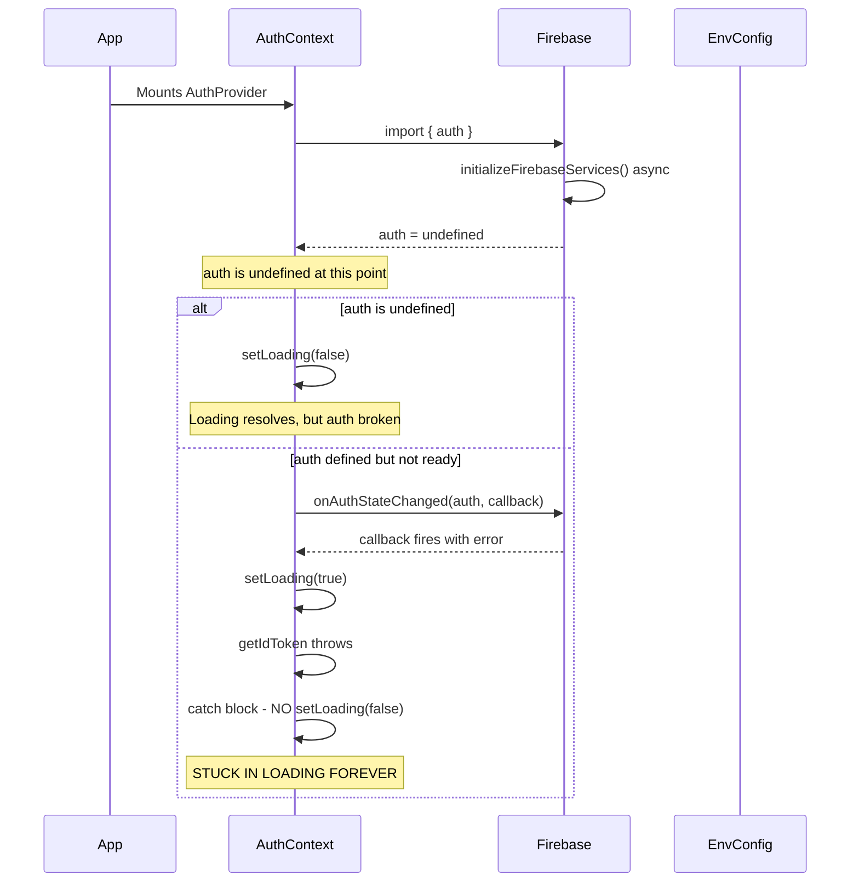

E# CareFlow Perpetual Loading State - Root Cause Analysis

**Date:** February 16, 2026
**Issue:** Application stuck in perpetual loading state during initialization
**Severity:** CRITICAL - Blocks application from mounting

---

## Executive Summary

The perpetual loading state is caused by **three interconnected race conditions** in the Firebase initialization and authentication flow:

1. **Firebase exports are `undefined` at module load time** due to async initialization
2. **AuthContext loading state never resolves** when Firebase auth is unavailable
3. **Environment config auto-initialization blocks** on the client side

---

## Root Cause #1: Firebase Export Race Condition (CRITICAL)

### Location

[`lib/firebase.js:17-64`](lib/firebase.js:17-64)

### Problematic Code

```javascript
// Initialize Firebase
let app;
let authInstance; // <-- Initially undefined
let storageInstance;
let messagingInstance;

// Initialize Firebase services
async function initializeFirebaseServices() {
  app = initializeApp(firebaseConfig);
  authInstance = getAuth(app); // <-- Assigned AFTER async operation completes
  storageInstance = getStorage(app);
  // ...
}

// Start initialization immediately
initializeFirebaseServices().catch(console.error); // <-- Async, runs in background

// Export the services (will be populated after initialization)
export const auth = authInstance; // <-- CAPTURES undefined VALUE!
export const storage = storageInstance;
export const messaging = messagingInstance;
```

### Why This Fails

1. JavaScript module exports are **bindings, not references** for primitive values
2. When `export const auth = authInstance` executes, `authInstance` is `undefined`
3. The async `initializeFirebaseServices()` runs in the background
4. Even after `authInstance` is assigned inside the function, the **exported `auth` remains `undefined`**
5. This is because `auth` was bound to the _value_ of `authInstance` at export time, not the variable itself

### Evidence

```javascript
// In AuthContext.js
import { auth } from '@/lib/firebase';

console.log(auth); // <-- Always undefined, even after Firebase initializes
```

---

## Root Cause #2: AuthContext Loading State Trap

### Location

[`context/AuthContext.js:28-92`](context/AuthContext.js:28-92)

### Problematic Code

```javascript
useEffect(() => {
  // Skip if auth is not available (SSR case)
  if (!auth) {
    setLoading(false); // <-- Sets loading to false when auth is undefined
    return;
  }

  const unsubscribe = onAuthStateChanged(auth, async (user) => {
    setLoading(true); // <-- Sets loading to TRUE
    setError(null);

    if (user) {
      try {
        const idToken = await getIdToken(user, true);
        // ... set user data
      } catch (error) {
        console.error('Error fetching user data:', error);
        setError('Failed to load user data');
        setCurrentUser(null);
        setToken(null);
        // <-- MISSING: setLoading(false) in catch block!
      }
    } else {
      setCurrentUser(null);
      setToken(null);
    }

    setLoading(false); // <-- Never reached if exception thrown above
  });

  return function () {
    if (unsubscribe && typeof unsubscribe === 'function') {
      unsubscribe();
    }
  };
}, []);
```

### Why This Fails

**Scenario A: `auth` is `undefined` (most common)**

- The `if (!auth)` check passes
- `setLoading(false)` is called
- But `onAuthStateChanged` is never registered
- If a user was previously logged in, the app shows as logged out
- **This is actually the "working" scenario** - loading resolves, but auth is broken

**Scenario B: `auth` is defined but Firebase not fully initialized**

- `onAuthStateChanged` is called with a partially initialized auth instance
- The callback fires with `user = null` (no signed-in user)
- `setLoading(true)` is called at the start of the callback
- If `getIdToken` throws (because Firebase isn't ready), the catch block doesn't set `loading` to `false`
- **Loading remains `true` forever**

**Scenario C: `onAuthStateChanged` never fires**

- If Firebase auth is in an error state, `onAuthStateChanged` may never call the callback
- `setLoading(true)` was called, but `setLoading(false)` is inside the callback
- **Loading remains `true` forever**

---

## Root Cause #3: Environment Config Client-Side Blocking

### Location

[`lib/env.config.js:489`](lib/env.config.js:489)

### Problematic Code

```javascript
// Auto-initialize on import
configManager.initialize();
```

### Why This Fails

1. `configManager.initialize()` calls `loadEnvironment()` which uses `dotenv.config()`
2. `dotenv` is a **Node.js-only module** that reads from the filesystem
3. When this module is imported on the client side:
   - `dotenv.config()` may throw or hang
   - `path.join()` uses Node.js path module
   - File system operations are not available in browsers

4. This import chain triggers the issue:
   ```
   context/AuthContext.js
   → imports lib/firebase.js
   → imports lib/env.config.js (in some configurations)
   → configManager.initialize() blocks or throws
   ```

---

## The Complete Failure Chain



---

## Required Patches

### Patch 1: Fix Firebase Export Pattern

**File:** [`lib/firebase.js`](lib/firebase.js)

```javascript
// lib/firebase.js - COMPLETE REWRITE
import { initializeApp, getApps, getApp } from 'firebase/app';
import { getAuth, inMemoryPersistence, onAuthStateChanged } from 'firebase/auth';
import { getStorage } from 'firebase/storage';
import { getMessaging, isSupported } from 'firebase/messaging';

// Firebase configuration
const firebaseConfig = {
  apiKey: process.env.NEXT_PUBLIC_FIREBASE_API_KEY,
  authDomain: process.env.NEXT_PUBLIC_FIREBASE_AUTH_DOMAIN,
  projectId: process.env.NEXT_PUBLIC_FIREBASE_PROJECT_ID,
  storageBucket: process.env.NEXT_PUBLIC_FIREBASE_STORAGE_BUCKET,
  messagingSenderId: process.env.NEXT_PUBLIC_FIREBASE_MESSAGING_SENDER_ID,
  appId: process.env.NEXT_PUBLIC_FIREBASE_APP_ID,
  databaseURL: process.env.NEXT_PUBLIC_FIREBASE_DATABASE_URL,
};

// Check if Firebase is configured
const isConfigured = !!(firebaseConfig.apiKey && firebaseConfig.projectId);

// Singleton instances - initialized lazily
let _app = null;
let _auth = null;
let _storage = null;
let _messaging = null;
let _initializationPromise = null;

/**
 * Get the Firebase app instance (initializes if needed)
 */
function getAppInstance() {
  if (typeof window === 'undefined') {
    return null; // SSR: Don't initialize on server
  }

  if (!_app) {
    const apps = getApps();
    _app = apps.length > 0 ? apps[0] : initializeApp(firebaseConfig);
  }

  return _app;
}

/**
 * Get the Firebase Auth instance (initializes if needed)
 */
export function getAuthInstance() {
  if (typeof window === 'undefined') {
    return null; // SSR: Don't initialize on server
  }

  if (!_auth) {
    const app = getAppInstance();
    if (app) {
      _auth = getAuth(app);
      // Use inMemoryPersistence for SSR compatibility
      _auth.setPersistence(inMemoryPersistence).catch(() => {
        // Persistence setting failed, continue anyway
      });
    }
  }

  return _auth;
}

/**
 * Get the Firebase Storage instance
 */
export function getStorageInstance() {
  if (typeof window === 'undefined') {
    return null;
  }

  if (!_storage) {
    const app = getAppInstance();
    if (app) {
      _storage = getStorage(app);
    }
  }

  return _storage;
}

/**
 * Get the Firebase Messaging instance (async)
 */
export async function getMessagingInstance() {
  if (typeof window === 'undefined') {
    return null;
  }

  if (!_messaging) {
    const supported = await isSupported().catch(() => false);
    if (supported) {
      const app = getAppInstance();
      if (app) {
        _messaging = getMessaging(app);
      }
    }
  }

  return _messaging;
}

// For backward compatibility, export getter functions
// These will be null on SSR, valid on client after hydration
export const auth = typeof window !== 'undefined' ? getAuthInstance() : null;
export const storage = typeof window !== 'undefined' ? getStorageInstance() : null;
export const firebaseApp = typeof window !== 'undefined' ? getAppInstance() : null;

// Export configuration status
export { isConfigured };
export const configMessage = isConfigured
  ? 'Firebase configuration loaded successfully'
  : 'Firebase not configured - missing environment variables';

// Notification helper functions
export const requestNotificationPermission = async () => {
  const messaging = await getMessagingInstance();
  if (!messaging) {
    console.warn('Firebase Messaging not available');
    return null;
  }

  try {
    const permission = await Notification.requestPermission();
    return permission === 'granted' ? permission : null;
  } catch (error) {
    console.error('Error requesting notification permission:', error);
    return null;
  }
};

export const getFCMToken = async (vapidKey) => {
  const messaging = await getMessagingInstance();
  if (!messaging) return null;

  try {
    const { getToken } = await import('firebase/messaging');
    return await getToken(messaging, { vapidKey });
  } catch (error) {
    console.error('Error getting FCM token:', error);
    return null;
  }
};

export const onMessageListener = async (callback) => {
  const messaging = await getMessagingInstance();
  if (!messaging) return () => {};

  const { onMessage } = await import('firebase/messaging');
  return onMessage(messaging, callback);
};

export default getAppInstance;
```

### Patch 2: Fix AuthContext Loading State

**File:** [`context/AuthContext.js`](context/AuthContext.js)

```javascript
// context/AuthContext.js - COMPLETE REWRITE
'use client';

import React, { createContext, useContext, useState, useEffect, useCallback } from 'react';
import {
  onAuthStateChanged,
  signInWithEmailAndPassword,
  createUserWithEmailAndPassword,
  signOut,
  sendPasswordResetEmail,
  updateProfile,
  getIdToken,
} from 'firebase/auth';
import { getAuthInstance, isConfigured as isFirebaseConfigured } from '@/lib/firebase';

const AuthContext = createContext(null);

export function useAuth() {
  const context = useContext(AuthContext);
  if (!context) {
    throw new Error('useAuth must be used within an AuthProvider');
  }
  return context;
}

export function AuthProvider({ children }) {
  const [currentUser, setCurrentUser] = useState(null);
  const [token, setToken] = useState(null);
  const [loading, setLoading] = useState(true);
  const [error, setError] = useState(null);
  const [isInitialized, setIsInitialized] = useState(false);

  // Initialize authentication state
  useEffect(() => {
    let unsubscribe = null;
    let isMounted = true;

    const initializeAuth = async () => {
      try {
        // Check if Firebase is configured
        if (!isFirebaseConfigured) {
          console.warn('Firebase not configured - skipping auth initialization');
          if (isMounted) {
            setLoading(false);
            setIsInitialized(true);
          }
          return;
        }

        // Get auth instance (may be null on SSR)
        const auth = getAuthInstance();

        if (!auth) {
          // SSR or auth not available
          if (isMounted) {
            setLoading(false);
            setIsInitialized(true);
          }
          return;
        }

        // Set up auth state listener
        unsubscribe = onAuthStateChanged(
          auth,
          async (user) => {
            if (!isMounted) return;

            setLoading(true);
            setError(null);

            if (user) {
              try {
                // Get fresh token
                const idToken = await getIdToken(user, true);

                if (!isMounted) return;

                setCurrentUser({
                  uid: user.uid,
                  email: user.email,
                  displayName: user.displayName,
                  photoURL: user.photoURL,
                  emailVerified: user.emailVerified,
                  phoneNumber: user.phoneNumber,
                });
                setToken(idToken);

                // Store token in sessionStorage (more secure than localStorage)
                if (typeof window !== 'undefined') {
                  sessionStorage.setItem('careflow_token', idToken);
                }
              } catch (tokenError) {
                console.error('Error fetching user token:', tokenError);
                if (isMounted) {
                  setError('Failed to load user session');
                  setCurrentUser(null);
                  setToken(null);
                  setLoading(false); // CRITICAL: Ensure loading is set to false on error
                }
                return;
              }
            } else {
              if (isMounted) {
                setCurrentUser(null);
                setToken(null);
                if (typeof window !== 'undefined') {
                  sessionStorage.removeItem('careflow_token');
                }
              }
            }

            if (isMounted) {
              setLoading(false);
              setIsInitialized(true);
            }
          },
          (authError) => {
            // Handle onAuthStateChanged error callback
            console.error('Auth state change error:', authError);
            if (isMounted) {
              setError('Authentication initialization failed');
              setLoading(false);
              setIsInitialized(true);
            }
          }
        );
      } catch (initError) {
        console.error('Auth initialization error:', initError);
        if (isMounted) {
          setError('Failed to initialize authentication');
          setLoading(false);
          setIsInitialized(true);
        }
      }
    };

    // Initialize with a small delay to ensure client-side hydration
    if (typeof window !== 'undefined') {
      // Use requestAnimationFrame for better hydration
      requestAnimationFrame(() => {
        initializeAuth();
      });
    } else {
      // SSR: Set loading to false immediately
      setLoading(false);
      setIsInitialized(true);
    }

    // Cleanup
    return () => {
      isMounted = false;
      if (unsubscribe && typeof unsubscribe === 'function') {
        unsubscribe();
      }
    };
  }, []);

  // Token refresh effect (separate from initialization)
  useEffect(() => {
    if (!currentUser || !token) return;

    let refreshInterval = null;

    // Set up token refresh every 50 minutes
    refreshInterval = setInterval(
      async () => {
        try {
          const auth = getAuthInstance();
          if (auth?.currentUser) {
            const newToken = await getIdToken(auth.currentUser, true);
            setToken(newToken);
            if (typeof window !== 'undefined') {
              sessionStorage.setItem('careflow_token', newToken);
            }
          }
        } catch (err) {
          console.error('Token refresh failed:', err);
          // Don't logout on refresh failure, let the next API call handle it
        }
      },
      50 * 60 * 1000
    );

    return () => {
      if (refreshInterval) {
        clearInterval(refreshInterval);
      }
    };
  }, [currentUser, token]);

  const login = useCallback(async (email, password) => {
    try {
      setError(null);
      const auth = getAuthInstance();
      if (!auth) {
        throw new Error('Authentication not available');
      }
      const result = await signInWithEmailAndPassword(auth, email, password);
      return { success: true, user: result.user };
    } catch (error) {
      console.error('Login error:', error);
      setError(error.message);
      return { success: false, error: error.message };
    }
  }, []);

  const signup = useCallback(async (email, password, displayName) => {
    try {
      setError(null);
      const auth = getAuthInstance();
      if (!auth) {
        throw new Error('Authentication not available');
      }
      const result = await createUserWithEmailAndPassword(auth, email, password);

      if (displayName && result.user) {
        await updateProfile(result.user, { displayName });
      }

      return { success: true, user: result.user };
    } catch (error) {
      console.error('Signup error:', error);
      setError(error.message);
      return { success: false, error: error.message };
    }
  }, []);

  const logout = useCallback(async () => {
    try {
      setError(null);
      const auth = getAuthInstance();
      if (auth) {
        await signOut(auth);
      }
      setCurrentUser(null);
      setToken(null);

      if (typeof window !== 'undefined') {
        sessionStorage.removeItem('careflow_token');
      }

      return { success: true };
    } catch (error) {
      console.error('Logout error:', error);
      setError(error.message);
      return { success: false, error: error.message };
    }
  }, []);

  const resetPassword = useCallback(async (email) => {
    try {
      setError(null);
      const auth = getAuthInstance();
      if (!auth) {
        throw new Error('Authentication not available');
      }
      await sendPasswordResetEmail(auth, email);
      return { success: true };
    } catch (error) {
      console.error('Password reset error:', error);
      setError(error.message);
      return { success: false, error: error.message };
    }
  }, []);

  const updateUserProfile = useCallback(
    async (data) => {
      try {
        setError(null);
        const auth = getAuthInstance();
        if (currentUser && auth?.currentUser) {
          await updateProfile(auth.currentUser, data);
          setCurrentUser({ ...currentUser, ...data });
          return { success: true };
        }
        return { success: false, error: 'No user logged in' };
      } catch (error) {
        console.error('Profile update error:', error);
        setError(error.message);
        return { success: false, error: error.message };
      }
    },
    [currentUser]
  );

  const value = {
    currentUser,
    token,
    loading,
    error,
    isInitialized,
    login,
    signup,
    logout,
    resetPassword,
    updateUserProfile,
    setError,
  };

  return React.createElement(AuthContext.Provider, { value }, children);
}
```

### Patch 3: Fix Environment Config Client-Side Import

**File:** [`lib/env.config.js`](lib/env.config.js) - Add client-side guard

```javascript
// lib/env.config.js - Add at the end of the file

// ... existing code ...

// Create singleton instance
const configManager = new ConfigurationManager();

// Export configuration object with runtime protection
const createProtectedConfig = () =>
  new Proxy(
    {},
    {
      get(target, prop) {
        if (prop === 'then') {
          return undefined;
        }
        if (prop === Symbol.toPrimitive) {
          return () => '[Configuration Object]';
        }
        return configManager.get(prop);
      },
      set() {
        throw new Error('Configuration object is read-only and cannot be modified');
      },
      deleteProperty() {
        throw new Error('Configuration properties cannot be deleted');
      },
      has(target, prop) {
        return prop in configManager.get();
      },
      ownKeys() {
        return Object.keys(configManager.get());
      },
      getOwnPropertyDescriptor(target, prop) {
        const config = configManager.get();
        return Object.getOwnPropertyDescriptor(config, prop);
      },
    }
  );

// Initialize configuration
const config = createProtectedConfig();

// Export both the manager and the config object
export { configManager, CONFIG_SCHEMA };
export default config;

// CRITICAL FIX: Only auto-initialize on server side
// Client-side should use NEXT_PUBLIC_ environment variables directly
if (typeof window === 'undefined') {
  // Server-side: Initialize immediately
  configManager.initialize();
} else {
  // Client-side: Mark as initialized but don't load from .env files
  // Client uses NEXT_PUBLIC_ variables which are embedded at build time
  configManager.isInitialized = true;
  configManager.config = Object.freeze({
    NODE_ENV: process.env.NODE_ENV,
    // Add other public config as needed
    _meta: {
      validation: { valid: true, errors: [], warnings: [] },
      warnings: [],
      loadedAt: new Date().toISOString(),
      environment: process.env.NODE_ENV || 'development',
      clientSide: true,
    },
  });
}
```

---

## Summary of Changes

| File                                               | Issue                                 | Fix                                             |
| -------------------------------------------------- | ------------------------------------- | ----------------------------------------------- |
| [`lib/firebase.js`](lib/firebase.js)               | Exports `undefined` due to async init | Use lazy initialization with getter functions   |
| [`context/AuthContext.js`](context/AuthContext.js) | Loading state never resolves on error | Add `setLoading(false)` in all error paths      |
| [`lib/env.config.js`](lib/env.config.js)           | Blocks on client-side                 | Add `typeof window` check before initialization |

---

## Verification Steps

After applying patches:

1. **Clear browser storage** - Remove old localStorage tokens
2. **Restart development server** - Ensure clean module loading
3. **Check console** - Should see "Firebase configuration loaded successfully"
4. **Verify loading state** - Should resolve within 2-3 seconds
5. **Test auth flow** - Login should work correctly

---

**Report Generated:** February 16, 2026
