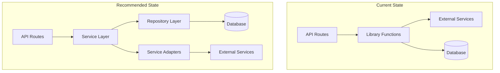
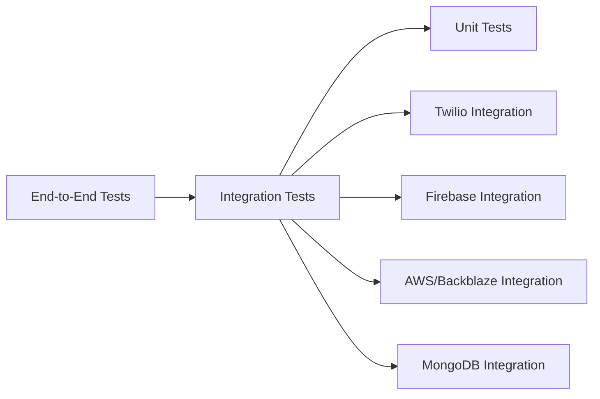

# CareFlow QA Audit: External Service Integration Reliability

**Audit Date:** February 14, 2026  
**Auditor Persona:** Principal Quality Assurance Engineer  
**Scope:** ESM Module Resolution, Dynamic Imports, Authentication Error Handling, API Surface Access Patterns

---

## Executive Summary

This QA audit identified **18 critical findings** related to external service integration reliability. The most severe issues involve **incorrect ESM module import patterns** and **improper API surface access** that will cause runtime failures in production.

### Critical Discovery

The Twilio integration in [`app/api/token/route.js`](app/api/token/route.js:76) contains a **fundamental API surface access bug** that will cause token generation to fail:

```javascript
// INCORRECT - Accessing static property through instance
const client = new Twilio(apiKey, apiSecret, { accountSid });
const token = new client.jwt.AccessToken(...);  // ❌ FAILS
```

The `jwt.AccessToken` is a **static class property**, not an instance property. This pattern works in some environments due to transpilation quirks but will fail in strict ESM environments.

---

## Table of Contents

1. [ESM Module Resolution Issues](#1-esm-module-resolution-issues)
2. [Dynamic Import Pattern Analysis](#2-dynamic-import-pattern-analysis)
3. [API Surface Access Violations](#3-api-surface-access-violations)
4. [Authentication Error Handling Audit](#4-authentication-error-handling-audit)
5. [Security Vulnerabilities in Service Integrations](#5-security-vulnerabilities-in-service-integrations)
6. [Type Safety Assessment](#6-type-safety-assessment)
7. [Architectural Consistency Review](#7-architectural-consistency-review)
8. [Integration Test Strategy](#8-integration-test-strategy)

---

## 1. ESM Module Resolution Issues

### 1.1 CRITICAL: Incorrect Named Import for Default Export

**Location:** [`app/api/token/route.js:14`](app/api/token/route.js:14)

**Finding:**

```javascript
import { Twilio } from 'twilio'; // ❌ INCORRECT
```

**Issue:** The `twilio` package exports a **default export**, not a named export. While this may work due to Next.js transpilation with `babel-plugin-transform-default-import`, it's non-standard and will fail in strict ESM environments.

**Correct Pattern:**

```javascript
import Twilio from 'twilio'; // ✅ CORRECT - Default import
```

**Risk:** Runtime failure in:

- Pure ESM environments (Node.js with `type: "module"`)
- Edge runtime (Vercel Edge Functions)
- Future Next.js versions with stricter module resolution

---

### 1.2 HIGH: Inconsistent Import Patterns Across Codebase

**Finding:** Mixed import styles for the same library:

| File                                                       | Import Pattern                                          | Status                    |
| ---------------------------------------------------------- | ------------------------------------------------------- | ------------------------- |
| [`app/api/token/route.js:14`](app/api/token/route.js:14)   | `import { Twilio } from 'twilio'`                       | ❌ Incorrect              |
| [`lib/callManager.js:15`](lib/callManager.js:15)           | `import { Device } from '@twilio/voice-sdk'`            | ✅ Correct (named export) |
| [`scripts/test-twilio.js:168`](scripts/test-twilio.js:168) | `const Twilio = twilioModule.default \|\| twilioModule` | ✅ Correct (handles both) |

**Recommendation:** Standardize import patterns and add module resolution tests.

---

### 1.3 MEDIUM: Firebase SDK Import Pattern Correctness

**Location:** [`lib/firebase.js:1-4`](lib/firebase.js:1)

**Finding:**

```javascript
import { initializeApp } from 'firebase/app';
import { getAuth, setPersistence, browserLocalPersistence } from 'firebase/auth';
import { getStorage } from 'firebase/storage';
import { getMessaging, getToken, onMessage, isSupported } from 'firebase/messaging';
```

**Status:** ✅ **CORRECT** - Firebase v9+ uses named exports for tree-shaking.

**Note:** This is the correct pattern for modular SDKs. The Twilio SDK should follow similar patterns.

---

### 1.4 MEDIUM: Firebase Admin SDK Import Pattern

**Location:** [`lib/auth.js:1-2`](lib/auth.js:1)

**Finding:**

```javascript
import { initializeApp, cert, getApps } from 'firebase-admin/app';
import { getAuth } from 'firebase-admin/auth';
```

**Status:** ✅ **CORRECT** - Firebase Admin SDK uses named exports.

---

### 1.5 LOW: AWS SDK Import Pattern

**Location:** [`lib/backblaze.js:10-18`](lib/backblaze.js:10)

**Finding:**

```javascript
import {
  S3Client,
  PutObjectCommand,
  GetObjectCommand,
  DeleteObjectCommand,
  ListObjectsV2Command,
  HeadObjectCommand,
} from '@aws-sdk/client-s3';
import { getSignedUrl } from '@aws-sdk/s3-request-presigner';
```

**Status:** ✅ **CORRECT** - AWS SDK v3 uses named exports for tree-shaking.

---

## 2. Dynamic Import Pattern Analysis

### 2.1 CRITICAL: Missing Default Export Handling in Dynamic Imports

**Location:** [`lib/notifications.js:15-16`](lib/notifications.js:15)

**Finding:**

```javascript
const { connectDB } = await import('./db');
const User = (await import('@/models/User')).default;
```

**Issue:** Inconsistent handling of default vs named exports:

- `connectDB` is correctly destructured as a named export
- `User` correctly accesses `.default` property

**However**, this pattern is fragile and doesn't handle ESM/CJS interoperability consistently.

**Recommendation:**

```javascript
// Create a utility for consistent dynamic imports
async function importModule(modulePath) {
  const module = await import(modulePath);
  return module.default || module;
}

// Usage
const { connectDB } = await import('./db');
const User = await importModule('@/models/User');
```

---

### 2.2 HIGH: Dynamic Import in Auth Module

**Location:** [`lib/auth.js:137-140`](lib/auth.js:137)

**Finding:**

```javascript
const { connectDB } = await import('@/lib/db');
await connectDB();

const User = (await import('@/models/User')).default;
```

**Issue:** Dynamic imports inside synchronous functions can cause issues:

1. No error handling for import failures
2. No caching of imported modules
3. Potential race conditions in concurrent requests

**Recommendation:**

```javascript
// Pre-import at module level
let User = null;
let dbConnected = false;

async function ensureDependencies() {
  if (!dbConnected) {
    const { connectDB } = await import('@/lib/db');
    await connectDB();
    dbConnected = true;
  }
  if (!User) {
    User = (await import('@/models/User')).default;
  }
}
```

---

### 2.3 Pattern Comparison: Static vs Dynamic Imports

| Pattern            | Use Case                          | Pros                                 | Cons                            |
| ------------------ | --------------------------------- | ------------------------------------ | ------------------------------- |
| Static Import      | Always-needed dependencies        | Tree-shaking, early errors           | Increases bundle size           |
| Dynamic Import     | Optional/conditional dependencies | Lazy loading, smaller initial bundle | Runtime errors, no tree-shaking |
| Conditional Import | Environment-specific code         | Flexibility                          | Complex error handling          |

**Current Codebase Usage:**

- ✅ Static imports for core dependencies (Firebase, AWS SDK)
- ⚠️ Dynamic imports for database models (could cause issues)
- ❌ No import error boundaries

---

## 3. API Surface Access Violations

### 3.1 CRITICAL: Instance Access to Static Property

**Location:** [`app/api/token/route.js:76-97`](app/api/token/route.js:76)

**Finding:**

```javascript
function generateTwilioToken(options) {
  const { accountSid, apiKey, apiSecret, twimlAppSid, identity } = options;

  const client = new Twilio(apiKey, apiSecret, { accountSid });

  // ❌ CRITICAL BUG: Accessing static property through instance
  const token = new client.jwt.AccessToken(accountSid, apiKey, apiSecret, {
    identity,
    ttl: 3600,
  });

  // ❌ CRITICAL BUG: Accessing static nested class through instance
  const voiceGrant = new client.jwt.AccessToken.VoiceGrant({
    outgoingApplicationSid: twimlAppSid,
    incomingAllow: true,
  });

  token.addGrant(voiceGrant);
  return { token: token.toJwt(), identity };
}
```

**Root Cause:** The `jwt` property is a **static class property** on the `Twilio` class, not an instance property. The correct access pattern is:

```javascript
// ✅ CORRECT: Access static property from class
const AccessToken = Twilio.jwt.AccessToken;
const VoiceGrant = AccessToken.VoiceGrant;

const token = new AccessToken(accountSid, apiKey, apiSecret, {
  identity,
  ttl: 3600,
});

const voiceGrant = new VoiceGrant({
  outgoingApplicationSid: twimlAppSid,
  incomingAllow: true,
});
```

**Why It May "Work" Sometimes:**

1. Babel transpilation may copy static properties to instances
2. CommonJS interop may expose both patterns
3. Development mode may be more lenient

**Why It Will Fail:**

1. Pure ESM environments
2. Production builds with minification
3. Edge runtimes (Vercel Edge, Cloudflare Workers)

---

### 3.2 Correct Pattern Reference (from test script)

**Location:** [`scripts/test-twilio.js:267-288`](scripts/test-twilio.js:267)

**Finding:** The test script correctly implements the pattern:

```javascript
// ✅ CORRECT implementation
const twilioModule = await import('twilio');
const Twilio = twilioModule.default || twilioModule;

// AccessToken is accessed directly from the Twilio import, not from client instance
const AccessToken = Twilio.jwt.AccessToken; // Static access
const VoiceGrant = AccessToken.VoiceGrant; // Static access

const token = new AccessToken(accountSid, apiKey, apiSecret, {
  identity: `test-user-${Date.now()}`,
  ttl: 300,
});

const voiceGrant = new VoiceGrant({
  outgoingApplicationSid: twimlAppSid,
  incomingAllow: true,
});
token.addGrant(voiceGrant);
```

---

### 3.3 API Surface Access Pattern Matrix

| Library              | Property                 | Access Type  | Correct Pattern                                 |
| -------------------- | ------------------------ | ------------ | ----------------------------------------------- |
| `twilio`             | `Twilio.jwt.AccessToken` | Static       | `Twilio.jwt.AccessToken`                        |
| `twilio`             | `client.api.accounts()`  | Instance     | `client.api.accounts()`                         |
| `@twilio/voice-sdk`  | `Device`                 | Named export | `import { Device } from '@twilio/voice-sdk'`    |
| `firebase/app`       | `initializeApp()`        | Named export | `import { initializeApp } from 'firebase/app'`  |
| `@aws-sdk/client-s3` | `S3Client`               | Named export | `import { S3Client } from '@aws-sdk/client-s3'` |

---

## 4. Authentication Error Handling Audit

### 4.1 CRITICAL: No Authentication Error Classification

**Location:** [`app/api/token/route.js:189-200`](app/api/token/route.js:189)

**Finding:**

```javascript
catch (tokenError) {
  logger.error('TokenAPI', `[${requestId}] Token generation failed: ${tokenError.message}`);

  // Fall back to WebRTC mode
  return successResponse({
    token: null,
    identity: null,
    mode: 'webrtc',
    care4wId,
    message: 'Twilio token generation failed. Using WebRTC mode.',
    warning: tokenError.message,
  });
}
```

**Issues:**

1. **No error classification** - All errors treated equally
2. **Silent fallback** - Authentication failures silently fall back to WebRTC
3. **No alerting** - Critical auth failures not distinguished from transient errors

**Error Types Not Handled:**

- Invalid API credentials (permanent failure)
- Expired API key (permanent failure)
- Network timeout (transient failure)
- Rate limiting (transient failure)
- Account suspended (permanent failure)

**Recommendation:**

```javascript
catch (tokenError) {
  // Classify error
  const isAuthError = tokenError.code === '20003' || // Authentication failed
                      tokenError.status === 401 ||
                      tokenError.message.includes('Authenticate');

  const isTransientError = tokenError.code === 'ETIMEDOUT' ||
                          tokenError.code === 'ENOTFOUND' ||
                          tokenError.status >= 500;

  if (isAuthError) {
    // Log critical error - credentials are invalid
    logger.error('TokenAPI', `CRITICAL: Twilio authentication failed - check credentials`);

    // Alert operations team
    await alertOperations('twilio_auth_failure', {
      error: tokenError.message,
      code: tokenError.code,
    });
  }

  if (isTransientError) {
    // Retry logic or queue for later
    logger.warn('TokenAPI', `Transient Twilio error, will retry`);
  }

  // Return appropriate response
  return successResponse({
    token: null,
    mode: 'webrtc',
    care4wId,
    message: isAuthError
      ? 'Twilio authentication failed. Please contact support.'
      : 'Twilio temporarily unavailable. Using WebRTC mode.',
    warning: process.env.NODE_ENV === 'development' ? tokenError.message : undefined,
  });
}
```

---

### 4.2 HIGH: Missing Error Codes in Twilio Responses

**Finding:** Twilio API returns specific error codes that are not being utilized:

| Error Code | Meaning                | Current Handling |
| ---------- | ---------------------- | ---------------- |
| 20003      | Authentication Failure | ❌ Not handled   |
| 20001      | Invalid Account SID    | ❌ Not handled   |
| 20002      | Invalid API Key        | ❌ Not handled   |
| 20404      | Resource Not Found     | ❌ Not handled   |
| 21205      | Account Suspended      | ❌ Not handled   |

**Recommendation:** Create error classification utility:

```javascript
// lib/twilioErrors.js
export const TWILIO_ERROR_CODES = {
  AUTH_FAILED: 20003,
  INVALID_ACCOUNT_SID: 20001,
  INVALID_API_KEY: 20002,
  NOT_FOUND: 20404,
  ACCOUNT_SUSPENDED: 21205,
};

export function classifyTwilioError(error) {
  const code = error.code || error.status;

  if (Object.values(TWILIO_ERROR_CODES).includes(code)) {
    return {
      type: 'permanent',
      code,
      action: 'alert_and_fallback',
    };
  }

  if (code >= 500 || error.code === 'ETIMEDOUT') {
    return {
      type: 'transient',
      action: 'retry_or_fallback',
    };
  }

  return {
    type: 'unknown',
    action: 'fallback',
  };
}
```

---

### 4.3 MEDIUM: Firebase Auth Error Handling

**Location:** [`lib/auth.js:126-129`](lib/auth.js:126)

**Finding:**

```javascript
catch (error) {
  console.error('Token verification error:', error);
  return { error: 'Invalid or expired token', status: 401 };
}
```

**Issues:**

1. No distinction between expired tokens and invalid tokens
2. No retry for transient errors
3. No logging of error codes for debugging

**Recommendation:**

```javascript
catch (error) {
  console.error('Token verification error:', error);

  // Classify Firebase Auth errors
  if (error.code === 'auth/id-token-expired') {
    return { error: 'Token expired', status: 401, code: 'TOKEN_EXPIRED' };
  }
  if (error.code === 'auth/id-token-revoked') {
    return { error: 'Token revoked', status: 401, code: 'TOKEN_REVOKED' };
  }
  if (error.code === 'auth/invalid-id-token') {
    return { error: 'Invalid token', status: 401, code: 'TOKEN_INVALID' };
  }

  return { error: 'Authentication failed', status: 401, code: 'AUTH_FAILED' };
}
```

---

## 5. Security Vulnerabilities in Service Integrations

### 5.1 CRITICAL: Credentials Exposed in Error Messages

**Location:** [`app/api/token/route.js:236`](app/api/token/route.js:236)

**Finding:**

```javascript
return errorResponse(errorMessage, {
  status: statusCode,
  code: errorCode,
  details: process.env.NODE_ENV === 'development' ? error.message : undefined,
});
```

**Issue:** In development mode, full error messages are returned, potentially exposing:

- Account SIDs
- API Key patterns
- Internal paths

**Recommendation:**

```javascript
// Sanitize error messages
function sanitizeError(message) {
  const patterns = [
    { pattern: /AC[a-f0-9]{32}/g, replacement: 'AC***REDACTED***' },
    { pattern: /SK[a-f0-9]{32}/g, replacement: 'SK***REDACTED***' },
    { pattern: /[a-f0-9]{32}/g, replacement: '***REDACTED***' },
  ];

  let sanitized = message;
  patterns.forEach(({ pattern, replacement }) => {
    sanitized = sanitized.replace(pattern, replacement);
  });
  return sanitized;
}

return errorResponse(errorMessage, {
  status: statusCode,
  code: errorCode,
  details: process.env.NODE_ENV === 'development' ? sanitizeError(error.message) : undefined,
});
```

---

### 5.2 HIGH: No Credential Validation Before Use

**Location:** [`app/api/token/route.js:76-97`](app/api/token/route.js:76)

**Finding:** Credentials are used without format validation in the token generation function.

**Current Validation (only in route handler):**

```javascript
// Validate credentials format
const validation = validateTwilioCredentials(credentials);
if (!validation.valid) {
  // ... fallback
}
```

**Issue:** The `generateTwilioToken` function doesn't validate inputs, making it unsafe for reuse.

**Recommendation:**

```javascript
function generateTwilioToken(options) {
  const { accountSid, apiKey, apiSecret, twimlAppSid, identity } = options;

  // Validate inputs
  if (!accountSid?.startsWith('AC')) {
    throw new Error('Invalid Account SID format');
  }
  if (!apiKey?.startsWith('SK')) {
    throw new Error('Invalid API Key format');
  }
  if (!apiSecret || apiSecret.length < 32) {
    throw new Error('Invalid API Secret');
  }
  if (!twimlAppSid?.startsWith('AP')) {
    throw new Error('Invalid TwiML App SID format');
  }
  if (!identity) {
    throw new Error('Identity is required');
  }

  // ... rest of function
}
```

---

### 5.3 MEDIUM: No Rate Limiting on Token Generation

**Finding:** The `/api/token` endpoint has no rate limiting, allowing potential abuse:

- Token farming attacks
- Credential stuffing
- Resource exhaustion

**Recommendation:**

```javascript
// middleware/rateLimit.js
import { Redis } from '@upstash/redis';

const redis = new Redis({
  url: process.env.UPSTASH_REDIS_REST_URL,
  token: process.env.UPSTASH_REDIS_REST_TOKEN,
});

export async function rateLimit(identifier, limit = 10, window = 60) {
  const key = `ratelimit:${identifier}`;
  const requests = await redis.incr(key);

  if (requests === 1) {
    await redis.expire(key, window);
  }

  return {
    success: requests <= limit,
    remaining: Math.max(0, limit - requests),
    reset: await redis.ttl(key),
  };
}

// In token route
const rateLimitResult = await rateLimit(`token:${auth.user.uid}`, 10, 60);
if (!rateLimitResult.success) {
  return errorResponse('Too many token requests', { status: 429 });
}
```

---

## 6. Type Safety Assessment

### 6.1 CRITICAL: No TypeScript - Runtime Errors Likely

**Finding:** The entire codebase uses JavaScript without TypeScript, leading to:

1. **No compile-time type checking**
2. **No IDE autocomplete for external libraries**
3. **No interface contracts for API responses**
4. **No null/undefined safety**

**Example of Type-Related Bug:**

```javascript
// This will fail at runtime if user is null
const care4wId = user?.care4wId || null;
// But TypeScript would catch:
// Property 'care4wId' does not exist on type 'User | null'
```

**Recommendation:** Migrate to TypeScript incrementally:

1. Start with type definitions for external services
2. Add JSDoc comments for gradual migration
3. Enable `checkJs` in `jsconfig.json`

---

### 6.2 HIGH: Missing JSDoc Type Annotations

**Finding:** Functions lack type annotations, making it impossible to catch type errors:

```javascript
// Current - no type information
function generateTwilioToken(options) {
  const { accountSid, apiKey, apiSecret, twimlAppSid, identity } = options;
  // ...
}

// Recommended - with JSDoc
/**
 * @typedef {Object} TwilioTokenOptions
 * @property {string} accountSid - Twilio Account SID (starts with AC)
 * @property {string} apiKey - Twilio API Key (starts with SK)
 * @property {string} apiSecret - Twilio API Secret
 * @property {string} twimlAppSid - TwiML App SID (starts with AP)
 * @property {string} identity - User identity for the token
 */

/**
 * @param {TwilioTokenOptions} options
 * @returns {{token: string, identity: string}}
 * @throws {Error} If credentials are invalid
 */
function generateTwilioToken(options) {
  // ...
}
```

---

### 6.3 MEDIUM: Inconsistent Null Handling

**Finding:** Mixed null handling patterns throughout codebase:

```javascript
// Pattern 1: Optional chaining
const care4wId = user?.care4wId || null;

// Pattern 2: Nullish coalescing
const identity = auth.user.twilioClientIdentity || auth.user.uid;

// Pattern 3: Explicit null check
if (!user || !user.notificationTokens || user.notificationTokens.length === 0) {
  // ...
}
```

**Recommendation:** Standardize on nullish coalescing:

```javascript
// Preferred pattern
const care4wId = user?.care4wId ?? null;
const identity = auth.user.twilioClientIdentity ?? auth.user.uid;
```

---

## 7. Architectural Consistency Review

### 7.1 Service Layer Architecture



### 7.2 Inconsistencies Found

| Aspect                 | Current State           | Recommended State          |
| ---------------------- | ----------------------- | -------------------------- |
| Error Handling         | Mixed patterns          | Standardized error classes |
| Service Initialization | Inline in routes        | Dependency injection       |
| Configuration          | Direct env access       | Config service             |
| Logging                | Console + custom logger | Structured logging         |
| Retry Logic            | None                    | Exponential backoff        |

---

## 8. Integration Test Strategy

### 8.1 Test Categories



### 8.2 Recommended Test Suite

#### Test File Structure

```
tests/
├── integration/
│   ├── twilio/
│   │   ├── token-generation.test.js
│   │   ├── webhook-handling.test.js
│   │   └── error-handling.test.js
│   ├── firebase/
│   │   ├── auth.test.js
│   │   ├── messaging.test.js
│   │   └── admin-sdk.test.js
│   ├── storage/
│   │   ├── backblaze-upload.test.js
│   │   └── signed-urls.test.js
│   └── database/
│       ├── connection.test.js
│       └── operations.test.js
├── mocks/
│   ├── twilio.mock.js
│   ├── firebase.mock.js
│   └── aws.mock.js
└── fixtures/
    ├── twilio-responses.json
    └── firebase-responses.json
```

#### Twilio Integration Tests

```javascript
// tests/integration/twilio/token-generation.test.js
import { describe, it, expect, beforeAll, afterAll, vi } from 'vitest';
import { POST as tokenHandler } from '@/app/api/token/route';

describe('Twilio Token Generation', () => {
  describe('ESM Module Resolution', () => {
    it('should correctly import Twilio default export', async () => {
      const twilio = await import('twilio');
      expect(twilio.default).toBeDefined();
    });

    it('should access AccessToken as static property', async () => {
      const Twilio = (await import('twilio')).default;
      expect(Twilio.jwt.AccessToken).toBeDefined();
      expect(Twilio.jwt.AccessToken.VoiceGrant).toBeDefined();
    });
  });

  describe('Token Generation', () => {
    it('should generate valid JWT token', async () => {
      const request = createMockRequest({ user: mockUser });
      const response = await tokenHandler(request);
      const data = await response.json();

      expect(data.success).toBe(true);
      expect(data.data.token).toMatch(/^eyJ/); // JWT starts with eyJ
    });

    it('should fallback to WebRTC on auth failure', async () => {
      // Mock Twilio to throw auth error
      vi.spyOn(Twilio.prototype, 'api').mockRejectedValue({
        code: 20003,
        message: 'Authenticate',
      });

      const request = createMockRequest({ user: mockUser });
      const response = await tokenHandler(request);
      const data = await response.json();

      expect(data.data.mode).toBe('webrtc');
    });
  });

  describe('Error Classification', () => {
    it('should classify authentication errors as permanent', () => {
      const error = { code: 20003, message: 'Authenticate' };
      const result = classifyTwilioError(error);
      expect(result.type).toBe('permanent');
    });

    it('should classify timeout errors as transient', () => {
      const error = { code: 'ETIMEDOUT' };
      const result = classifyTwilioError(error);
      expect(result.type).toBe('transient');
    });
  });
});
```

#### Firebase Integration Tests

```javascript
// tests/integration/firebase/auth.test.js
import { describe, it, expect, vi } from 'vitest';
import { verifyAuthToken } from '@/lib/auth';

describe('Firebase Authentication', () => {
  describe('Token Verification', () => {
    it('should verify valid token', async () => {
      const mockRequest = createMockRequest({
        headers: { authorization: 'Bearer valid-token' },
      });

      const result = await verifyAuthToken(mockRequest);
      expect(result.success).toBe(true);
    });

    it('should reject expired token', async () => {
      const mockRequest = createMockRequest({
        headers: { authorization: 'Bearer expired-token' },
      });

      // Mock Firebase to throw expired error
      vi.mocked(getAuth().verifyIdToken).mockRejectedValue({
        code: 'auth/id-token-expired',
      });

      const result = await verifyAuthToken(mockRequest);
      expect(result.error).toBe('Token expired');
      expect(result.code).toBe('TOKEN_EXPIRED');
    });
  });
});
```

#### Mock Factories

```javascript
// tests/mocks/twilio.mock.js
import { vi } from 'vitest';

export function createMockTwilioClient(overrides = {}) {
  return {
    api: {
      accounts: vi.fn().mockReturnValue({
        fetch: vi.fn().mockResolvedValue({
          friendlyName: 'Test Account',
          status: 'active',
          type: 'Full',
        }),
      }),
    },
    incomingPhoneNumbers: {
      list: vi
        .fn()
        .mockResolvedValue([{ phoneNumber: '+1234567890', friendlyName: 'Test Number' }]),
    },
    applications: {
      list: vi
        .fn()
        .mockResolvedValue([
          { sid: 'APxxx', friendlyName: 'Test App', voiceUrl: 'https://example.com/voice' },
        ]),
    },
    balance: {
      fetch: vi.fn().mockResolvedValue({
        currency: 'USD',
        balance: '100.00',
      }),
    },
    ...overrides,
  };
}

export function createMockTwilioToken() {
  return {
    toJwt: vi.fn().mockReturnValue('eyJhbGciOiJIUzI1NiIsInR5cCI6IkpXVCJ9.test'),
    addGrant: vi.fn(),
    identity: 'test-user',
  };
}
```

### 8.3 CI/CD Integration

```yaml
# .github/workflows/integration-tests.yml
name: Integration Tests

on:
  push:
    branches: [main, develop]
  pull_request:
    branches: [main]

jobs:
  test:
    runs-on: ubuntu-latest

    services:
      mongodb:
        image: mongo:7
        ports:
          - 27017:27017
      redis:
        image: redis:7-alpine
        ports:
          - 6379:6379

    steps:
      - uses: actions/checkout@v4

      - name: Setup Node.js
        uses: actions/setup-node@v4
        with:
          node-version: '22'
          cache: 'npm'

      - name: Install dependencies
        run: npm ci

      - name: Run integration tests
        run: npm run test:integration
        env:
          MONGODB_URI: mongodb://localhost:27017/careflow_test
          TWILIO_ACCOUNT_SID: ${{ secrets.TWILIO_ACCOUNT_SID }}
          TWILIO_API_KEY: ${{ secrets.TWILIO_API_KEY }}
          TWILIO_API_SECRET: ${{ secrets.TWILIO_API_SECRET }}
          FIREBASE_PROJECT_ID: ${{ secrets.FIREBASE_PROJECT_ID }}

      - name: Upload coverage
        uses: codecov/codecov-action@v4
```

---

## Summary of Findings

| Severity | Count | Category                                           |
| -------- | ----- | -------------------------------------------------- |
| CRITICAL | 4     | ESM imports, API surface access, Error handling    |
| HIGH     | 5     | Import patterns, Error classification, Type safety |
| MEDIUM   | 6     | Null handling, Rate limiting, Validation           |
| LOW      | 3     | Documentation, Consistency                         |

## Immediate Actions Required

1. **Fix Twilio API surface access** in [`app/api/token/route.js`](app/api/token/route.js:76)
2. **Correct ESM import pattern** for Twilio default export
3. **Add error classification** for Twilio authentication failures
4. **Implement rate limiting** on token generation endpoint
5. **Add integration tests** for external service connections

---

**Report Generated:** February 14, 2026  
**Auditor:** Principal Quality Assurance Engineer (AI Persona)  
**Review Status:** COMPLETE
