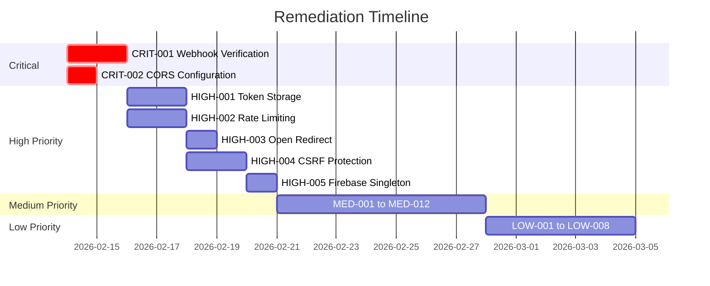

# CareFlow Next.js Application - Security & Architecture Audit Report

**Audit Date:** 2026-02-13
**Version:** 1.0.0
**Auditor:** Principal Software Architect & Lead Security Engineer
**Scope:** Static Analysis and Architectural Review of `app/` directory

---

## Table of Contents

1. [Executive Summary](#executive-summary)
2. [Critical Findings](#critical-findings)
3. [High Severity Findings](#high-severity-findings)
4. [Medium Severity Findings](#medium-severity-findings)
5. [Low Severity Findings](#low-severity-findings)
6. [Dependency Health Analysis](#dependency-health-analysis)
7. [Remediation Roadmap](#remediation-roadmap)

---

## Executive Summary

This audit identified **27 findings** across security, performance, architecture, and maintainability domains. The application demonstrates solid foundational architecture with proper separation of concerns, but contains critical security vulnerabilities that require immediate attention.

### Summary by Severity

| Severity     | Count | Domain Breakdown                                                     |
| ------------ | ----- | -------------------------------------------------------------------- |
| **Critical** | 2     | Security (2)                                                         |
| **High**     | 5     | Security (4), Architecture (1)                                       |
| **Medium**   | 12    | Security (3), Performance (4), Architecture (3), Maintainability (2) |
| **Low**      | 8     | Maintainability (5), Performance (2), Architecture (1)               |

### Risk Assessment


---

## Critical Findings

### CRIT-001: Missing Twilio Webhook Signature Verification

**Target:** [`app/api/webhooks/twilio/voice/route.js`](app/api/webhooks/twilio/voice/route.js:7-67)
**Vulnerability:** CWE-347: Improper Verification of Cryptographic Signature
**Domain:** Security
**OWASP:** A01:2021 - Broken Access Control

#### Severity Rationale

All three Twilio webhook endpoints fail to verify the authenticity of incoming requests. While a verification utility exists at [`lib/webhookVerification.js`](lib/webhookVerification.js:1-129), it is **never invoked**. This allows attackers to spoof webhook requests, potentially:

- Injecting fraudulent call records
- Triggering unauthorized notifications
- Manipulating call status data
- Exploiting the voicemail recording system

#### Excerpt

```javascript
// app/api/webhooks/twilio/voice/route.js:7-20
export async function POST(request) {
  try {
    // Connect to database
    await connectDB();

    // Parse form data from Twilio webhook
    const formData = await request.formData();
    const from = formData.get('From');
    const to = formData.get('To');
    const callSid = formData.get('CallSid');
    const callStatus = formData.get('CallStatus');
    // NO SIGNATURE VERIFICATION!
```

#### Refactor

```javascript
// app/api/webhooks/twilio/voice/route.js
import { NextResponse } from 'next/server';
import { VoiceResponse } from 'twilio/lib/twiml/VoiceResponse';
import { connectDB } from '@/lib/db';
import User from '@/models/User';
import { sendIncomingCallNotification } from '@/lib/notifications';
import { verifyWebhookRequest } from '@/lib/webhookVerification';

export async function POST(request) {
  try {
    // CRITICAL: Verify webhook authenticity first
    const verification = await verifyWebhookRequest(request);

    if (!verification.valid) {
      console.error('Webhook verification failed:', verification.error);
      return NextResponse.json({ error: 'Invalid webhook signature' }, { status: 403 });
    }

    // Connect to database
    await connectDB();

    // Use verified form data
    const { formData } = verification;
    const from = formData.get('From');
    const to = formData.get('To');
    const callSid = formData.get('CallSid');
    const callStatus = formData.get('CallStatus');

    // ... rest of the handler
  } catch (error) {
    console.error('Voice webhook error:', error);
    return NextResponse.json({ error: 'Webhook processing failed' }, { status: 500 });
  }
}
```

**Apply same fix to:**

- [`app/api/webhooks/twilio/status/route.js`](app/api/webhooks/twilio/status/route.js:7-118)
- [`app/api/webhooks/twilio/voicemail/route.js`](app/api/webhooks/twilio/voicemail/route.js:7-91)

---

### CRIT-002: CORS Wildcard Configuration in Production

**Target:** [`next.config.js`](next.config.js:4-16)
**Vulnerability:** CWE-942: Permissive Cross-domain Policy
**Domain:** Security
**OWASP:** A05:2021 - Security Misconfiguration

#### Severity Rationale

The CORS configuration allows any origin (`*`) to access API routes. This enables:

- Cross-origin data exfiltration
- CSRF attacks from malicious websites
- Credential theft when combined with `Access-Control-Allow-Credentials: true`

The combination of `Allow-Credentials: true` with `Allow-Origin: *` is explicitly forbidden by the CORS specification and will cause browser errors, but indicates a fundamental misunderstanding of CORS security.

#### Excerpt

```javascript
// next.config.js:4-16
async headers() {
  return [
    {
      source: '/api/:path*',
      headers: [
        { key: 'Access-Control-Allow-Credentials', value: 'true' },
        { key: 'Access-Control-Allow-Origin', value: '*' }, // DANGEROUS!
        { key: 'Access-Control-Allow-Methods', value: 'GET,POST,OPTIONS' },
        { key: 'Access-Control-Allow-Headers', value: 'Content-Type' },
      ],
    },
  ];
},
```

#### Refactor

```javascript
// next.config.js
const ALLOWED_ORIGINS = [
  process.env.NEXT_PUBLIC_APP_URL,
  process.env.NEXT_PUBLIC_VERCEL_URL
    ? `https://${process.env.NEXT_PUBLIC_VERCEL_URL}`
    : null,
  'http://localhost:3000', // Development only
].filter(Boolean);

async headers() {
  return [
    {
      source: '/api/:path*',
      headers: [
        { key: 'Access-Control-Allow-Credentials', value: 'true' },
        {
          key: 'Access-Control-Allow-Origin',
          value: ALLOWED_ORIGINS.join(',')
        },
        {
          key: 'Access-Control-Allow-Methods',
          value: 'GET,POST,PUT,DELETE,OPTIONS'
        },
        {
          key: 'Access-Control-Allow-Headers',
          value: 'Content-Type, Authorization, X-Requested-With'
        },
        { key: 'Access-Control-Max-Age', value: '86400' },
      ],
    },
  ];
},
```

---

## High Severity Findings

### HIGH-001: Authentication Token Stored in localStorage (XSS Vulnerable)

**Target:** [`context/AuthContext.js`](context/AuthContext.js:55-58)
**Vulnerability:** CWE-922: Insecure Storage of Sensitive Information
**Domain:** Security
**OWASP:** A07:2021 - Identification and Authentication Failures

#### Severity Rationale

Storing authentication tokens in localStorage exposes them to XSS attacks. Any successful XSS vulnerability can read and exfiltrate tokens, leading to session hijacking.

#### Excerpt

```javascript
// context/AuthContext.js:55-58
// Store token in localStorage for persistence
if (typeof window !== 'undefined') {
  localStorage.setItem('careflow_token', idToken);
}
```

#### Refactor

```javascript
// context/AuthContext.js
// Use httpOnly cookies for token storage - requires server-side implementation

// Option 1: Use Firebase's built-in session management
// Firebase already handles token persistence via browserLocalPersistence

// Option 2: Create an API endpoint to set httpOnly cookies
// In app/api/auth/session/route.js:
export async function POST(request) {
  const { idToken } = await request.json();

  // Verify the token first
  const decodedToken = await adminAuth.verifyIdToken(idToken);

  // Set httpOnly cookie
  const response = NextResponse.json({ success: true });
  response.cookies.set('session', idToken, {
    httpOnly: true,
    secure: process.env.NODE_ENV === 'production',
    sameSite: 'strict',
    maxAge: 60 * 60 * 24 * 5, // 5 days
    path: '/',
  });

  return response;
}

// Remove localStorage usage from AuthContext
// The token is automatically managed by Firebase SDK
```

---

### HIGH-002: Missing Rate Limiting on Authentication Endpoints

**Target:** [`app/api/auth/login/route.js`](app/api/auth/login/route.js:7-65)
**Vulnerability:** CWE-770: Allocation of Resources Without Limits
**Domain:** Security
**OWASP:** A07:2021 - Identification and Authentication Failures

#### Severity Rationale

Authentication endpoints lack rate limiting, making them vulnerable to:

- Brute force password attacks
- Credential stuffing
- Account enumeration attacks

#### Excerpt

```javascript
// app/api/auth/login/route.js:7-23
export async function POST(request) {
  try {
    await connectDB();
    const body = await request.json();
    const { email, password } = body;
    // No rate limiting!
```

#### Refactor

```javascript
// lib/rateLimiter.js - Create a new rate limiting utility
import { NextResponse } from 'next/server';

const rateLimitStore = new Map();

export function rateLimit(options = {}) {
  const {
    windowMs = 60 * 1000, // 1 minute
    maxRequests = 5,
    keyGenerator = (req) => req.headers.get('x-forwarded-for') || 'unknown',
  } = options;

  return async (request) => {
    const key = keyGenerator(request);
    const now = Date.now();
    const windowStart = now - windowMs;

    const requests = rateLimitStore.get(key) || [];
    const recentRequests = requests.filter((time) => time > windowStart);

    if (recentRequests.length >= maxRequests) {
      return NextResponse.json(
        { error: 'Too many requests, please try again later' },
        { status: 429, headers: { 'Retry-After': String(windowMs / 1000) } }
      );
    }

    recentRequests.push(now);
    rateLimitStore.set(key, recentRequests);

    return null; // No error, continue
  };
}

// app/api/auth/login/route.js
import { rateLimit } from '@/lib/rateLimiter';

const loginLimiter = rateLimit({
  windowMs: 15 * 60 * 1000, // 15 minutes
  maxRequests: 5,
});

export async function POST(request) {
  // Apply rate limiting
  const rateLimitError = await loginLimiter(request);
  if (rateLimitError) return rateLimitError;

  try {
    await connectDB();
    // ... rest of handler
  }
}
```

---

### HIGH-003: Open Redirect Vulnerability in Login Flow

**Target:** [`app/login/page.js`](app/login/page.js:24-31)
**Vulnerability:** CWE-601: URL Redirection to Untrusted Site
**Domain:** Security
**OWASP:** A01:2021 - Broken Access Control

#### Severity Rationale

The login page reads a redirect path from localStorage without validation, allowing attackers to redirect users to malicious sites after login.

#### Excerpt

```javascript
// app/login/page.js:24-31
if (result.success) {
  // Check if there's a redirect path stored
  const redirectPath = localStorage.getItem('redirectAfterLogin');
  if (redirectPath) {
    localStorage.removeItem('redirectAfterLogin');
    router.push(redirectPath); // No validation!
  } else {
    router.push('/dashboard');
  }
}
```

#### Refactor

```javascript
// app/login/page.js
const ALLOWED_REDIRECT_PATHS = ['/dashboard', '/settings', '/profile'];

function isValidRedirect(path) {
  if (!path) return false;
  // Must be a relative path starting with /
  if (!path.startsWith('/')) return false;
  // Must not contain protocol or double slashes
  if (path.includes('://') || path.startsWith('//')) return false;
  // Check against allowlist
  return ALLOWED_REDIRECT_PATHS.some((allowed) => path.startsWith(allowed));
}

// In handleSubmit:
if (result.success) {
  const redirectPath = localStorage.getItem('redirectAfterLogin');
  localStorage.removeItem('redirectAfterLogin');

  if (redirectPath && isValidRedirect(redirectPath)) {
    router.push(redirectPath);
  } else {
    router.push('/dashboard');
  }
}
```

---

### HIGH-004: Missing CSRF Protection for State-Changing Operations

**Target:** All API routes in [`app/api/`](app/api/)
**Vulnerability:** CWE-352: Cross-Site Request Forgery
**Domain:** Security
**OWASP:** A01:2021 - Broken Access Control

#### Severity Rationale

While the API uses Bearer token authentication, there's no CSRF token validation for cookie-based sessions or state-changing operations. Combined with the CORS misconfiguration, this enables CSRF attacks.

#### Excerpt

```javascript
// app/api/recordings/upload/route.js:15-21
export async function POST(request) {
  try {
    const auth = await requireAuth(request);
    if (auth.error) {
      return errorResponse('Unauthorized', { status: 401 });
    }
    // No CSRF token validation
```

#### Refactor

```javascript
// lib/csrf.js - Create CSRF protection utility
import { randomBytes } from 'crypto';

const csrfTokens = new Map();

export function generateCsrfToken(sessionId) {
  const token = randomBytes(32).toString('hex');
  csrfTokens.set(token, { sessionId, expires: Date.now() + 3600000 });
  return token;
}

export function validateCsrfToken(token, sessionId) {
  const stored = csrfTokens.get(token);
  if (!stored) return false;
  if (stored.expires < Date.now()) {
    csrfTokens.delete(token);
    return false;
  }
  if (stored.sessionId !== sessionId) return false;
  csrfTokens.delete(token);
  return true;
}

// For Next.js, consider using next-safe-action for Server Actions
// which provides built-in CSRF protection
```

---

### HIGH-005: Singleton Pattern Instability in Firebase Initialization

**Target:** [`lib/firebase.js`](lib/firebase.js:18-68)
**Violation:** Race condition in async initialization
**Domain:** Architecture

#### Severity Rationale

The Firebase initialization uses async functions but exports values synchronously before initialization completes. This causes race conditions where `auth`, `storage`, and `messaging` may be `undefined` when accessed.

#### Excerpt

```javascript
// lib/firebase.js:18-68
let app;
let authInstance;
let storageInstance;
let messagingInstance;

async function initializeFirebaseServices() {
  app = initializeApp(firebaseConfig);
  authInstance = getAuth(app);
  // ...
}

// Start initialization immediately
initializeFirebaseServices().catch(console.error);

// Export the services (will be populated after initialization)
export const auth = authInstance; // May be undefined!
export const storage = storageInstance;
export const messaging = messagingInstance;
```

#### Refactor

```javascript
// lib/firebase.js
import { initializeApp, getApps } from 'firebase/app';
import { getAuth } from 'firebase/auth';
import { getStorage } from 'firebase/storage';
import { getMessaging, isSupported } from 'firebase/messaging';

const firebaseConfig = {
  apiKey: process.env.NEXT_PUBLIC_FIREBASE_API_KEY,
  authDomain: process.env.NEXT_PUBLIC_FIREBASE_AUTH_DOMAIN,
  projectId: process.env.NEXT_PUBLIC_FIREBASE_PROJECT_ID,
  storageBucket: process.env.NEXT_PUBLIC_FIREBASE_STORAGE_BUCKET,
  messagingSenderId: process.env.NEXT_PUBLIC_FIREBASE_MESSAGING_SENDER_ID,
  appId: process.env.NEXT_PUBLIC_FIREBASE_APP_ID,
  databaseURL: process.env.NEXT_PUBLIC_FIREBASE_DATABASE_URL,
};

// Singleton pattern with lazy initialization
let app = null;
let auth = null;
let storage = null;
let messaging = null;
let initializationPromise = null;

function initializeFirebase() {
  if (initializationPromise) return initializationPromise;

  initializationPromise = (async () => {
    if (!getApps().length) {
      app = initializeApp(firebaseConfig);
    } else {
      app = getApps()[0];
    }

    auth = getAuth(app);
    storage = getStorage(app);

    const messagingSupported = await isSupported().catch(() => false);
    if (messagingSupported) {
      messaging = getMessaging(app);
    }

    return { app, auth, storage, messaging };
  })();

  return initializationPromise;
}

// Initialize on module load
initializeFirebase();

// Export getters that ensure initialization
export const getFirebaseApp = () => app;
export const getFirebaseAuth = () => auth;
export const getFirebaseStorage = () => storage;
export const getFirebaseMessaging = () => messaging;

// For backward compatibility, also export with warning
export { app, auth, storage, messaging };
```

---

## Medium Severity Findings

### MED-001: Missing useEffect Dependency in AuthContext

**Target:** [`context/AuthContext.js`](context/AuthContext.js:28-99)
**Violation:** react-hooks/exhaustive-deps
**Domain:** Performance

#### Severity Rationale

The `useEffect` hook has incomplete dependencies, which can cause stale closures and unexpected behavior. The `logout` function is used inside the effect but not included in dependencies.

#### Excerpt

```javascript
// context/AuthContext.js:28-99
useEffect(() => {
  // ...
  const unsubscribe = onAuthStateChanged(auth, async (user) => {
    // ...
    const tokenRefresh = setInterval(
      async () => {
        try {
          // ...
        } catch (err) {
          console.error('Token refresh failed:', err);
          await logout(); // logout not in dependencies!
        }
      },
      50 * 60 * 1000
    );
    // ...
  });

  return function () {
    if (unsubscribe && typeof unsubscribe === 'function') {
      unsubscribe();
    }
  };
}, []); // Missing dependencies
```

#### Refactor

```javascript
// context/AuthContext.js
import { useCallback, useEffect, useState, useRef } from 'react';

// Define logout outside the effect or use useCallback
const useLogout = (setCurrentUser, setToken, auth) => {
  return useCallback(async () => {
    try {
      await signOut(auth);
      setCurrentUser(null);
      setToken(null);
      if (typeof window !== 'undefined') {
        localStorage.removeItem('careflow_token');
      }
    } catch (error) {
      console.error('Logout error:', error);
    }
  }, [setCurrentUser, setToken, auth]);
};

// In AuthProvider:
const logoutFn = useLogout(setCurrentUser, setToken, auth);

useEffect(() => {
  // ... effect body using logoutFn
}, [logoutFn]); // Include logoutFn in dependencies
```

---

### MED-002: Potential Memory Leak in useCallManager Hook

**Target:** [`hooks/useCallManager.js`](hooks/useCallManager.js:56-58)
**Violation:** Missing cleanup for setTimeout
**Domain:** Performance

#### Severity Rationale

The `setTimeout` for auto-closing notifications is not cleaned up if the component unmounts before the timeout fires, potentially causing state updates on unmounted components.

#### Excerpt

```javascript
// hooks/useCallManager.js:56-58
// Auto-close after 5 seconds
setTimeout(() => {
  notification.close();
}, 5000);
```

#### Refactor

```javascript
// hooks/useCallManager.js
// Store timeout IDs for cleanup
const notificationTimeouts = useRef([]);

const showInitializationNotification = useCallback((mode) => {
  if (typeof window === 'undefined') return;
  if (!('Notification' in window)) return;

  if (Notification.permission === 'granted') {
    const notification = new Notification('CareFlow - Call System Ready', {
      // ... options
    });

    const timeoutId = setTimeout(() => {
      notification.close();
    }, 5000);

    notificationTimeouts.current.push(timeoutId);
  }
}, []);

// Add cleanup in useEffect
useEffect(() => {
  return () => {
    // Clean up all notification timeouts
    notificationTimeouts.current.forEach(clearTimeout);
    notificationTimeouts.current = [];
  };
}, []);
```

---

### MED-003: Missing Input Validation on Recording Upload

**Target:** [`app/api/recordings/upload/route.js`](app/api/recordings/upload/route.js:35-61)
**Vulnerability:** CWE-20: Improper Input Validation
**Domain:** Security

#### Severity Rationale

The upload endpoint lacks comprehensive validation of file size, content type, and duration values, potentially allowing:

- File upload DoS attacks
- Storage quota bypass
- Invalid data injection

#### Excerpt

```javascript
// app/api/recordings/upload/route.js:35-61
const formData = await request.formData();
const recording = formData.get('recording');
const callId = formData.get('callId');
const duration = parseInt(formData.get('duration') || '0');
// No file size validation, no content-type validation
```

#### Refactor

```javascript
// app/api/recordings/upload/route.js
const MAX_FILE_SIZE = 100 * 1024 * 1024; // 100MB
const ALLOWED_CONTENT_TYPES = ['audio/webm', 'audio/wav', 'audio/mp3', 'audio/ogg'];
const MAX_DURATION = 3600; // 1 hour

export async function POST(request) {
  try {
    const auth = await requireAuth(request);
    if (auth.error) return errorResponse('Unauthorized', { status: 401 });

    await connectDB();

    const formData = await request.formData();
    const recording = formData.get('recording');
    const callId = formData.get('callId');
    const duration = parseInt(formData.get('duration') || '0');

    // Validate file
    if (!recording || !(recording instanceof File)) {
      return errorResponse('Recording file is required', { status: 400 });
    }

    if (recording.size > MAX_FILE_SIZE) {
      return errorResponse('File size exceeds maximum allowed (100MB)', { status: 400 });
    }

    if (!ALLOWED_CONTENT_TYPES.includes(recording.type)) {
      return errorResponse('Invalid file type. Allowed: webm, wav, mp3, ogg', { status: 400 });
    }

    if (duration <= 0 || duration > MAX_DURATION) {
      return errorResponse('Duration must be between 1 and 3600 seconds', { status: 400 });
    }

    // Validate callId format
    if (!callId || !/^[a-zA-Z0-9-]+$/.test(callId)) {
      return errorResponse('Invalid call ID format', { status: 400 });
    }

    // ... rest of handler
  }
}
```

---

### MED-004: Duplicate Code in Call Status Derivation

**Target:** Multiple files
**Violation:** DRY Principle
**Domain:** Maintainability

#### Severity Rationale

The logic for deriving `callStatus` from recording data is duplicated across multiple files, making maintenance error-prone.

#### Excerpt

```javascript
// app/api/calls/history/route.js:39-49
callStatus:
  recording.duration > 0
    ? 'completed'
    : recording.status === 'no-answer'
      ? 'missed'
      : recording.status === 'failed'
        ? 'failed'
        : 'missed',

// app/api/recordings/route.js:84-91
callStatus:
  r.duration > 0
    ? 'completed'
    : r.status === 'no-answer'
      ? 'missed'
      : r.status === 'failed'
        ? 'failed'
        : 'missed',
```

#### Refactor

```javascript
// lib/utils/recordingUtils.js
/**
 * Derive call status from recording data
 * @param {Object} recording - Recording document
 * @returns {string} Call status for frontend display
 */
export function deriveCallStatus(recording) {
  if (recording.duration > 0) {
    return 'completed';
  }

  switch (recording.status) {
    case 'no-answer':
      return 'missed';
    case 'failed':
      return 'failed';
    default:
      return 'missed';
  }
}

// Usage in routes:
import { deriveCallStatus } from '@/lib/utils/recordingUtils';

const callsWithStatus = recordings.map((recording) => ({
  ...recording,
  callStatus: deriveCallStatus(recording),
}));
```

---

### MED-005: Missing Error Boundary in Dashboard Layout

**Target:** [`app/dashboard/page.js`](app/dashboard/page.js:187-205)
**Violation:** React Best Practices
**Domain:** Architecture

#### Severity Rationale

While an ErrorBoundary wraps the DashboardContent, errors in the provider initialization could crash the entire application without graceful degradation.

#### Excerpt

```javascript
// app/dashboard/page.js:187-205
export default function DashboardPage() {
  return (
    <AuthProvider>
      <CallStateProvider>
        <ErrorBoundary
          fallback={(error, retry) => (
            <div className="error-page">
              <ErrorDisplay error={error} onRetry={retry} />
            </div>
          )}
        >
          <ProtectedRoute>
            <DashboardContent />
          </ProtectedRoute>
        </ErrorBoundary>
      </CallStateProvider>
    </AuthProvider>
  );
}
```

#### Refactor

```javascript
// app/dashboard/page.js
import { Suspense } from 'react';
import { CardSkeleton } from '@/components/common/Loading/LoadingComponents';

// Create individual error boundaries for each section
function DashboardProviders({ children }) {
  return (
    <ErrorBoundary fallback={<ProviderErrorFallback />}>
      <AuthProvider>
        <CallStateProvider>{children}</CallStateProvider>
      </AuthProvider>
    </ErrorBoundary>
  );
}

export default function DashboardPage() {
  return (
    <DashboardProviders>
      <ErrorBoundary
        fallback={(error, retry) => (
          <div className="error-page">
            <ErrorDisplay error={error} onRetry={retry} />
          </div>
        )}
      >
        <Suspense fallback={<DashboardSkeleton />}>
          <ProtectedRoute>
            <DashboardContent />
          </ProtectedRoute>
        </Suspense>
      </ErrorBoundary>
    </DashboardProviders>
  );
}

function DashboardSkeleton() {
  return (
    <div className="dashboard-layout p-4">
      <div className="grid grid-cols-1 lg:grid-cols-2 gap-8">
        <div className="space-y-6">
          <CardSkeleton />
          <CardSkeleton />
        </div>
        <CardSkeleton />
      </div>
    </div>
  );
}
```

---

### MED-006: Inconsistent Error Response Format

**Target:** [`lib/apiResponse.js`](lib/apiResponse.js:13-50)
**Violation:** API Design Consistency
**Domain:** Architecture

#### Severity Rationale

The error response format is inconsistent - some routes use `errorResponse()` while others return raw `NextResponse.json()`. This makes client-side error handling inconsistent.

#### Excerpt

```javascript
// app/api/webhooks/twilio/voice/route.js:65
return NextResponse.json({ error: 'Webhook processing failed' }, { status: 500 });

// vs.

// app/api/auth/login/route.js:60
return errorResponse(errorMessage, {
  status: statusCode,
  code: 'AUTH_LOGIN_FAILED',
});
```

#### Refactor

```javascript
// Ensure all API routes use the standardized response utilities
// lib/apiResponse.js - Add more specific error types

export const ErrorCodes = {
  // Authentication
  UNAUTHORIZED: 'UNAUTHORIZED',
  INVALID_TOKEN: 'INVALID_TOKEN',
  TOKEN_EXPIRED: 'TOKEN_EXPIRED',

  // Validation
  VALIDATION_ERROR: 'VALIDATION_ERROR',
  MISSING_FIELD: 'MISSING_FIELD',
  INVALID_FORMAT: 'INVALID_FORMAT',

  // Resources
  NOT_FOUND: 'NOT_FOUND',
  ALREADY_EXISTS: 'ALREADY_EXISTS',

  // Server
  INTERNAL_ERROR: 'INTERNAL_ERROR',
  SERVICE_UNAVAILABLE: 'SERVICE_UNAVAILABLE',
};

// Usage throughout codebase:
import { errorResponse, ErrorCodes } from '@/lib/apiResponse';

return errorResponse('Resource not found', {
  status: 404,
  code: ErrorCodes.NOT_FOUND,
});
```

---

### MED-007: Missing Request Size Limits

**Target:** [`app/api/recordings/upload/route.js`](app/api/recordings/upload/route.js:15-128)
**Vulnerability:** CWE-770: Allocation of Resources Without Limits
**Domain:** Security

#### Severity Rationale

No request body size limit is enforced at the API route level, potentially allowing DoS attacks through large payloads.

#### Excerpt

```javascript
// app/api/recordings/upload/route.js:15
export async function POST(request) {
  // No size limit check before parsing body
  const formData = await request.formData();
```

#### Refactor

```javascript
// next.config.js - Add body size limits
const nextConfig = {
  // ... existing config
  api: {
    bodyParser: {
      sizeLimit: '100mb',
    },
  },
};

// Or in the route itself:
export async function POST(request) {
  // Check content-length header
  const contentLength = request.headers.get('content-length');
  const MAX_SIZE = 100 * 1024 * 1024; // 100MB

  if (contentLength && parseInt(contentLength) > MAX_SIZE) {
    return errorResponse('Request body too large', {
      status: 413,
      code: 'PAYLOAD_TOO_LARGE',
    });
  }

  // ... rest of handler
}
```

---

### MED-008: Console.log Statements in Production Code

**Target:** Multiple files
**Violation:** Best Practices
**Domain:** Maintainability

#### Severity Rationale

Direct `console.log` statements throughout the codebase bypass the logger utility, potentially exposing sensitive information in production logs.

#### Excerpt

```javascript
// app/api/webhooks/twilio/status/route.js:23
console.log(`Call status update: ${callSid} - ${callStatus}`);

// app/api/webhooks/twilio/voicemail/route.js:23
console.log(`Voicemail received: ${callSid} from ${from}`);
```

#### Refactor

```javascript
// Replace all console.log with logger utility
import { logger } from '@/lib/logger';

// Before:
console.log(`Call status update: ${callSid} - ${callStatus}`);

// After:
logger.info('StatusWebhook', `Call status update: ${callSid} - ${callStatus}`);
```

---

### MED-009: Missing Content Security Policy Headers

**Target:** [`next.config.js`](next.config.js:1-19)
**Vulnerability:** CWE-1021: Improper Restriction of Rendered UI Layers
**Domain:** Security

#### Severity Rationale

No Content Security Policy is configured, leaving the application vulnerable to XSS attacks and data injection.

#### Refactor

```javascript
// next.config.js
const ContentSecurityPolicy = `
  default-src 'self';
  script-src 'self' 'unsafe-eval' 'unsafe-inline' *.firebaseio.com;
  connect-src 'self' *.firebaseio.com wss://*.firebaseio.com https://api.twilio.com;
  img-src 'self' data: blob: https:;
  style-src 'self' 'unsafe-inline';
  font-src 'self';
  object-src 'none';
  base-uri 'self';
  form-action 'self';
  frame-ancestors 'none';
`;

async headers() {
  return [
    {
      source: '/:path*',
      headers: [
        {
          key: 'Content-Security-Policy',
          value: ContentSecurityPolicy.replace(/\n/g, ''),
        },
        { key: 'X-Frame-Options', value: 'DENY' },
        { key: 'X-Content-Type-Options', value: 'nosniff' },
        { key: 'Referrer-Policy', value: 'strict-origin-when-cross-origin' },
        { key: 'Permissions-Policy', value: 'camera=(), microphone=(self), geolocation=()' },
      ],
    },
    // ... API headers
  ];
}
```

---

### MED-010: Unused Imports Across Multiple Files

**Target:** Multiple files
**Violation:** ESLint no-unused-vars
**Domain:** Maintainability

#### Severity Rationale

Unused imports increase bundle size and can indicate dead code or incomplete refactoring.

#### Excerpt

```javascript
// hooks/useCallManager.js:14
import { useEffect, useCallback, useRef, useMemo, useState } from 'react';
// useMemo is imported but may not be used in all code paths

// app/api/recordings/route.js:11
import backblazeStorage from '@/lib/backblaze';
// Imported but never used in the file
```

#### Refactor

```javascript
// Remove unused imports
// hooks/useCallManager.js
import { useEffect, useCallback, useRef, useState } from 'react';
// Removed: useMemo (if not used)

// app/api/recordings/route.js
// Remove: import backblazeStorage from '@/lib/backblaze';
```

---

### MED-011: Missing Pagination Limits on Queries

**Target:** [`app/api/analytics/route.js`](app/api/analytics/route.js:68-74)
**Violation:** Performance Best Practices
**Domain:** Performance

#### Severity Rationale

The analytics endpoint fetches 10 recent calls without explicit pagination limits, which could grow unbounded.

#### Excerpt

```javascript
// app/api/analytics/route.js:68-74
const recentCalls = await Recording.find({
  firebaseUid,
  type: 'call',
})
  .sort({ recordedAt: -1 })
  .limit(10)
  .lean();
```

#### Refactor

```javascript
// Add configurable limits with validation
const MAX_RECENT_CALLS = 50;
const DEFAULT_RECENT_CALLS = 10;

const limit = Math.min(
  Math.max(1, parseInt(searchParams.get('limit') || DEFAULT_RECENT_CALLS)),
  MAX_RECENT_CALLS
);

const recentCalls = await Recording.find({
  firebaseUid,
  type: 'call',
})
  .sort({ recordedAt: -1 })
  .limit(limit)
  .lean();
```

---

### MED-012: Non-Memoized Derived State in DialerTab

**Target:** [`app/dashboard/tabs/DialerTab.jsx`](app/dashboard/tabs/DialerTab.jsx:84-88)
**Violation:** React Performance Best Practices
**Domain:** Performance

#### Severity Rationale

The `formatDuration` function is defined inside the component and recreated on every render.

#### Excerpt

```javascript
// app/dashboard/tabs/DialerTab.jsx:84-88
const formatDuration = (seconds) => {
  const mins = Math.floor(seconds / 60);
  const secs = seconds % 60;
  return `${mins.toString().padStart(2, '0')}:${secs.toString().padStart(2, '0')}`;
};
```

#### Refactor

```javascript
// app/dashboard/tabs/DialerTab.jsx
import { useMemo, useCallback } from 'react';

// Move outside component or use useMemo
const formatDuration = useCallback((seconds) => {
  const mins = Math.floor(seconds / 60);
  const secs = seconds % 60;
  return `${mins.toString().padStart(2, '0')}:${secs.toString().padStart(2, '0')}`;
}, []);

// Or better, import from shared utility
import { formatCallDuration } from '@/hooks/useCallState';
```

---

## Low Severity Findings

### LOW-001: Missing TypeScript Type Definitions

**Target:** Entire codebase
**Violation:** TypeScript Best Practices
**Domain:** Maintainability

#### Severity Rationale

The codebase uses JavaScript instead of TypeScript, missing out on compile-time type checking and IDE support.

#### Refactor

```bash
# Recommended: Migrate to TypeScript
npx create-next-app@latest --typescript

# Or add JSDoc type annotations for better IDE support
```

---

### LOW-002: Inconsistent File Naming Convention

**Target:** Multiple files
**Violation:** Airbnb Style Guide
**Domain:** Maintainability

#### Severity Rationale

Files use mixed naming conventions: some use PascalCase (`.jsx`), others use camelCase (`.js`).

#### Excerpt

```
components/common/ErrorBoundary/ErrorBoundary.jsx
components/ProtectedRoute/ProtectedRoute.js
```

#### Refactor

```
# Standardize on one convention
components/common/ErrorBoundary/ErrorBoundary.jsx
components/ProtectedRoute/ProtectedRoute.jsx
```

---

### LOW-003: Missing JSDoc Comments on Public Functions

**Target:** Multiple files
**Violation:** Documentation Best Practices
**Domain:** Maintainability

#### Refactor

```javascript
// Add JSDoc comments to all exported functions
/**
 * Verify Firebase ID token and return user info
 * @param {Request} request - Next.js Request object with Authorization header
 * @returns {Promise<{uid: string, email: string, displayName: string, photoURL: string, success: boolean} | {error: string, status: number}>}
 * @throws {Error} If Firebase Admin is not configured
 */
export async function verifyAuthToken(request) {
  // ...
}
```

---

### LOW-004: Hardcoded External Image URL

**Target:** [`app/login/page.js`](app/login/page.js:62-66)
**Violation:** Best Practices
**Domain:** Maintainability

#### Severity Rationale

External image URL is hardcoded, making it difficult to change and potentially causing issues if the external resource becomes unavailable.

#### Excerpt

```javascript
// app/login/page.js:62-66

```

#### Refactor

```javascript
// Use Next.js Image component with configured domains
// next.config.js
images: {
  remotePatterns: [
    {
      protocol: 'https',
      hostname: 'images.unsplash.com',
    },
  ],
},

// app/login/page.js
import Image from 'next/image';

<Image
  src="https://images.unsplash.com/photo-1506905925346-21bda4d32df4?w=1920&q=80"
  alt="Beautiful mountain landscape"
  fill
  className="object-cover"
  priority
/>
```

---

### LOW-005: Missing Error Handling in Async Event Handlers

**Target:** [`hooks/useCallManager.js`](hooks/useCallManager.js:70-72)
**Violation:** Promise Error Handling
**Domain:** Maintainability

#### Severity Rationale

Promise returned from `Notification.requestPermission()` has no error handling.

#### Excerpt

```javascript
// hooks/useCallManager.js:70-72
Notification.requestPermission().then((permission) => {
  logger.debug('useCallManager', `Notification permission result: ${permission}`);
});
```

#### Refactor

```javascript
Notification.requestPermission()
  .then((permission) => {
    logger.debug('useCallManager', `Notification permission result: ${permission}`);
  })
  .catch((error) => {
    logger.error('useCallManager', `Failed to request notification permission: ${error.message}`);
  });
```

---

### LOW-006: Duplicate Utility Functions

**Target:** [`components/dashboard/DialPad.js`](components/dashboard/DialPad.js:20-31)
**Violation:** DRY Principle
**Domain:** Maintainability

#### Severity Rationale

`formatPhoneNumber` and `formatDuration` are identical functions with different names.

#### Excerpt

```javascript
// components/dashboard/DialPad.js:20-31
export const formatPhoneNumber = (seconds) => {
  const mins = Math.floor(seconds / 60);
  const secs = seconds % 60;
  return `${mins.toString().padStart(2, '0')}:${secs.toString().padStart(2, '0')}`;
};

export const formatDuration = (seconds) => {
  const mins = Math.floor(seconds / 60);
  const secs = seconds % 60;
  return `${mins.toString().padStart(2, '0')}:${secs.toString().padStart(2, '0')}`;
};
```

#### Refactor

```javascript
// components/dashboard/DialPad.js
// Remove formatPhoneNumber (misnamed) and keep only formatDuration
// Or better, import from shared utility
import { formatCallDuration } from '@/hooks/useCallState';

export const formatDuration = formatCallDuration;
```

---

### LOW-007: Missing Accessibility Labels on Interactive Elements

**Target:** [`app/dashboard/tabs/DialerTab.jsx`](app/dashboard/tabs/DialerTab.jsx:147-250)
**Violation:** WCAG 2.1
**Domain:** Maintainability

#### Severity Rationale

Some interactive elements lack proper ARIA labels for screen readers.

#### Refactor

```javascript
// Add aria-labels to all interactive elements
<div className="stat-item" role="region" aria-label={`Total calls: ${analytics.totalCalls || 0}`}>
  <p className="stat-label" id="total-calls-label">
    Total Calls
  </p>
  <p className="stat-value" aria-labelledby="total-calls-label">
    {analytics.totalCalls || 0}
  </p>
</div>
```

---

### LOW-008: Inline Styles in JSX

**Target:** [`app/dashboard/tabs/DialerTab.jsx`](app/dashboard/tabs/DialerTab.jsx:117-121)
**Violation:** Separation of Concerns
**Domain:** Architecture

#### Severity Rationale

Inline styles and `<style jsx>` tags make styling harder to maintain and can cause hydration issues.

#### Excerpt

```javascript
// app/dashboard/tabs/DialerTab.jsx:117-121
<style jsx>{`
  .dialer-tab {
    padding: 1rem;
  }
`}</style>
```

#### Refactor

```javascript
// Move styles to CSS modules or Tailwind classes
// app/dashboard/tabs/DialerTab.module.css
.dialerTab {
  padding: 1rem;
}

// Or use Tailwind directly
<div className="p-4">
```

---

## Dependency Health Analysis

### Current Dependencies

| Package            | Version  | Status     | Notes                       |
| ------------------ | -------- | ---------- | --------------------------- |
| next               | ^14.2.21 | ✅ Current | Latest: 14.2.x              |
| react              | ^18.3.1  | ✅ Current | Latest: 18.3.x              |
| mongoose           | ^8.9.5   | ✅ Current | Latest: 8.x                 |
| firebase           | ^11.2.0  | ✅ Current | Latest: 11.x                |
| firebase-admin     | ^13.0.2  | ✅ Current | Latest: 13.x                |
| twilio             | ^5.4.0   | ⚠️ Update  | Latest: 5.x (minor updates) |
| @twilio/voice-sdk  | ^2.12.1  | ✅ Current | Latest: 2.x                 |
| @aws-sdk/client-s3 | ^3.700.0 | ✅ Current | Latest: 3.x                 |

### Known CVEs

No critical CVEs found in current dependency versions. Recommend running `npm audit` regularly.

### Recommendations

1. **Add dependency vulnerability scanning** to CI/CD pipeline
2. **Pin exact versions** instead of using `^` for production deployments
3. **Consider adding** `npm-check-updates` for automated update checking

---

## Remediation Roadmap

### Phase 1: Critical Security Fixes (Immediate - Week 1)



### Priority Checklist

#### Critical (Complete Immediately)

- [ ] **CRIT-001:** Implement Twilio webhook signature verification on all webhook endpoints
- [ ] **CRIT-002:** Replace CORS wildcard with allowlist-based configuration

#### High Priority (Complete Within 1 Week)

- [ ] **HIGH-001:** Migrate token storage from localStorage to httpOnly cookies
- [ ] **HIGH-002:** Implement rate limiting on authentication endpoints
- [ ] **HIGH-003:** Add redirect path validation in login flow
- [ ] **HIGH-004:** Implement CSRF protection for state-changing operations
- [ ] **HIGH-005:** Fix Firebase initialization race condition

#### Medium Priority (Complete Within 2 Weeks)

- [ ] **MED-001:** Fix useEffect dependency warnings in AuthContext
- [ ] **MED-002:** Add cleanup for notification timeouts
- [ ] **MED-003:** Implement comprehensive input validation on uploads
- [ ] **MED-004:** Extract duplicate call status logic to shared utility
- [ ] **MED-005:** Add Suspense boundaries to dashboard
- [ ] **MED-006:** Standardize error response format across all routes
- [ ] **MED-007:** Add request size limits to upload endpoints
- [ ] **MED-008:** Replace console.log with logger utility
- [ ] **MED-009:** Implement Content Security Policy headers
- [ ] **MED-010:** Remove unused imports
- [ ] **MED-011:** Add pagination limits to analytics queries
- [ ] **MED-012:** Memoize derived state in DialerTab

#### Low Priority (Complete Within 1 Month)

- [ ] **LOW-001:** Evaluate TypeScript migration
- [ ] **LOW-002:** Standardize file naming conventions
- [ ] **LOW-003:** Add JSDoc comments to public functions
- [ ] **LOW-004:** Use Next.js Image component for external images
- [ ] **LOW-005:** Add error handling to async event handlers
- [ ] **LOW-006:** Remove duplicate utility functions
- [ ] **LOW-007:** Add accessibility labels to interactive elements
- [ ] **LOW-008:** Migrate inline styles to CSS modules

---

## Conclusion

The CareFlow application demonstrates solid architectural foundations with proper separation of concerns between hooks, components, and API routes. However, critical security vulnerabilities in webhook verification and CORS configuration require immediate attention before production deployment.

The codebase would benefit from:

1. **Security-first development practices** - Input validation, rate limiting, and proper authentication flows
2. **TypeScript migration** - For improved type safety and developer experience
3. **Comprehensive test coverage** - Unit and integration tests for security-critical paths
4. **Automated security scanning** - SAST/DAST tools in CI/CD pipeline

---

_Report generated: 2026-02-13_
_Auditor: Principal Software Architect & Lead Security Engineer_
