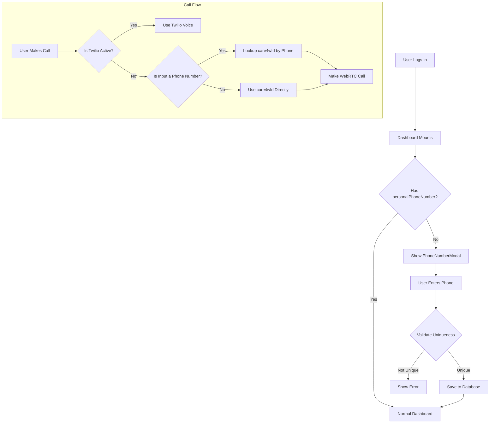
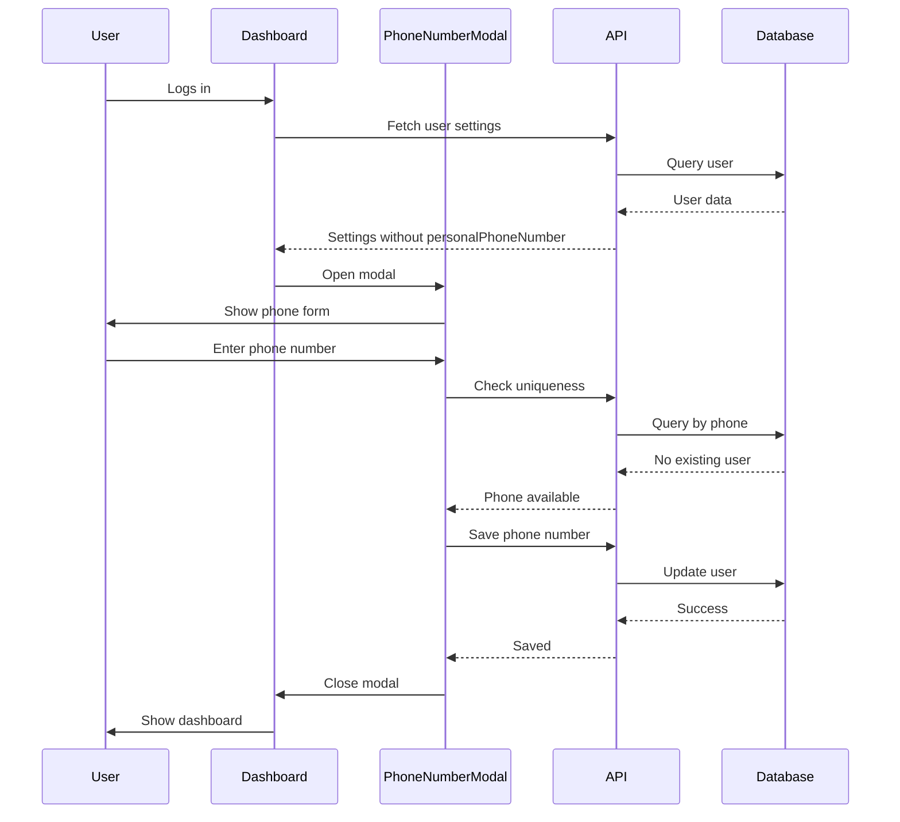
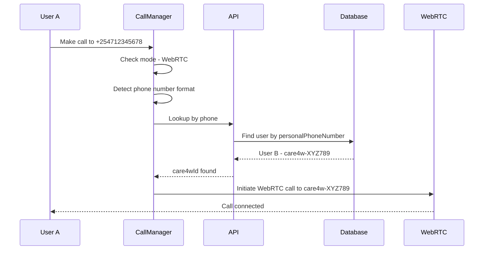

# Personal Phone Number Feature Implementation Plan

## Overview

This feature adds a personal phone number field to user profiles. When a user logs in and hasn't provided their personal phone number, a modal will automatically open prompting them to add it. The phone number serves as an identity/lookup mechanism that maps to the user's `care4wId` for WebRTC calls when Twilio is not active.

## Key Requirements

1. **Phone Number Storage**: Add `personalPhoneNumber` field to User model
2. **Uniqueness**: Phone number must be unique (excluding country code) across all users
3. **Auto-modal**: Open modal on dashboard mount if user hasn't provided phone number
4. **Call Flow Integration**: Use phone number to lookup `care4wId` for WebRTC calls

## Architecture



## Implementation Details

### 1. Database Schema Changes

**File**: [`models/User.js`](models/User.js)

Add a new field `personalPhoneNumber`:

```javascript
// Personal Phone Number for identity/lookup
personalPhoneNumber: {
  type: String,
  sparse: true, // Allow null/undefined for users who haven't set it
  trim: true,
  validate: {
    validator(v) {
      if (!v) return true; // Allow null/empty
      // E.164 format validation
      return /^\+?[1-9]\d{1,14}$/.test(v);
    },
    message: 'Invalid phone number format. Use E.164 format (e.g., +254712345678)',
  },
},
```

**Index**: Create a unique sparse index on the national number part (excluding country code). This requires a compound approach or a separate field for the national number.

**Alternative Approach**: Store both full number and national number:

```javascript
personalPhoneNumber: {
  full: { type: String, sparse: true },  // E.164 format: +254712345678
  national: { type: String, sparse: true, unique: true }, // Without country code: 712345678
},
```

### 2. API Endpoints

#### 2.1 Check Phone Uniqueness

**File**: `app/api/users/phone/check/route.js` (new file)

```http
POST /api/users/phone/check
Authorization: Bearer <token>
Content-Type: application/json

{
  "phoneNumber": "+254712345678"
}

Response 200:
{
  "success": true,
  "data": {
    "available": true,
    "message": "Phone number is available"
  }
}
```

#### 2.2 Update User Phone Number

**File**: `app/api/users/phone/route.js` (new file)

```http
PATCH /api/users/phone
Authorization: Bearer <token>
Content-Type: application/json

{
  "phoneNumber": "+254712345678"
}

Response 200:
{
  "success": true,
  "data": {
    "personalPhoneNumber": "+254712345678",
    "message": "Phone number updated successfully"
  }
}
```

#### 2.3 Lookup User by Phone Number

**File**: `app/api/users/lookup/phone/route.js` (new file)

```http
GET /api/users/lookup/phone?phoneNumber=%2B254712345678
Authorization: Bearer <token>

Response 200:
{
  "success": true,
  "data": {
    "exists": true,
    "care4wId": "care4w-ABC1234",
    "displayName": "John Doe"
  }
}
```

### 3. Frontend Components

#### 3.1 PhoneNumberModal Component

**File**: `components/settings/PhoneNumberModal.jsx` (new file)

Features:

- Modal dialog with phone number input
- Country code selector dropdown
- Real-time validation
- Uniqueness check on blur/debounce
- Loading states
- Error handling
- Skip for now option (optional)

```jsx
// Component structure
<PhoneNumberModal
  isOpen={showModal}
  onClose={handleClose}
  onSuccess={handleSuccess}
  token={authToken}
/>
```

#### 3.2 Dashboard Layout Integration

**File**: [`app/dashboard/layout.js`](app/dashboard/layout.js)

Add state and effect to check for phone number:

```jsx
// In DashboardContent component
const [showPhoneModal, setShowPhoneModal] = useState(false);
const [phoneCheckComplete, setPhoneCheckComplete] = useState(false);

useEffect(() => {
  // Check if user has personalPhoneNumber
  const checkPhoneNumber = async () => {
    if (token && isInitialized) {
      try {
        const response = await fetch('/api/users/settings', {
          headers: { Authorization: `Bearer ${token}` },
        });
        const data = await response.json();
        if (!data.settings?.personalPhoneNumber) {
          setShowPhoneModal(true);
        }
      } catch (error) {
        console.error('Failed to check phone number:', error);
      } finally {
        setPhoneCheckComplete(true);
      }
    }
  };
  checkPhoneNumber();
}, [token, isInitialized]);
```

### 4. Call Flow Integration

**File**: [`lib/callManager.js`](lib/callManager.js)

Modify the `makeCall` method to check if the input is a phone number and lookup the corresponding `care4wId`:

```javascript
async makeCall(destination) {
  // Check if destination looks like a phone number
  const isPhoneNumber = /^[\+]?[0-9]{8,15}$/.test(destination.replace(/[\s\-\(\)]/g, ''));

  if (isPhoneNumber && this.mode === 'webrtc') {
    // Lookup user by phone number
    const lookupResult = await this.lookupUserByPhone(destination);
    if (lookupResult.exists) {
      destination = lookupResult.care4wId;
    } else {
      throw new Error('No user found with this phone number');
    }
  }

  // Continue with existing call logic...
}

async lookupUserByPhone(phoneNumber) {
  const response = await fetch(`/api/users/lookup/phone?phoneNumber=${encodeURIComponent(phoneNumber)}`, {
    headers: { Authorization: `Bearer ${this.token}` }
  });
  return response.json();
}
```

### 5. Phone Number Validation

**File**: `lib/phoneUtils.js` (new file)

Utility functions for phone number handling:

```javascript
/**
 * Parse phone number to extract country code and national number
 */
export function parsePhoneNumber(phoneNumber) {
  // Implementation using libphonenumber-js or custom logic
}

/**
 * Format phone number to E.164
 */
export function formatToE164(phoneNumber, countryCode) {
  // Implementation
}

/**
 * Validate phone number format
 */
export function isValidPhoneNumber(phoneNumber) {
  // Implementation
}
```

## File Changes Summary

### New Files

1. `app/api/users/phone/check/route.js` - Check phone uniqueness
2. `app/api/users/phone/route.js` - Update user phone
3. `app/api/users/lookup/phone/route.js` - Lookup by phone
4. `components/settings/PhoneNumberModal.jsx` - Modal component
5. `components/settings/PhoneNumberModal.module.css` - Modal styles
6. `lib/phoneUtils.js` - Phone utility functions

### Modified Files

1. [`models/User.js`](models/User.js) - Add `personalPhoneNumber` field
2. [`app/dashboard/layout.js`](app/dashboard/layout.js) - Add modal trigger logic
3. [`lib/callManager.js`](lib/callManager.js) - Add phone lookup for WebRTC calls
4. [`app/api/users/settings/route.js`](app/api/users/settings/route.js) - Include `personalPhoneNumber` in settings response

## User Flow



## Call Flow with Phone Lookup



## Considerations

### Security

- Phone numbers should be validated on both client and server
- Rate limit phone uniqueness checks to prevent enumeration
- Sanitize phone number input to prevent injection

### UX

- Allow users to skip the phone number prompt (optional)
- Show clear error messages for duplicate phone numbers
- Provide country code selector for easier input
- Remember dismissal to avoid repeated prompts

### Data Migration

- Existing users will have `null` for `personalPhoneNumber`
- No migration needed due to sparse index

### Dependencies

- Consider using `libphonenumber-js` for robust phone parsing
- Or implement custom validation if keeping bundle size small

## Testing Checklist

- [ ] Phone number validation works correctly
- [ ] Uniqueness check prevents duplicates
- [ ] Modal opens on first login without phone
- [ ] Modal does not open if phone already set
- [ ] Phone number saves correctly to database
- [ ] Call flow looks up care4wId by phone
- [ ] Error handling for non-existent phone numbers
- [ ] Country code handling works correctly
