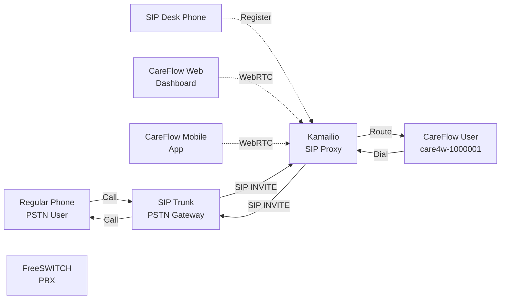
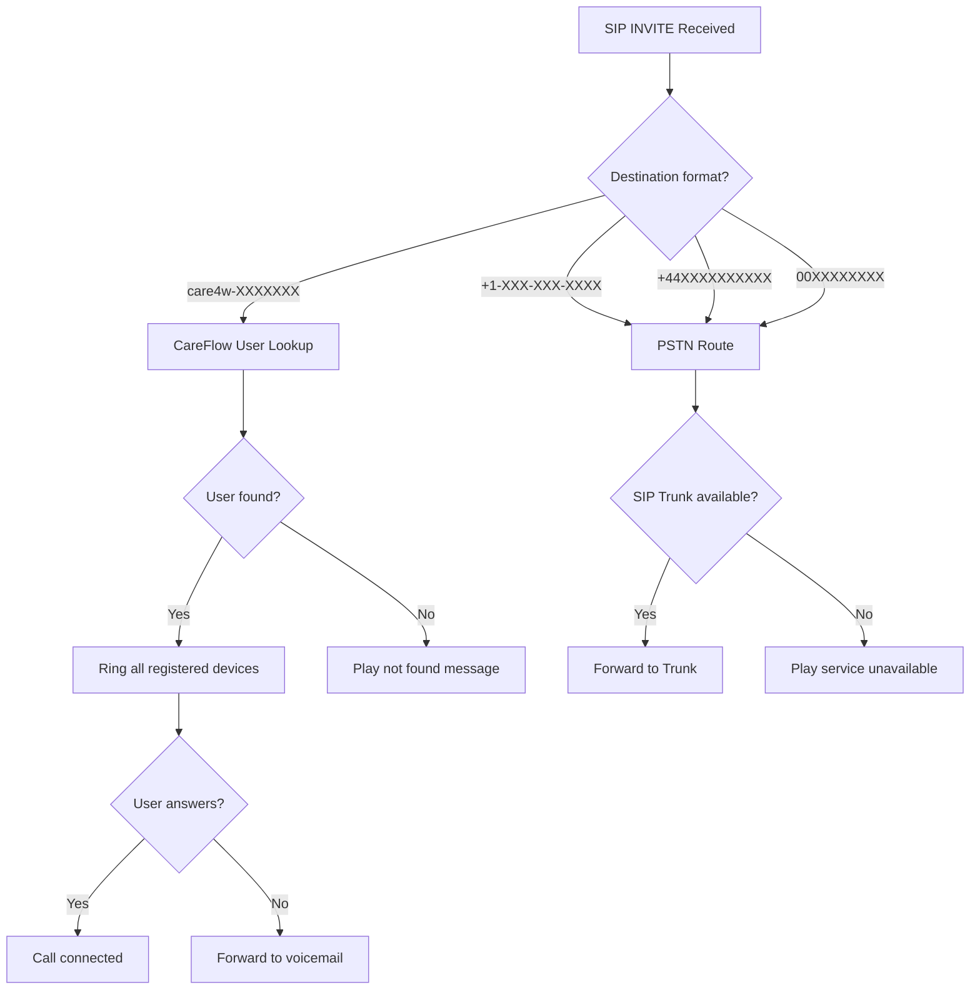

# PSTN Integration: Phone to CareFlow Calls

## Overview

Yes! A user with a regular phone can call a CareFlow user, and vice versa, through SIP trunking.

## Call Scenarios



## How It Works

### 1. Regular Phone → CareFlow User

```
Regular Phone: +1-555-123-4567
        ↓
Calls: +1-800-CAREFLOW (+1-800-227-3369)
        ↓
SIP Trunk Provider (Twilio/Vonage/VoIP.ms)
        ↓
SIP INVITE → Kamailio
        ↓
Kamailio looks up: care4w-1000001
        ↓
Routes call to user's registered devices:
  • SIP Desk Phone (if registered)
  • WebRTC browser client
  • Mobile app
        ↓
CareFlow User answers on their device
```

### 2. CareFlow User → Regular Phone

```
CareFlow User (care4w-1000001)
        ↓
Dials: +1-555-987-6543
        ↓
Kamailio recognizes PSTN format
        ↓
Forwards to SIP Trunk
        ↓
SIP Trunk routes to PSTN
        ↓
Regular Phone rings
```

## Call Routing Logic



## Implementation: SIP Trunk Setup

### Option 1: Twilio SIP Trunking

```
Twilio provides SIP trunk for outbound/inbound PSTN
- Inbound: DID numbers point to your Kamailio
- Outbound: Kamailio sends calls to Twilio SIP
```

**Configuration:**

```yaml
# Kamailio outbound route to Twilio
route[TO_PSTN] {
    if ($rU =~ "^\+?[1-9][0-9]{6,14}$") {
        # Outbound PSTN
        t_relay("sip:Twilio@your-trunk-id.pstn.twilio.com:5060");
        exit;
    }
}
```

### Option 2: VoIP.ms

```
Canadian provider, lower rates
- $0.01/minute outbound
- $0.50/month per DID
```

### Option 3: Telnyx

```
Enterprise-grade, global coverage
- Multiple redundancy
- Better call quality
```

## Phone Number Strategy

### CareFlow DID Numbers

```
Option A: Single Toll-Free Number
  - 1-800-CAREFLOW
  - All calls route to care4w-ID based on caller ID

Option B: Personal DID per User
  - Each user gets own phone number
  - Direct dial to their care4w-ID

Option C: Hybrid
  - Main number for general inquiries
  - Personal numbers for direct contact
```

### Number Format

```
CareFlow ID: care4w-1000001
Associated Phone: +1 (800) 227-3569

SIP URI: careflow_abc123@sip.careflow.io
Phone: +1-800-227-3569
```

## Dial Plan Configuration

```cfg
# Kamailio routing - kamailio.cfg

route[PSTN_ROUTING] {
    # International format: 00 + country + number
    if ($rU =~ "^00[1-9][0-9]{6,14}$") {
        strip(2);
        prefix("+");
    }

    # North American format: +1 + 10 digits
    if ($rU =~ "^\+1[2-9][0-9]{9}$") {
        # Keep as is
    }

    # UK format: +44 + 10 digits
    if ($rU =~ "^\+44[1-9][0-9]{9}$") {
        # Keep as is
    }

    # Forward to PSTN trunk
    t_relay("sip:trunk1.your-voip-provider.com:5060");
}

route[CAREFLOW_ROUTING] {
    # CareFlow ID format: care4w-XXXXXXX
    if ($rU =~ "^care4w-[0-9]{7}$") {
        # Lookup user in database
        if (!lookup("location")) {
            sl_send_reply("404", "User Not Found");
            exit;
        }
        t_relay();
        exit;
    }
}

route {
    if (is_method("INVITE")) {
        if ($rU =~ "^care4w-") {
            route(CAREFLOW_ROUTING);
        } else {
            route(PSTN_ROUTING);
        }
    }
}
```

## Number Management API

```javascript
// app/api/phone-numbers/route.js
export async function GET(request) {
  const { searchParams } = new URL(request.url);
  const userId = searchParams.get("userId");

  // Get user's assigned phone numbers
  return Response.json({
    numbers: [
      {
        number: "+1-800-227-3569",
        type: "tollfree",
        trunk: "twilio",
        incoming: true,
        outgoing: true,
      },
    ],
  });
}

// app/api/phone-numbers/purchase/route.js
export async function POST(request) {
  const { userId, type, areaCode } = await request.json();

  // Purchase new DID
  const provider = await purchaseDID(type, areaCode);

  // Associate with CareFlow user
  await associateNumber(userId, provider.number);

  return Response.json({ number: provider.number });
}
```

## Call Flow Examples

### Example 1: Mom Calls Daughter on CareFlow

```
Mom (Regular Phone): +1-555-123-4567
        ↓
Dials: 1-800-CAREFLOW
        ↓
SIP Trunk receives call
        ↓
Kamailio:
  - Checks caller ID: +1-555-123-4567
  - Looks up associated CareFlow user
  - Finds: daughter@care4w-1000001
        ↓
Rings daughter's:
  - Desk phone (if at work)
  - Browser (if online)
  - Mobile app (if available)
        ↓
Daughter answers on dashboard
```

### Example 2: CareFlow User Calls Pizza Place

```
CareFlow User (care4w-1000001)
        ↓
Dials: 1-555-999-8888 (Pizza Palace)
        ↓
Kamailio recognizes PSTN format
        ↓
Routes to SIP Trunk
        ↓
SIP Trunk to PSTN
        ↓
Pizza Palace phone rings
```

## Pricing Comparison

| Call Type           | Twilio (Current) | Self-Hosted SIP |
| ------------------- | ---------------- | --------------- |
| Inbound to CareFlow | $0.01/min        | $0.005/min      |
| Outbound to PSTN    | $0.015/min       | $0.01/min       |
| DID Number/month    | $1.00            | $0.50           |
| SIP Trunk           | Included         | $10/month       |

**Estimated Monthly Savings:**

- 10,000 minutes: ~$150 savings
- 100 users: ~$100 savings

## Required Components

1. **SIP Trunk Provider Account**
   - Twilio SIP Trunking
   - VoIP.ms
   - Telnyx

2. **DID Numbers**
   - Purchase for each user or shared lines
   - Configure in Kamailio

3. **CareFlow API Updates**
   - Phone number management
   - Caller ID lookup
   - Call routing logic

## Files to Modify/Create

```
app/api/
├── phone-numbers/
│   ├── route.js              # GET/POST phone numbers
│   └── purchase/route.js     # Purchase new DID
├── calls/
│   └── route.js              # Call history
└── sip/
    └── trunk/route.js        # Trunk configuration

lib/
├── pstnRouting.js            # PSTN routing logic
├── didManagement.js          # Number management
└── callerIdLookup.js        # Caller ID to CareFlow user

infrastructure/
├── kamailio/
│   └── pstn.cfg              # PSTN routing config
└── certificates/
    └── trunk.crt            # Trunk TLS cert
```
