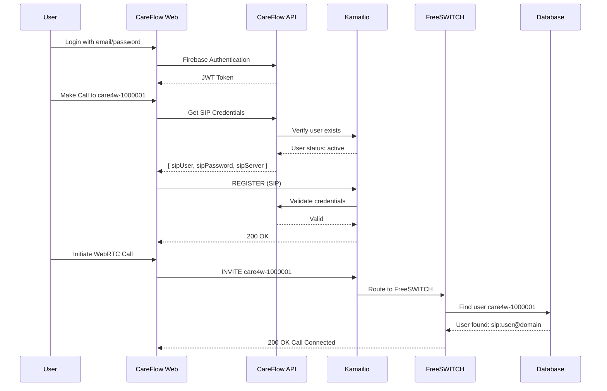
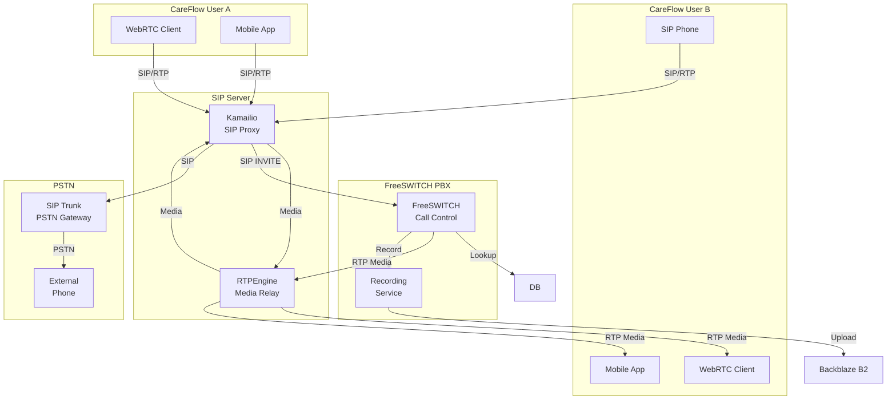

# How SIP Server Integrates with CareFlow

## User Authentication Flow



## Call Flow Diagram



## CareFlow Integration Points

### 1. User Registration

```
CareFlow User Register
        ↓
CareFlow API creates user
        ↓
┌──────────────────────────────────┐
│  SIP Server Integration          │
│  • Create subscriber in Kamailio│
│  • Create extension in FreeSWITCH│
│  • Generate SIP credentials      │
│  • Sync with CareFlow database │
└──────────────────────────────────┘
        ↓
User can make/receive calls
```

### 2. Making a Call

```
User enters: care4w-1000001
        ↓
CareFlow WebRTC Client
        ↓
┌──────────────────────────────────┐
│  SIP Server Flow                 │
│  1. Query Kamailio for user     │
│  2. Kamailio checks location     │
│  3. Route to endpoint           │
│  4. RTPEngine handles media     │
│  5. FreeSWITCH records call     │
└──────────────────────────────────┘
        ↓
Connected!
```

### 3. Receiving a Call

```
Incoming call to care4w-1000001
        ↓
┌──────────────────────────────────┐
│  Incoming Call Flow             │
│  1. SIP Trunk → Kamailio       │
│  2. Kamailio queries FreeSWITCH │
│  3. FS looks up care4w-1000001 │
│  4. Finds user's location      │
│  5. Rings all registered devices│
└──────────────────────────────────┘
        ↓
User answers on any device
```

## Data Flow

### CareFlow → SIP Server

| Data             | Direction             | Purpose        |
| ---------------- | --------------------- | -------------- |
| User credentials | CareFlow → Kamailio   | Sync user data |
| Call recordings  | FreeSWITCH → CareFlow | Store metadata |
| User presence    | Kamailio → CareFlow   | Online status  |

### SIP Server → CareFlow

| Data                      | Direction             | Purpose       |
| ------------------------- | --------------------- | ------------- |
| CDR (Call Detail Records) | SIP → CareFlow        | Analytics     |
| Registration events       | Kamailio → CareFlow   | Auth status   |
| Call events               | FreeSWITCH → CareFlow | Activity feed |

## SIP Credentials Flow

```
CareFlow User Login
        ↓
CareFlow generates unique SIP credentials:
  - sipUsername: "careflow_[userId]"
  - sipPassword: [random secure string]
  - sipDomain: "sip.careflow.io"
        ↓
Store in CareFlow DB
        ↓
Credentials sent to:
  - WebRTC client (for in-browser calls)
  - Mobile app (for SIP client)
  - User's SIP phone (if configured)
```

## WebRTC Integration

```
┌────────────────────────────────────────────────────────────┐
│                    WebRTC → SIP Gateway                  │
├────────────────────────────────────────────────────────────┤
│                                                            │
│   Browser (WebRTC)                                        │
│         ↓                                                 │
│   Kamailio (SIP over WebSocket)                          │
│         ↓                                                 │
│   RTPEngine (Media Relay)                                │
│         ↓                                                 │
│   FreeSWITCH (Call Control)                              │
│         ↓                                                 │
│   RTPEngine (Media to destination)                       │
│         ↓                                                 │
│   Destination (SIP phone/PSTN)                          │
│                                                            │
└────────────────────────────────────────────────────────────┘

Kamailio Configuration for WebRTC:
- listen=ws://0.0.0.0:5060
- tcp_use_certificate = "/etc/kamailio/cert.pem"
- loadmodule "websocket.so"
- loadmodule "rtpengine.so"
```

## Call Routing Logic

```
Incoming SIP Invite
        ↓
┌──────────────────────────────┐
│  Kamailio Route Logic       │
│                              │
│  if (destination matches     │
│     care4w-[0-9]{7}) then   │
│     → FreeSWITCH             │
│                              │
│  if (destination is local)   │
│     → Lookup in usrloc      │
│     → Ring device           │
│                              │
│  if (destination is external)│
│     → SIP Trunk              │
└──────────────────────────────┘
        ↓
Route to destination
```

## Call Recording Integration

```
Call Started
        ↓
FreeSWITCH records to WAV
        ↓
After call ends:
┌──────────────────────────────────┐
│  Recording Processing            │
│  • Convert to MP3/OGG          │
│  • Upload to Backblaze B2       │
│  • Create recording metadata    │
│  • Store in CareFlow DB         │
│  • Add to user's recordings     │
└──────────────────────────────────┘
        ↓
Recording available in CareFlow UI
```

## Scalability

```
                           ┌─────────────┐
                           │ Load        │
                           │ Balancer    │
                           └──────┬──────┘
                                  │
              ┌───────────────────┼───────────────────┐
              │                   │                   │
        ┌─────┴─────┐     ┌─────┴─────┐     ┌─────┴─────┐
        │ Kamailio  │     │ Kamailio  │     │ Kamailio  │
        │ Node 1    │     │ Node 2    │     │ Node N    │
        └─────┬─────┘     └─────┬─────┘     └─────┬─────┘
              │                 │                 │
              └─────────────────┼─────────────────┘
                                │
                        ┌───────┴───────┐
                        │ Redis         │
                        │ (shared reg)  │
                        └───────┬───────┘
                                │
        ┌───────────────────────┼───────────────────────┐
        │                       │                       │
  ┌─────┴─────┐         ┌─────┴─────┐         ┌─────┴─────┐
  │FreeSWITCH │         │FreeSWITCH │         │FreeSWITCH │
  │Cluster 1  │         │Cluster 2  │         │Cluster N  │
  └───────────┘         └───────────┘         └───────────┘
```

## Monitoring

```
┌────────────────────────────────────────────────────────┐
│              CareFlow SIP Monitoring                  │
├────────────────────────────────────────────────────────┤
│                                                        │
│  Kamailio Metrics:                                    │
│  - Active registrations                               │
│  - Calls per second                                  │
│  - SIP message rate                                  │
│  - Authentication failures                           │
│                                                        │
│  FreeSWITCH Metrics:                                 │
│  - Concurrent calls                                  │
│  - Call duration average                            │
│  - Recording storage used                           │
│  - API response times                                │
│                                                        │
│  Alerts:                                             │
│  - Server down                                       │
│  - High call latency                                 │
│  - Registration failures                            │
│  - Disk space warning                               │
│                                                        │
└────────────────────────────────────────────────────────┘
```

## Security

```
┌────────────────────────────────────────────────────────┐
│                 SIP Security Model                     │
├────────────────────────────────────────────────────────┤
│                                                        │
│  Authentication:                                       │
│  - SIP users authenticated via CareFlow API            │
│  - JWT tokens for REST API                            │
│  - Digest auth for SIP registration                    │
│                                                        │
│  Encryption:                                          │
│  - TLS for SIP signaling                             │
│  - SRTP for media                                    │
│  - DTLS for WebRTC                                    │
│                                                        │
│  Firewall:                                           │
│  - Only allow SIP from trusted IPs                   │
│  - Rate limiting: 100 calls/min/user                  │
│  - Max concurrent calls: 1000                         │
│                                                        │
│  Fail2ban:                                            │
│  - Block IPs after 5 failed auth attempts            │
│                                                        │
└────────────────────────────────────────────────────────┘
```
