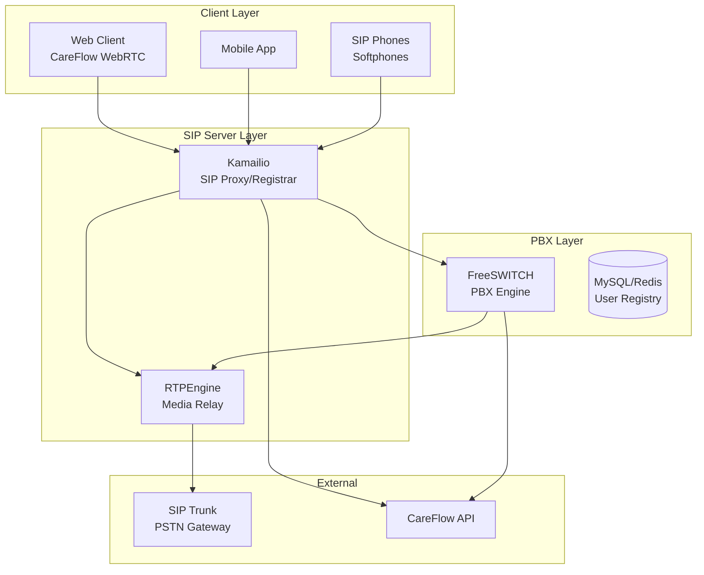

# SIP Server Implementation Plan

## Overview

Replace Twilio with a self-hosted SIP server for all call routing using open source tools.

## Architecture Diagram



## Recommended Stack

### Core Components

| Component      | Role                         | License  |
| -------------- | ---------------------------- | -------- |
| **Kamailio**   | SIP Proxy, Registrar, Router | GPL v2+  |
| **FreeSWITCH** | PBX, Call Control            | MPL v1.1 |
| **RTPEngine**  | Media Relay, NAT Traversal   | GPL v2+  |
| **MySQL**      | User/Location Database       | GPL v2   |
| **Redis**      | Caching, Real-time Config    | BSD      |

### Alternative Options

| Component    | Use Case               | Pros/Cons                |
| ------------ | ---------------------- | ------------------------ |
| Asterisk     | Simpler deployments    | Easier but less scalable |
| OpenSIPS     | High-performance proxy | Similar to Kamailio      |
| Janus WebRTC | WebRTC gateway         | Alternative to Kamailio  |

## Implementation Steps

### Phase 1: Infrastructure Setup

1. **Server Requirements**
   - Minimum: 4 vCPU, 8GB RAM, 100GB SSD
   - Recommended: 8 vCPU, 16GB RAM, 200GB SSD
   - Recommended: Separate media server for RTPEngine

2. **Network Configuration**

   ```
   - Public IP for SIP signaling (port 5060/5061)
   - UDP/TCP for SIP
   - RTP media ports (10000-60000 range)
   - TLS/SRTP support
   ```

3. **Docker Setup**

   ```yaml
   # docker-compose.yml
   version: '3.8'
   services:
     kamailio:
       image: kamailio/kamailio:5.7
       ports:
         - '5060:5060/udp'
         - '5061:5061/tcp'
       volumes:
         - ./kamailio.cfg:/etc/kamailio/kamailio.cfg
         - ./kamailio.d:/etc/kamailio/

   FreeSWITCH:
     image: freeswitch/freeswitch:latest
     ports:
       - '8021:8021'
       - '5080:5080'

   rtpengine:
     image: sipwise/rtpengine:latest
     ports:
       - '22222:22222/udp'
   ```

### Phase 2: Kamailio Configuration

1. **kamailio.cfg Core Settings**

   ```
   #!define WITH_AUTH
   #!define WITH_USRLOC
   #!define WITH_NAT
   #!define WITH_TLS
   ```

2. **User Authentication**

   ```sql
   -- subscriber table
   CREATE TABLE subscriber (
     id INT AUTO_INCREMENT PRIMARY KEY,
     username VARCHAR(64) NOT NULL,
     domain VARCHAR(64),
     password VARCHAR(64),
     email VARCHAR(64),
     created DATETIME DEFAULT CURRENT_TIMESTAMP
   );
   ```

3. **Integration with CareFlow Auth**
   - Create REST interface for user sync
   - Webhook for user registration/deletion
   - Rate limiting per user

### Phase 3: FreeSWITCH Configuration

1. **Dialplan for CareFlow**

   ```xml
   <!-- extensions/conf/dialplan/default.xml -->
   <extension name="careflow-web">
     <condition field="destination_number" expression="^careflow\+(\d+)$">
       <action application="socket" data="fsctl:connect /tmp/freeswitch.sip"/>
     </condition>
   </extension>
   ```

2. **Call Recording**
   - Auto-record all calls
   - Store in Backblaze B2
   - Link to CareFlow user

### Phase 4: Media Server (RTPEngine)

1. **STUN/TURN Support**

   ```
   rtpengine --external-ip=YOUR_PUBLIC_IP
   ```

2. **WebRTC Integration**
   - Kamailio as WebRTC gateway
   - DTLS-SRTP encryption
   - Opus codec support

### Phase 5: CareFlow API Integration

1. **New Endpoints**

   ```javascript
   // app/api/sip/register/route.js
   // app/api/sip/calls/route.js
   // app/api/sip/config/route.js
   ```

2. **Authentication Flow**
   ```
   1. User logs into CareFlow
   2. CareFlow generates SIP credentials
   3. SIP phone authenticates with Kamailio
   4. Kamailio verifies with CareFlow API
   ```

## Migration from Twilio

### Step 1: Parallel Operation

- Run Kamailio alongside Twilio
- Route test traffic to both
- Monitor quality metrics

### Step 2: Gradual Migration

- Move 10% of calls to SIP
- Increase gradually based on stability
- Maintain Twilio as fallback

### Step 3: Full Cutover

- Redirect all traffic to SIP
- Disable Twilio integration
- Monitor for issues

## Cost Comparison

| Service       | Twilio (Monthly) | Self-Hosted (Monthly) |
| ------------- | ---------------- | --------------------- |
| Voice API     | ~$500/10k min    | ~$50-100 server       |
| Phone Numbers | ~$1-2/num        | ~$0.50-2/num (DID)    |
| Storage       | Included         | ~$5 (Backblaze)       |
| **Total**     | **~$600+**       | **~$100-200**         |

## Security Considerations

1. **SIP Security**
   - TLS encryption
   - SIP authentication
   - Fail2ban for brute force protection

2. **Media Security**
   - SRTP encryption
   - Media firewall rules

3. **Rate Limiting**
   - Per-user call limits
   - Global concurrent call limits

## Files to Create/Modify

### New Files

- `docker-compose.sip.yml`
- `infrastructure/kamailio/kamailio.cfg`
- `infrastructure/freeswitch/dialplan.xml`
- `app/api/sip/register/route.js`
- `app/api/sip/calls/route.js`
- `lib/sipClient.js`
- `lib/sipAuth.js`

### Modified Files

- `lib/callManager.js` - Add SIP mode
- `app/api/token/route.js` - Generate SIP tokens
- `app/dashboard/page.js` - SIP status display

## Testing Plan

1. **Unit Tests**
   - SIP registration flow
   - Call routing logic
   - Authentication verification

2. **Integration Tests**
   - End-to-end calls
   - Call recording
   - Media quality

3. **Load Tests**
   - 100 concurrent calls
   - 1000 registered endpoints
   - Failover scenarios

## Timeline

| Phase          | Duration | Deliverables               |
| -------------- | -------- | -------------------------- |
| Infrastructure | 1 week   | Docker setup, basic config |
| Kamailio       | 2 weeks  | Proxy, auth, NAT           |
| FreeSWITCH     | 2 weeks  | PBX, dialplan, recording   |
| Integration    | 1 week   | CareFlow API, web client   |
| Testing        | 1 week   | Load tests, bug fixes      |

**Total: 7-8 weeks**
