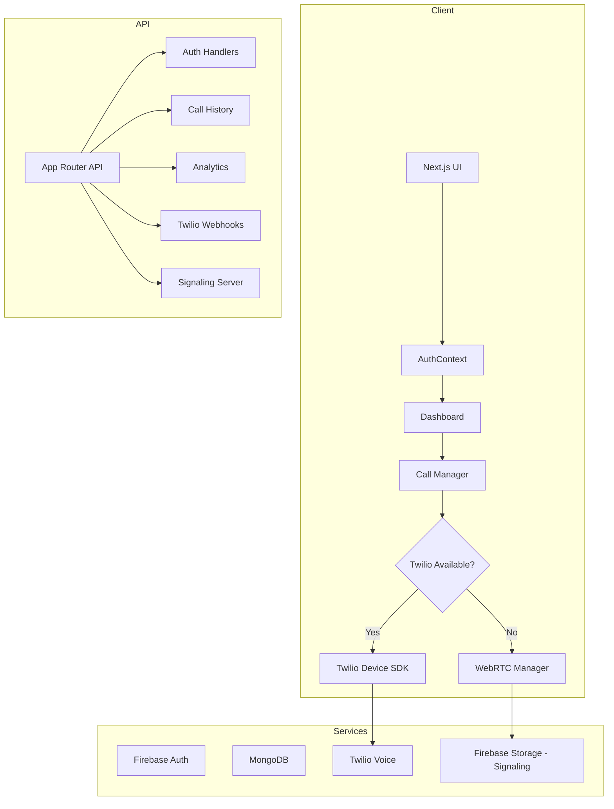
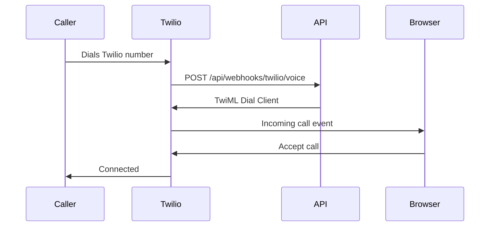
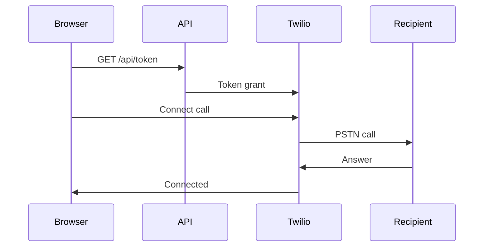
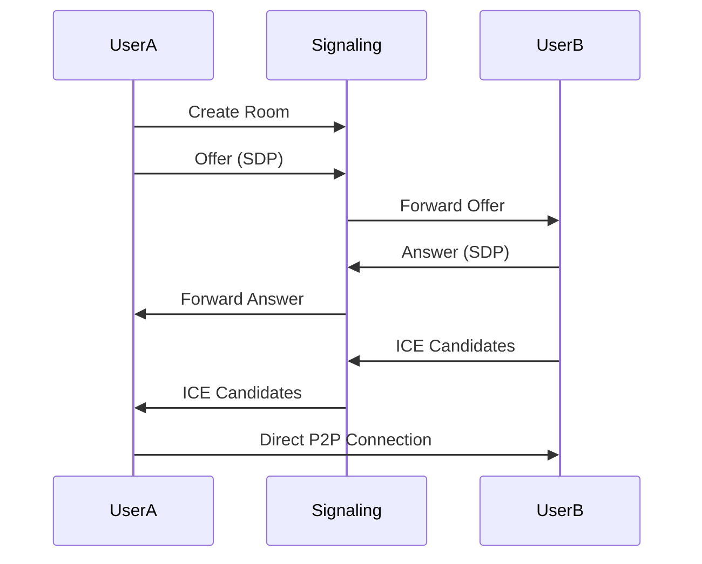

---

# CareFlow System Architecture

## Overview

CareFlow is a Next.js application supporting dual calling modes:

- **Twilio Voice**: Traditional PSTN telephony calls (when credentials provided)
- **WebRTC**: Browser-to-browser peer-to-peer calls (fallback mode)

## Architecture Diagram



## Key Data Flows

### Incoming Call Flow (Twilio)



### Outgoing Call Flow (Twilio)



### WebRTC Peer-to-Peer Flow (Fallback)



## Call Modes

### Mode 1: Twilio Voice (Default)

When Twilio credentials are provided, the app uses Twilio Voice SDK for:

- PSTN calls to regular phone numbers
- Call recording via Twilio
- Phone number masking
- Professional telephony features

### Mode 2: WebRTC (Fallback)

When Twilio credentials are missing, the app automatically switches to WebRTC for:

- Free browser-to-browser calls
- Peer-to-peer encrypted audio
- No telephony costs
- Works between CareFlow users

## Relevant Modules

- API route handlers in [`careflow/app/api`](careflow/app/api)
- Authentication context in [`careflow/context/AuthContext.js`](careflow/context/AuthContext.js)
- Twilio integration in [`careflow/lib/twilio.js`](careflow/lib/twilio.js) (if exists)
- WebRTC manager in [`careflow/lib/webrtc.js`](careflow/lib/webrtc.js) (fallback)
- Call manager in [`careflow/lib/callManager.js`](careflow/lib/callManager.js)
- Database layer in [`careflow/lib/db.js`](careflow/lib/db.js)

## Server vs Client

- **Server**: Route handlers, token generation, database access, signaling.
- **Client**: Dashboard UI, Twilio Device/WebRTC, call controls.

## Key Components

- Dashboard page in [`careflow/app/dashboard/page.js`](careflow/app/dashboard/page.js)
- Protected routes in [`careflow/components/ProtectedRoute/ProtectedRoute.js`](careflow/components/ProtectedRoute/ProtectedRoute.js)
- Call status UI in [`careflow/components/dashboard/CallStatus.js`](careflow/components/dashboard/CallStatus.js)

## Security Notes

- Server-side credentials only for Twilio and Firebase Admin.
- Require Firebase ID token validation for protected APIs.
- Validate webhook signatures for Twilio callbacks.
- WebRTC uses DTLS-SRTP for encryption.
- Signaling endpoints require authentication.

## Environment Variables

See [`careflow/.env.local.example`](careflow/.env.local.example).

### Twilio Configuration (Optional)

```
TWILIO_ACCOUNT_SID=your-account-sid
TWILIO_AUTH_TOKEN=your-auth-token
TWILIO_PHONE_NUMBER=+1234567890
TWILIO_TWIML_APP_SID=your-twiml-app-sid
TWILIO_API_KEY=your-api-key
TWILIO_API_SECRET=your-api-secret
```

### WebRTC Configuration (Automatic)

```
NEXT_PUBLIC_APP_URL=http://localhost:3000
# Firebase config for signaling (if needed)
```

## Fallback Behavior

```javascript
// Automatic mode detection in CallManager
const twilioConfigured = TWILIO_ACCOUNT_SID && TWILIO_AUTH_TOKEN;

if (twilioConfigured) {
  mode = "twilio";
  // Use Twilio Voice SDK
} else {
  mode = "webrtc";
  // Use WebRTC for browser-to-browser
}
```

## API Endpoints

### Token Endpoint

```javascript
// GET /api/token
// Returns: { token: string, mode: 'twilio' | 'webrtc' }
```

### Signaling Endpoints (WebRTC Mode)

```javascript
// POST /api/signaling/offer
// POST /api/signaling/answer
// POST /api/signaling/ice
```

### Webhook Endpoints (Twilio Mode)

```javascript
// POST /api/webhooks/twilio/voice
// POST /api/webhooks/twilio/status
// POST /api/webhooks/twilio/voicemail
```
