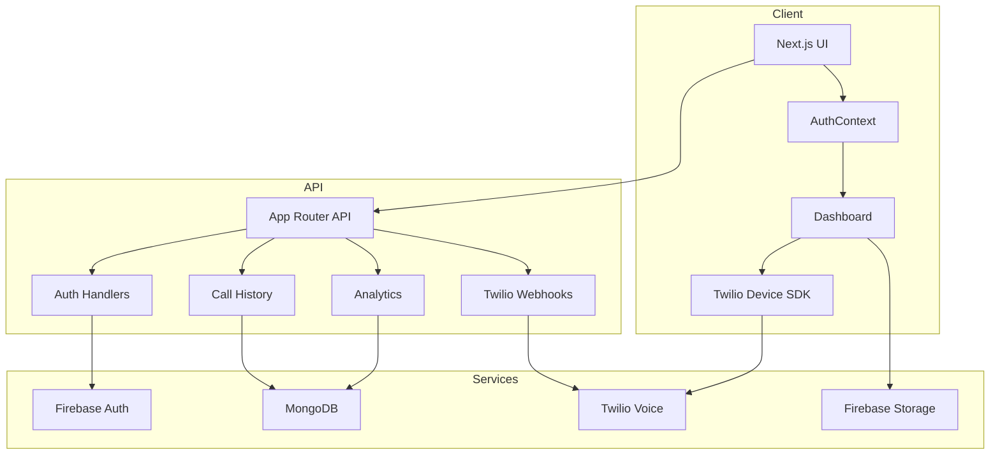
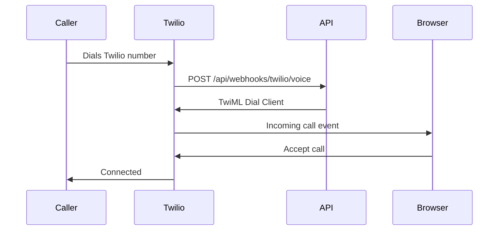
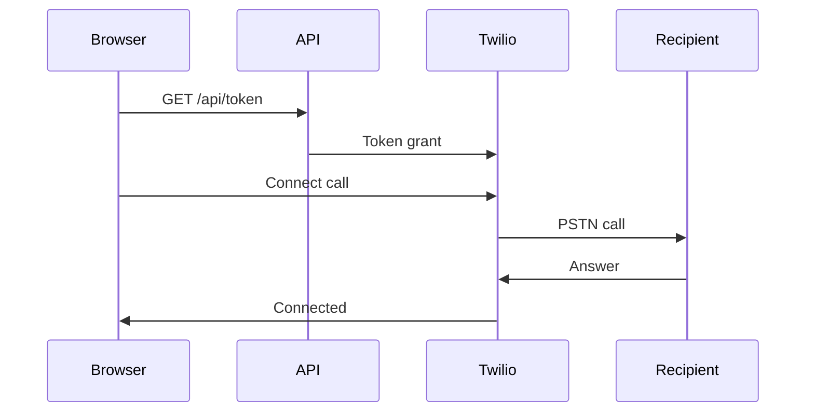

---

# CareFlow System Architecture (Concise)

## Overview

CareFlow is a Next.js application using Twilio Voice for browser calling, Firebase Auth for authentication, and MongoDB for persistence.

## Architecture Diagram

## Key Data Flows

### Incoming Call Flow

### Outgoing Call Flow

## Relevant Modules

- API route handlers in [`careflow/app/api`](careflow/app/api)
- Authentication context in [`careflow/context/AuthContext.js`](careflow/context/AuthContext.js)
- Twilio integration in [`careflow/lib/twilio.js`](careflow/lib/twilio.js)
- Database layer in [`careflow/lib/db.js`](careflow/lib/db.js)

## Server vs Client

- **Server**: Route handlers, token generation, database access.
- **Client**: Dashboard UI, Twilio Device, call controls.

## Key Components

- Dashboard page in [`careflow/app/dashboard/page.js`](careflow/app/dashboard/page.js)
- Protected routes in [`careflow/components/ProtectedRoute/ProtectedRoute.js`](careflow/components/ProtectedRoute/ProtectedRoute.js)
- Call status UI in [`careflow/components/dashboard/CallStatus.js`](careflow/components/dashboard/CallStatus.js)

## Security Notes

- Server-side credentials only for Twilio and Firebase Admin.
- Require Firebase ID token validation for protected APIs.
- Validate webhook signatures for Twilio callbacks.

## Environment Variables

See [`careflow/.env.local.example`](careflow/.env.local.example).
