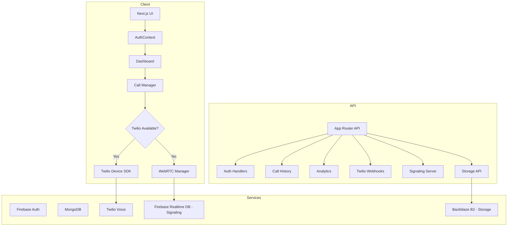
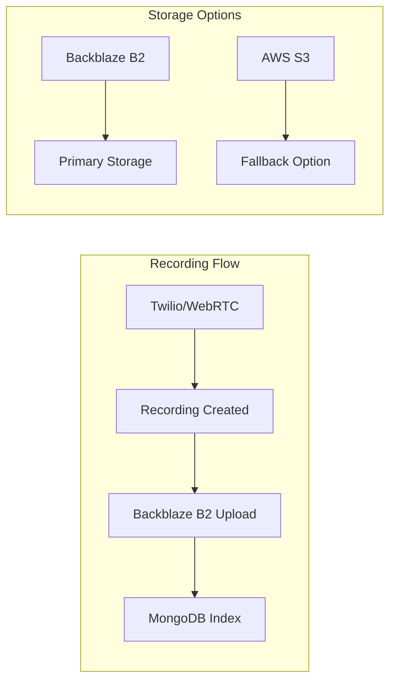
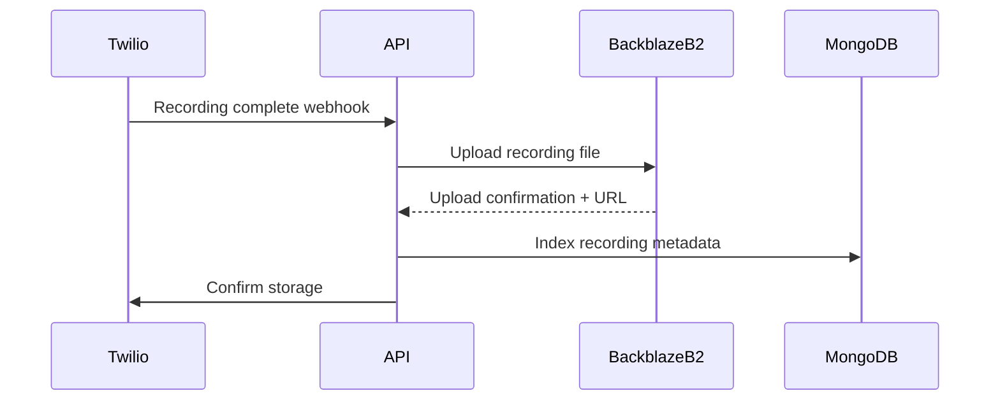

---

# CareFlow System Architecture

## Overview

CareFlow is a Next.js application supporting dual calling modes and cloud storage:

- **Twilio Voice**: Traditional PSTN telephony calls (when credentials provided)
- **WebRTC**: Browser-to-browser peer-to-peer calls (fallback mode)
- **Backblaze B2**: S3-compatible cloud storage for recordings (cost-effective alternative to AWS S3)

## Architecture Diagram



## Storage Architecture



## Key Data Flows

### Incoming Call Flow (Twilio)


### Outgoing Call Flow (Twilio)


### WebRTC Peer-to-Peer Flow (Fallback)


### Recording Upload Flow (Backblaze B2)



## Call Modes

### Mode 1: Twilio Voice (Default)

When Twilio credentials are provided, the app uses Twilio Voice SDK for:

- PSTN calls to regular phone numbers
- Call recording via Twilio
- Phone number masking
- Professional telephony features

### Mode 2: WebRTC (Fallback)

When Twilio credentials are missing, the app automatically switches to WebRTC for:

- Free browser-to-browser calls
- Peer-to-peer encrypted audio
- No telephony costs
- Works between CareFlow users

### Mode 3: CareFlow User IDs

WebRTC mode uses CareFlow User IDs for direct calling:

- **Format**: `care4w-XXXXXXX` (e.g., `care4w-1000001`)
- Users enter CareFlow IDs instead of phone numbers
- Free calls between CareFlow users

## Storage Options

### Primary: Backblaze B2

CareFlow uses Backblaze B2 S3-compatible storage as the primary storage option:

- **Cost-effective**: Up to 75% cheaper than AWS S3
- **S3-compatible**: Uses AWS SDK v3
- **Reliable**: 99.9% uptime SLA
- **Simple**: No complex bucket policies

### Configuration

```bash
BACKBLAZE_KEY_ID=your-key-id
BACKBLAZE_APPLICATION_KEY=your-app-key
BACKBLAZE_BUCKET_NAME=your-bucket
BACKBLAZE_ENDPOINT=https://s3.us-east-1.backblazeb2.com
BACKBLAZE_REGION=us-east-1
```

## Relevant Modules

- API route handlers in [`app/api`](app/api)
- Authentication context in [`context/AuthContext.js`](context/AuthContext.js)
- WebRTC manager in [`lib/webrtc.js`](lib/webrtc.js)
- Call manager in [`lib/callManager.js`](lib/callManager.js)
- Backblaze B2 storage in [`lib/backblaze.js`](lib/backblaze.js)
- Database layer in [`lib/db.js`](lib/db.js)

## Server vs Client

- **Server**: Route handlers, token generation, database access, storage operations.
- **Client**: Dashboard UI, Twilio Device/WebRTC, call controls.

## Key Components

- Dashboard page in [`app/dashboard/page.js`](app/dashboard/page.js)
- Protected routes in [`components/ProtectedRoute/ProtectedRoute.js`](components/ProtectedRoute/ProtectedRoute.js)
- Call status UI in [`components/dashboard/CallStatus.js`](components/dashboard/CallStatus.js)
- DialPad in [`components/dashboard/DialPad.js`](components/dashboard/DialPad.js)

## Security Notes

- Server-side credentials only for Twilio, Firebase Admin, and Backblaze B2.
- Require Firebase ID token validation for protected APIs.
- Validate webhook signatures for Twilio callbacks.
- WebRTC uses DTLS-SRTP for encryption.
- Signaling endpoints require authentication.
- Backblaze B2 uses presigned URLs for secure file access.

## Environment Variables

See [`.env.local.example`](.env.local.example).

### Twilio Configuration (Optional)

```
TWILIO_ACCOUNT_SID=your-account-sid
TWILIO_AUTH_TOKEN=your-auth-token
TWILIO_PHONE_NUMBER=+1234567890
TWILIO_TWIML_APP_SID=your-twiml-app-sid
TWILIO_API_KEY=your-api-key
TWILIO_API_SECRET=your-api-secret
```

### WebRTC Configuration (Automatic)

```
NEXT_PUBLIC_APP_URL=http://localhost:3000
NEXT_PUBLIC_FIREBASE_DATABASE_URL=https://your-project-rtdb.firebaseio.com
```

### Backblaze B2 Configuration

```
BACKBLAZE_KEY_ID=your-key-id
BACKBLAZE_APPLICATION_KEY=your-app-key
BACKBLAZE_BUCKET_NAME=your-bucket
BACKBLAZE_ENDPOINT=https://s3.us-east-1.backblazeb2.com
BACKBLAZE_REGION=us-east-1
```

## Fallback Behavior

```javascript
// Automatic mode detection in CallManager
const twilioConfigured = TWILIO_ACCOUNT_SID && TWILIO_AUTH_TOKEN;

if (twilioConfigured) {
  mode = "twilio";
  // Use Twilio Voice SDK
} else {
  mode = "webrtc";
  // Use WebRTC for browser-to-browser
}
```

## API Endpoints

### Token Endpoint

```javascript
// GET /api/token
// Returns: { token: string, mode: 'twilio' | 'webrtc', care4wId: string }
```

### Signaling Endpoints (WebRTC Mode via Firebase)

- Real-time signaling via Firebase Realtime Database

### Webhook Endpoints (Twilio Mode)

```javascript
// POST /api/webhooks/twilio/voice
// POST /api/webhooks/twilio/status
// POST /api/webhooks/twilio/voicemail
```

### User Lookup (WebRTC Mode)

```javascript
// GET /api/users/lookup?care4wId=care4w-XXXXXXX
// Returns: { exists: boolean, displayName: string }
```

## Data Models

### User

```javascript
{
  firebaseUid: String,        // Firebase user ID
  email: String,             // User email
  displayName: String,       // User display name
  care4wId: String,         // CareFlow User ID (care4w-XXXXXXX)
  sequenceNumber: Number,     // Unique sequence number
  twilioClientIdentity: String, // Twilio client identity
  role: String,              // User role ('user' or 'admin')
  isActive: Boolean,         // Account status
  createdAt: Date,
  updatedAt: Date,
  lastLoginAt: Date
}
```

### Recording

```javascript
{
  firebaseUid: String,       // User who owns the recording
  userId: ObjectId,         // Reference to User
  type: String,             // 'call' or 'voicemail'
  sid: String,             // Twilio call SID (unique)
  from: String,            // Caller number/ID
  to: String,              // Callee number/ID
  direction: String,       // 'inbound' or 'outbound'
  storageKey: String,     // Backblaze B2 object key
  storageBucket: String,  // Backblaze B2 bucket name
  duration: Number,       // Call duration in seconds
  recordedAt: Date,      // When recording was created
  status: String,        // 'active', 'archived', 'deleted'
  isListened: Boolean,   // Whether user has listened
  transcription: String  // Optional transcription
}
```

## Performance Considerations

- **Token Refresh**: Firebase tokens refresh every 50 minutes
- **MongoDB Connection**: Cached connection for hot reloads
- **Backblaze B2**: Presigned URLs for efficient file access
- **WebRTC**: Direct P2P connection minimizes server load

## Scalability

- **Stateless API**: All state in MongoDB and services
- **Connection Pooling**: MongoDB connection pooling (max 10 connections)
- **Serverless Ready**: Compatible with Vercel and similar platforms
- **WebRTC Scaling**: Firebase Realtime Database handles signaling

---

Related Documents:

- [Deployment Guide](DEPLOYMENT.md)
- [User Flows](USER_FLOWS.md)
- [WebRTC Fallback Architecture](WEBRTC_FALLBACK_ARCHITECTURE.md)
- [Backblaze B2 Guide](BACKBLAZE_B2_GUIDE.md)
