# CareFlow User Flows (Concise)

## Overview

Core user journeys for authentication and calling. Diagrams reflect the target flow (some steps are pending implementation, see analysis report).

---

## Authentication

### Login

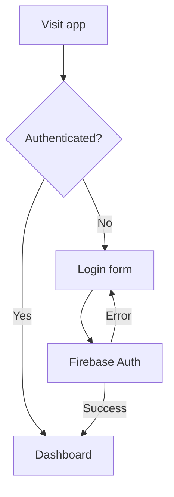

### Registration

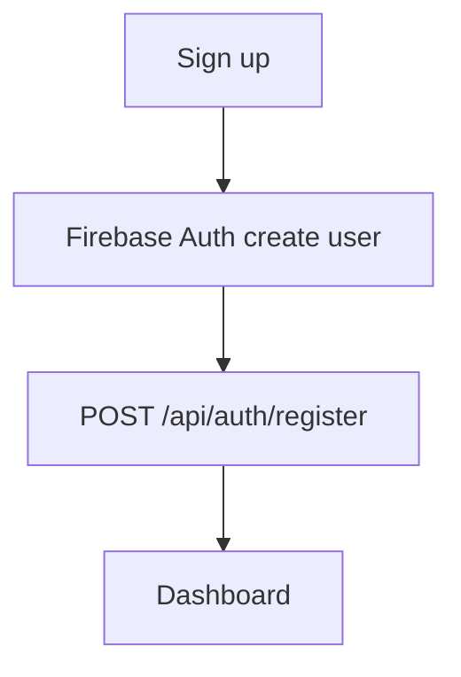

### Password Reset

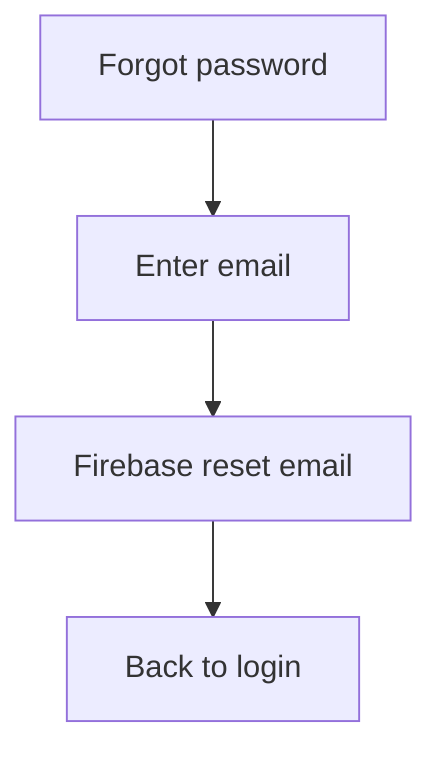

---

## Calling

### Outbound Call

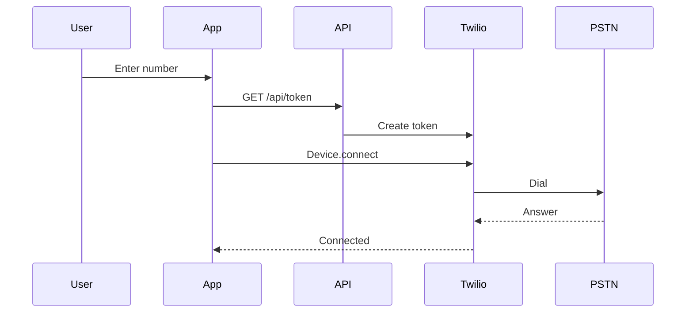

### Inbound Call

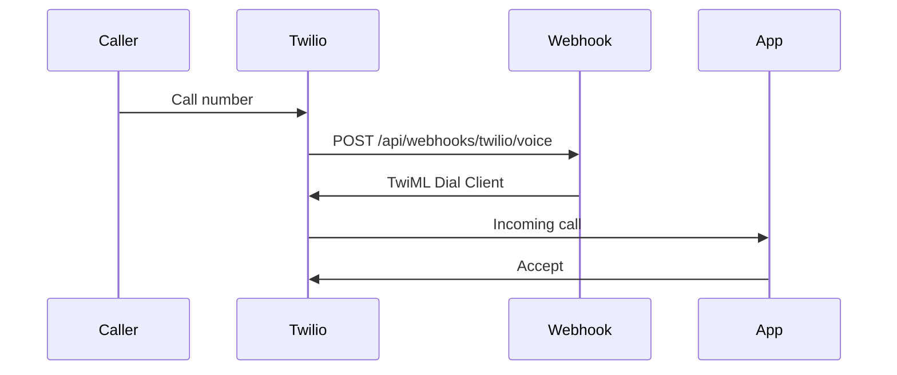

### Call History

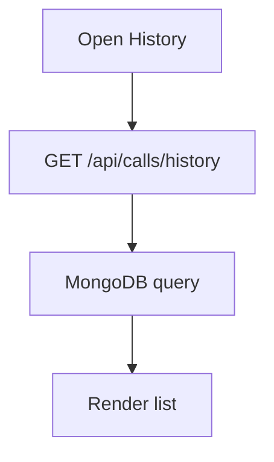

---

## Components Involved

- Login: [`careflow/app/login/page.js`](careflow/app/login/page.js)
- Signup: [`careflow/app/signup/page.js`](careflow/app/signup/page.js)
- Dashboard: [`careflow/app/dashboard/page.js`](careflow/app/dashboard/page.js)
- Auth state: [`careflow/context/AuthContext.js`](careflow/context/AuthContext.js)
- Webhooks: [`careflow/app/api/webhooks/twilio/voice/route.js`](careflow/app/api/webhooks/twilio/voice/route.js)

## Application Initialization Flow

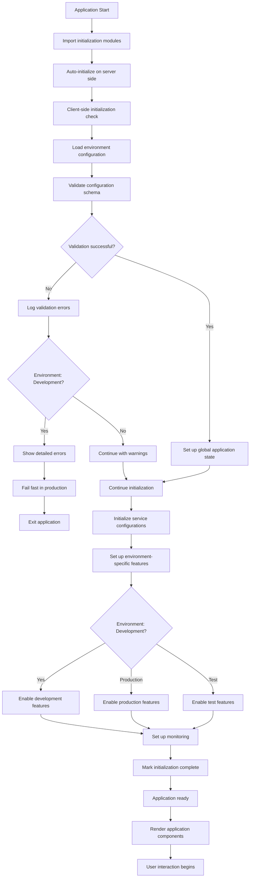

**Initialization Phases:**

### Phase 1: Configuration Loading

1. **Environment Detection**: Determine development/production/test environment
2. **File Loading**: Load `.env.local` configuration file
3. **Schema Validation**: Validate all required environment variables
4. **Type Casting**: Convert configuration values to proper types

### Phase 2: Service Setup

1. **Global State**: Set up application metadata and service configurations
2. **Service Validation**: Verify all required services are configured
3. **Error Handling**: Handle missing or invalid configurations appropriately

### Phase 3: Environment Configuration

1. **Development**: Enable verbose logging, hot reload, development middleware
2. **Production**: Enable security features, compression, rate limiting
3. **Test**: Enable mocking, silent logging, fast timeouts

### Phase 4: Monitoring Setup

1. **Status Monitoring**: Initialize initialization status components
2. **Error Tracking**: Set up error monitoring and reporting
3. **Performance Monitoring**: Configure performance tracking

---

## Call Management Flows

### Making a Call

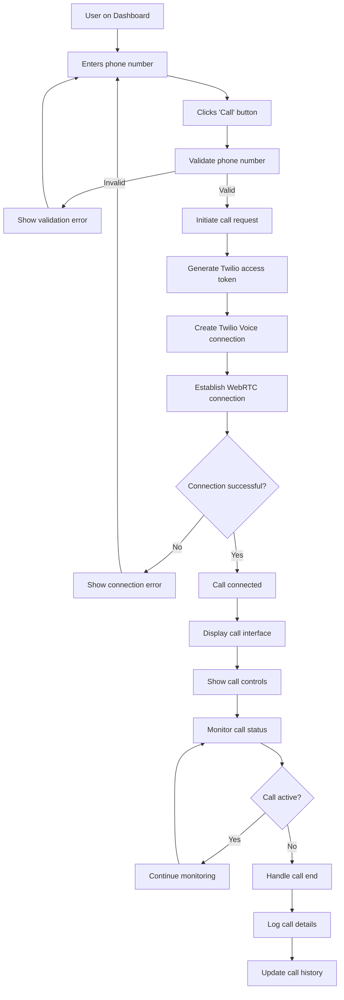

**Call Process Details:**

1. **Number Input**: User enters destination phone number
2. **Validation**: Client-side and server-side number validation
3. **Token Generation**: Secure Twilio access token creation
4. **Connection**: WebRTC connection establishment
5. **Call Management**: Real-time call status monitoring
6. **Call Logging**: Automatic call history updates

**Security Measures:**

- Phone number format validation
- Secure token generation with expiration
- Connection encryption via WebRTC
- Call logging for audit trails

---

### Receiving a Call

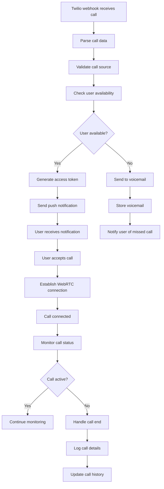

**Receiving Process:**

1. **Call Detection**: Twilio webhook detects incoming call
2. **Validation**: Verify call source and user availability
3. **Notification**: Push notification to user's browser
4. **Acceptance**: User accepts or declines call
5. **Connection**: WebRTC connection establishment
6. **Monitoring**: Real-time call status tracking

**Features:**

- Push notifications for incoming calls
- User availability checking
- Voicemail system for unavailable users
- Call logging and history updates

---

### Call History Access

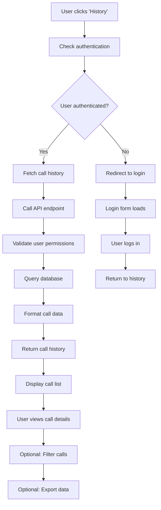

**History Features:**

1. **Authentication Required**: Only authenticated users can access history
2. **Permission Validation**: Verify user can access requested data
3. **Data Formatting**: Format raw call data for display
4. **Filtering Options**: Filter by date, call type, duration
5. **Export Capabilities**: Export call history to various formats

---

## System Architecture Flow

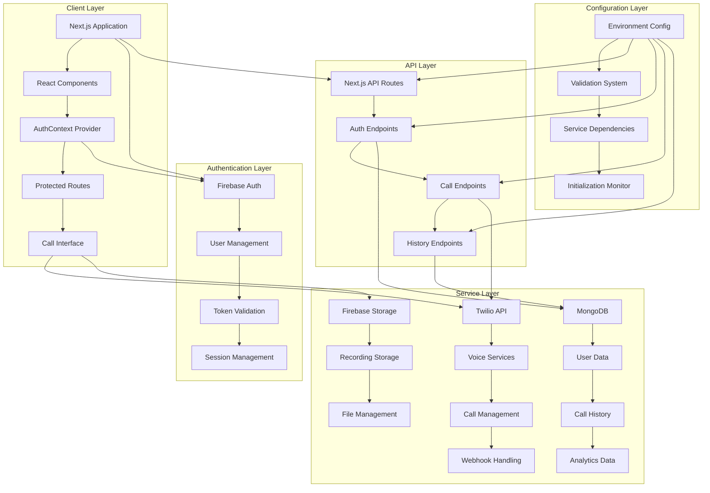

**Architecture Components:**

### Client Layer

- **Next.js Application**: Main application framework
- **React Components**: User interface components
- **AuthContext**: Authentication state management
- **Protected Routes**: Route-level authentication

### Authentication Layer

- **Firebase Auth**: User authentication and authorization
- **Token Management**: JWT token handling and validation
- **Session Management**: User session persistence

### API Layer

- **Next.js API Routes**: Server-side API endpoints
- **Auth Endpoints**: Authentication-related APIs
- **Call Endpoints**: Voice call management APIs
- **History Endpoints**: Call history and analytics APIs

### Service Layer

- **Twilio API**: Voice call services and WebRTC
- **Firebase Storage**: Call recording storage
- **MongoDB**: Database for user and call data

### Configuration Layer

- **Environment Config**: Dynamic configuration loading
- **Validation System**: Configuration validation and type casting
- **Service Dependencies**: Service availability checking
- **Initialization Monitor**: Application startup monitoring

---

## Error Handling Flow

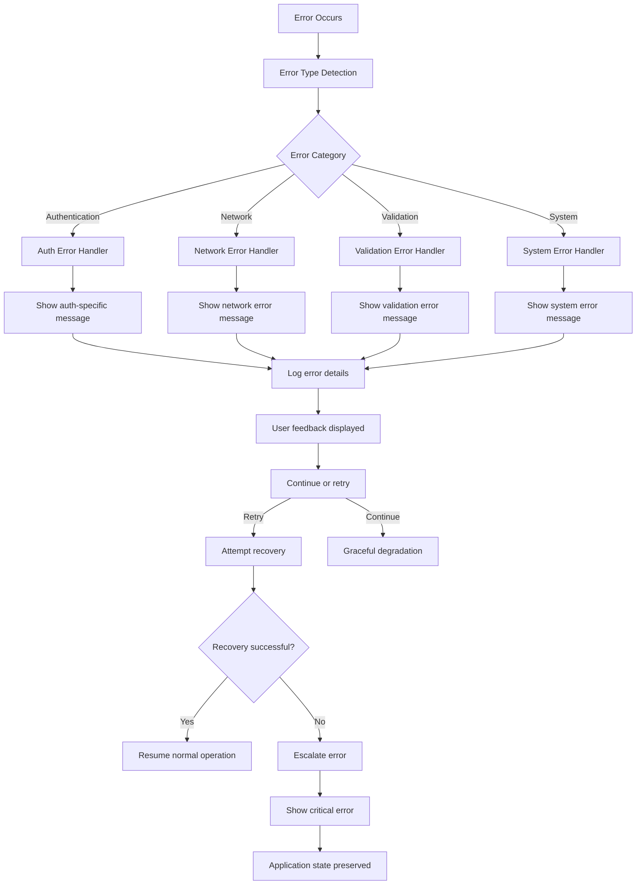

**Error Categories:**

1. **Authentication Errors**: Login failures, session timeouts, token issues
2. **Network Errors**: API failures, connection timeouts, service unavailability
3. **Validation Errors**: Input validation failures, configuration errors
4. **System Errors**: Database errors, service failures, critical system issues

**Error Response Strategy:**

- User-friendly error messages
- Detailed logging for debugging
- Graceful degradation when possible
- Recovery attempts for transient errors
- Critical error escalation procedures

---

## Performance Monitoring Flow

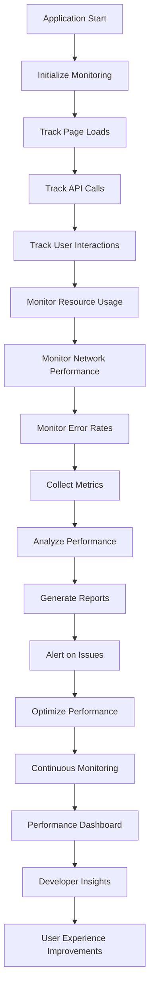

**Monitoring Features:**

1. **Page Load Times**: Track initial load and navigation performance
2. **API Response Times**: Monitor backend API performance
3. **User Interaction Latency**: Track UI responsiveness
4. **Resource Usage**: Monitor memory and CPU usage
5. **Error Tracking**: Track and categorize application errors
6. **Performance Analytics**: Generate performance reports and insights

This comprehensive user flow documentation provides detailed insights into how users interact with CareFlow, the system architecture, and the various flows that ensure a smooth user experience.
