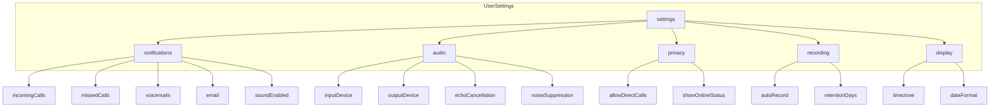

# CareFlow User Settings Schema - Minimal Viable Product

**Created:** 2026-02-16
**Status:** Draft
**Purpose:** Define the minimal viable user settings schema to give users essential control over CareFlow features.

---

## Executive Summary

This document defines a minimal viable user settings schema for CareFlow, a browser-based telephony application supporting both Twilio Voice (PSTN) and WebRTC (peer-to-peer) calls. The schema focuses on essential user controls across notifications, audio/call behavior, privacy, and recording preferences.

---

## Feature Analysis

### Current Application Features

| Feature Category  | Features Available                                                                                         |
| ----------------- | ---------------------------------------------------------------------------------------------------------- |
| **Calling**       | Twilio Voice (PSTN), WebRTC (P2P), Mute, Hangup, Accept/Reject, DTMF tones                                 |
| **Notifications** | FCM Push notifications, Incoming calls, Missed calls, Voicemails, Email alerts                             |
| **Recordings**    | WebRTC call recording, Upload to Backblaze B2, Playback, Download, Delete, Filter by type/direction/status |
| **Analytics**     | Total calls, Voicemails, Duration, Success rate, Today's calls, Average duration, Recent calls             |
| **User Identity** | CareFlow ID (care4w-XXXXXXX), Display name, Email, Phone number                                            |

### Existing Settings in User Model

The [`User.js`](models/User.js:82) model already contains notification preferences:

```javascript
notifications: {
  incomingCalls: { type: Boolean, default: true },
  missedCalls: { type: Boolean, default: true },
  voicemails: { type: Boolean, default: true },
  email: { type: Boolean, default: false },
}
```

---

## Minimal Viable Settings Schema

### Schema Overview



---

## Detailed Field Specifications

### 1. Notification Settings

Controls how and when users receive alerts about call activity.

| Field                         | Type    | Default | Description                                  |
| ----------------------------- | ------- | ------- | -------------------------------------------- |
| `notifications.incomingCalls` | Boolean | `true`  | Enable push notifications for incoming calls |
| `notifications.missedCalls`   | Boolean | `true`  | Enable notifications for missed calls        |
| `notifications.voicemails`    | Boolean | `true`  | Enable notifications for new voicemails      |
| `notifications.email`         | Boolean | `false` | Enable email notifications for call activity |
| `notifications.soundEnabled`  | Boolean | `true`  | Enable sound alerts for notifications        |
| `notifications.soundVolume`   | Number  | `80`    | Volume level for notification sounds (0-100) |

**Rationale:** These settings give users control over notification channels and alert behavior. Sound controls are essential for users who may be in quiet environments or need audible alerts.

---

### 2. Audio Settings

Controls audio device selection and processing for calls.

| Field                    | Type    | Default     | Description                   |
| ------------------------ | ------- | ----------- | ----------------------------- |
| `audio.inputDevice`      | String  | `'default'` | Selected microphone device ID |
| `audio.outputDevice`     | String  | `'default'` | Selected speaker device ID    |
| `audio.echoCancellation` | Boolean | `true`      | Enable echo cancellation      |
| `audio.noiseSuppression` | Boolean | `true`      | Enable noise suppression      |
| `audio.autoGainControl`  | Boolean | `true`      | Enable automatic gain control |

**Rationale:** Audio device selection is critical for users with multiple microphones/speakers. Echo cancellation and noise suppression are essential for call quality and should be user-controllable for advanced scenarios.

---

### 3. Privacy Settings

Controls visibility and access to user's calling status.

| Field                         | Type    | Default | Description                                        |
| ----------------------------- | ------- | ------- | -------------------------------------------------- |
| `privacy.allowDirectCalls`    | Boolean | `true`  | Allow other users to call directly via CareFlow ID |
| `privacy.showOnlineStatus`    | Boolean | `true`  | Show online/available status to other users        |
| `privacy.blockAnonymousCalls` | Boolean | `false` | Block calls from anonymous/hidden numbers          |

**Rationale:** Privacy controls are essential for users who may not want to receive unsolicited calls or want to control their visibility within the CareFlow network.

---

### 4. Recording Settings

Controls automatic recording behavior and retention.

| Field                      | Type    | Default | Description                                  |
| -------------------------- | ------- | ------- | -------------------------------------------- |
| `recording.autoRecord`     | Boolean | `false` | Automatically record all calls               |
| `recording.retentionDays`  | Number  | `30`    | Days to retain recordings before auto-delete |
| `recording.notifyOnRecord` | Boolean | `true`  | Notify caller when recording starts          |

**Rationale:** Auto-record is off by default for privacy compliance. Retention settings help users manage storage quota. Notification on record may be legally required in some jurisdictions.

---

### 5. Display Settings

Controls timezone and formatting preferences.

| Field                | Type   | Default        | Description                               |
| -------------------- | ------ | -------------- | ----------------------------------------- |
| `display.timezone`   | String | `'UTC'`        | User's timezone for displaying timestamps |
| `display.dateFormat` | String | `'MM/DD/YYYY'` | Preferred date format                     |
| `display.timeFormat` | String | `'12h'`        | Time format preference (12h or 24h)       |

**Rationale:** Timezone is essential for accurate call history timestamps. Date/time format preferences improve user experience for international users.

---

## Complete Schema Definition

### MongoDB Schema Extension

```javascript
// Add to models/User.js

const userSettingsSchema = new mongoose.Schema(
  {
    // Notification Settings
    notifications: {
      incomingCalls: { type: Boolean, default: true },
      missedCalls: { type: Boolean, default: true },
      voicemails: { type: Boolean, default: true },
      email: { type: Boolean, default: false },
      soundEnabled: { type: Boolean, default: true },
      soundVolume: { type: Number, default: 80, min: 0, max: 100 },
    },

    // Audio Settings
    audio: {
      inputDevice: { type: String, default: 'default' },
      outputDevice: { type: String, default: 'default' },
      echoCancellation: { type: Boolean, default: true },
      noiseSuppression: { type: Boolean, default: true },
      autoGainControl: { type: Boolean, default: true },
    },

    // Privacy Settings
    privacy: {
      allowDirectCalls: { type: Boolean, default: true },
      showOnlineStatus: { type: Boolean, default: true },
      blockAnonymousCalls: { type: Boolean, default: false },
    },

    // Recording Settings
    recording: {
      autoRecord: { type: Boolean, default: false },
      retentionDays: { type: Number, default: 30, min: 1, max: 365 },
      notifyOnRecord: { type: Boolean, default: true },
    },

    // Display Settings
    display: {
      timezone: { type: String, default: 'UTC' },
      dateFormat: {
        type: String,
        default: 'MM/DD/YYYY',
        enum: ['MM/DD/YYYY', 'DD/MM/YYYY', 'YYYY-MM-DD'],
      },
      timeFormat: {
        type: String,
        default: '12h',
        enum: ['12h', '24h'],
      },
    },
  },
  { _id: false }
);

// Add to main userSchema
userSchema.add({
  settings: { type: userSettingsSchema, default: () => ({}) },
});
```

---

## Settings API Endpoints

### Required API Routes

| Endpoint                    | Method | Description                    |
| --------------------------- | ------ | ------------------------------ |
| `/api/users/settings`       | GET    | Retrieve current user settings |
| `/api/users/settings`       | PATCH  | Update user settings           |
| `/api/users/settings/reset` | POST   | Reset settings to defaults     |

### Example API Response

```json
{
  "success": true,
  "data": {
    "settings": {
      "notifications": {
        "incomingCalls": true,
        "missedCalls": true,
        "voicemails": true,
        "email": false,
        "soundEnabled": true,
        "soundVolume": 80
      },
      "audio": {
        "inputDevice": "default",
        "outputDevice": "default",
        "echoCancellation": true,
        "noiseSuppression": true,
        "autoGainControl": true
      },
      "privacy": {
        "allowDirectCalls": true,
        "showOnlineStatus": true,
        "blockAnonymousCalls": false
      },
      "recording": {
        "autoRecord": false,
        "retentionDays": 30,
        "notifyOnRecord": true
      },
      "display": {
        "timezone": "Africa/Nairobi",
        "dateFormat": "DD/MM/YYYY",
        "timeFormat": "24h"
      }
    }
  }
}
```

---

## Implementation Priority

### Phase 1: Essential Settings (MVP)

1. **Notification Settings** - Already partially implemented, extend with sound controls
2. **Audio Device Selection** - Critical for multi-device users
3. **Display Timezone** - Essential for accurate timestamps

### Phase 2: Enhanced Control

4. **Privacy Settings** - User visibility and call acceptance
5. **Recording Settings** - Auto-record and retention

### Phase 3: Advanced Features

6. **Audio Processing** - Echo cancellation, noise suppression toggles
7. **Date/Time Formatting** - Internationalization support

---

## Settings UI Components

### Recommended UI Structure

```
Settings Page
├── Notifications Tab
│   ├── Push Notifications
│   │   ├── Incoming calls toggle
│   │   ├── Missed calls toggle
│   │   └── Voicemails toggle
│   ├── Email Notifications
│   │   └── Email alerts toggle
│   └── Sound Settings
│       ├── Sound enabled toggle
│       └── Volume slider
│
├── Audio Tab
│   ├── Device Selection
│   │   ├── Microphone dropdown
│   │   └── Speaker dropdown
│   └── Audio Processing
│       ├── Echo cancellation toggle
│       ├── Noise suppression toggle
│       └── Auto gain control toggle
│
├── Privacy Tab
│   ├── Direct calls toggle
│   ├── Online status toggle
│   └── Block anonymous calls toggle
│
├── Recording Tab
│   ├── Auto-record toggle
│   ├── Retention period selector
│   └── Recording notification toggle
│
└── Display Tab
    ├── Timezone selector
    ├── Date format dropdown
    └── Time format dropdown
```

---

## Migration Strategy

### For Existing Users

1. **Default Values:** All new settings have sensible defaults
2. **Gradual Rollout:** Settings appear in UI as features are implemented
3. **Backward Compatibility:** Existing notification preferences preserved
4. **No Breaking Changes:** Settings are additive, not modifying existing fields

### Database Migration

```javascript
// Migration script to add settings to existing users
db.users.updateMany(
  { settings: { $exists: false } },
  {
    $set: {
      settings: {
        notifications: {
          incomingCalls: true,
          missedCalls: true,
          voicemails: true,
          email: false,
          soundEnabled: true,
          soundVolume: 80,
        },
        audio: {
          inputDevice: 'default',
          outputDevice: 'default',
          echoCancellation: true,
          noiseSuppression: true,
          autoGainControl: true,
        },
        privacy: {
          allowDirectCalls: true,
          showOnlineStatus: true,
          blockAnonymousCalls: false,
        },
        recording: {
          autoRecord: false,
          retentionDays: 30,
          notifyOnRecord: true,
        },
        display: {
          timezone: 'UTC',
          dateFormat: 'MM/DD/YYYY',
          timeFormat: '12h',
        },
      },
    },
  }
);
```

---

## Summary

### Total Settings: 21 Fields

| Category      | Field Count |
| ------------- | ----------- |
| Notifications | 6           |
| Audio         | 5           |
| Privacy       | 3           |
| Recording     | 3           |
| Display       | 3           |

### Key Benefits

1. **User Control:** Essential controls for notifications, audio, privacy, and recordings
2. **Minimal Complexity:** Only settings that directly impact user experience
3. **Extensible:** Schema designed for future additions
4. **Backward Compatible:** Builds on existing notification preferences

---

## Next Steps

1. Review and approve this schema
2. Implement Phase 1 settings (Notifications, Audio Devices, Timezone)
3. Create settings UI components
4. Add API endpoints for settings CRUD
5. Write migration script for existing users
