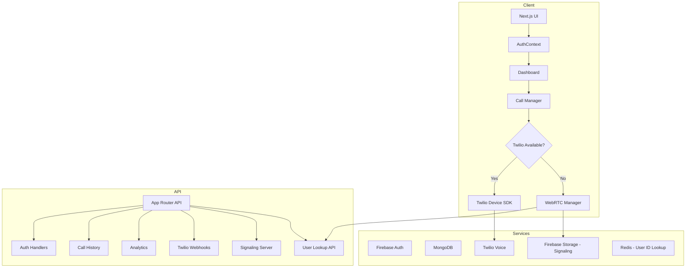
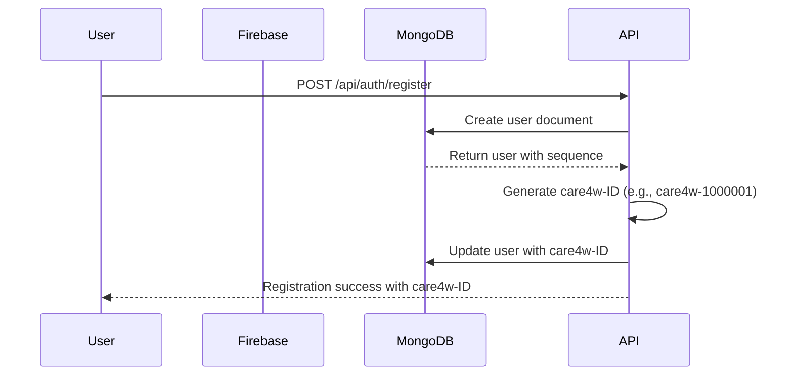
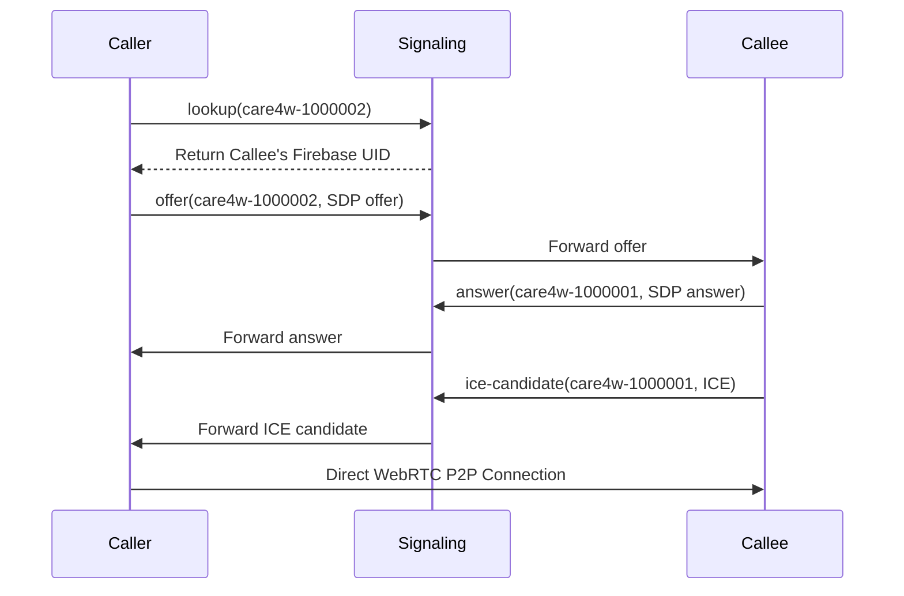

# CareFlow WebRTC Fallback Architecture

## Overview

CareFlow now supports dual calling modes:

- **Twilio Voice**: Traditional telephony calls (PSTN) when Twilio credentials are configured
- **WebRTC**: Browser-to-browser calls using custom CareFlow user IDs when Twilio is unavailable

## WebRTC Call ID System

### CareFlow User ID Format

Each user is assigned a unique **CareFlow User ID** during registration:

- **Format**: `care4w-XXXXXXX` (prefix + 7-digit number)
- **Example**: `care4w-1000001`, `care4w-1000002`
- **Immutable**: Assigned once during registration, cannot be changed
- **Unique**: Each user has a unique ID

### ID Generation

```javascript
// Example: care4w-1000001
const generateCareFlowId = (sequenceNumber) => {
  return `care4w-${sequenceNumber.toString().padStart(7, '0')}`;
};
```

## Architecture Diagram



## Call Modes

### Mode 1: Twilio Voice (Default when credentials provided)

When Twilio credentials are configured:

- Users enter regular phone numbers (E.164 format)
- Calls go through Twilio PSTN network
- Call recording via Twilio
- Phone number masking available

### Mode 2: WebRTC (Fallback when Twilio unavailable)

When Twilio credentials are missing:

- Users enter CareFlow User IDs (format: `care4w-XXXXXXX`)
- Calls are peer-to-peer browser-to-browser
- Free encrypted audio calls between CareFlow users
- Uses Firebase Realtime Database for signaling

## User Registration Flow



## WebRTC Call Flow



## Environment Variables

```bash
# Twilio (Optional - if missing, WebRTC mode is used)
TWILIO_ACCOUNT_SID=your-account-sid
TWILIO_AUTH_TOKEN=your-auth-token
TWILIO_PHONE_NUMBER=+1234567890
TWILIO_TWIML_APP_SID=your-twiml-app-sid

# WebRTC (Optional - for signaling)
NEXT_PUBLIC_APP_URL=http://localhost:3000
```

## User Model Extension

```javascript
{
  // ... existing fields
  care4wId: {
    type: String,
    unique: true,
    immutable: true,
    // Example: "care4w-1000001"
  },
  sequenceNumber: {
    type: Number,
    unique: true,
    immutable: true,
  }
}
```

## API Endpoints

### Token Endpoint

```javascript
// GET /api/token
// Returns: { token: string, mode: 'twilio' | 'webrtc', care4wId: string }
```

### User Lookup Endpoint (WebRTC)

```javascript
// GET /api/users/lookup/:care4wId
// Returns: { exists: boolean, displayName: string }
// Used to validate WebRTC call targets
```

### Signaling Endpoints (WebRTC Mode Only)

```javascript
// POST /api/signaling/offer
// Body: { roomId, targetCare4wId, offer: RTCSessionDescription }

// POST /api/signaling/answer
// Body: { roomId, sourceCare4wId, answer: RTCSessionDescription }

// POST /api/signaling/ice
// Body: { roomId, sourceCare4wId, candidate: RTCIceCandidate }
```

## Implementation Plan

### Phase 1: Core Infrastructure

- [ ] Create `lib/webrtc.js` - WebRTC peer connection manager
- [ ] Create `lib/callManager.js` - Unified call interface (Twilio/WebRTC)
- [ ] Update `app/api/token/route.js` - Return mode flag and care4wId
- [ ] Update `models/User.js` - Add care4wId and sequenceNumber
- [ ] Update `app/api/auth/register/route.js` - Generate care4wId on registration

### Phase 2: User Lookup API

- [ ] Create `/api/users/lookup/:care4wId` endpoint
- [ ] Implement user validation for WebRTC calls
- [ ] Return user display name for caller ID

### Phase 3: Signaling Server

- [ ] Create Firebase Realtime Database structure for signaling
- [ ] Implement offer/answer exchange by care4wId
- [ ] Handle ICE candidate exchange
- [ ] Implement room management

### Phase 4: Dashboard Integration

- [ ] Update `app/dashboard/page.js` to use CallManager
- [ ] Show mode indicator ("Twilio Mode" vs "WebRTC Mode")
- [ ] Update DialPad to accept care4wId format in WebRTC mode
- [ ] Add user lookup validation before making WebRTC call

### Phase 5: UI/UX Improvements

- [ ] Show call mode indicator in header
- [ ] Display user's care4wId in profile section
- [ ] Add help text explaining WebRTC mode
- [ ] Handle call states consistently across modes

## Call Manager Class

```javascript
// lib/callManager.js
class CallManager {
  constructor() {
    this.twilioAvailable = false;
    this.care4wId = null;
    this.mode = null;
  }

  async initialize(token) {
    // Check Twilio configuration
    const config = getAppConfig();
    this.twilioAvailable = !!(
      config.TWILIO_ACCOUNT_SID &&
      config.TWILIO_AUTH_TOKEN &&
      config.TWILIO_PHONE_NUMBER
    );

    if (this.twilioAvailable) {
      this.mode = 'twilio';
      await this.initializeTwilio(token);
    } else {
      this.mode = 'webrtc';
      await this.initializeWebRTC();
    }
  }

  async makeCall(number) {
    if (this.mode === 'twilio') {
      return this.makeTwilioCall(number);
    } else {
      // Validate care4wId format
      if (!this.isValidCare4wId(number)) {
        throw new Error('Invalid CareFlow User ID. Format: care4w-XXXXXXX');
      }
      return this.makeWebRTCCall(number);
    }
  }

  isValidCare4wId(id) {
    return /^care4w-\d{7}$/.test(id);
  }

  getModeInfo() {
    if (this.mode === 'twilio') {
      return {
        mode: 'twilio',
        description: 'Twilio Voice - PSTN Calls',
        placeholder: 'Enter phone number (+1234567890)',
        format: 'E.164 phone format',
      };
    } else {
      return {
        mode: 'webrtc',
        description: 'WebRTC - CareFlow User Calls',
        placeholder: 'Enter CareFlow ID (care4w-XXXXXXX)',
        format: 'care4w- followed by 7 digits',
      };
    }
  }
}
```

## Security Considerations

- Firebase Auth required for both modes
- WebRTC uses DTLS-SRTP for encryption
- Signaling endpoints require authentication
- care4wId is immutable (set once during registration)
- User lookup only confirms existence, doesn't expose sensitive data

## Testing Checklist

- [ ] Twilio mode works with valid credentials
- [ ] WebRTC mode activates when Twilio credentials missing
- [ ] care4wId is generated correctly during registration
- [ ] care4wId is immutable after registration
- [ ] User lookup returns correct information
- [ ] Browser-to-browser calls work between two tabs using care4wId
- [ ] Call status updates correctly in both modes
- [ ] UI shows correct mode indicator and placeholder
- [ ] Call controls work in both modes
