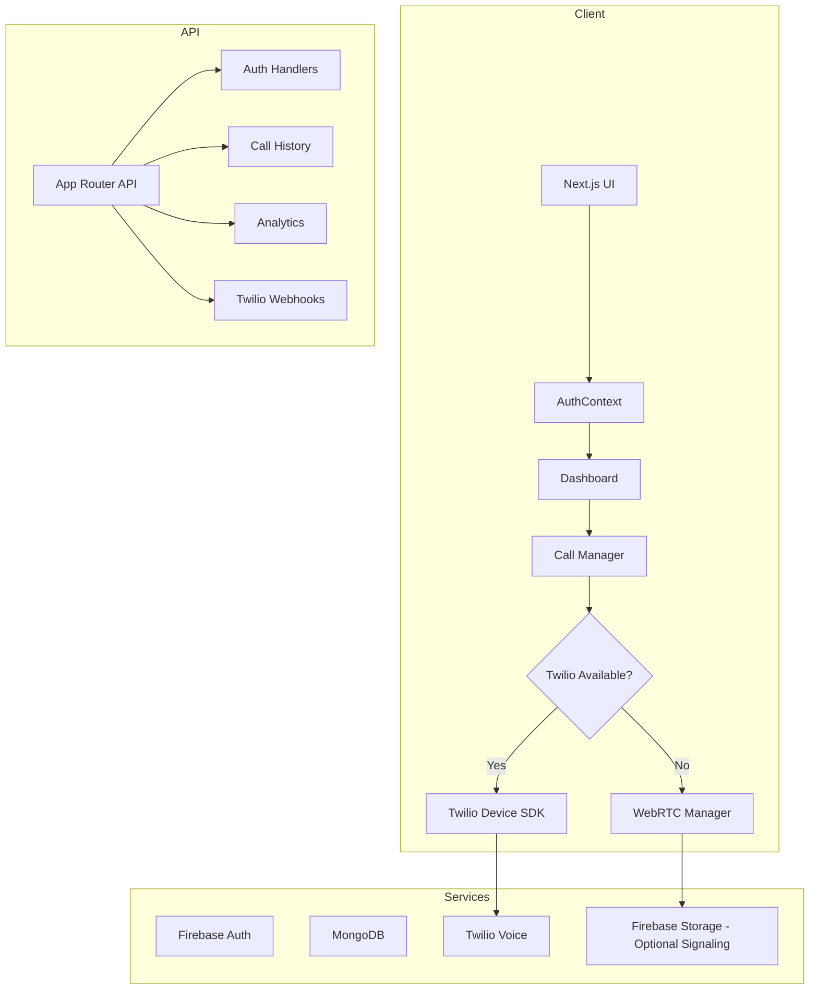
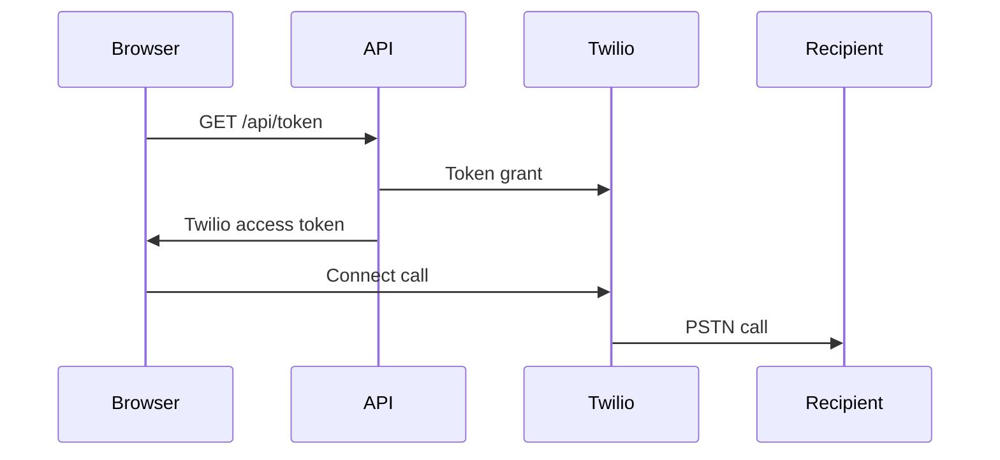
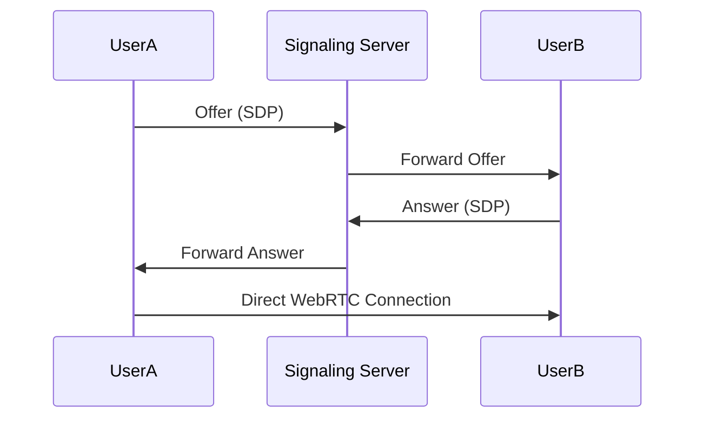

# CareFlow System Architecture - WebRTC Fallback Support

## Overview

CareFlow now supports dual calling modes:

- **Twilio Voice**: Traditional telephony calls (PSTN) when Twilio credentials are configured
- **WebRTC (Peer-to-Peer)**: Browser-to-browser calls when Twilio credentials are missing

## Architecture Diagram



## Call Modes

### Mode 1: Twilio Voice (Default when credentials provided)



### Mode 2: WebRTC Peer-to-Peer (Fallback)



## Environment Variables

```bash
# Twilio (Optional - if missing, WebRTC mode is used)
TWILIO_ACCOUNT_SID=your-account-sid
TWILIO_AUTH_TOKEN=your-auth-token
TWILIO_PHONE_NUMBER=+1234567890
TWILIO_TWIML_APP_SID=your-twiml-app-sid

# WebRTC Signaling (Optional - uses Firebase Realtime Database)
NEXT_PUBLIC_APP_URL=http://localhost:3000
```

## Implementation Plan

### Phase 1: Core Infrastructure

- [ ] Create `lib/webrtc.js` - WebRTC manager for peer connections
- [ ] Create `lib/callManager.js` - Unified call interface (Twilio/WebRTC)
- [ ] Update `app/api/token/route.js` - Return mode flag
- [ ] Update `app/dashboard/page.js` - Use CallManager

### Phase 2: Signaling Server

- [ ] Create Firebase Realtime Database structure for signaling
- [ ] Implement offer/answer exchange
- [ ] Handle ICE candidate exchange

### Phase 3: User Experience

- [ ] Show mode indicator in UI
- [ ] Display "WebRTC Mode" when using peer-to-peer
- [ ] Handle call states consistently

## File Structure

```
lib/
├── twilio.js          # Twilio token generation
├── webrtc.js          # WebRTC peer connection manager
└── callManager.js     # Unified call interface

app/api/
├── token/
│   └── route.js       # Returns Twilio token or signals WebRTC mode
└── signaling/
    ├── offer/         # Handle WebRTC offers
    ├── answer/        # Handle WebRTC answers
    └── ice/           # Handle ICE candidates

components/dashboard/
├── CallControls.js    # Updated to use CallManager
└── CallStatus.js      # Updated status display
```

## Fallback Logic

```javascript
// callManager.js
class CallManager {
  constructor() {
    this.twilioAvailable = false;
    this.mode = null;
  }

  async initialize(token) {
    // Check Twilio configuration
    const config = getAppConfig();
    this.twilioAvailable = !!(
      config.TWILIO_ACCOUNT_SID &&
      config.TWILIO_AUTH_TOKEN &&
      config.TWILIO_PHONE_NUMBER
    );

    if (this.twilioAvailable) {
      this.mode = "twilio";
      await this.initializeTwilio(token);
    } else {
      this.mode = "webrtc";
      await this.initializeWebRTC();
    }
  }

  getMode() {
    return {
      mode: this.mode,
      description:
        this.mode === "twilio"
          ? "Twilio Voice - PSTN Calls"
          : "WebRTC - Browser to Browser",
    };
  }
}
```

## Security Considerations

- Firebase Auth required for both modes
- WebRTC uses DTLS-SRTP for encryption
- Signaling traffic via authenticated endpoints

## API Endpoints

### Token Endpoint

```javascript
// GET /api/token
// Returns: { token: string, mode: 'twilio' | 'webrtc' }
```

### Signaling Endpoints (WebRTC Mode Only)

```javascript
// POST /api/signaling/offer
// Body: { roomId, offer: RTCSessionDescription, targetUserId }

// POST /api/signaling/answer
// Body: { roomId, answer: RTCSessionDescription }

// POST /api/signaling/ice
// Body: { roomId, candidate: RTCIceCandidate }
```

## Testing Checklist

- [ ] Twilio mode works with valid credentials
- [ ] WebRTC mode activates when Twilio credentials missing
- [ ] Browser-to-browser calls work between two tabs
- [ ] Call status updates correctly in both modes
- [ ] UI shows correct mode indicator
- [ ] Call controls work in both modes
