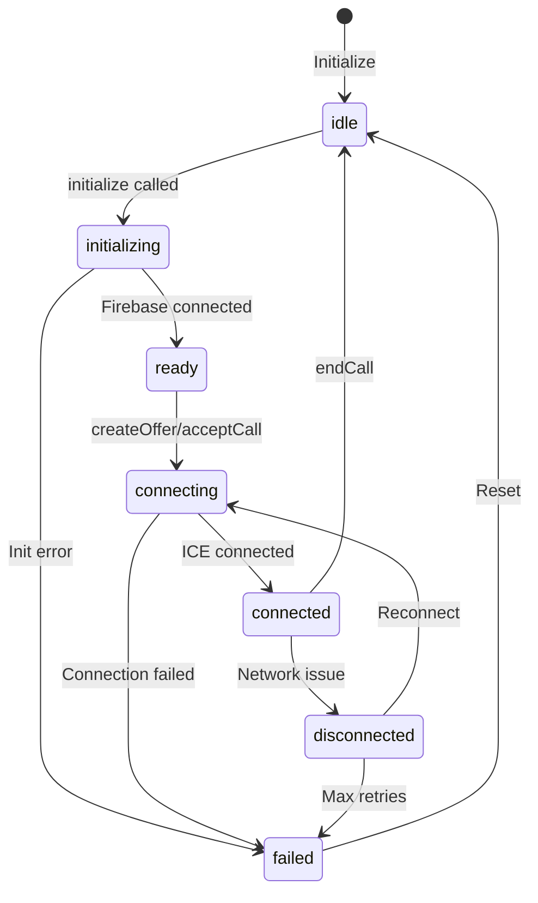
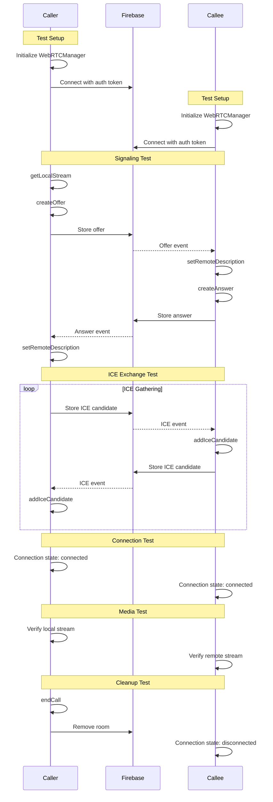

# CareFlow WebRTC Integration Test Suite Plan

**Created:** 2026-02-14
**Status:** Draft
**Author:** Architect Mode

---

## Executive Summary

This document outlines a comprehensive integration test suite for the CareFlow WebRTC module, specifically designed to validate direct user-to-user free call workflows. The suite will use Jest with Playwright to simulate distinct browser contexts for caller and callee, rigorously testing the full signaling lifecycle, PeerConnection state transitions, media stream transmission, and negative test cases.

---

## 1. Current State Analysis

### 1.1 Existing WebRTC Implementation

The WebRTC module ([`lib/webrtc.js`](lib/webrtc.js)) provides:

- **WebRTCManager class** - Core peer-to-peer connection management
- **Firebase signaling** - Real-time database for SDP/ICE exchange
- **State management** - Connection states: idle, initializing, ready, connecting, connected, failed, disconnected
- **Media handling** - Local/remote stream management, recording support
- **ICE configuration** - STUN servers (Google) with optional TURN support
- **Reconnection logic** - Automatic reconnection with exponential backoff

### 1.2 Existing Test Coverage

| Test File                                                              | Type        | Coverage                                            |
| ---------------------------------------------------------------------- | ----------- | --------------------------------------------------- |
| [`tests/webrtc.test.js`](tests/webrtc.test.js)                         | Unit        | Basic WebRTC manager functionality with mocks       |
| [`tests/webrtc-integration.test.js`](tests/webrtc-integration.test.js) | Integration | Signaling workflow tests with mocked Firebase       |
| [`tests/e2e/webrtc.spec.js`](tests/e2e/webrtc.spec.js)                 | E2E         | Basic connection establishment, network simulations |
| [`tests/lib/webrtc.test.js`](tests/lib/webrtc.test.js)                 | Unit        | Library-level WebRTC tests                          |

### 1.3 Gaps in Current Testing

1. **No real browser context testing** - Current tests use mocked WebRTC APIs
2. **Incomplete signaling lifecycle coverage** - Missing SDP validation, ICE candidate verification
3. **Limited state transition testing** - Missing edge cases in state machine
4. **No media stream verification** - Audio track validation not implemented
5. **Insufficient negative test cases** - Missing timeout handling, resource cleanup verification

---

## 2. Test Suite Architecture

### 2.1 Test Framework Stack

```
┌─────────────────────────────────────────────────────────────────┐
│                    Test Framework Stack                          │
├─────────────────────────────────────────────────────────────────┤
│                                                                  │
│   ┌─────────────────────────────────────────────────────────┐   │
│   │              Playwright Browser Automation               │   │
│   │   - Multi-browser context support                        │   │
│   │   - Network condition simulation                         │   │
│   │   - Real WebRTC API access                               │   │
│   └─────────────────────────────────────────────────────────┘   │
│                            │                                     │
│   ┌─────────────────────────────────────────────────────────┐   │
│   │                    Jest Test Runner                       │   │
│   │   - Test organization and execution                      │   │
│   │   - Assertions and expectations                          │   │
│   │   - Coverage reporting                                   │   │
│   └─────────────────────────────────────────────────────────┘   │
│                            │                                     │
│   ┌─────────────────────────────────────────────────────────┐   │
│   │                 Test Utilities Layer                     │   │
│   │   - Firebase Emulator integration                        │   │
│   │   - WebRTC test helpers                                  │   │
│   │   - Mock media devices                                   │   │
│   │   - Async operation handlers                             │   │
│   └─────────────────────────────────────────────────────────┘   │
│                                                                  │
└─────────────────────────────────────────────────────────────────┘
```

### 2.2 Test Categories

```mermaid
graph TD
    A[WebRTC Integration Tests] --> B[Signaling Lifecycle]
    A --> C[PeerConnection States]
    A --> D[Media Stream Verification]
    A --> E[Negative Test Cases]
    A --> F[Fallback and Degradation]
    A --> G[Advanced Lifecycle Management]
    A --> H[Integration Conflicts]

    B --> B1[SDP Offer/Answer Exchange]
    B --> B2[ICE Candidate Gathering]
    B --> B3[Firebase Signaling]

    C --> C1[State Transitions]
    C --> C2[Connection Events]
    C --> C3[Reconnection Logic]

    D --> D1[Local Stream Acquisition]
    D --> D2[Remote Stream Reception]
    D --> D3[Audio Track Validation]

    E --> E1[Network Interruptions]
    E --> E2[ICE Connection Failures]
    E --> E3[Signaling Timeouts]
    E --> E4[Resource Cleanup]

    F --> F1[Mode Selection]
    F --> F2[Fallback Scenarios]
    F --> F3[WebRTC as Primary]
    F --> F4[User Experience]
    F --> F5[CallManager Integration]

    G --> G1[Initialization and Startup]
    G --> G2[Connection Lifecycle]
    G --> G3[Reconnection and Resilience]
    G --> G4[Error Handling and State]
    G --> G5[Twilio PSTN Integration]

    H --> H1[Mode Selection Race Conditions]
    H --> H2[State Management Conflicts]
    H --> H3[Signaling Path Isolation]
    H --> H4[Resource Contention]
    H --> H5[Fallback Chain Integrity]
    H --> H6[End-to-End User Flow]
    H --> H7[Error Propagation]
```



---

## 3. Detailed Test Specifications

### 3.1 Signaling Lifecycle Tests

#### 3.1.1 SDP Offer/Answer Exchange

| Test ID | Test Name                 | Description                                         | Expected Outcome                           |
| ------- | ------------------------- | --------------------------------------------------- | ------------------------------------------ |
| SIG-001 | Create valid SDP offer    | Caller creates offer with correct SDP format        | Offer contains valid SDP with audio m-line |
| SIG-002 | Offer stored in Firebase  | Verify offer is persisted to correct path           | Offer at `/calls/{roomId}/offer`           |
| SIG-003 | Callee receives offer     | Callee detects incoming call via Firebase listener  | `onIncomingCall` event fired               |
| SIG-004 | Create valid SDP answer   | Callee creates answer matching offer                | Answer SDP compatible with offer           |
| SIG-005 | Answer stored in Firebase | Verify answer is persisted correctly                | Answer at `/calls/{roomId}/answer`         |
| SIG-006 | Caller receives answer    | Caller processes answer via Firebase listener       | Remote description set successfully        |
| SIG-007 | SDP renegotiation         | Handle offer/answer exchange for connection updates | New SDP negotiated without call drop       |
| SIG-008 | Codec negotiation         | Verify Opus codec is preferred                      | SDP contains Opus as primary codec         |

#### 3.1.2 ICE Candidate Gathering

| Test ID | Test Name                   | Description                         | Expected Outcome                                |
| ------- | --------------------------- | ----------------------------------- | ----------------------------------------------- |
| ICE-001 | Host candidate gathering    | Gather local network candidates     | Host candidates collected                       |
| ICE-002 | Server reflexive candidates | STUN server returns public IP       | srflx candidates gathered                       |
| ICE-003 | Relay candidates            | TURN server provides relay          | relay candidates available when TURN configured |
| ICE-004 | Candidate exchange          | Candidates sent via Firebase        | Both peers receive all candidates               |
| ICE-005 | Candidate filtering         | Filter candidates by type if needed | Only valid candidates processed                 |
| ICE-006 | ICE gathering complete      | Verify gathering state transitions  | State reaches `complete`                        |
| ICE-007 | Trickle ICE                 | Process candidates as they arrive   | Connection established incrementally            |
| ICE-008 | ICE restart                 | Restart ICE on connection failure   | New candidates gathered successfully            |

#### 3.1.3 Firebase Signaling

| Test ID | Test Name                | Description                         | Expected Outcome                                |
| ------- | ------------------------ | ----------------------------------- | ----------------------------------------------- |
| FBS-001 | Room creation            | Create unique room ID for call      | Room ID format: `{caller}-{callee}-{timestamp}` |
| FBS-002 | Offer storage            | Store offer with correct structure  | Valid offer object in Firebase                  |
| FBS-003 | Answer storage           | Store answer with correct structure | Valid answer object in Firebase                 |
| FBS-004 | ICE candidate storage    | Store candidates with metadata      | Valid ICE objects in Firebase                   |
| FBS-005 | Room cleanup             | Remove room on call end             | Room deleted from Firebase                      |
| FBS-006 | Concurrent call handling | Handle multiple simultaneous calls  | Each call has unique room                       |
| FBS-007 | Auth token validation    | Verify Firebase auth requirements   | Operations require valid token                  |
| FBS-008 | Reconnection signaling   | Re-establish Firebase connection    | Listeners re-attached after reconnect           |

### 3.2 PeerConnection State Transition Tests

#### 3.2.1 State Machine Validation



| Test ID | Test Name                 | Description                            | Expected Outcome                      |
| ------- | ------------------------- | -------------------------------------- | ------------------------------------- |
| ST-001  | Initial state             | Verify initial state is idle           | State equals `idle`                   |
| ST-002  | Initialization flow       | Transition through init states         | idle → initializing → ready           |
| ST-003  | Connection flow           | Transition through connection states   | ready → connecting → connected        |
| ST-004  | Failed state handling     | Handle connection failure              | State transitions to `failed`         |
| ST-005  | Disconnection handling    | Handle temporary disconnection         | State transitions to `disconnected`   |
| ST-006  | Reconnection success      | Successful reconnection flow           | disconnected → connecting → connected |
| ST-007  | Reconnection failure      | Failed reconnection after max attempts | State transitions to `failed`         |
| ST-008  | Call termination          | End call from any state                | State returns to `idle`               |
| ST-009  | State event emission      | Verify state change events             | `onConnectionStateChange` fired       |
| ST-010  | Invalid state transitions | Prevent invalid transitions            | Error thrown for invalid transition   |

#### 3.2.2 Connection Events

| Test ID | Test Name                  | Description                  | Expected Outcome             |
| ------- | -------------------------- | ---------------------------- | ---------------------------- |
| CE-001  | onicecandidate event       | ICE candidate event handling | Candidate stored in Firebase |
| CE-002  | onconnectionstatechange    | Connection state event       | State change propagated      |
| CE-003  | oniceconnectionstatechange | ICE state event              | ICE state change handled     |
| CE-004  | ontrack event              | Remote track received        | Remote stream available      |
| CE-005  | onsignalingstatechange     | Signaling state event        | Signaling state tracked      |

### 3.3 Media Stream Verification Tests

#### 3.3.1 Media Verification Strategy

Verifying audio streams in automated tests requires multiple approaches since actual audio content verification is unreliable in CI/CD environments. The following strategies are used:

| Strategy             | Method                               | Reliability | Use Case               |
| -------------------- | ------------------------------------ | ----------- | ---------------------- |
| Track existence      | `stream.getAudioTracks().length > 0` | High        | Basic validation       |
| Track state          | `track.readyState === 'live'`        | High        | Connection health      |
| SDP codec            | Parse SDP for Opus                   | High        | Codec negotiation      |
| Stats flow           | `getStats()` bytes increasing        | Medium      | Data flow verification |
| Audio level          | Web Audio API analyser               | Medium      | Activity detection     |
| Actual audio content | Not recommended for CI               | Low         | Manual testing only    |

**Fake Media Devices (Primary Approach)**

Playwright and browsers support fake media devices that generate synthetic audio:

```javascript
// Playwright context with fake audio
const context = await browser.newContext({
  permissions: ['microphone'],
});

// Chrome flags for synthetic audio
// --use-fake-ui-for-media-stream
// --use-fake-device-for-media-stream
```

**Audio Context Analysis**

```javascript
async function analyzeAudioStream(stream) {
  const audioContext = new AudioContext();
  const source = audioContext.createMediaStreamSource(stream);
  const analyser = audioContext.createAnalyser();
  source.connect(analyser);

  const dataArray = new Uint8Array(analyser.frequencyBinCount);
  analyser.getByteFrequencyData(dataArray);

  const average = dataArray.reduce((a, b) => a + b) / dataArray.length;
  return average > 0; // True if audio is present
}
```

**getStats() API for Flow Verification**

```javascript
async function verifyAudioFlow(peerConnection) {
  const stats = await peerConnection.getStats();
  let bytesReceived = 0;
  let bytesSent = 0;

  stats.forEach((report) => {
    if (report.type === 'inbound-rtp' && report.kind === 'audio') {
      bytesReceived = report.bytesReceived;
    }
    if (report.type === 'outbound-rtp' && report.kind === 'audio') {
      bytesSent = report.bytesSent;
    }
  });

  return { bytesReceived, bytesSent };
}
```

#### 3.3.2 Local Stream Acquisition

| Test ID | Test Name           | Description                 | Expected Outcome              |
| ------- | ------------------- | --------------------------- | ----------------------------- |
| MS-001  | Get user media      | Request microphone access   | MediaStream obtained          |
| MS-002  | Audio track present | Verify audio track exists   | At least one audio track      |
| MS-003  | No video track      | Verify video not requested  | No video tracks present       |
| MS-004  | Track enabled state | Verify track is enabled     | Track enabled = true          |
| MS-005  | Permission denied   | Handle permission rejection | Error with helpful message    |
| MS-006  | No microphone       | Handle missing device       | Error with device message     |
| MS-007  | Stream constraints  | Verify audio constraints    | Constraints applied correctly |
| MS-008  | Track stop on end   | Verify cleanup              | Track stopped on call end     |

#### 3.3.3 Remote Stream Reception

| Test ID | Test Name             | Description                    | Expected Outcome                   |
| ------- | --------------------- | ------------------------------ | ---------------------------------- |
| RS-001  | Remote track received | Verify remote track event      | ontrack event fired                |
| RS-002  | Remote stream valid   | Verify stream structure        | MediaStream with audio track       |
| RS-003  | Remote audio active   | Verify audio is flowing        | Audio data received via getStats() |
| RS-004  | Stream event emission | Verify event propagation       | onRemoteStream listener called     |
| RS-005  | Multiple tracks       | Handle multiple track scenario | All tracks processed               |
| RS-006  | Bytes received        | Verify inbound audio bytes     | bytesReceived > 0 and increasing   |

#### 3.3.4 Audio Track Validation

| Test ID | Test Name                | Description                       | Expected Outcome             |
| ------- | ------------------------ | --------------------------------- | ---------------------------- |
| AT-001  | Audio context creation   | Create audio context for analysis | AudioContext created         |
| AT-002  | Audio level detection    | Detect audio level from stream    | Level data available         |
| AT-003  | Silence detection        | Detect silent audio track         | Silence identified           |
| AT-004  | Audio codec verification | Verify Opus codec usage           | Opus codec in SDP            |
| AT-005  | Sample rate check        | Verify sample rate                | 48kHz sample rate            |
| AT-006  | Bitrate estimation       | Estimate audio bitrate            | Within expected range        |
| AT-007  | Track readyState         | Verify track is live              | readyState equals 'live'     |
| AT-008  | Outbound bytes sent      | Verify outbound audio bytes       | bytesSent > 0 and increasing |

### 3.4 Negative Test Cases

#### 3.4.1 Network Interruptions

| Test ID | Test Name                 | Description                     | Expected Outcome                            |
| ------- | ------------------------- | ------------------------------- | ------------------------------------------- |
| NI-001  | Offline during call       | Simulate network offline        | Disconnection detected, reconnect attempted |
| NI-002  | Online recovery           | Restore network after offline   | Reconnection successful                     |
| NI-003  | Intermittent connectivity | Multiple brief disconnections   | Connection maintained or recovered          |
| NI-004  | Slow network              | Simulate high latency           | Connection established with delay           |
| NI-005  | Packet loss simulation    | Simulate packet loss            | Audio quality degraded but maintained       |
| NI-006  | Network route change      | Change network interface        | ICE restart triggered                       |
| NI-007  | DNS failure               | Simulate DNS resolution failure | Graceful error handling                     |
| NI-008  | Firebase disconnection    | Lose Firebase connection        | Reconnection handler activated              |

#### 3.4.2 ICE Connection Failures

| Test ID | Test Name               | Description               | Expected Outcome             |
| ------- | ----------------------- | ------------------------- | ---------------------------- |
| IC-001  | All candidates fail     | No viable ICE candidates  | Connection failed state      |
| IC-002  | STUN server unreachable | Cannot reach STUN servers | Fallback to host candidates  |
| IC-003  | TURN server failure     | TURN server unavailable   | Direct connection attempted  |
| IC-004  | NAT traversal failure   | Symmetric NAT blocking    | Connection failed with error |
| IC-005  | ICE timeout             | ICE gathering timeout     | Appropriate error message    |
| IC-006  | Candidate format error  | Malformed ICE candidate   | Error handled gracefully     |
| IC-007  | ICE restart failure     | ICE restart unsuccessful  | Call terminated with error   |

#### 3.4.3 Signaling Timeouts

| Test ID | Test Name               | Description                      | Expected Outcome             |
| ------- | ----------------------- | -------------------------------- | ---------------------------- |
| TO-001  | Offer timeout           | No answer received               | Timeout error, call ended    |
| TO-002  | Answer timeout          | Answer not processed             | Connection failed            |
| TO-003  | ICE candidate timeout   | No candidates received           | Connection attempt continues |
| TO-004  | Firebase init timeout   | Firebase initialization hangs    | Timeout error thrown         |
| TO-005  | Token fetch timeout     | Token API timeout                | Network error message        |
| TO-006  | Peer connection timeout | Connection establishment timeout | Failed state with error      |

#### 3.4.4 Resource Cleanup

| Test ID | Test Name                 | Description                | Expected Outcome       |
| ------- | ------------------------- | -------------------------- | ---------------------- |
| RC-001  | Local stream cleanup      | Stop tracks on call end    | All tracks stopped     |
| RC-002  | Peer connection cleanup   | Close connection on end    | PC closed and null     |
| RC-003  | Firebase listener cleanup | Remove all listeners       | No memory leaks        |
| RC-004  | Room cleanup              | Delete Firebase room       | Room removed from DB   |
| RC-005  | Recording cleanup         | Stop recording on end      | Recording finalized    |
| RC-006  | Event listener cleanup    | Remove all event listeners | No dangling references |
| RC-007  | Cleanup on error          | Cleanup after error        | Resources released     |
| RC-008  | Cleanup on page unload    | Handle page close          | Graceful disconnection |

### 3.5 Fallback and Graceful Degradation Tests

The WebRTC module serves as a fallback communication method when Twilio is unavailable. These tests verify proper mode selection and graceful degradation.

#### 3.5.1 Mode Selection Tests

| Test ID | Test Name                           | Description                            | Expected Outcome                       |
| ------- | ----------------------------------- | -------------------------------------- | -------------------------------------- |
| FB-001  | WebRTC mode when Twilio unavailable | No Twilio credentials configured       | CallManager initializes in WebRTC mode |
| FB-002  | Twilio mode when available          | Valid Twilio credentials present       | CallManager initializes in Twilio mode |
| FB-003  | Mode persistence                    | Mode remains consistent during session | Mode does not change unexpectedly      |
| FB-004  | Token API determines mode           | /api/token returns correct mode        | Mode matches token response            |
| FB-005  | Invalid token handling              | Token API returns error                | Appropriate error message shown        |

#### 3.5.2 Fallback Scenarios

| Test ID | Test Name                            | Description                        | Expected Outcome                 |
| ------- | ------------------------------------ | ---------------------------------- | -------------------------------- |
| FB-010  | Fallback to WebRTC on Twilio failure | Twilio initialization fails        | WebRTC initialization attempted  |
| FB-011  | Fallback on Twilio token expiry      | Twilio token becomes invalid       | User notified, WebRTC available  |
| FB-012  | Fallback on Twilio network error     | Cannot reach Twilio servers        | WebRTC mode activated            |
| FB-013  | No fallback available                | Both Twilio and WebRTC fail        | Clear error message to user      |
| FB-014  | Graceful mode switch mid-session     | Switch modes during active session | Handled gracefully, no call drop |

#### 3.5.3 WebRTC as Primary Mode

| Test ID | Test Name | Description | Expected Outcome |
| FB-020 | Direct WebRTC call | Call without Twilio configured | WebRTC call established successfully |
| FB-021 | CareFlow ID validation | Validate CareFlow ID format | Invalid IDs rejected with message |
| FB-022 | Self-call prevention | Attempt to call own ID | Error: cannot call yourself |
| FB-023 | WebRTC-only user flow | Complete user journey without Twilio | All features work via WebRTC |
| FB-024 | Mixed mode calls | Twilio user calls WebRTC user | Call connects via appropriate method |

#### 3.5.4 Degradation User Experience

| Test ID | Test Name | Description | Expected Outcome |
| FB-030 | User notification on fallback | System falls back to WebRTC | User informed of mode change |
| FB-031 | Feature parity notification | Features differ between modes | User informed of limitations |
| FB-032 | Quality degradation notice | Call quality degrades | User notified of quality issues |
| FB-033 | Reconnection attempts | Connection lost, attempting reconnect | Progress indicator shown |
| FB-034 | Final failure message | All connection attempts fail | Clear, actionable error message |

#### 3.5.5 CallManager Integration Tests

| Test ID | Test Name | Description | Expected Outcome |
| FB-040 | CallManager initialization | Initialize with WebRTC mode | Correct mode set, listeners attached |
| FB-041 | Rate limiting | Multiple rapid calls | Rate limit enforced, user notified |
| FB-042 | Event propagation | WebRTC events reach CallManager | All events properly forwarded |
| FB-043 | State synchronization | WebRTC state syncs to CallManager | Connection states match |
| FB-044 | Error handling integration | WebRTC error reaches CallManager | Error properly handled and displayed |
| FB-045 | Recording integration | Recording via CallManager | Recording works in WebRTC mode |

### 3.6 Advanced Lifecycle Management Tests

This section covers production-grade WebRTC initialization and lifecycle management, including auto-initialization, connection health monitoring, reconnection resilience, and Twilio integration for PSTN calls.

#### 3.6.1 Initialization and Startup Tests

| Test ID | Test Name                        | Description                                       | Expected Outcome                                 |
| ------- | -------------------------------- | ------------------------------------------------- | ------------------------------------------------ |
| LM-001  | Auto-initialization on bootstrap | WebRTC subsystem initializes during app bootstrap | Initialization completes before call operations  |
| LM-002  | Initialization state observable  | Check initializationState$ emits correct states   | States: idle → initializing → ready/failed       |
| LM-003  | Lazy initialization mode         | Configure lazy init with InitializationConfig     | Resources allocated only on first call           |
| LM-004  | Eager initialization mode        | Configure eager init for critical paths           | Resources allocated immediately on bootstrap     |
| LM-005  | Initialization timeout           | Configure custom timeoutMs in config              | Timeout triggers error after configured duration |
| LM-006  | WebRTC API availability check    | Verify RTCPeerConnection, getUserMedia available  | Graceful error if APIs missing                   |
| LM-007  | RTCDataChannel availability      | Check data channel support                        | Feature flag set appropriately                   |
| LM-008  | Browser support detection        | Detect unsupported browsers                       | User-friendly degradation message shown          |
| LM-009  | Foreground initialization        | Init while app is visible                         | Normal resource allocation                       |
| LM-010  | Background initialization        | Init while app is hidden                          | Lower priority, deferred resource allocation     |
| LM-011  | Visibility state change          | Change visibility during init                     | Resource priority adjusted                       |
| LM-012  | Double initialization prevention | Attempt to initialize twice                       | Second call returns existing instance            |

#### 3.6.2 Connection Lifecycle Tests

| Test ID | Test Name                             | Description                              | Expected Outcome                        |
| ------- | ------------------------------------- | ---------------------------------------- | --------------------------------------- |
| LM-020  | ICE connection monitoring             | Monitor ICE state continuously           | State changes logged and emitted        |
| LM-021  | Configurable keepalive interval       | Set custom keepaliveIntervalMs           | Keepalive sent at configured interval   |
| LM-022  | Default keepalive 15s                 | Use default keepalive setting            | Keepalive sent every 15 seconds         |
| LM-023  | ICE gathering state tracking          | Track gathering state transitions        | States: new → gathering → complete      |
| LM-024  | Connection state tracking             | Track connection state transitions       | States logged with timestamps           |
| LM-025  | Signaling state tracking              | Track signaling state changes            | stable → have-local-offer → stable etc. |
| LM-026  | Unified state management              | All states accessible from single source | getState() returns all states           |
| LM-027  | Connection health heartbeat           | STUN binding request heartbeat           | RTT measured and logged                 |
| LM-028  | RTT measurement                       | Measure round-trip time                  | RTT value available in stats            |
| LM-029  | Connection degradation detection      | Detect degradation before failure        | Warning emitted on high RTT/packet loss |
| LM-030  | State persistence for recovery        | Persist state before navigation          | State recoverable after route change    |
| LM-031  | Session transition stability          | Navigate during active call              | Connection maintained across routes     |
| LM-032  | Peer connection reference persistence | Keep PC reference across navigation      | Call continues after route change       |
| LM-033  | Explicit session termination cleanup  | Cleanup only on explicit termination     | Resources held until user ends call     |

#### 3.6.3 Reconnection and Resilience Tests

| Test ID | Test Name                           | Description                             | Expected Outcome                                    |
| ------- | ----------------------------------- | --------------------------------------- | --------------------------------------------------- |
| LM-040  | Exponential backoff reconnection    | Test backoff timing                     | Delays: 1s, 2s, 4s, 8s, 16s up to max               |
| LM-041  | Configurable max retry attempts     | Set custom max retries                  | Stops after configured attempts                     |
| LM-042  | Default max retry 5                 | Use default retry setting               | Maximum 5 reconnection attempts                     |
| LM-043  | Initial delay configuration         | Set custom initial delay                | First retry after configured delay                  |
| LM-044  | Max delay configuration             | Set custom max delay                    | Delay caps at configured maximum                    |
| LM-045  | Jitter factor application           | Apply jitter to prevent thundering herd | Random jitter up to 30% added                       |
| LM-046  | Recoverable failure detection       | Network blip, temporary ICE failure     | Automatic reconnection attempted                    |
| LM-047  | Non-recoverable failure detection   | Permission denied, unsupported codec    | No reconnection, user notified                      |
| LM-048  | Error code categorization           | Verify error codes                      | Correct category: recoverable/user-actionable/fatal |
| LM-049  | Automatic ICE restart               | Trigger on connection degradation       | ICE restart without full renegotiation              |
| LM-050  | Manual ICE restart                  | Call restartIce method                  | ICE restart initiated                               |
| LM-051  | ICE restart on state degradation    | Connection state degrades               | ICE restart triggered automatically                 |
| LM-052  | Operation queue during reconnection | Queue pending operations                | Operations queued and replayed                      |
| LM-053  | Queue timeout fallback              | Queue timeout after 30s                 | Timeout error, queue cleared                        |
| LM-054  | SessionStorage queue persistence    | Persist queue to sessionStorage         | Queue recovered after page reload                   |
| LM-055  | Queue replay on reconnection        | Replay queued operations                | All queued operations executed                      |

#### 3.6.4 Error Handling and State Management Tests

| Test ID | Test Name                            | Description                            | Expected Outcome                      |
| ------- | ------------------------------------ | -------------------------------------- | ------------------------------------- |
| LM-060  | Recoverable error category           | Network issues, temporary failures     | Auto-recovery attempted               |
| LM-061  | User-actionable error category       | Permission denied, device not found    | User shown resolution steps           |
| LM-062  | Fatal error category                 | Unsupported browser, signaling failure | User shown final error message        |
| LM-063  | Localized error messages             | Error messages in user locale          | Correct language displayed            |
| LM-064  | Actionable resolution steps          | Permission denied error                | Step-by-step resolution shown         |
| LM-065  | Circuit breaker activation           | 5 consecutive failures                 | Circuit opens, stops attempts         |
| LM-066  | Configurable failure threshold       | Set custom threshold                   | Circuit opens at configured count     |
| LM-067  | Circuit breaker reset timeout        | Wait 60s in open state                 | Circuit enters half-open              |
| LM-068  | Half-open state probing              | Test connection in half-open           | Single probe sent                     |
| LM-069  | Circuit breaker close on success     | Probe succeeds in half-open            | Circuit closes, normal operation      |
| LM-070  | Circuit breaker reopen on failure    | Probe fails in half-open               | Circuit reopens                       |
| LM-071  | Structured event emission            | Events via EventEmitter                | Consistent schema with correlation ID |
| LM-072  | Correlation ID in events             | Check event correlation IDs            | ID present and consistent             |
| LM-073  | Timestamp in events                  | Check event timestamps                 | ISO 8601 timestamp present            |
| LM-074  | Winston/Pino logging integration     | Events logged to winston               | Logs appear in winston output         |
| LM-075  | Analytics integration                | Events sent to analytics               | Segment/Mixpanel events fired         |
| LM-076  | Complete resource cleanup            | End session/cleanup                    | All resources released                |
| LM-077  | Peer connection cleanup verification | Close PC on termination                | PC closed, null reference             |
| LM-078  | Media track cleanup verification     | Stop tracks on termination             | All tracks stopped                    |
| LM-079  | Timer cleanup verification           | Clear all timers                       | No orphaned timers                    |
| LM-080  | Device permission release            | Release permissions on cleanup         | Permissions properly released         |
| LM-081  | Cleanup verification logging         | Log cleanup steps                      | Each cleanup step logged              |

#### 3.6.5 Twilio Integration for PSTN Tests

| Test ID | Test Name                             | Description                         | Expected Outcome                |
| ------- | ------------------------------------- | ----------------------------------- | ------------------------------- |
| LM-090  | PSTN call via Twilio                  | Call real phone number              | Call routed through Twilio      |
| LM-091  | CallTransportManager abstraction      | Transport selection logic           | Optimal transport selected      |
| LM-092  | Twilio health check                   | Verify Twilio availability          | Health check passes             |
| LM-093  | Token validity check                  | Verify Twilio token valid           | Token not expired               |
| LM-094  | Device readiness check                | Verify Twilio device ready          | Device registered               |
| LM-095  | Network reachability check            | Verify Twilio servers reachable     | Network check passes            |
| LM-096  | Cached health status                  | Check health status cache           | Cache TTL 60 seconds            |
| LM-097  | WebRTC fallback on Twilio unavailable | Twilio health check fails           | WebRTC mode used                |
| LM-098  | Automatic Twilio retry                | Retry Twilio on next call           | Re-registration attempted       |
| LM-099  | Transport limitation notification     | Twilio unavailable                  | User notified of limitation     |
| LM-100  | Unified CallSession interface         | Same interface for both transports  | Transport-agnostic methods work |
| LM-101  | Transport-agnostic events             | Events same regardless of transport | Consistent event schema         |
| LM-102  | Transport selection logging           | Log transport decision              | Transport type, reason logged   |
| LM-103  | Fallback chain logging                | Log fallback chain                  | Full fallback path logged       |
| LM-104  | Performance metrics logging           | Log transport performance           | Latency, quality metrics logged |

### 3.7 Integration Conflict and Race Condition Tests

This section addresses potential conflicts, race conditions, and discrepancies between native WebRTC and Twilio integration, ensuring both systems function correctly without collisions.

#### 3.7.1 Mode Selection Race Conditions

| Test ID | Test Name                          | Description                                | Expected Outcome                  |
| ------- | ---------------------------------- | ------------------------------------------ | --------------------------------- |
| RC-100  | Concurrent initialization attempts | Multiple initialize() calls simultaneously | Only one initialization executes  |
| RC-101  | Mode switch during initialization  | Attempt mode change while initializing     | Mode locked during initialization |
| RC-102  | Token fetch race condition         | Multiple token requests simultaneously     | Single token fetch, shared result |
| RC-103  | Initialization promise reuse       | Call initialize() during ongoing init      | Same promise returned             |
| RC-104  | Mode determination timing          | Token API response delayed                 | Timeout handled gracefully        |
| RC-105  | Singleton instance integrity       | Multiple import sources                    | Same instance used everywhere     |

#### 3.7.2 State Management Conflicts

| Test ID | Test Name                            | Description                         | Expected Outcome               |
| ------- | ------------------------------------ | ----------------------------------- | ------------------------------ |
| RC-110  | Shared state between modes           | State from Twilio affects WebRTC    | States are independent         |
| RC-111  | Connection state consistency         | State matches actual connection     | State reflects reality         |
| RC-112  | State transition atomicity           | State changes are atomic            | No intermediate states exposed |
| RC-113  | Event emission ordering              | Events fire in correct order        | Consistent event sequence      |
| RC-114  | Listener notification timing         | Listeners called after state update | State updated before listeners |
| RC-115  | WebRTC ICE state vs connection state | ICE state differs from connection   | Both tracked independently     |
| RC-116  | State recovery after error           | Error during state transition       | State rolls back correctly     |

#### 3.7.3 Signaling Path Isolation

| Test ID | Test Name                              | Description                            | Expected Outcome               |
| ------- | -------------------------------------- | -------------------------------------- | ------------------------------ |
| RC-120  | Firebase signaling isolation           | Twilio mode active, Firebase inactive  | No Firebase operations         |
| RC-121  | Twilio signaling isolation             | WebRTC mode active, Twilio inactive    | No Twilio operations           |
| RC-122  | Signaling message routing              | Message sent to correct signaling path | Correct path used              |
| RC-123  | Cross-mode message rejection           | WebRTC message in Twilio mode          | Message ignored/rejected       |
| RC-124  | Signaling state cleanup on mode switch | Switch modes, verify cleanup           | Previous signaling stopped     |
| RC-125  | Firebase listener cleanup              | Switch from WebRTC to Twilio           | All Firebase listeners removed |

#### 3.7.4 Resource Contention

| Test ID | Test Name                   | Description                         | Expected Outcome          |
| ------- | --------------------------- | ----------------------------------- | ------------------------- |
| RC-130  | Media device access         | Both modes try to access microphone | Only active mode accesses |
| RC-131  | Audio context sharing       | Shared AudioContext between modes   | Context managed per mode  |
| RC-132  | Recording resource conflict | Recording in one mode, switch modes | Recording stopped cleanly |
| RC-133  | Network resource allocation | Both modes compete for bandwidth    | Active mode prioritized   |
| RC-134  | Memory leak on mode switch  | Repeated mode switches              | Memory stable             |
| RC-135  | Event listener accumulation | Multiple mode switches              | Listeners not duplicated  |

#### 3.7.5 Fallback Chain Integrity

| Test ID | Test Name                      | Description                       | Expected Outcome              |
| ------- | ------------------------------ | --------------------------------- | ----------------------------- |
| RC-140  | Twilio to WebRTC fallback      | Twilio fails, WebRTC activates    | Clean fallback transition     |
| RC-141  | WebRTC to Twilio fallback      | WebRTC fails, Twilio available    | Twilio activated              |
| RC-142  | Fallback during active call    | Transport fails during call       | Call recovery attempted       |
| RC-143  | Fallback notification timing   | User notified of fallback         | Notification before action    |
| RC-144  | Fallback state preservation    | State preserved across fallback   | Call continues if possible    |
| RC-145  | No fallback available scenario | Both transports fail              | Clear error to user           |
| RC-146  | Fallback retry timing          | Retry failed primary transport    | Exponential backoff for retry |
| RC-147  | Fallback health monitoring     | Monitor primary while on fallback | Primary health tracked        |

#### 3.7.6 End-to-End User Flow Verification

| Test ID | Test Name                    | Description                     | Expected Outcome           |
| ------- | ---------------------------- | ------------------------------- | -------------------------- |
| E2E-001 | Complete WebRTC call flow    | User A calls User B via WebRTC  | Call connects, audio flows |
| E2E-002 | Complete Twilio call flow    | User calls phone via Twilio     | Call connects, audio flows |
| E2E-003 | Mixed mode call              | WebRTC user calls Twilio user   | Appropriate transport used |
| E2E-004 | Incoming call handling       | Receive call in either mode     | Call handled correctly     |
| E2E-005 | Call transfer between modes  | Transfer call across modes      | Transfer succeeds          |
| E2E-006 | Call recording across modes  | Record in both modes            | Recording works in both    |
| E2E-007 | Call quality monitoring      | Monitor quality in both modes   | Stats available in both    |
| E2E-008 | Network degradation handling | Network degrades during call    | Graceful handling          |
| E2E-009 | Complete session lifecycle   | Login to logout with calls      | All resources cleaned      |
| E2E-010 | Page refresh during call     | Refresh page during active call | Call state recovered       |
| E2E-011 | Tab switch during call       | Switch tabs during call         | Call continues             |
| E2E-012 | Browser close during call    | Close browser during call       | Cleanup on beforeunload    |

#### 3.7.7 Error Propagation and Recovery

| Test ID | Test Name                     | Description                         | Expected Outcome          |
| ------- | ----------------------------- | ----------------------------------- | ------------------------- |
| RC-150  | WebRTC error propagation      | Error in WebRTC reaches CallManager | Error handled correctly   |
| RC-151  | Twilio error propagation      | Error in Twilio reaches CallManager | Error handled correctly   |
| RC-152  | Error during mode switch      | Error occurs during switch          | Rollback to previous mode |
| RC-153  | Recovery from transient error | Temporary error, then recovery      | Automatic recovery        |
| RC-154  | Fatal error handling          | Non-recoverable error               | Clean shutdown            |
| RC-155  | Error event consistency       | Same error schema for both modes    | Consistent error format   |
| RC-156  | Error logging completeness    | All errors logged with context      | Full error context logged |

---

## 4. Test Utilities and Helpers

### 4.1 WebRTC Test Helpers

```javascript
// tests/helpers/webrtc-helpers.js

/**
 * WebRTC Test Helper Utilities
 */
class WebRTCTestHelpers {
  /**
   * Wait for peer connection state
   */
  static async waitForState(manager, targetState, timeout = 10000) {}

  /**
   * Wait for ICE gathering to complete
   */
  static async waitForIceGathering(manager, timeout = 5000) {}

  /**
   * Generate mock ICE candidate
   */
  static createMockIceCandidate(type = 'host') {}

  /**
   * Validate SDP structure
   */
  static validateSdp(sdp, expectedType) {}

  /**
   * Extract codec from SDP
   */
  static extractCodec(sdp) {}

  /**
   * Check audio track activity
   */
  static async checkAudioActivity(stream, duration = 1000) {}

  /**
   * Create fake media stream
   */
  static createFakeMediaStream(audioEnabled = true) {}
}
```

### 4.2 Media Verification Helpers

```javascript
// tests/helpers/media-verification.js

/**
 * Media Stream Verification Utilities
 * Provides methods for verifying audio streams in automated tests
 */
class MediaVerification {
  /**
   * Verify stream has active audio track
   * @param {MediaStream} stream - The stream to verify
   * @returns {boolean} True if stream has live audio tracks
   */
  static hasActiveAudioTrack(stream) {
    const tracks = stream.getAudioTracks();
    return tracks.length > 0 && tracks.every((t) => t.readyState === 'live');
  }

  /**
   * Get track metadata for validation
   * @param {MediaStreamTrack} track - Audio track to inspect
   * @returns {Object} Track metadata
   */
  static getTrackMetadata(track) {
    return {
      kind: track.kind,
      enabled: track.enabled,
      muted: track.muted,
      readyState: track.readyState,
      label: track.label,
    };
  }

  /**
   * Wait for audio bytes to flow through connection
   * @param {RTCPeerConnection} peerConnection - The peer connection
   * @param {number} minBytes - Minimum bytes to consider successful
   * @param {number} timeout - Maximum wait time in ms
   * @returns {Promise<boolean>} True if audio bytes received
   */
  static async waitForAudioFlow(peerConnection, minBytes = 100, timeout = 5000) {
    const startTime = Date.now();
    let lastBytes = 0;

    while (Date.now() - startTime < timeout) {
      const stats = await peerConnection.getStats();
      let currentBytes = 0;

      stats.forEach((report) => {
        if (report.type === 'inbound-rtp' && report.kind === 'audio') {
          currentBytes = report.bytesReceived;
        }
      });

      if (currentBytes >= minBytes) return true;
      if (currentBytes > lastBytes) {
        lastBytes = currentBytes;
      }

      await new Promise((r) => setTimeout(r, 100));
    }

    return false;
  }

  /**
   * Get audio statistics from peer connection
   * @param {RTCPeerConnection} peerConnection - The peer connection
   * @returns {Promise<Object>} Audio statistics
   */
  static async getAudioStats(peerConnection) {
    const stats = await peerConnection.getStats();
    const result = {
      inbound: { bytesReceived: 0, packetsLost: 0, jitter: 0 },
      outbound: { bytesSent: 0, packetsSent: 0 },
      codec: null,
    };

    stats.forEach((report) => {
      if (report.type === 'inbound-rtp' && report.kind === 'audio') {
        result.inbound.bytesReceived = report.bytesReceived || 0;
        result.inbound.packetsLost = report.packetsLost || 0;
        result.inbound.jitter = report.jitter || 0;
      }
      if (report.type === 'outbound-rtp' && report.kind === 'audio') {
        result.outbound.bytesSent = report.bytesSent || 0;
        result.outbound.packetsSent = report.packetsSent || 0;
      }
      if (report.type === 'codec' && report.mimeType?.includes('audio')) {
        result.codec = report.mimeType;
      }
    });

    return result;
  }

  /**
   * Analyze audio stream using Web Audio API
   * @param {MediaStream} stream - The stream to analyze
   * @param {number} duration - Analysis duration in ms
   * @returns {Promise<Object>} Audio analysis results
   */
  static async analyzeAudioLevels(stream, duration = 1000) {
    const audioContext = new AudioContext();
    const source = audioContext.createMediaStreamSource(stream);
    const analyser = audioContext.createAnalyser();
    source.connect(analyser);

    analyser.fftSize = 256;
    const dataArray = new Uint8Array(analyser.frequencyBinCount);

    const levels = [];
    const startTime = Date.now();

    while (Date.now() - startTime < duration) {
      analyser.getByteFrequencyData(dataArray);
      const average = dataArray.reduce((a, b) => a + b) / dataArray.length;
      levels.push(average);
      await new Promise((r) => setTimeout(r, 50));
    }

    await audioContext.close();

    return {
      averageLevel: levels.reduce((a, b) => a + b) / levels.length,
      maxLevel: Math.max(...levels),
      minLevel: Math.min(...levels),
      hasActivity: levels.some((l) => l > 10),
    };
  }

  /**
   * Extract audio codec from SDP
   * @param {string} sdp - Session Description Protocol string
   * @returns {string|null} Codec name or null
   */
  static extractCodecFromSdp(sdp) {
    const lines = sdp.split('\r\n');
    const rtpmapLine = lines.find(
      (l) =>
        l.includes('a=rtpmap') && (l.includes('opus') || l.includes('PCMU') || l.includes('PCMA'))
    );

    if (rtpmapLine) {
      const match = rtpmapLine.match(/a=rtpmap:\d+\s+(\w+)/);
      return match ? match[1] : null;
    }
    return null;
  }
}
```

### 4.3 Firebase Test Helpers

```javascript
// tests/helpers/firebase-helpers.js

/**
 * Firebase Test Helper Utilities
 */
class FirebaseTestHelpers {
  /**
   * Initialize Firebase emulator
   */
  static async setupEmulator() {}

  /**
   * Clear test database
   */
  static async clearDatabase() {}

  /**
   * Seed test data
   */
  static async seedCallRoom(roomId, offer, answer) {}

  /**
   * Wait for Firebase operation
   */
  static async waitForFirebase(path, timeout = 5000) {}

  /**
   * Get call room data
   */
  static async getCallRoom(roomId) {}

  /**
   * Simulate Firebase disconnect
   */
  static async simulateDisconnect() {}
}
```

### 4.3 Playwright Browser Helpers

```javascript
// tests/helpers/browser-helpers.js

/**
 * Playwright Browser Test Utilities
 */
class BrowserTestHelpers {
  /**
   * Create authenticated browser context
   */
  static async createAuthContext(browser, userId, care4wId) {}

  /**
   * Setup WebRTC in page
   */
  static async setupWebRTCInPage(page, care4wId) {}

  /**
   * Initiate call from page
   */
  static async initiateCall(page, targetCare4wId) {}

  /**
   * Accept incoming call
   */
  static async acceptCall(page) {}

  /**
   * Reject incoming call
   */
  static async rejectCall(page) {}

  /**
   * End current call
   */
  static async endCall(page) {}

  /**
   * Get call status from page
   */
  static async getCallStatus(page) {}

  /**
   * Wait for connection state
   */
  static async waitForConnectionState(page, state, timeout) {}

  /**
   * Simulate network condition
   */
  static async simulateNetwork(context, condition) {}
}
```

### 4.4 Async Operation Handlers

```javascript
// tests/helpers/async-helpers.js

/**
 * Async Test Utilities
 */
class AsyncTestHelpers {
  /**
   * Wait for condition with timeout
   */
  static async waitFor(condition, timeout = 10000, interval = 100) {}

  /**
   * Poll for value
   */
  static async pollForValue(getter, expected, timeout = 10000) {}

  /**
   * Race multiple promises
   */
  static async raceWithTimeout(promise, timeout, message) {}

  /**
   * Retry operation
   */
  static async retry(operation, maxAttempts = 3, delay = 1000) {}

  /**
   * Collect events over time
   */
  static async collectEvents(emitter, event, duration) {}
}
```

---

## 5. File Structure

```
tests/
├── integration/
│   └── webrtc/
│       ├── signaling-lifecycle.test.js      # SDP/ICE exchange tests
│       ├── peer-connection-states.test.js   # State transition tests
│       ├── media-stream-verification.test.js # Audio/stream tests
│       ├── network-failures.test.js         # Network interruption tests
│       ├── ice-failures.test.js             # ICE failure scenarios
│       ├── signaling-timeouts.test.js       # Timeout handling tests
│       ├── resource-cleanup.test.js         # Cleanup verification tests
│       ├── fallback-degradation.test.js     # Fallback and graceful degradation tests
│       ├── initialization-startup.test.js   # Initialization and startup tests
│       ├── connection-lifecycle.test.js     # Connection lifecycle tests
│       ├── reconnection-resilience.test.js  # Reconnection and resilience tests
│       ├── error-handling-state.test.js     # Error handling and state management tests
│       ├── twilio-pstn-integration.test.js  # Twilio PSTN integration tests
│       ├── integration-conflicts.test.js    # Race conditions and conflict tests
│       └── e2e-user-flow.test.js            # End-to-end user flow tests
│       ├── signaling-timeouts.test.js       # Timeout handling tests
│       └── resource-cleanup.test.js         # Cleanup verification tests
│
├── e2e/
│   └── webrtc/
│       ├── call-establishment.spec.js       # Full call flow E2E
│       ├── multi-browser-call.spec.js       # Cross-browser testing
│       ├── network-conditions.spec.js       # Network simulation E2E
│       └── call-quality.spec.js             # Quality metrics E2E
│
├── helpers/
│   ├── webrtc-helpers.js                    # WebRTC test utilities
│   ├── firebase-helpers.js                  # Firebase test utilities
│   ├── browser-helpers.js                   # Playwright utilities
│   ├── async-helpers.js                     # Async operation helpers
│   └── mock-factories.js                    # Test data factories
│
├── fixtures/
│   ├── sdp-offers.js                        # Sample SDP offers
│   ├── sdp-answers.js                       # Sample SDP answers
│   ├── ice-candidates.js                    # Sample ICE candidates
│   └── firebase-data.js                     # Sample Firebase data
│
└── setup/
    ├── webrtc-setup.js                      # WebRTC test environment setup
    ├── firebase-emulator.js                 # Firebase emulator config
    └── global-setup.js                      # Global test setup
```

---

## 6. Implementation Phases

### Phase 1: Foundation

- [ ] Create test helper utilities
- [ ] Setup Firebase emulator integration
- [ ] Configure Playwright for multi-browser contexts
- [ ] Create test fixtures and mock data

### Phase 2: Signaling Tests

- [ ] Implement SDP offer/answer exchange tests
- [ ] Implement ICE candidate gathering tests
- [ ] Implement Firebase signaling tests

### Phase 3: State Management Tests

- [ ] Implement state transition tests
- [ ] Implement connection event tests
- [ ] Implement reconnection logic tests

### Phase 4: Media Verification Tests

- [ ] Implement local stream acquisition tests
- [ ] Implement remote stream reception tests
- [ ] Implement audio track validation tests

### Phase 5: Negative Test Cases

- [ ] Implement network interruption tests
- [ ] Implement ICE failure tests
- [ ] Implement timeout handling tests
- [ ] Implement resource cleanup tests

### Phase 6: Fallback and Degradation Tests

- [ ] Implement mode selection tests
- [ ] Implement fallback scenario tests
- [ ] Implement WebRTC as primary mode tests
- [ ] Implement user experience degradation tests
- [ ] Implement CallManager integration tests

### Phase 7: Advanced Lifecycle Management Tests

- [ ] Implement initialization and startup tests
- [ ] Implement connection lifecycle tests
- [ ] Implement reconnection and resilience tests
- [ ] Implement error handling and state management tests
- [ ] Implement Twilio PSTN integration tests

### Phase 8: Integration Conflict and Race Condition Tests

- [ ] Implement mode selection race condition tests
- [ ] Implement state management conflict tests
- [ ] Implement signaling path isolation tests
- [ ] Implement resource contention tests
- [ ] Implement fallback chain integrity tests
- [ ] Implement end-to-end user flow tests
- [ ] Implement error propagation and recovery tests

### Phase 9: E2E Integration

- [ ] Implement full call flow E2E tests
- [ ] Implement cross-browser call tests
- [ ] Implement network condition simulation tests

---

## 7. Configuration Requirements

### 7.1 Jest Configuration Updates

```javascript
// jest.config.js additions
{
  testMatch: [
    '**/tests/integration/webrtc/**/*.test.js',
    '**/tests/e2e/webrtc/**/*.spec.js',
  ],
  testTimeout: 60000, // Increased for WebRTC operations
  setupFilesAfterEnv: [
    '<rootDir>/tests/setup/webrtc-setup.js',
  ],
}
```

### 7.2 Playwright Configuration Updates

```javascript
// playwright.config.js additions
{
  projects: [
    {
      name: 'webrtc-chromium',
      use: {
        ...devices['Desktop Chrome'],
        permissions: ['microphone'], // Auto-grant microphone
      },
    },
    {
      name: 'webrtc-firefox',
      use: {
        ...devices['Desktop Firefox'],
      },
    },
  ],
  // WebRTC tests need longer timeouts
  timeout: 120000,
}
```

### 7.3 Environment Variables

```bash
# .env.test
FIREBASE_EMULATOR_HOST=localhost
FIREBASE_EMULATOR_PORT=9000
TEST_USER_1_CARE4W_ID=care4w-1000001
TEST_USER_2_CARE4W_ID=care4w-1000002
TEST_TIMEOUT_MULTIPLIER=1
```

---

## 8. Success Criteria

### 8.1 Coverage Targets

| Category                | Target Coverage |
| ----------------------- | --------------- |
| Signaling Lifecycle     | 90%             |
| State Transitions       | 95%             |
| Media Stream Operations | 85%             |
| Error Handling          | 90%             |
| Resource Cleanup        | 100%            |

### 8.2 Test Quality Metrics

- All tests must be deterministic and pass consistently
- No flaky tests allowed in CI pipeline
- Each test must clean up all resources
- Tests must complete within timeout limits
- Clear error messages on test failure

### 8.3 Documentation Requirements

- Each test file must have header documentation
- Complex test cases must have inline comments
- Test utilities must be documented with JSDoc
- README for running tests locally

---

## 9. Risks and Mitigations

| Risk                          | Impact                    | Mitigation                                    |
| ----------------------------- | ------------------------- | --------------------------------------------- |
| Firebase emulator instability | Tests fail intermittently | Add retry logic, use local mocks as fallback  |
| WebRTC browser differences    | Inconsistent behavior     | Browser-specific test configurations          |
| Network timing issues         | Flaky tests               | Use generous timeouts, implement retries      |
| Audio device access in CI     | Tests cannot run          | Use fake media devices, mock getUserMedia     |
| Memory leaks in long tests    | Test runner crashes       | Implement proper cleanup, limit test duration |

---

## 10. Next Steps

1. **Review and approve this plan** - Stakeholder sign-off required
2. **Create test helper utilities** - Foundation for all tests
3. **Implement Phase 1 tests** - Signaling lifecycle validation
4. **Iterate through remaining phases** - Sequential implementation
5. **CI/CD integration** - Add tests to pipeline
6. **Documentation** - Create test running guide

---

## Appendix A: Test Data Examples

### Sample SDP Offer

```javascript
const sampleOffer = {
  type: 'offer',
  sdp: `v=0
o=- 123456789 2 IN IP4 127.0.0.1
s=-
t=0 0
a=group:BUNDLE 0
m=audio 9 UDP/TLS/RTP/SAVPF 111 103 104 9 0 8 106 105 13 110 112 113 126
a=rtcp:9 IN IP4 0.0.0.0
a=ice-ufrag:abcd
a=ice-pwd:abcdefghijklmnopqrstuvwx
a=fingerprint:sha-256 00:11:22:33:44:55:66:77:88:99:AA:BB:CC:DD:EE:FF:00:11:22:33:44:55:66:77:88:99:AA:BB:CC:DD:EE:FF
a=setup:actpass
a=mid:0
a=extmap:1 urn:ietf:params:rtp-hdrext:ssrc-audio-level
a=sendrecv
a=rtcp-mux
a=rtpmap:111 opus/48000/2
a=fmtp:111 minptime=10;useinbandfec=1
a=rtpmap:103 ISAC/16000
a=rtpmap:104 ISAC/32000
a=rtpmap:9 G722/8000
a=rtpmap:0 PCMU/8000
a=rtpmap:8 PCMA/8000
a=rtpmap:106 CN/32000
a=rtpmap:105 CN/16000
a=rtpmap:13 CN/8000
a=rtpmap:110 telephone-event/48000
a=rtpmap:112 telephone-event/32000
a=rtpmap:113 telephone-event/16000
a=rtpmap:126 telephone-event/8000
a=ssrc:123456789 cname:abcdefghijklmnop`,
};
```

### Sample ICE Candidate

```javascript
const sampleIceCandidate = {
  candidate: 'candidate:1 1 udp 2113937151 192.168.1.100 54321 typ host',
  sdpMid: '0',
  sdpMLineIndex: 0,
};
```

---

## Appendix B: Mermaid Diagrams

### Complete Test Flow



---

_End of Plan Document_
