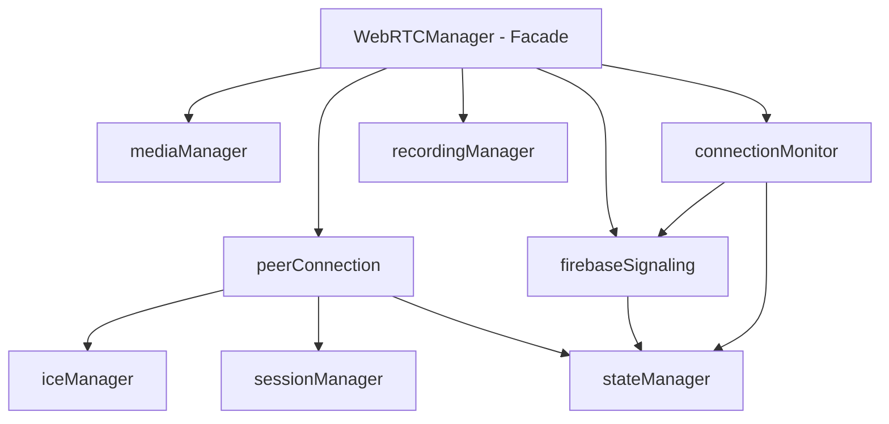

# WebRTC Refactoring Plan: Separation of Concerns

## Executive Summary

This plan outlines a comprehensive refactoring of the WebRTC implementation in the CareFlow application. The goal is to improve separation of concerns, enhance testability, and increase maintainability by breaking down the monolithic `WebRTCManager` class into smaller, focused modules.

## Current State Analysis

### Existing Files

- `lib/webrtc.js` - ~1400 lines containing the monolithic WebRTCManager class
- `lib/callManager.js` - ~1700 lines managing call lifecycle and mode selection

### Current WebRTCManager Responsibilities (Single Class)

1. Firebase initialization and authentication
2. Peer connection management (RTCPeerConnection)
3. ICE candidate handling (gathering, exchange, restart)
4. SDP offer/answer creation and exchange
5. Media stream management (getUserMedia, track handling)
6. Recording functionality (MediaRecorder)
7. Connection state management
8. Reconnection handling
9. Event listener management
10. Resource cleanup

## Proposed Module Structure

### New Directory: `lib/webrtc/`

```
lib/webrtc/
├── index.js              # Main export and factory function
├── config.js             # Configuration (ICE servers, timeouts)
├── firebaseSignaling.js   # Firebase signaling abstraction
├── peerConnection.js      # RTCPeerConnection wrapper
├── mediaManager.js       # Media stream handling
├── iceManager.js         # ICE candidate management
├── sessionManager.js     # SDP offer/answer handling
├── stateManager.js       # Connection state machine
├── recordingManager.js    # Call recording
└── connectionMonitor.js  # Reconnection & health monitoring
```

## Module Design

### 1. config.js

**Responsibilities:**

- ICE server configuration
- Timeout values
- Connection limits

**Key Exports:**

```javascript
export const ICE_SERVERS = [...]
export const TIMEOUTS = {
  CONNECTION: 30000,
  ICE_GATHERING: 5000,
}
```

### 2. firebaseSignaling.js

**Responsibilities:**

- Firebase database operations
- Signaling message publishing
- Subscription management for offers, answers, ICE candidates

**Interface:**

```javascript
class SignalingService {
  constructor(firebaseApp, userId)
  async publishOffer(roomId, offer)
  async publishAnswer(roomId, answer)
  async publishIceCandidate(roomId, candidate)
  subscribeToOffers(callback)
  subscribeToRoom(roomId, callback)
  cleanup()
}
```

### 3. peerConnection.js

**Responsibilities:**

- Create and configure RTCPeerConnection
- Handle connection state changes
- Track ICE connection state
- Provide connection statistics

**Interface:**

```javascript
class PeerConnectionManager {
  constructor(config)
  async createConnection()
  addTrack(track, stream)
  setLocalDescription(sdp)
  setRemoteDescription(sdp)
  createOffer()
  createAnswer()
  addIceCandidate(candidate)
  getConnectionStats()
  close()
  onConnectionStateChange(callback)
  onIceConnectionStateChange(callback)
}
```

### 4. iceManager.js

**Responsibilities:**

- ICE candidate gathering
- ICE candidate filtering
- ICE restart logic

**Interface:**

```javascript
class IceManager {
  constructor(peerConnection)
  startGathering()
  onCandidate(callback)
  restart()
  getGatheringState()
}
```

### 5. sessionManager.js

**Responsibilities:**

- SDP offer creation
- SDP answer creation
- Session description management

**Interface:**

```javascript
class SessionManager {
  createOffer()
  createAnswer(offerSdp)
  setLocalDescription(sdp)
  setRemoteDescription(sdp)
  getLocalDescription()
  getRemoteDescription()
}
```

### 6. mediaManager.js

**Responsibilities:**

- getUserMedia requests
- Local stream management
- Track lifecycle (mute, unmute, stop)
- Device enumeration

**Interface:**

```javascript
class MediaManager {
  async getUserMedia(constraints)
  getLocalStream()
  muteAudio()
  unmuteAudio()
  stopTracks()
  getSupportedMimeTypes()
}
```

### 7. stateManager.js

**Responsibilities:**

- Connection state machine
- State transitions
- Timeout handling

**Interface:**

```javascript
class ConnectionStateManager {
  getState()
  setState(state, message)
  onStateChange(callback)
  setTimeout(ms)
  clearTimeout()
}
```

### 8. recordingManager.js

**Responsibilities:**

- MediaRecorder setup
- Recording start/stop
- Chunk collection

**Interface:**

```javascript
class CallRecorder {
  startRecording(stream)
  stopRecording()
  getRecordingBlob()
  isRecording()
}
```

### 9. connectionMonitor.js

**Responsibilities:**

- Connection health monitoring
- Reconnection logic
- Firebase connectivity monitoring

**Interface:**

```javascript
class ConnectionMonitor {
  startMonitoring(signalingService)
  onDisconnected(callback)
  onReconnecting(callback)
  onReconnected(callback)
  attemptReconnection()
  stop()
}
```

### 10. index.js (Facade)

**Responsibilities:**

- Coordinate all modules
- Provide backward-compatible API
- Manage dependencies

```javascript
class WebRTCManager {
  constructor()
  async initialize(userId, token)
  async makeCall(targetId)
  async acceptCall(roomId, offer)
  async endCall()
  // ... maintains existing API
}
```

## Implementation Sequence

### Phase 1: Infrastructure (Week 1)

1. Create `lib/webrtc/` directory
2. Create `config.js` module
3. Create `stateManager.js` module
4. Create `mediaManager.js` module

### Phase 2: Core WebRTC (Week 2)

5. Create `peerConnection.js` module
6. Create `iceManager.js` module
7. Create `sessionManager.js` module
8. Integrate with stateManager

### Phase 3: Signaling (Week 3)

9. Create `firebaseSignaling.js` module
10. Create `connectionMonitor.js` module

### Phase 4: Recording (Week 4)

11. Create `recordingManager.js` module
12. Migrate existing recording tests

### Phase 5: Integration (Week 5)

13. Create `index.js` facade
14. Migrate existing `webrtc.js` calls
15. Update `callManager.js` imports

### Phase 6: Testing & Cleanup (Week 6)

16. Add unit tests for each module
17. Add integration tests
18. Update documentation

## Dependency Diagram



## Testing Strategy

### Unit Tests

- Each module tested in isolation
- Mock dependencies
- Test state transitions
- Test error handling

### Integration Tests

- Full WebRTC flow
- Firebase signaling
- Connection recovery

### Test Coverage Goals

- Core modules: 80%+
- Utility modules: 70%+

## Backward Compatibility

The refactoring will maintain the existing API through the facade:

- `createWebRTCManager()` factory function
- Event listener pattern
- Method signatures

## Migration Path

1. Keep existing `lib/webrtc.js` as backward-compatible wrapper
2. New code uses new modules
3. Gradually migrate existing code to use modules directly
4. Remove wrapper when migration complete

## Benefits

1. **Testability**: Each module can be unit tested independently
2. **Maintainability**: Smaller files, focused responsibilities
3. **Reusability**: MediaManager can be used for other media features
4. **Flexibility**: Swap Firebase for another signaling provider
5. **Debugging**: Easier to isolate issues

## Risks & Mitigation

| Risk                            | Mitigation                      |
| ------------------------------- | ------------------------------- |
| Breaking existing functionality | Comprehensive integration tests |
| Over-engineering                | Start with simplest solution    |
| Dependency complexity           | Use dependency injection        |
| Performance overhead            | Profile after implementation    |

## Next Steps

1. Review and approve this plan
2. Begin Phase 1 implementation
3. Set up test infrastructure
